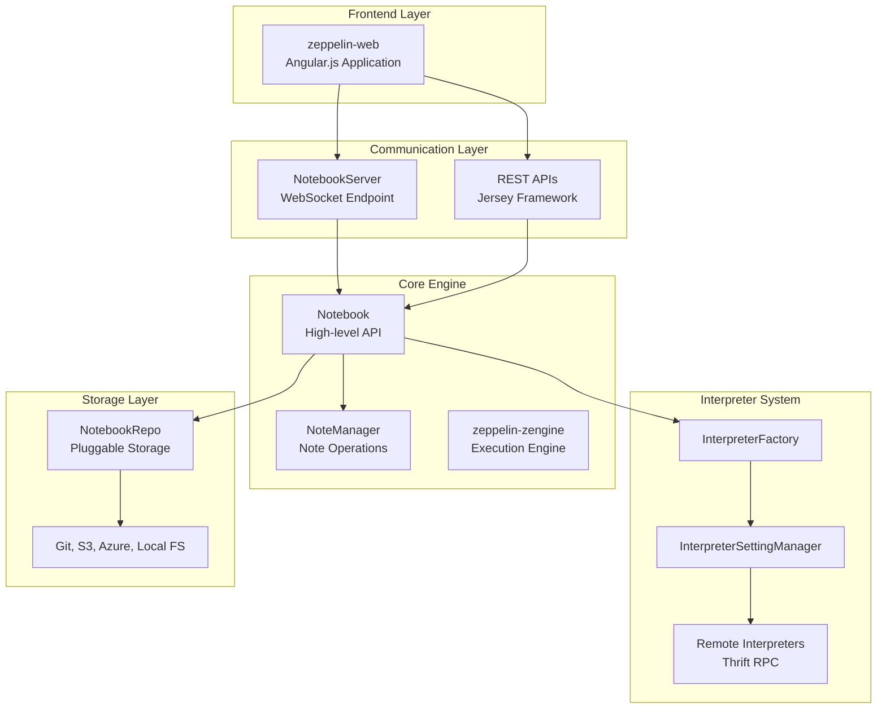
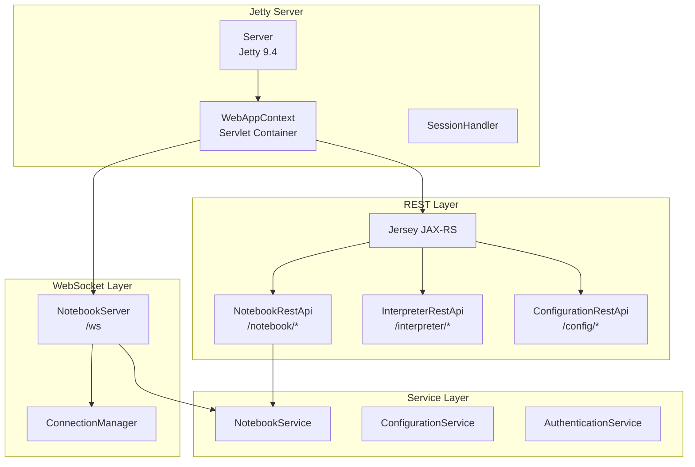
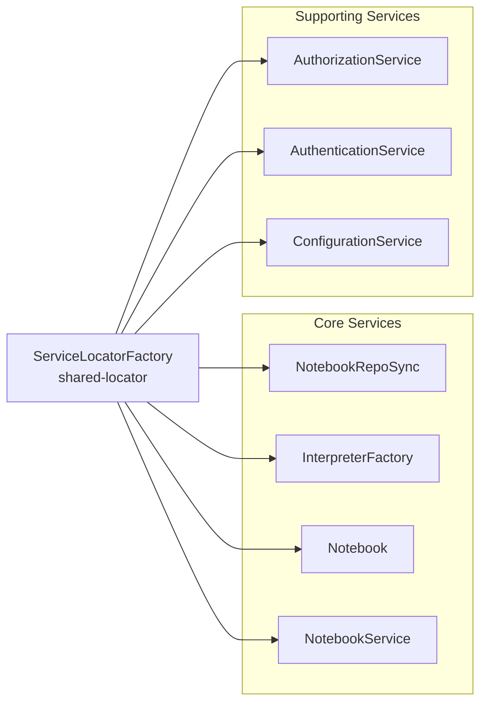
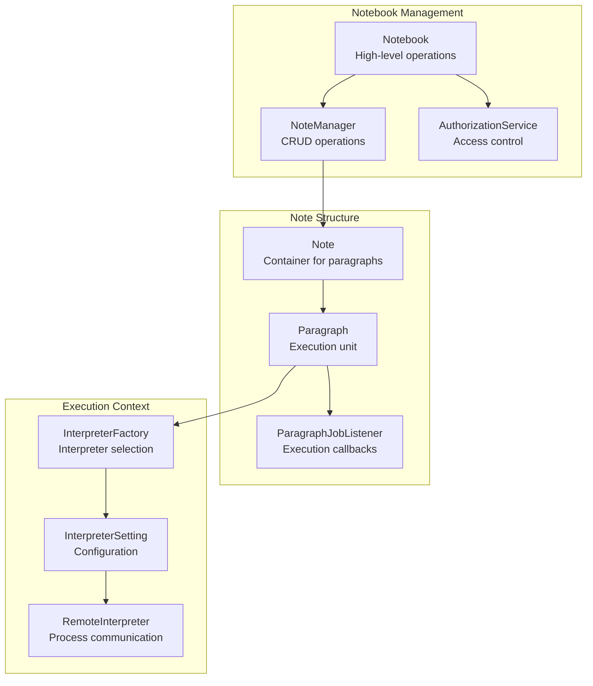
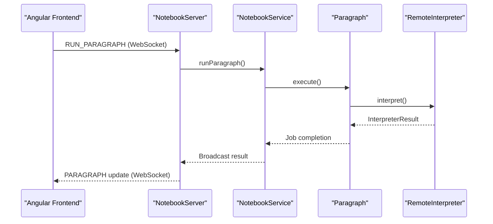
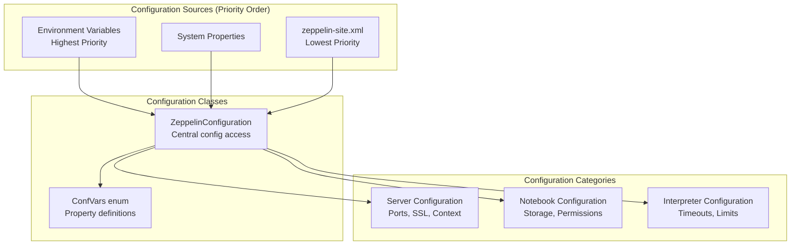

# Architecture

<details>
<summary>Relevant source files</summary>

The following files were used as context for generating this wiki page:

- [.gitignore](.gitignore)
- [README.md](README.md)
- [conf/zeppelin-site.xml.template](conf/zeppelin-site.xml.template)
- [docs/setup/operation/configuration.md](docs/setup/operation/configuration.md)
- [pom.xml](pom.xml)
- [spark/pom.xml](spark/pom.xml)
- [zeppelin-display/pom.xml](zeppelin-display/pom.xml)
- [zeppelin-distribution/pom.xml](zeppelin-distribution/pom.xml)
- [zeppelin-interpreter/pom.xml](zeppelin-interpreter/pom.xml)
- [zeppelin-interpreter/src/main/java/org/apache/zeppelin/conf/ZeppelinConfiguration.java](zeppelin-interpreter/src/main/java/org/apache/zeppelin/conf/ZeppelinConfiguration.java)
- [zeppelin-interpreter/src/main/java/org/apache/zeppelin/interpreter/launcher/InterpreterLauncher.java](zeppelin-interpreter/src/main/java/org/apache/zeppelin/interpreter/launcher/InterpreterLauncher.java)
- [zeppelin-interpreter/src/main/java/org/apache/zeppelin/interpreter/lifecycle/TimeoutLifecycleManager.java](zeppelin-interpreter/src/main/java/org/apache/zeppelin/interpreter/lifecycle/TimeoutLifecycleManager.java)
- [zeppelin-interpreter/src/main/java/org/apache/zeppelin/scheduler/Job.java](zeppelin-interpreter/src/main/java/org/apache/zeppelin/scheduler/Job.java)
- [zeppelin-interpreter/src/main/java/org/apache/zeppelin/scheduler/JobWithProgressPoller.java](zeppelin-interpreter/src/main/java/org/apache/zeppelin/scheduler/JobWithProgressPoller.java)
- [zeppelin-interpreter/src/test/java/org/apache/zeppelin/conf/ZeppelinConfigurationTest.java](zeppelin-interpreter/src/test/java/org/apache/zeppelin/conf/ZeppelinConfigurationTest.java)
- [zeppelin-interpreter/src/test/java/org/apache/zeppelin/scheduler/JobTest.java](zeppelin-interpreter/src/test/java/org/apache/zeppelin/scheduler/JobTest.java)
- [zeppelin-server/pom.xml](zeppelin-server/pom.xml)
- [zeppelin-server/src/main/java/org/apache/zeppelin/rest/NotebookRestApi.java](zeppelin-server/src/main/java/org/apache/zeppelin/rest/NotebookRestApi.java)
- [zeppelin-server/src/main/java/org/apache/zeppelin/server/ZeppelinServer.java](zeppelin-server/src/main/java/org/apache/zeppelin/server/ZeppelinServer.java)
- [zeppelin-server/src/main/java/org/apache/zeppelin/service/NotebookService.java](zeppelin-server/src/main/java/org/apache/zeppelin/service/NotebookService.java)
- [zeppelin-server/src/main/java/org/apache/zeppelin/socket/NotebookServer.java](zeppelin-server/src/main/java/org/apache/zeppelin/socket/NotebookServer.java)
- [zeppelin-server/src/test/java/org/apache/zeppelin/rest/AbstractTestRestApi.java](zeppelin-server/src/test/java/org/apache/zeppelin/rest/AbstractTestRestApi.java)
- [zeppelin-server/src/test/java/org/apache/zeppelin/rest/NotebookRestApiTest.java](zeppelin-server/src/test/java/org/apache/zeppelin/rest/NotebookRestApiTest.java)
- [zeppelin-server/src/test/java/org/apache/zeppelin/rest/ZeppelinRestApiTest.java](zeppelin-server/src/test/java/org/apache/zeppelin/rest/ZeppelinRestApiTest.java)
- [zeppelin-server/src/test/java/org/apache/zeppelin/service/NotebookServiceTest.java](zeppelin-server/src/test/java/org/apache/zeppelin/service/NotebookServiceTest.java)
- [zeppelin-server/src/test/java/org/apache/zeppelin/socket/NotebookServerTest.java](zeppelin-server/src/test/java/org/apache/zeppelin/socket/NotebookServerTest.java)
- [zeppelin-web/pom.xml](zeppelin-web/pom.xml)
- [zeppelin-zengine/pom.xml](zeppelin-zengine/pom.xml)
- [zeppelin-zengine/src/main/java/org/apache/zeppelin/interpreter/recovery/RecoveryUtils.java](zeppelin-zengine/src/main/java/org/apache/zeppelin/interpreter/recovery/RecoveryUtils.java)
- [zeppelin-zengine/src/main/java/org/apache/zeppelin/interpreter/remote/RemoteInterpreter.java](zeppelin-zengine/src/main/java/org/apache/zeppelin/interpreter/remote/RemoteInterpreter.java)
- [zeppelin-zengine/src/main/java/org/apache/zeppelin/notebook/Note.java](zeppelin-zengine/src/main/java/org/apache/zeppelin/notebook/Note.java)
- [zeppelin-zengine/src/main/java/org/apache/zeppelin/notebook/Notebook.java](zeppelin-zengine/src/main/java/org/apache/zeppelin/notebook/Notebook.java)
- [zeppelin-zengine/src/main/java/org/apache/zeppelin/notebook/Paragraph.java](zeppelin-zengine/src/main/java/org/apache/zeppelin/notebook/Paragraph.java)
- [zeppelin-zengine/src/test/java/org/apache/zeppelin/conf/ZeppelinConfigurationTest.java](zeppelin-zengine/src/test/java/org/apache/zeppelin/conf/ZeppelinConfigurationTest.java)
- [zeppelin-zengine/src/test/java/org/apache/zeppelin/helium/HeliumApplicationFactoryTest.java](zeppelin-zengine/src/test/java/org/apache/zeppelin/helium/HeliumApplicationFactoryTest.java)
- [zeppelin-zengine/src/test/java/org/apache/zeppelin/interpreter/launcher/StandardInterpreterLauncherTest.java](zeppelin-zengine/src/test/java/org/apache/zeppelin/interpreter/launcher/StandardInterpreterLauncherTest.java)
- [zeppelin-zengine/src/test/java/org/apache/zeppelin/interpreter/lifecycle/TimeoutLifecycleManagerTest.java](zeppelin-zengine/src/test/java/org/apache/zeppelin/interpreter/lifecycle/TimeoutLifecycleManagerTest.java)
- [zeppelin-zengine/src/test/java/org/apache/zeppelin/interpreter/remote/RemoteInterpreterTest.java](zeppelin-zengine/src/test/java/org/apache/zeppelin/interpreter/remote/RemoteInterpreterTest.java)
- [zeppelin-zengine/src/test/java/org/apache/zeppelin/notebook/NoteTest.java](zeppelin-zengine/src/test/java/org/apache/zeppelin/notebook/NoteTest.java)
- [zeppelin-zengine/src/test/java/org/apache/zeppelin/notebook/NotebookTest.java](zeppelin-zengine/src/test/java/org/apache/zeppelin/notebook/NotebookTest.java)
- [zeppelin-zengine/src/test/java/org/apache/zeppelin/notebook/ParagraphTest.java](zeppelin-zengine/src/test/java/org/apache/zeppelin/notebook/ParagraphTest.java)

</details>


This document describes the high-level architecture of Apache Zeppelin, including the relationship between major components, module structure, and system design patterns. For detailed information about specific interpreter implementations, see [Interpreters](#5). For deployment and operational concerns, see [Deployment and Operations](#6).

## Overview

Apache Zeppelin is a web-based notebook platform that enables interactive data analytics. The system follows a multi-tier architecture with a clear separation between the frontend web interface, backend services, and pluggable interpreter framework for executing code in various languages.



Sources: [pom.xml:54-103](), [zeppelin-server/src/main/java/org/apache/zeppelin/server/ZeppelinServer.java:166-224](), [zeppelin-server/src/main/java/org/apache/zeppelin/socket/NotebookServer.java:112-123]()

## Maven Module Structure

Zeppelin is organized as a multi-module Maven project with clear separation of concerns:

| Module | Purpose | Key Dependencies |
|--------|---------|------------------|
| `zeppelin-server` | Web server and REST APIs | zeppelin-zengine, Jersey, Jetty |
| `zeppelin-web` | Frontend Angular.js application | Node.js build tools |
| `zeppelin-zengine` | Core notebook execution engine | zeppelin-interpreter, zeppelin-common |
| `zeppelin-interpreter` | Interpreter framework and base classes | Apache Thrift |
| `zeppelin-common` | Shared utilities and configurations | Commons libraries |
| `spark/*` | Spark interpreter family | Multiple Scala versions |
| `python` | Python interpreter | IPython, Conda support |
| `jdbc` | JDBC interpreter | Database drivers |

```mermaid
graph TD
    Root["zeppelin<br/>(root pom)"]
    
    subgraph "Core Modules"
        Common["zeppelin-common"]
        Interpreter["zeppelin-interpreter"] 
        ZEngine["zeppelin-zengine"]
        Server["zeppelin-server"]
        Web["zeppelin-web"]
    end
    
    subgraph "Language Interpreters"
        SparkParent["spark-parent"]
        Python["python"]
        JDBC["jdbc"]
        Flink["flink"]
    end
    
    subgraph "Distribution"
        Distribution["zeppelin-distribution"]
    end
    
    Root --> Common
    Root --> Interpreter
    Root --> ZEngine
    Root --> Server
    Root --> Web
    Root --> SparkParent
    Root --> Python
    Root --> JDBC
    Root --> Flink
    Root --> Distribution
    
    ZEngine --> Interpreter
    ZEngine --> Common
    Server --> ZEngine
    SparkParent --> Interpreter
    Python --> Interpreter
    JDBC --> Interpreter
    Distribution --> Server
```

Sources: [pom.xml:54-103](), [zeppelin-server/pom.xml:50-95](), [zeppelin-zengine/pom.xml:45-72](), [spark/pom.xml:58-67]()

## Core Server Components

The `zeppelin-server` module provides the main web server functionality using embedded Jetty with dependency injection via HK2.

### Web Server Architecture



Sources: [zeppelin-server/src/main/java/org/apache/zeppelin/server/ZeppelinServer.java:148-280](), [zeppelin-server/src/main/java/org/apache/zeppelin/socket/NotebookServer.java:117-118](), [zeppelin-server/src/main/java/org/apache/zeppelin/rest/NotebookRestApi.java:75-113]()

### Dependency Injection Configuration

The server uses HK2 for dependency injection with a shared `ServiceLocator`:



Sources: [zeppelin-server/src/main/java/org/apache/zeppelin/server/ZeppelinServer.java:166-224]()

## Data Model and Core Entities

The core data model revolves around `Notebook`, `Note`, and `Paragraph` entities:

### Core Entity Relationships



Sources: [zeppelin-zengine/src/main/java/org/apache/zeppelin/notebook/Notebook.java:73-114](), [zeppelin-zengine/src/main/java/org/apache/zeppelin/notebook/Note.java:70-185](), [zeppelin-zengine/src/main/java/org/apache/zeppelin/notebook/Paragraph.java:67-116]()

## Communication Architecture

Zeppelin supports both synchronous REST API calls and real-time WebSocket communication:

### WebSocket Message Flow



Sources: [zeppelin-server/src/main/java/org/apache/zeppelin/socket/NotebookServer.java:274-500](), [zeppelin-zengine/src/main/java/org/apache/zeppelin/notebook/Paragraph.java:322-373]()

### Configuration System

Zeppelin uses a hierarchical configuration system with multiple sources:



Sources: [zeppelin-interpreter/src/main/java/org/apache/zeppelin/conf/ZeppelinConfiguration.java:62-148](), [conf/zeppelin-site.xml.template:20-700]()
