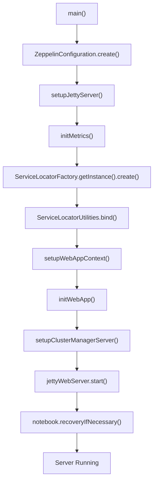
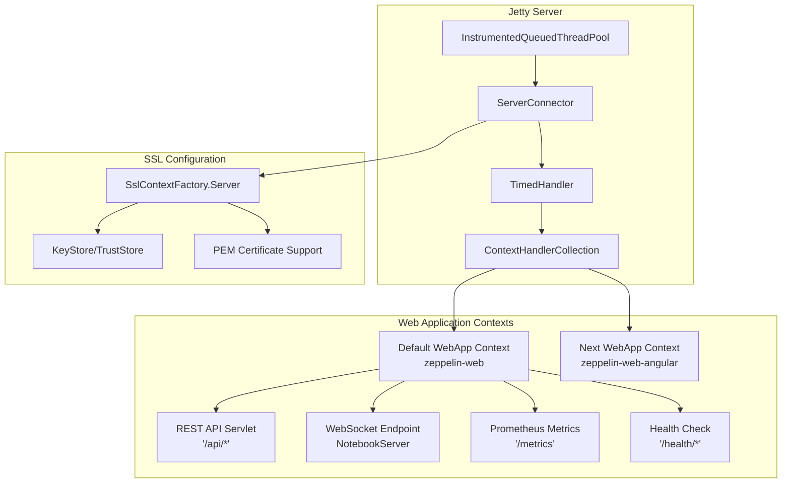
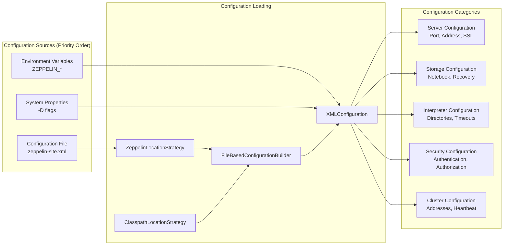
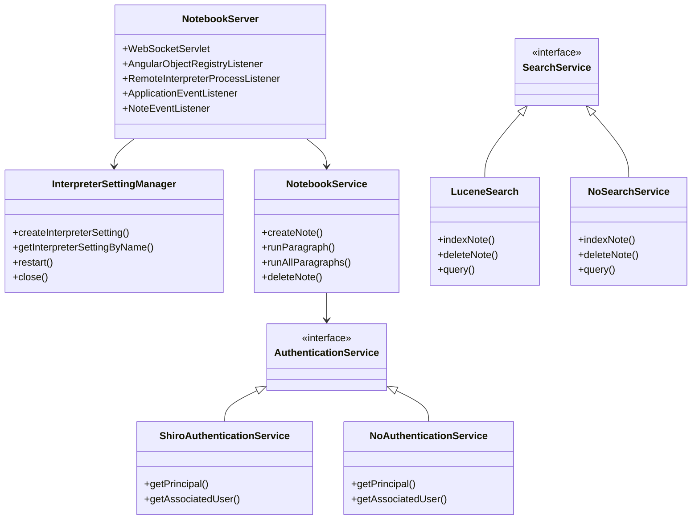
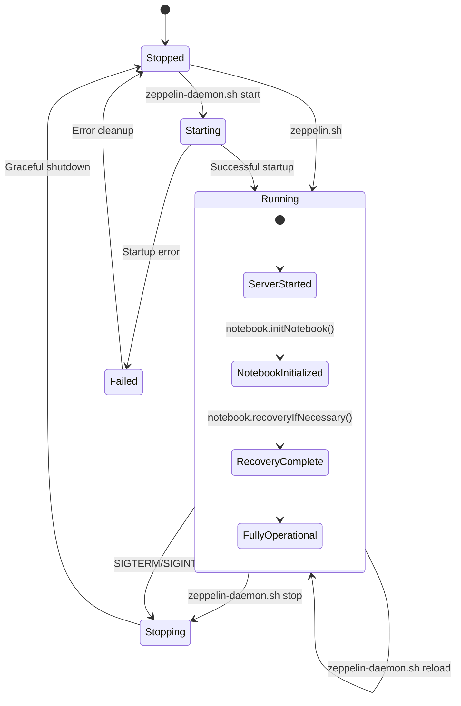

# Core Server Components

Relevant source files

The following files were used as context for generating this wiki page:

- [bin/common.cmd](bin/common.cmd)
- [bin/common.sh](bin/common.sh)
- [bin/functions.sh](bin/functions.sh)
- [bin/interpreter.sh](bin/interpreter.sh)
- [bin/zeppelin-daemon.sh](bin/zeppelin-daemon.sh)
- [bin/zeppelin.sh](bin/zeppelin.sh)
- [conf/zeppelin-env.cmd.template](conf/zeppelin-env.cmd.template)
- [conf/zeppelin-env.sh.template](conf/zeppelin-env.sh.template)
- [conf/zeppelin-site.xml.template](conf/zeppelin-site.xml.template)
- [docs/setup/operation/configuration.md](docs/setup/operation/configuration.md)
- [zeppelin-interpreter/src/main/java/org/apache/zeppelin/conf/ZeppelinConfiguration.java](zeppelin-interpreter/src/main/java/org/apache/zeppelin/conf/ZeppelinConfiguration.java)
- [zeppelin-interpreter/src/main/java/org/apache/zeppelin/interpreter/launcher/InterpreterLauncher.java](zeppelin-interpreter/src/main/java/org/apache/zeppelin/interpreter/launcher/InterpreterLauncher.java)
- [zeppelin-interpreter/src/main/java/org/apache/zeppelin/interpreter/lifecycle/TimeoutLifecycleManager.java](zeppelin-interpreter/src/main/java/org/apache/zeppelin/interpreter/lifecycle/TimeoutLifecycleManager.java)
- [zeppelin-interpreter/src/test/java/org/apache/zeppelin/conf/ZeppelinConfigurationTest.java](zeppelin-interpreter/src/test/java/org/apache/zeppelin/conf/ZeppelinConfigurationTest.java)
- [zeppelin-server/src/main/java/org/apache/zeppelin/server/ImmediateErrorHandlerImpl.java](zeppelin-server/src/main/java/org/apache/zeppelin/server/ImmediateErrorHandlerImpl.java)
- [zeppelin-server/src/main/java/org/apache/zeppelin/server/ZeppelinServer.java](zeppelin-server/src/main/java/org/apache/zeppelin/server/ZeppelinServer.java)
- [zeppelin-server/src/main/java/org/apache/zeppelin/socket/SessionConfigurator.java](zeppelin-server/src/main/java/org/apache/zeppelin/socket/SessionConfigurator.java)
- [zeppelin-server/src/main/java/org/apache/zeppelin/utils/TestUtils.java](zeppelin-server/src/main/java/org/apache/zeppelin/utils/TestUtils.java)
- [zeppelin-server/src/test/java/org/apache/zeppelin/recovery/RecoveryTest.java](zeppelin-server/src/test/java/org/apache/zeppelin/recovery/RecoveryTest.java)
- [zeppelin-zengine/src/main/java/org/apache/zeppelin/interpreter/recovery/RecoveryUtils.java](zeppelin-zengine/src/main/java/org/apache/zeppelin/interpreter/recovery/RecoveryUtils.java)
- [zeppelin-zengine/src/main/java/org/apache/zeppelin/interpreter/remote/RemoteInterpreter.java](zeppelin-zengine/src/main/java/org/apache/zeppelin/interpreter/remote/RemoteInterpreter.java)
- [zeppelin-zengine/src/test/java/org/apache/zeppelin/conf/ZeppelinConfigurationTest.java](zeppelin-zengine/src/test/java/org/apache/zeppelin/conf/ZeppelinConfigurationTest.java)
- [zeppelin-zengine/src/test/java/org/apache/zeppelin/interpreter/launcher/StandardInterpreterLauncherTest.java](zeppelin-zengine/src/test/java/org/apache/zeppelin/interpreter/launcher/StandardInterpreterLauncherTest.java)
- [zeppelin-zengine/src/test/java/org/apache/zeppelin/interpreter/lifecycle/TimeoutLifecycleManagerTest.java](zeppelin-zengine/src/test/java/org/apache/zeppelin/interpreter/lifecycle/TimeoutLifecycleManagerTest.java)
- [zeppelin-zengine/src/test/java/org/apache/zeppelin/interpreter/remote/RemoteInterpreterTest.java](zeppelin-zengine/src/test/java/org/apache/zeppelin/interpreter/remote/RemoteInterpreterTest.java)

This document explains the core server infrastructure of Apache Zeppelin, including the Jetty web server configuration, HK2 dependency injection framework, configuration management, and core service bindings that form the foundation of the Zeppelin server architecture.

For information about the interpreter framework and execution, see [Interpreter Framework](#2.3). For details about storage and persistence mechanisms, see [Storage and Persistence](#2.4).

## Server Bootstrap Process

The Zeppelin server bootstrap begins with the `ZeppelinServer.main()` method, which orchestrates the initialization of all core components in a specific sequence.

**Server Bootstrap Flow**

The bootstrap process loads configuration from multiple sources with the following priority order: environment variables, system properties, and finally the `zeppelin-site.xml` configuration file. The server then sets up the Jetty web server with appropriate connectors, initializes the HK2 dependency injection framework, and binds all core services before starting the web server.

Sources: [zeppelin-server/src/main/java/org/apache/zeppelin/server/ZeppelinServer.java:148-310]()

## Jetty Web Server Architecture

Zeppelin uses an embedded Jetty server as its web container, configured with customizable thread pools, SSL support, and multiple web application contexts.

**Jetty Server Component Architecture**

The server supports both HTTP and HTTPS configurations, with SSL certificates configurable via either Java KeyStore/TrustStore files or PEM certificate files. Thread pool sizing is configurable through properties like `zeppelin.server.jetty.thread.pool.max`.

Sources: [zeppelin-server/src/main/java/org/apache/zeppelin/server/ZeppelinServer.java:343-391](), [zeppelin-server/src/main/java/org/apache/zeppelin/server/ZeppelinServer.java:476-546]()

## HK2 Dependency Injection Framework

Zeppelin uses the HK2 dependency injection framework to manage service lifecycles and dependencies. A shared `ServiceLocator` instance manages all core services as singletons.

```mermaid
graph TB
    ServiceLocatorFactory["ServiceLocatorFactory.getInstance()"]
    SharedServiceLocator["ServiceLocator<br/>SERVICE_LOCATOR_NAME"]
    
    subgraph "Core Service Bindings"
        ZeppelinConfig["ZeppelinConfiguration"]
        InterpreterFactory["InterpreterFactory"]
        InterpreterSettingManager["InterpreterSettingManager"]
        NotebookRepoSync["NotebookRepoSync"]
        Notebook["Notebook"]
        NoteManager["NoteManager"]
        NotebookService["NotebookService"]
        NotebookServer["NotebookServer"]
        AuthService["AuthenticationService"]
        AuthzService["AuthorizationService"]
        ConnectionManager["ConnectionManager"]
        SearchService["SearchService"]
        SchedulerService["SchedulerService"]
        Helium["Helium"]
        HeliumBundleFactory["HeliumBundleFactory"]
        Credentials["Credentials"]
    end
    
    subgraph "Service Interfaces"
        AuthInterface["AuthenticationService Interface"]
        SearchInterface["SearchService Interface"]
        SchedulerInterface["SchedulerService Interface"]
        NotebookRepoInterface["NotebookRepo Interface"]
    end
    
    ServiceLocatorFactory --> SharedServiceLocator
    SharedServiceLocator --> ZeppelinConfig
    SharedServiceLocator --> InterpreterFactory
    SharedServiceLocator --> InterpreterSettingManager
    SharedServiceLocator --> NotebookRepoSync
    SharedServiceLocator --> Notebook
    SharedServiceLocator --> NoteManager
    SharedServiceLocator --> NotebookService
    SharedServiceLocator --> NotebookServer
    SharedServiceLocator --> AuthService
    SharedServiceLocator --> AuthzService
    SharedServiceLocator --> ConnectionManager
    SharedServiceLocator --> SearchService
    SharedServiceLocator --> SchedulerService
    SharedServiceLocator --> Helium
    SharedServiceLocator --> HeliumBundleFactory
    SharedServiceLocator --> Credentials
    
    AuthService --> AuthInterface
    SearchService --> SearchInterface
    SchedulerService --> SchedulerInterface
    NotebookRepoSync --> NotebookRepoInterface
```

**HK2 Service Dependency Graph**

The service bindings are configured in the `main()` method using an `AbstractBinder` implementation. Services are bound both to their concrete implementation classes and to their interface types, allowing for polymorphic dependency injection.

| Service | Implementation | Lifecycle | Interface |
|---------|---------------|-----------|-----------|
| `AuthenticationService` | `ShiroAuthenticationService` or `NoAuthenticationService` | Singleton | Based on Shiro configuration |
| `SearchService` | `LuceneSearch` or `NoSearchService` | Singleton | Based on search enable flag |
| `SchedulerService` | `QuartzSchedulerService` or `NoSchedulerService` | Singleton | Based on cron enable flag |
| `NotebookRepo` | `NotebookRepoSync` | Immediate | Multi-backend support |

Sources: [zeppelin-server/src/main/java/org/apache/zeppelin/server/ZeppelinServer.java:166-223](), [zeppelin-server/src/main/java/org/apache/zeppelin/socket/SessionConfigurator.java:47-49]()

## Configuration Management

The `ZeppelinConfiguration` class implements a hierarchical configuration system that loads settings from multiple sources in priority order.

**Configuration Hierarchy and Loading Process**

The configuration system uses Apache Commons Configuration2 to load settings from XML files, with support for both filesystem and classpath-based configuration file discovery. Configuration values are strongly typed with automatic conversion and validation.

| Configuration Category | Key Properties | Default Values |
|------------------------|---------------|----------------|
| Server | `zeppelin.server.addr`, `zeppelin.server.port` | `127.0.0.1:8080` |
| SSL | `zeppelin.ssl`, `zeppelin.ssl.keystore.path` | Disabled |
| Interpreters | `zeppelin.interpreter.dir`, `zeppelin.interpreter.connect.timeout` | `interpreter`, `600s` |
| Notebook Storage | `zeppelin.notebook.storage`, `zeppelin.notebook.dir` | `GitNotebookRepo`, `notebook` |

Sources: [zeppelin-interpreter/src/main/java/org/apache/zeppelin/conf/ZeppelinConfiguration.java:83-118](), [conf/zeppelin-site.xml.template:22-830]()

## Core Service Implementations

The server binds multiple service implementations based on configuration flags, providing pluggable architectures for authentication, search, scheduling, and storage.

**Core Service Class Relationships**

The `NotebookServer` serves as the primary WebSocket endpoint and implements multiple listener interfaces for different types of events. Service selection is determined by configuration flags - for example, authentication services are selected based on whether a Shiro configuration file exists.

Sources: [zeppelin-server/src/main/java/org/apache/zeppelin/server/ZeppelinServer.java:193-221]()

## Server Lifecycle Management

Zeppelin provides shell scripts for managing the server lifecycle, with support for daemon mode operation and graceful shutdown handling.

**Server Lifecycle State Machine**

The server supports both foreground execution via `zeppelin.sh` and daemon mode via `zeppelin-daemon.sh`. The daemon script manages PID files, handles process monitoring, and provides graceful shutdown with configurable timeouts.

| Script | Purpose | Key Features |
|--------|---------|--------------|
| `zeppelin.sh` | Direct execution | Foreground mode, direct console output |
| `zeppelin-daemon.sh` | Daemon management | Background mode, PID management, log redirection |
| `common.sh` | Shared utilities | Environment setup, classpath construction |
| `interpreter.sh` | Interpreter processes | Remote interpreter launching |

Sources: [bin/zeppelin-daemon.sh:188-235](), [bin/zeppelin.sh:88-143](), [bin/common.sh:25-177]()
