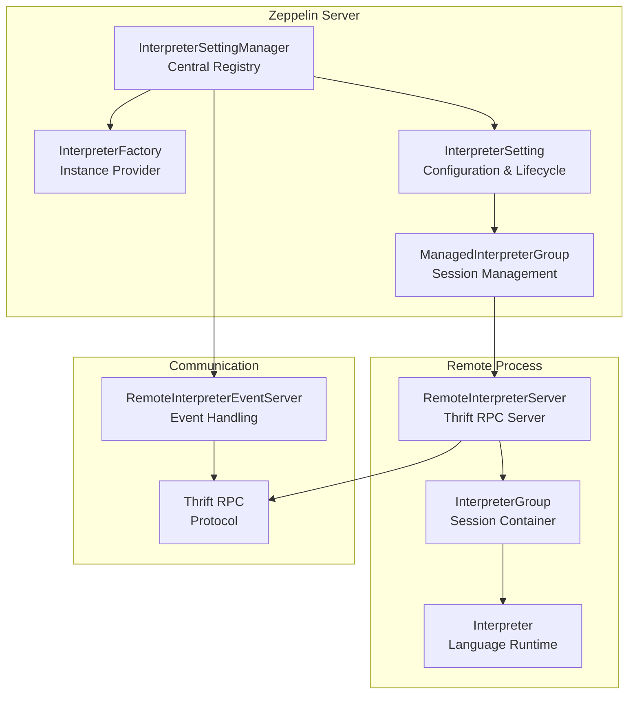
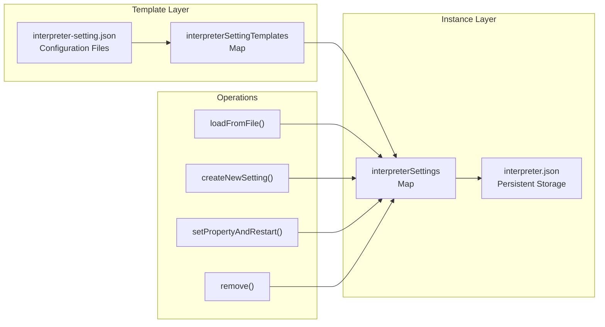
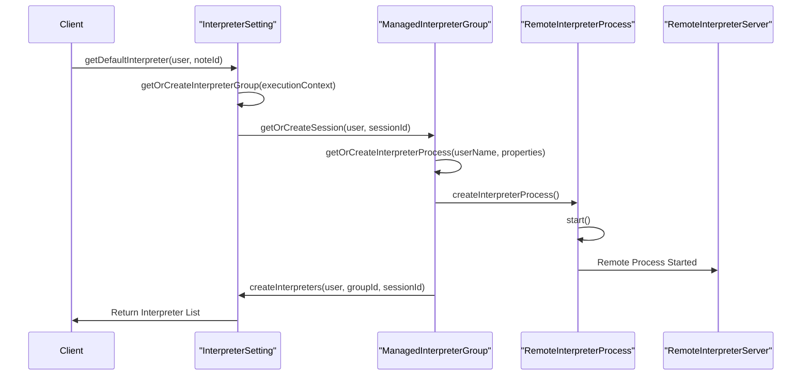
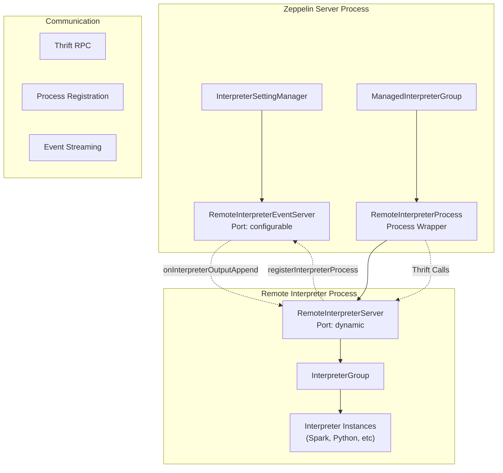
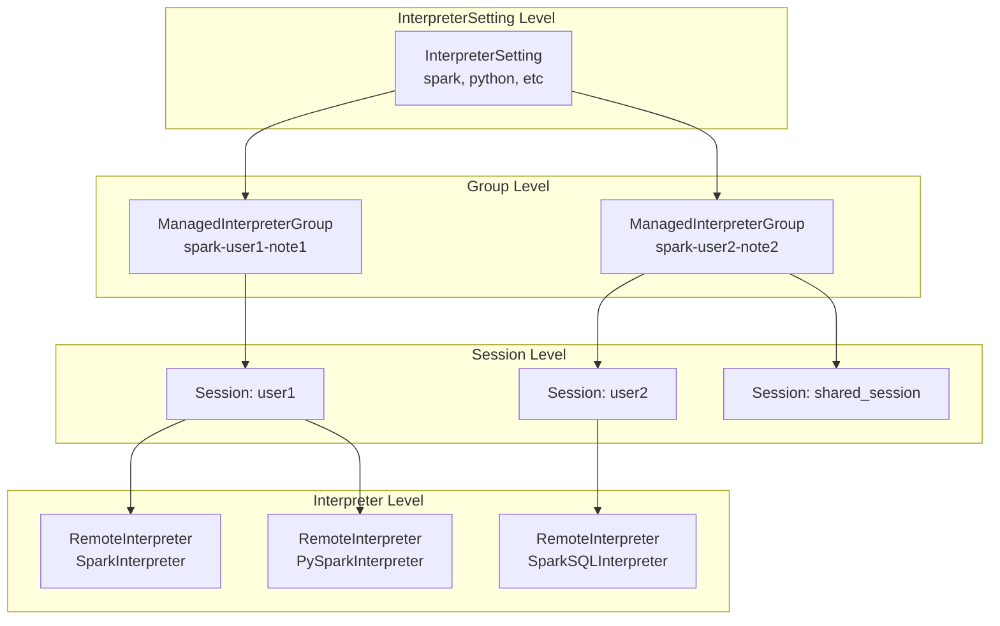
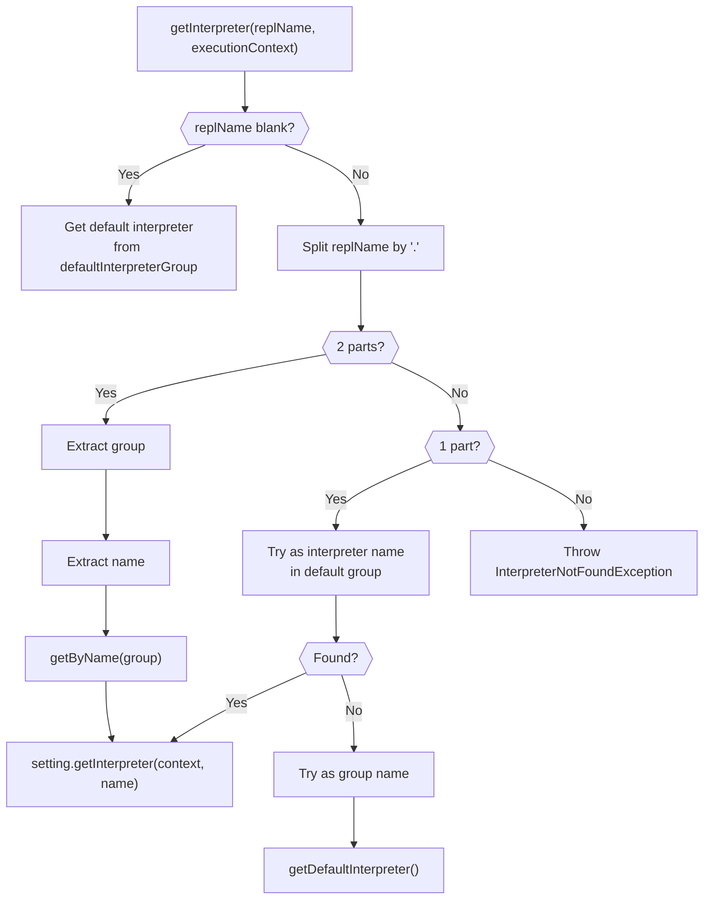

# Interpreter Framework

<details>
<summary>Relevant source files</summary>

The following files were used as context for generating this wiki page:

- [docs/assets/themes/zeppelin/img/screenshots/interpreter_setting_with_context_parameters.png](docs/assets/themes/zeppelin/img/screenshots/interpreter_setting_with_context_parameters.png)
- [helium-dev/src/main/java/org/apache/zeppelin/helium/ZeppelinDevServer.java](helium-dev/src/main/java/org/apache/zeppelin/helium/ZeppelinDevServer.java)
- [zeppelin-interpreter/src/main/java/org/apache/zeppelin/interpreter/AbstractInterpreter.java](zeppelin-interpreter/src/main/java/org/apache/zeppelin/interpreter/AbstractInterpreter.java)
- [zeppelin-interpreter/src/main/java/org/apache/zeppelin/interpreter/Interpreter.java](zeppelin-interpreter/src/main/java/org/apache/zeppelin/interpreter/Interpreter.java)
- [zeppelin-interpreter/src/main/java/org/apache/zeppelin/interpreter/InterpreterGroup.java](zeppelin-interpreter/src/main/java/org/apache/zeppelin/interpreter/InterpreterGroup.java)
- [zeppelin-interpreter/src/main/java/org/apache/zeppelin/interpreter/InterpreterOption.java](zeppelin-interpreter/src/main/java/org/apache/zeppelin/interpreter/InterpreterOption.java)
- [zeppelin-interpreter/src/main/java/org/apache/zeppelin/interpreter/remote/RemoteInterpreterServer.java](zeppelin-interpreter/src/main/java/org/apache/zeppelin/interpreter/remote/RemoteInterpreterServer.java)
- [zeppelin-interpreter/src/main/java/org/apache/zeppelin/interpreter/remote/RemoteInterpreterUtils.java](zeppelin-interpreter/src/main/java/org/apache/zeppelin/interpreter/remote/RemoteInterpreterUtils.java)
- [zeppelin-interpreter/src/test/java/org/apache/zeppelin/interpreter/InterpreterTest.java](zeppelin-interpreter/src/test/java/org/apache/zeppelin/interpreter/InterpreterTest.java)
- [zeppelin-interpreter/src/test/java/org/apache/zeppelin/interpreter/ZeppCtxtVariableTest.java](zeppelin-interpreter/src/test/java/org/apache/zeppelin/interpreter/ZeppCtxtVariableTest.java)
- [zeppelin-interpreter/src/test/java/org/apache/zeppelin/interpreter/remote/RemoteInterpreterServerTest.java](zeppelin-interpreter/src/test/java/org/apache/zeppelin/interpreter/remote/RemoteInterpreterServerTest.java)
- [zeppelin-interpreter/src/test/java/org/apache/zeppelin/interpreter/remote/RemoteInterpreterUtilsTest.java](zeppelin-interpreter/src/test/java/org/apache/zeppelin/interpreter/remote/RemoteInterpreterUtilsTest.java)
- [zeppelin-server/src/main/java/org/apache/zeppelin/rest/InterpreterRestApi.java](zeppelin-server/src/main/java/org/apache/zeppelin/rest/InterpreterRestApi.java)
- [zeppelin-server/src/test/java/org/apache/zeppelin/rest/InterpreterRestApiTest.java](zeppelin-server/src/test/java/org/apache/zeppelin/rest/InterpreterRestApiTest.java)
- [zeppelin-zengine/src/main/java/org/apache/zeppelin/interpreter/InterpreterFactory.java](zeppelin-zengine/src/main/java/org/apache/zeppelin/interpreter/InterpreterFactory.java)
- [zeppelin-zengine/src/main/java/org/apache/zeppelin/interpreter/InterpreterSetting.java](zeppelin-zengine/src/main/java/org/apache/zeppelin/interpreter/InterpreterSetting.java)
- [zeppelin-zengine/src/main/java/org/apache/zeppelin/interpreter/InterpreterSettingManager.java](zeppelin-zengine/src/main/java/org/apache/zeppelin/interpreter/InterpreterSettingManager.java)
- [zeppelin-zengine/src/main/java/org/apache/zeppelin/interpreter/ManagedInterpreterGroup.java](zeppelin-zengine/src/main/java/org/apache/zeppelin/interpreter/ManagedInterpreterGroup.java)
- [zeppelin-zengine/src/main/java/org/apache/zeppelin/interpreter/RemoteInterpreterEventServer.java](zeppelin-zengine/src/main/java/org/apache/zeppelin/interpreter/RemoteInterpreterEventServer.java)
- [zeppelin-zengine/src/test/java/org/apache/zeppelin/interpreter/InterpreterFactoryTest.java](zeppelin-zengine/src/test/java/org/apache/zeppelin/interpreter/InterpreterFactoryTest.java)
- [zeppelin-zengine/src/test/java/org/apache/zeppelin/interpreter/InterpreterSettingManagerTest.java](zeppelin-zengine/src/test/java/org/apache/zeppelin/interpreter/InterpreterSettingManagerTest.java)
- [zeppelin-zengine/src/test/java/org/apache/zeppelin/interpreter/InterpreterSettingTest.java](zeppelin-zengine/src/test/java/org/apache/zeppelin/interpreter/InterpreterSettingTest.java)

</details>


The Interpreter Framework is the core system in Apache Zeppelin that manages interpreter settings, creates interpreter instances, and handles their lifecycle. This framework enables Zeppelin to support multiple programming languages and execution backends through a pluggable architecture where interpreters can run locally or in remote processes.

For information about specific interpreter implementations like Spark or Python, see [Interpreters](#5). For details about the web interface for managing interpreters, see [Interpreter Management UI](#3.2).

## Architecture Overview

The Interpreter Framework consists of several key components that work together to provide interpreter functionality:



**Sources:** [zeppelin-zengine/src/main/java/org/apache/zeppelin/interpreter/InterpreterSettingManager.java:1-760](), [zeppelin-zengine/src/main/java/org/apache/zeppelin/interpreter/InterpreterFactory.java:1-84](), [zeppelin-zengine/src/main/java/org/apache/zeppelin/interpreter/InterpreterSetting.java:1-1200]()

## Interpreter Settings Management

The `InterpreterSettingManager` serves as the central registry for all interpreter configurations and is responsible for loading, creating, updating, and removing interpreter settings.

### Setting Templates and Instances



The system maintains two levels of interpreter configurations:

- **Templates** (`interpreterSettingTemplates`): Default configurations loaded from `interpreter-setting.json` files in interpreter directories
- **Instances** (`interpreterSettings`): User-customized configurations persisted in `interpreter.json`

**Sources:** [zeppelin-zengine/src/main/java/org/apache/zeppelin/interpreter/InterpreterSettingManager.java:122-133](), [zeppelin-zengine/src/main/java/org/apache/zeppelin/interpreter/InterpreterSettingManager.java:239-321]()

### Configuration Loading Process

The `InterpreterSettingManager` follows this initialization sequence:

1. **Load Templates**: Scan interpreter directories for `interpreter-setting.json` files via `loadInterpreterSettingFromDefaultDir()`
2. **Load Instances**: Read user configurations from `interpreter.json` via `loadFromFile()`
3. **Merge Configurations**: Combine template properties with user customizations
4. **Initialize Dependencies**: Set up dependency resolvers and repositories

**Sources:** [zeppelin-zengine/src/main/java/org/apache/zeppelin/interpreter/InterpreterSettingManager.java:414-443](), [zeppelin-zengine/src/main/java/org/apache/zeppelin/interpreter/InterpreterSettingManager.java:499-542]()

## Interpreter Lifecycle Management

Each `InterpreterSetting` manages the complete lifecycle of interpreter instances, from creation to destruction.

### Interpreter Creation Flow



The creation process involves:

1. **Execution Context**: Determine interpreter group ID based on isolation settings
2. **Session Management**: Create or reuse sessions based on `InterpreterOption` configuration
3. **Process Management**: Launch remote interpreter processes when needed
4. **Interpreter Instantiation**: Create actual interpreter instances in the remote process

**Sources:** [zeppelin-zengine/src/main/java/org/apache/zeppelin/interpreter/InterpreterSetting.java:448-462](), [zeppelin-zengine/src/main/java/org/apache/zeppelin/interpreter/InterpreterSetting.java:820-846](), [zeppelin-zengine/src/main/java/org/apache/zeppelin/interpreter/ManagedInterpreterGroup.java:60-75]()

### Isolation Modes

The framework supports multiple isolation modes controlled by `InterpreterOption`:

| Mode | Scope | Behavior |
|------|-------|----------|
| `SHARED` | Global | Single process/session shared across all users and notes |
| `SCOPED` | Per User/Note | Separate sessions within shared process |
| `ISOLATED` | Per User/Note | Separate processes for each user/note |

**Sources:** [zeppelin-interpreter/src/main/java/org/apache/zeppelin/interpreter/InterpreterOption.java:30-32](), [zeppelin-zengine/src/main/java/org/apache/zeppelin/interpreter/InterpreterSetting.java:400-442]()

## Remote Interpreter Infrastructure

Zeppelin runs interpreters in separate processes to provide isolation and fault tolerance. The remote interpreter infrastructure handles process management and communication.

### Process Architecture



### Process Registration

When a remote interpreter process starts, it follows this registration sequence:

1. **Server Startup**: `RemoteInterpreterServer` starts and binds to available port
2. **Registration**: Calls `registerInterpreterProcess()` on `RemoteInterpreterEventServer`
3. **Process Tracking**: Server updates `RemoteInterpreterProcess` with connection details
4. **Event Setup**: Establishes bidirectional communication for events and output

**Sources:** [zeppelin-interpreter/src/main/java/org/apache/zeppelin/interpreter/remote/RemoteInterpreterServer.java:616-658](), [zeppelin-zengine/src/main/java/org/apache/zeppelin/interpreter/RemoteInterpreterEventServer.java:167-186]()

### Launcher Plugins

The framework supports multiple launcher implementations for different deployment scenarios:

| Launcher | Use Case | Configuration |
|----------|----------|---------------|
| `StandardInterpreterLauncher` | Local processes | Default |
| `SparkInterpreterLauncher` | Spark-specific setup | Spark interpreter |
| `K8sStandardInterpreterLauncher` | Kubernetes pods | `RUN_MODE.K8S` |
| `YarnInterpreterLauncher` | YARN containers | `zeppelin.interpreter.launcher=yarn` |
| `DockerInterpreterLauncher` | Docker containers | `RUN_MODE.DOCKER` |

**Sources:** [zeppelin-zengine/src/main/java/org/apache/zeppelin/interpreter/InterpreterSetting.java:763-791]()

## Session and Group Management

The framework organizes interpreters into groups and sessions to manage sharing and isolation.

### Hierarchy Structure



### Session ID Generation

Session IDs are generated based on the `InterpreterOption` configuration:

- **Shared**: `"shared_session"`
- **Per User**: `user` 
- **Per Note**: `noteId`
- **Per User & Note**: `user + ":" + noteId`
- **Existing Process**: `"existing_process"`

**Sources:** [zeppelin-zengine/src/main/java/org/apache/zeppelin/interpreter/InterpreterSetting.java:428-442]()

### Group ID Generation

Interpreter group IDs encode the isolation scope:

```
{settingId}-{isolationKeys}
```

Where isolation keys depend on the interpreter option:
- **Shared**: `"shared_process"`
- **Isolated**: `{user}` and/or `{noteId}`
- **Existing**: `"existing_process"`

**Sources:** [zeppelin-zengine/src/main/java/org/apache/zeppelin/interpreter/InterpreterSetting.java:400-425]()

## Factory Pattern Implementation

The `InterpreterFactory` provides a clean interface for creating interpreter instances without exposing the complexity of the underlying management system.

### Resolution Logic



**Sources:** [zeppelin-zengine/src/main/java/org/apache/zeppelin/interpreter/InterpreterFactory.java:38-83]()

## Error Handling and Recovery

The framework includes comprehensive error handling and recovery mechanisms:

### Status Management

Each `InterpreterSetting` maintains a status:

- `READY`: Normal operational state
- `DOWNLOADING_DEPENDENCIES`: Resolving artifact dependencies  
- `ERROR`: Failed state with error reason

**Sources:** [zeppelin-zengine/src/main/java/org/apache/zeppelin/interpreter/InterpreterSetting.java:728-748]()

### Recovery Storage

The framework integrates with recovery storage systems to persist interpreter state and enable recovery after failures:

```java
// Recovery operations
recoveryStorage.onInterpreterClientStart(process);
recoveryStorage.onInterpreterClientStop(process);
```

**Sources:** [zeppelin-zengine/src/main/java/org/apache/zeppelin/interpreter/InterpreterSetting.java:857-858](), [zeppelin-zengine/src/main/java/org/apache/zeppelin/interpreter/ManagedInterpreterGroup.java:112-115]()
