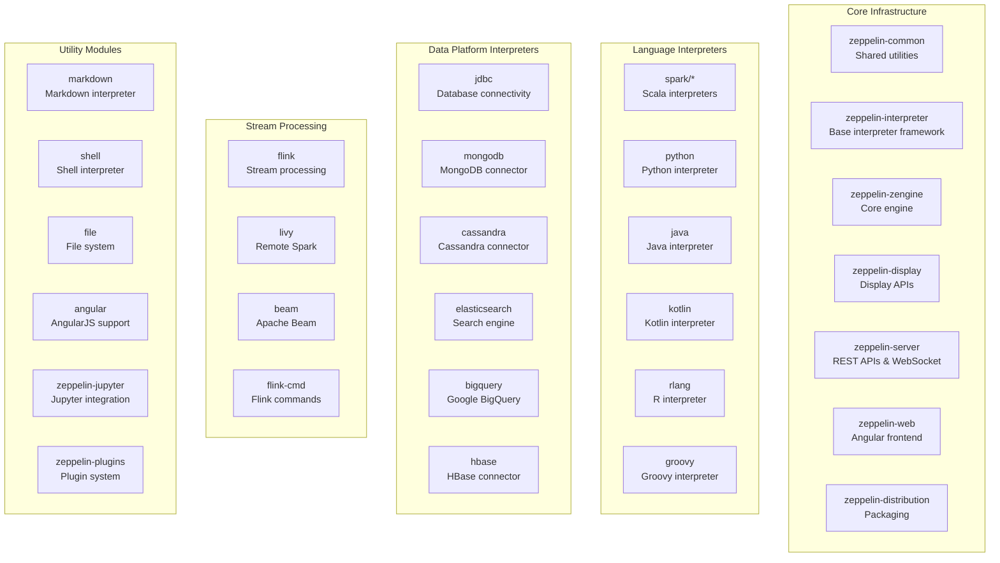
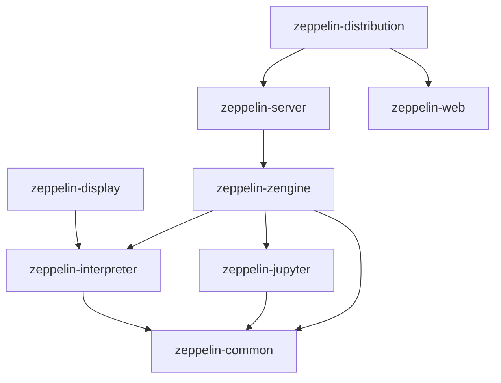
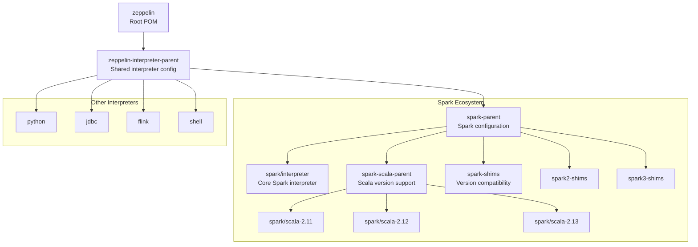
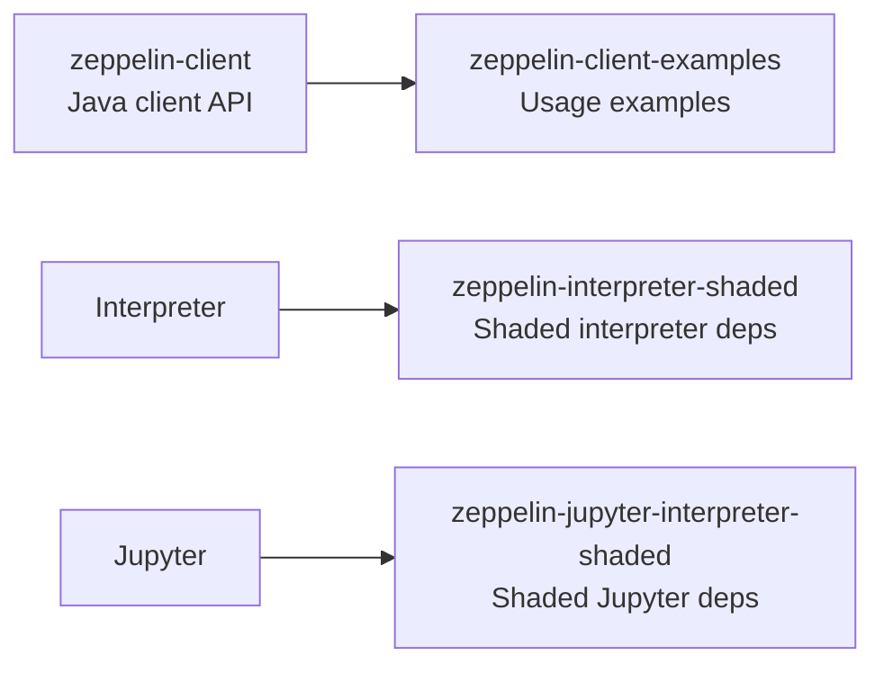

# Module Structure

Relevant source files

The following files were used as context for generating this wiki page:

- [.gitignore](.gitignore)
- [README.md](README.md)
- [pom.xml](pom.xml)
- [spark/pom.xml](spark/pom.xml)
- [zeppelin-display/pom.xml](zeppelin-display/pom.xml)
- [zeppelin-distribution/pom.xml](zeppelin-distribution/pom.xml)
- [zeppelin-interpreter/pom.xml](zeppelin-interpreter/pom.xml)
- [zeppelin-server/pom.xml](zeppelin-server/pom.xml)
- [zeppelin-web/pom.xml](zeppelin-web/pom.xml)
- [zeppelin-zengine/pom.xml](zeppelin-zengine/pom.xml)

This document describes the Maven module structure of Apache Zeppelin, including the organization of core components, interpreter modules, and their dependencies. This covers the build system architecture and module relationships that define how Zeppelin is assembled and packaged.

For information about the runtime architecture and component interactions, see [Core Server Components](#2.2). For details about individual interpreter implementations, see [Interpreters](#5).

## Module Organization

Zeppelin is organized as a multi-module Maven project with over 50 modules grouped into several logical categories. The root project defines the overall structure and shared configuration.

Sources: [pom.xml:54-103]()

## Core Module Dependencies

The core infrastructure modules have a layered dependency structure where higher-level components build upon lower-level foundations.

Sources: [zeppelin-server/pom.xml:54](), [zeppelin-zengine/pom.xml:48-72](), [zeppelin-distribution/pom.xml:77-87](), [zeppelin-display/pom.xml:67-71]()

## Core Infrastructure Modules

| Module | Artifact ID | Purpose | Key Dependencies |
|--------|-------------|---------|------------------|
| Common | `zeppelin-common` | Shared utilities and base classes | None (foundation) |
| Interpreter | `zeppelin-interpreter` | Base interpreter framework and API | `zeppelin-common` |
| Display | `zeppelin-display` | Display system APIs for visualizations | `zeppelin-interpreter` |
| Zengine | `zeppelin-zengine` | Core notebook engine and business logic | `zeppelin-common`, `zeppelin-interpreter`, `zeppelin-jupyter` |
| Server | `zeppelin-server` | REST APIs, WebSocket server, web container | `zeppelin-zengine` |
| Web | `zeppelin-web` | Angular.js frontend application | None (frontend only) |
| Distribution | `zeppelin-distribution` | Final packaging and assembly | `zeppelin-server`, `zeppelin-web` |

The `zeppelin-common` module serves as the foundation, providing shared utilities used across all other components. The `zeppelin-interpreter` module defines the core interpreter framework that all language-specific interpreters extend.

Sources: [zeppelin-server/pom.xml:50-95](), [zeppelin-zengine/pom.xml:45-72](), [zeppelin-distribution/pom.xml:76-88]()

## Interpreter Module Hierarchy

Interpreters are organized under a parent module structure that provides shared configuration and dependencies.

Sources: [pom.xml:55](), [spark/pom.xml:24-67]()

## Build Configuration and Profiles

The build system uses Maven profiles to support different Hadoop versions and deployment configurations. Key properties are defined at the root level and inherited by child modules.

| Property Category | Key Properties | Purpose |
|-------------------|----------------|---------|
| Language Versions | `java.version`, `scala.version`, `scala.binary.version` | Define language runtime versions |
| Hadoop Support | `hadoop.version`, `hadoop.deps.scope` | Configure Hadoop integration |
| Frontend Build | `node.version`, `npm.version`, `plugin.frontend.version` | Control web build process |
| Library Versions | `jetty.version`, `gson.version`, `libthrift.version` | Manage dependency versions |

The root POM defines two main Hadoop profiles:
- `hadoop2`: Uses Hadoop 2.7.x (default)
- `hadoop3`: Uses Hadoop 3.2.x

Sources: [pom.xml:105-216](), [zeppelin-server/pom.xml:482-519]()

## Shaded and Integration Modules

Several modules use Maven shading to resolve dependency conflicts and provide integration capabilities:

The shaded modules package dependencies with relocated class names to avoid conflicts when Zeppelin is embedded in other applications or when interpreters have conflicting dependency versions.

Sources: [pom.xml:57,62,96-97]()

## Web Application Build

The `zeppelin-web` module uses the frontend-maven-plugin to build the Angular.js application:

| Build Phase | Goal | Purpose |
|-------------|------|---------|
| Install | `install-node-and-npm` | Download Node.js and npm |
| Dependencies | `npm install` | Install JavaScript dependencies |
| Build | `npm run build:dist` | Build production assets |
| Test | `npm run karma-test` | Run unit tests |
| Integration Test | `npm run e2e` | Run end-to-end tests |

The web module produces a WAR file that contains the compiled frontend assets and is included in the final distribution.

Sources: [zeppelin-web/pom.xml:56-123](), [zeppelin-web/pom.xml:211-235]()
