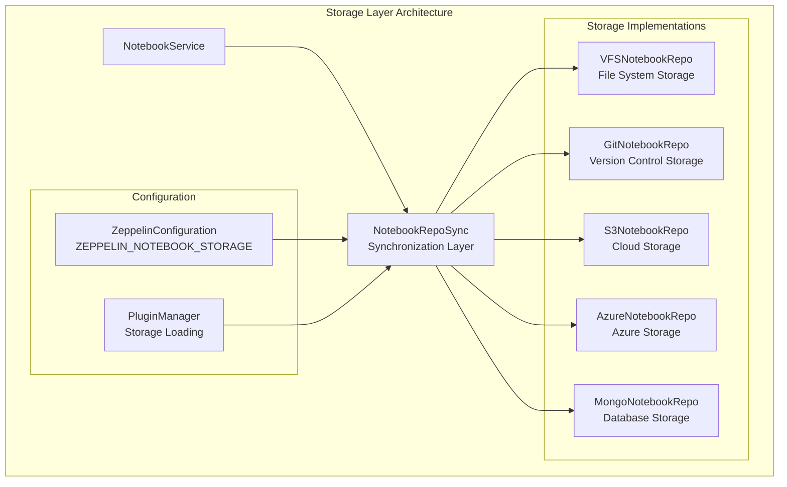
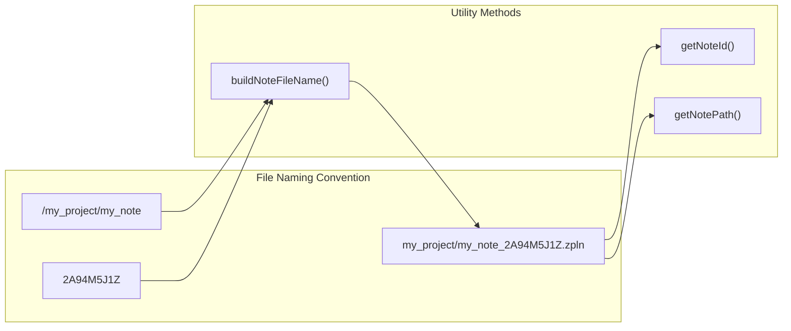
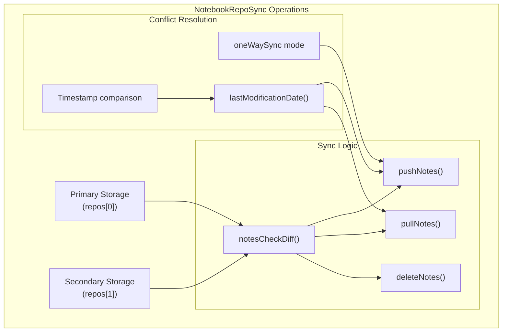
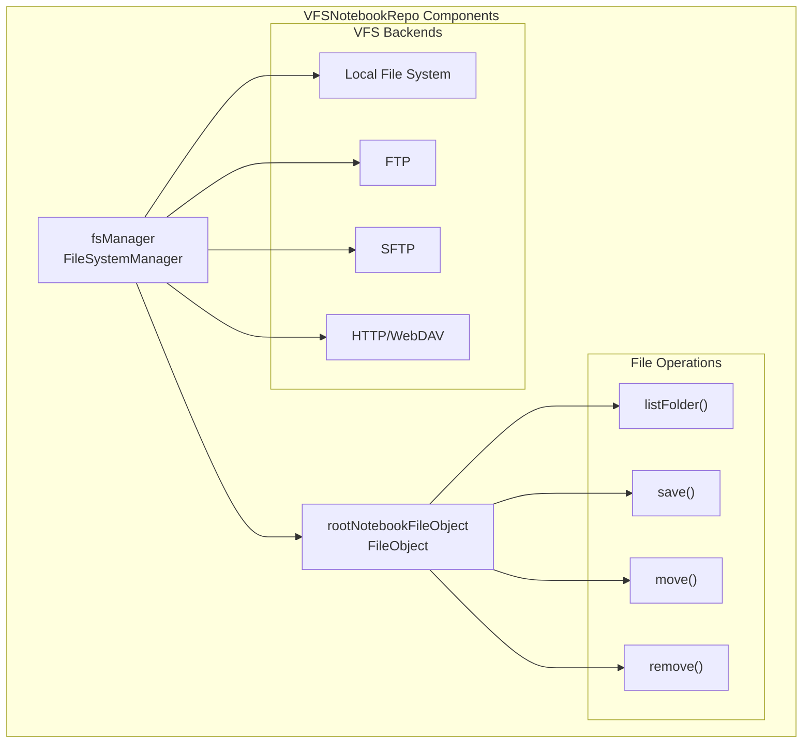
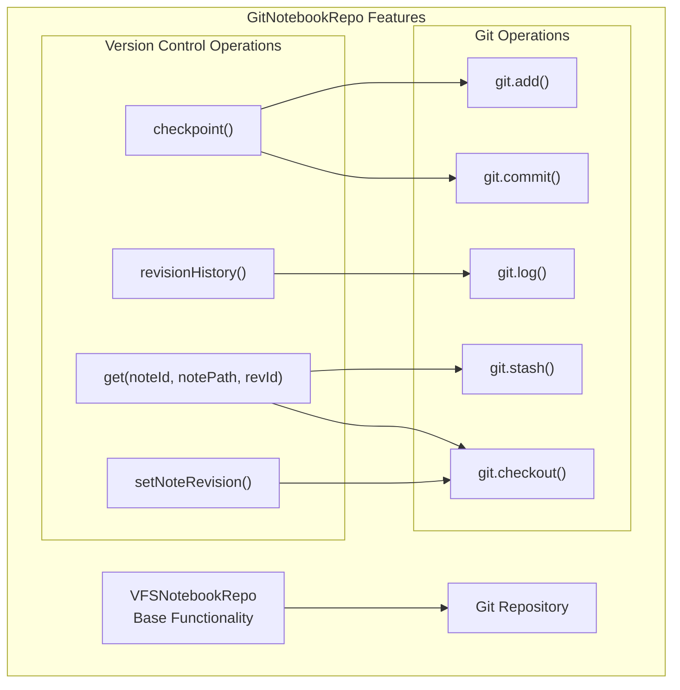
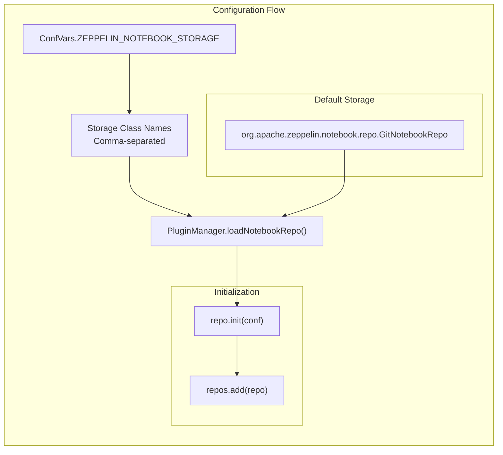
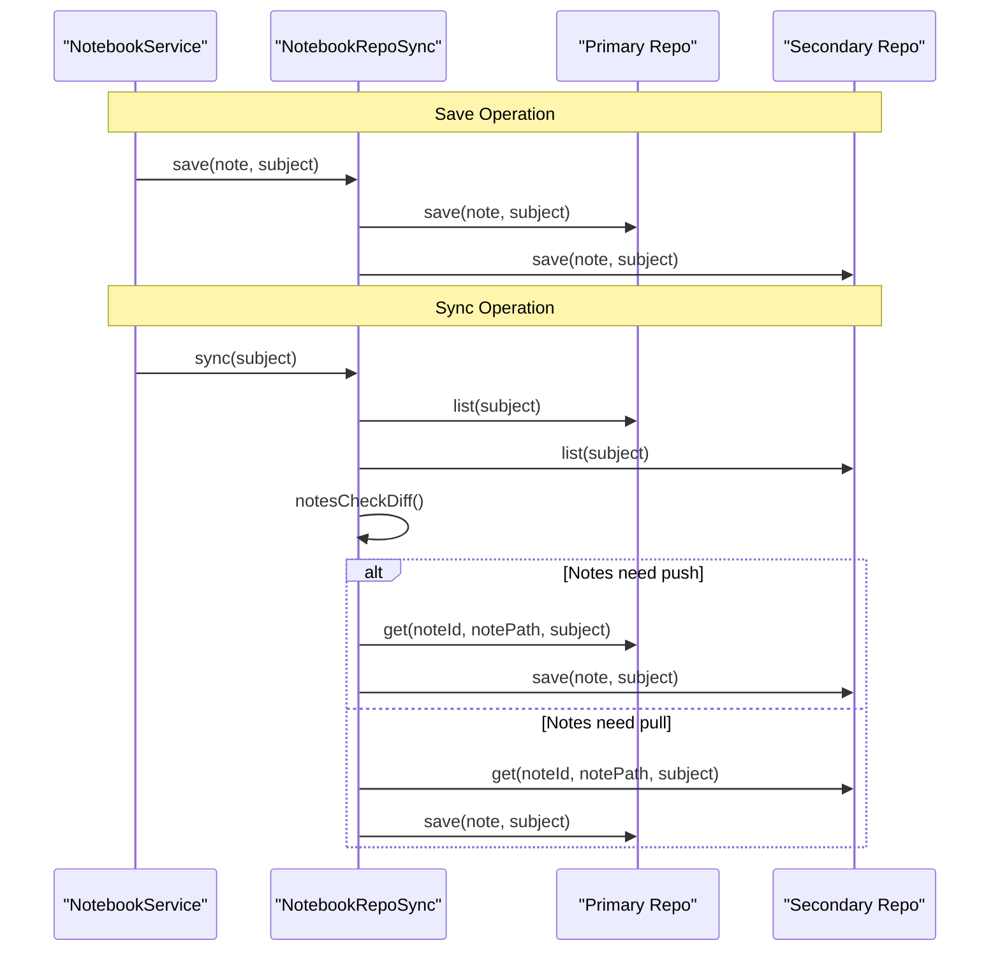

# Storage and Persistence

Relevant source files

The following files were used as context for generating this wiki page:

- [zeppelin-zengine/src/main/java/org/apache/zeppelin/notebook/repo/GitNotebookRepo.java](zeppelin-zengine/src/main/java/org/apache/zeppelin/notebook/repo/GitNotebookRepo.java)
- [zeppelin-zengine/src/main/java/org/apache/zeppelin/notebook/repo/NotebookRepo.java](zeppelin-zengine/src/main/java/org/apache/zeppelin/notebook/repo/NotebookRepo.java)
- [zeppelin-zengine/src/main/java/org/apache/zeppelin/notebook/repo/NotebookRepoSync.java](zeppelin-zengine/src/main/java/org/apache/zeppelin/notebook/repo/NotebookRepoSync.java)
- [zeppelin-zengine/src/main/java/org/apache/zeppelin/notebook/repo/VFSNotebookRepo.java](zeppelin-zengine/src/main/java/org/apache/zeppelin/notebook/repo/VFSNotebookRepo.java)
- [zeppelin-zengine/src/test/java/org/apache/zeppelin/notebook/repo/GitNotebookRepoTest.java](zeppelin-zengine/src/test/java/org/apache/zeppelin/notebook/repo/GitNotebookRepoTest.java)
- [zeppelin-zengine/src/test/java/org/apache/zeppelin/notebook/repo/NotebookRepoSyncTest.java](zeppelin-zengine/src/test/java/org/apache/zeppelin/notebook/repo/NotebookRepoSyncTest.java)
- [zeppelin-zengine/src/test/java/org/apache/zeppelin/notebook/repo/VFSNotebookRepoTest.java](zeppelin-zengine/src/test/java/org/apache/zeppelin/notebook/repo/VFSNotebookRepoTest.java)

This document covers Zeppelin's storage and persistence layer, which manages how notebooks are stored, synchronized, and versioned across different storage backends. The system supports multiple storage implementations including local file systems, Git repositories, and cloud storage providers, with built-in synchronization capabilities between multiple backends.

For information about notebook structure and lifecycle management, see [Core Server Components](#2.2). For interpreter-specific storage and recovery mechanisms, see [Interpreter Framework](#2.3).

## Storage Architecture Overview

Zeppelin's storage system is built around a pluggable architecture that supports multiple storage backends through the `NotebookRepo` interface. The system can operate with up to two storage backends simultaneously, with automatic synchronization between them.

Sources: [zeppelin-zengine/src/main/java/org/apache/zeppelin/notebook/repo/NotebookRepoSync.java:44-103](), [zeppelin-zengine/src/main/java/org/apache/zeppelin/notebook/repo/NotebookRepo.java:30-42]()

## NotebookRepo Interface

The `NotebookRepo` interface defines the core contract for all storage implementations. It provides standardized methods for notebook lifecycle operations and includes utility methods for file naming conventions.

| Method | Purpose | Parameters |
|--------|---------|------------|
| `list()` | List all notebooks | `AuthenticationInfo subject` |
| `get()` | Retrieve specific notebook | `noteId, notePath, subject` |
| `save()` | Persist notebook changes | `Note note, subject` |
| `move()` | Relocate notebook or folder | `noteId, notePath, newNotePath, subject` |
| `remove()` | Delete notebook or folder | `noteId, notePath, subject` |

Sources: [zeppelin-zengine/src/main/java/org/apache/zeppelin/notebook/repo/NotebookRepo.java:140-181]()

## Synchronization Layer

The `NotebookRepoSync` class manages synchronization between multiple storage backends, supporting both one-way and two-way synchronization modes. It operates as the primary interface between the notebook service and underlying storage implementations.

### Synchronization Process

The synchronization algorithm compares notebooks between storage backends and determines required actions:

1. **Note Comparison**: Uses `notesCheckDiff()` to identify differences between storages
2. **Timestamp Analysis**: Compares modification dates using paragraph timestamps
3. **Action Classification**: Categorizes notes into push, pull, or delete operations
4. **Conflict Resolution**: Applies one-way or timestamp-based resolution strategies

Sources: [zeppelin-zengine/src/main/java/org/apache/zeppelin/notebook/repo/NotebookRepoSync.java:315-376](), [zeppelin-zengine/src/main/java/org/apache/zeppelin/notebook/repo/NotebookRepoSync.java:231-275]()

## File System Storage

The `VFSNotebookRepo` implementation provides file-based storage using Apache Commons VFS, supporting local file systems and various remote file system protocols.

### File Organization

Notebooks are stored as JSON files with the `.zpln` extension, organized in a hierarchical folder structure that mirrors the notebook path hierarchy:

- **Root Directory**: Configured via `ZEPPELIN_NOTEBOOK_DIR`
- **File Naming**: `{notePath}_{noteId}.zpln` (path separator becomes folder structure)
- **Temporary Files**: Uses `.tmp` extension during save operations for atomicity

Sources: [zeppelin-zengine/src/main/java/org/apache/zeppelin/notebook/repo/VFSNotebookRepo.java:96-128](), [zeppelin-zengine/src/main/java/org/apache/zeppelin/notebook/repo/VFSNotebookRepo.java:142-159]()

## Version Control Storage

The `GitNotebookRepo` extends `VFSNotebookRepo` to provide Git-based version control capabilities, including checkpointing, revision history, and rollback functionality.

### Revision Management

The Git implementation provides sophisticated revision management:

1. **Checkpointing**: Creates Git commits only when changes are detected via `git.diff()`
2. **Revision Retrieval**: Uses stash/checkout/unstash sequence to access historical versions
3. **History Tracking**: Leverages Git log to provide complete revision history
4. **Safe Rollback**: Implements atomic rollback operations using Git reset

Sources: [zeppelin-zengine/src/main/java/org/apache/zeppelin/notebook/repo/GitNotebookRepo.java:123-146](), [zeppelin-zengine/src/main/java/org/apache/zeppelin/notebook/repo/GitNotebookRepo.java:155-191]()

## Configuration and Initialization

Storage backends are configured through `ZeppelinConfiguration` and loaded dynamically via the `PluginManager`. The system supports flexible configuration of multiple storage classes.

### Configuration Properties

| Property | Purpose | Default Value |
|----------|---------|---------------|
| `ZEPPELIN_NOTEBOOK_STORAGE` | Storage implementation classes | `GitNotebookRepo` |
| `ZEPPELIN_NOTEBOOK_ONE_WAY_SYNC` | Enable one-way synchronization | `false` |
| `ZEPPELIN_NOTEBOOK_DIR` | Root storage directory | `notebook/` |

Sources: [zeppelin-zengine/src/main/java/org/apache/zeppelin/notebook/repo/NotebookRepoSync.java:66-103](), [zeppelin-zengine/src/test/java/org/apache/zeppelin/notebook/repo/NotebookRepoSyncTest.java:82-87]()

## Persistence Data Flow

The following diagram illustrates how notebook data flows through the persistence layer during typical operations:

Sources: [zeppelin-zengine/src/main/java/org/apache/zeppelin/notebook/repo/NotebookRepoSync.java:167-178](), [zeppelin-zengine/src/main/java/org/apache/zeppelin/notebook/repo/NotebookRepoSync.java:277-279]()
