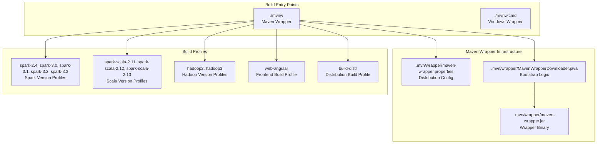
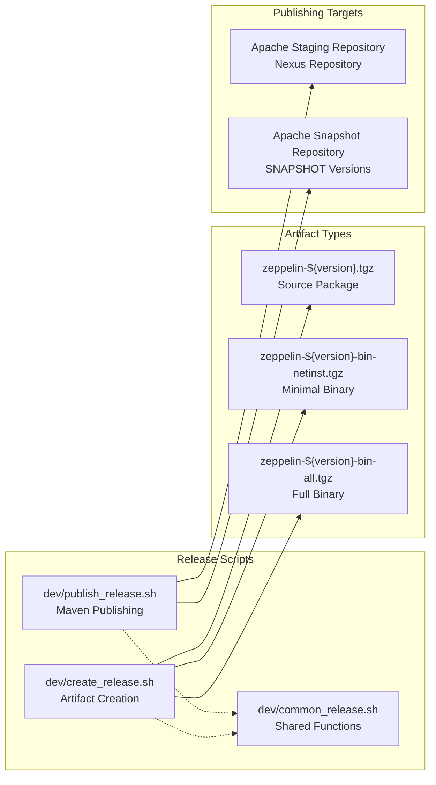
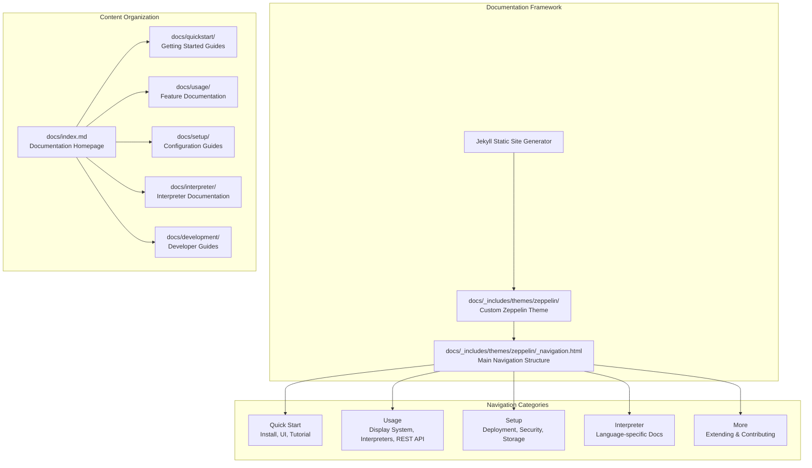
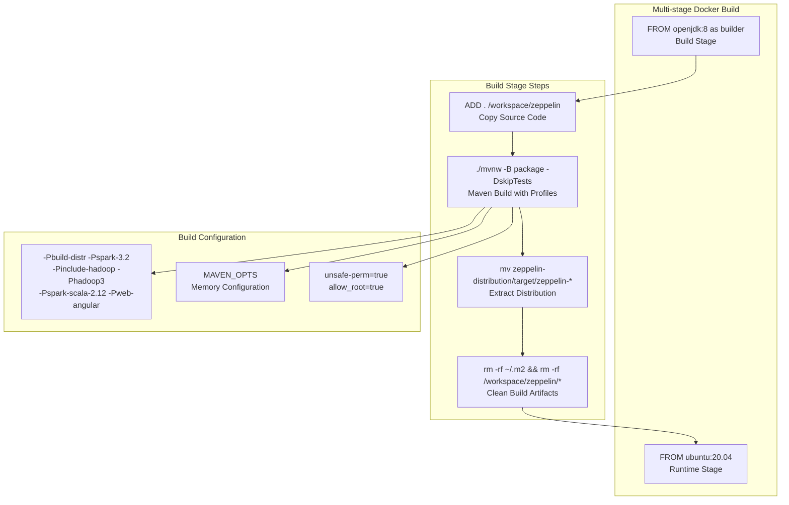

# Build, CI/CD, and Documentation

<details>
<summary>Relevant source files</summary>

The following files were used as context for generating this wiki page:

- [.github/workflows/core.yml](.github/workflows/core.yml)
- [.github/workflows/frontend.yml](.github/workflows/frontend.yml)
- [.github/workflows/quick.yml](.github/workflows/quick.yml)
- [.mvn/wrapper/MavenWrapperDownloader.java](.mvn/wrapper/MavenWrapperDownloader.java)
- [.mvn/wrapper/maven-wrapper.jar](.mvn/wrapper/maven-wrapper.jar)
- [.mvn/wrapper/maven-wrapper.properties](.mvn/wrapper/maven-wrapper.properties)
- [Dockerfile](Dockerfile)
- [conf/interpreter-list](conf/interpreter-list)
- [dev/common_release.sh](dev/common_release.sh)
- [dev/create_release.sh](dev/create_release.sh)
- [dev/publish_release.sh](dev/publish_release.sh)
- [docs/_includes/themes/zeppelin/_navigation.html](docs/_includes/themes/zeppelin/_navigation.html)
- [docs/index.md](docs/index.md)
- [docs/setup/basics/how_to_build.md](docs/setup/basics/how_to_build.md)
- [docs/usage/interpreter/installation.md](docs/usage/interpreter/installation.md)
- [livy/README.md](livy/README.md)

</details>


This page covers Zeppelin's build system infrastructure, continuous integration and deployment pipelines, and documentation framework. For information about deploying Zeppelin in production environments, see [Kubernetes Support](#6.1). For details about configuring and operating Zeppelin servers, see section 4.

## Build System Architecture

Zeppelin uses a Maven-based multi-module build system with a Maven wrapper for consistent builds across environments. The build system supports multiple profiles for different deployment targets and interpreter configurations.

### Maven Wrapper Infrastructure

The build system centers around the Maven wrapper (`mvnw`) which ensures consistent Maven versions across development and CI environments. The wrapper configuration is defined in [.mvn/wrapper/maven-wrapper.properties:18]() and uses Maven 3.8.1.



**Sources:** [.mvn/wrapper/maven-wrapper.properties:1-20](), [.mvn/wrapper/MavenWrapperDownloader.java:1-117](), [docs/setup/basics/how_to_build.md:80-175]()

### Build Command Patterns

The build system supports various configuration combinations through Maven profiles:

| Build Type | Command Example | Purpose |
|------------|-----------------|---------|
| Basic Build | `./mvnw clean package -DskipTests` | Standard compilation without tests |
| Distribution | `./mvnw clean package -Pbuild-distr` | Creates complete distribution package |
| Spark-specific | `./mvnw clean package -Pspark-3.2 -Pspark-scala-2.12` | Builds with specific Spark/Scala versions |
| Docker Build | `./mvnw -B package -Pbuild-distr -Pspark-3.2 -Pweb-angular` | Container-ready build |

**Sources:** [docs/setup/basics/how_to_build.md:58-175](), [Dockerfile:24]()

## Continuous Integration Pipeline

Zeppelin employs a comprehensive GitHub Actions-based CI/CD system with multiple workflow files handling different aspects of testing and validation.

### Primary CI Workflows

```mermaid
graph TB
    subgraph "GitHub Actions Workflows"
        core[".github/workflows/core.yml<br/>Core Module Testing"]
        frontend[".github/workflows/frontend.yml<br/>Frontend Testing"]
        quick[".github/workflows/quick.yml<br/>License & Validation"]
    end
    
    subgraph "Core Workflow Jobs"
        coremodules["core-modules<br/>zeppelin-interpreter, zeppelin-zengine, zeppelin-server"]
        interptest["interpreter-test-non-core<br/>beam, hbase, pig, jdbc, etc."]
        jupyter["interpreter-test-jupyter-python-rlang<br/>Python 3.7, 3.8 + R"]
        integration["zeppelin-integration-test<br/>Full Integration Tests"]
        flink["flink-test-and-flink-integration-test<br/>Flink 1.12-1.15"]
        spark["spark-integration-test<br/>Spark Integration"]
        sparktest["spark-test<br/>Multiple Spark Versions"]
        livy["livy-0-5-with-spark-2-2-0<br/>Livy Integration"]
    end
    
    subgraph "Frontend Workflow Jobs"
        e2e["run-e2e-tests-in-zeppelin-web<br/>Selenium E2E Tests"]
        angular["run-tests-in-zeppelin-web-angular<br/>Angular Unit Tests"]
        selenium["test-selenium-with-spark-module<br/>Spark UI Integration"]
    end
    
    subgraph "Quick Workflow Jobs"
        license["license-check<br/>Apache RAT License Check"]
        validate["maven-validate<br/>Maven POM Validation"]
    end
    
    core --> coremodules
    core --> interptest
    core --> jupyter
    core --> integration
    core --> flink
    core --> spark
    core --> sparktest
    core --> livy
    
    frontend --> e2e
    frontend --> angular
    frontend --> selenium
    
    quick --> license
    quick --> validate
```



**Sources:** [.github/workflows/core.yml:1-477](), [.github/workflows/frontend.yml:1-132](), [.github/workflows/quick.yml:1-58]()

### Environment Configuration

The CI system uses standardized environment variables and caching strategies across all workflows:

```bash
# Standard Maven Options (from core.yml:13-17)
MAVEN_OPTS: "-Xms1024M -Xmx2048M -XX:MaxMetaspaceSize=1024m 
             -XX:-UseGCOverheadLimit 
             -Dhttp.keepAlive=false 
             -Dmaven.wagon.http.pool=false"

# Zeppelin-specific Configuration (from core.yml:18-21)
ZEPPELIN_HELIUM_REGISTRY: helium
SPARK_PRINT_LAUNCH_COMMAND: "true" 
SPARK_LOCAL_IP: 127.0.0.1
ZEPPELIN_LOCAL_IP: 127.0.0.1
```

**Sources:** [.github/workflows/core.yml:10-22](), [.github/workflows/frontend.yml:10-22]()

### Test Matrix Strategy

The CI system employs matrix builds to test across multiple configurations:

| Matrix Dimension | Values | Workflow |
|------------------|--------|----------|
| Hadoop Versions | `hadoop2`, `hadoop3` | `core.yml:36` |
| Python Versions | `3.7`, `3.8` | `core.yml:129`, `spark-test:336` |
| Flink Versions | `112`, `113`, `114`, `115` | `core.yml:228` |
| Spark Versions | `2.4`, `3.0`, `3.1`, `3.2`, `3.3` | `spark-test` job |

**Sources:** [.github/workflows/core.yml:33-39](), [.github/workflows/core.yml:126-130](), [.github/workflows/core.yml:225-229]()

## Release Management System

Zeppelin's release process is automated through shell scripts that handle both source and binary artifact creation and publishing.

### Release Artifact Creation



**Sources:** [dev/create_release.sh:1-107](), [dev/publish_release.sh:1-183](), [dev/common_release.sh:1-66]()

### Binary Distribution Profiles

The release system creates different binary distributions based on included interpreters:

```bash
# Minimal Distribution (from create_release.sh:100)
make_binary_release netinst "-Pweb-angular -Phadoop-2.6 -pl !beam,!hbase,!pig,!jdbc,!file,!flink,!ignite,!cassandra,!elasticsearch,!bigquery,!alluxio,!scio,!livy,!groovy,!sap,!java,!geode,!neo4j,!hazelcastjet,!submarine,!sparql,!mongodb,!ksql -am"

# Full Distribution (from create_release.sh:101)  
make_binary_release all "-Pweb-angular -Phadoop-2.6"
```

**Sources:** [dev/create_release.sh:99-101]()

## Documentation Infrastructure

Zeppelin's documentation uses Jekyll with a custom theme and structured navigation system hosted as a static site.

### Documentation Site Structure



**Sources:** [docs/_includes/themes/zeppelin/_navigation.html:1-207](), [docs/index.md:1-177]()

### Navigation System Implementation

The documentation navigation is implemented as a Bootstrap-based dropdown menu system in [docs/_includes/themes/zeppelin/_navigation.html:22-202](). Key navigation sections include:

| Section | Lines | Content |
|---------|-------|---------|
| Quick Start | 24-42 | Installation, UI exploration, tutorials |
| Usage | 45-86 | Dynamic forms, display system, interpreters, REST API |
| Setup | 90-126 | Deployment, security, storage, operations |
| Interpreter | 130-170 | Language-specific interpreter documentation |
| More | 173-196 | Development guides and contribution information |

**Sources:** [docs/_includes/themes/zeppelin/_navigation.html:22-202]()

### Interpreter Documentation Management

Interpreter installation and documentation is managed through the `conf/interpreter-list` file, which defines available community-managed interpreters:

```bash
# Format: [name] [maven artifact] [description]
# Examples from conf/interpreter-list:
jdbc            org.apache.zeppelin:zeppelin-jdbc:0.10.0                 Jdbc interpreter
python          org.apache.zeppelin:zeppelin-python:0.10.0               Python interpreter
spark           org.apache.zeppelin:zeppelin-spark:0.10.0                Spark interpreter
```

This file drives both the `install-interpreter.sh` script functionality and documentation organization.

**Sources:** [conf/interpreter-list:1-46](), [docs/usage/interpreter/installation.md:103-235]()

## Container Build Integration

Zeppelin includes Docker containerization as part of its build and deployment strategy, with the `Dockerfile` implementing a multi-stage build process.

### Docker Build Process



**Sources:** [Dockerfile:17-34]()

The Docker build uses the same Maven profiles as the standard build system, ensuring consistency between local development, CI, and containerized deployments. The build produces a minimal runtime image by copying only the final distribution artifacts from the builder stage.
