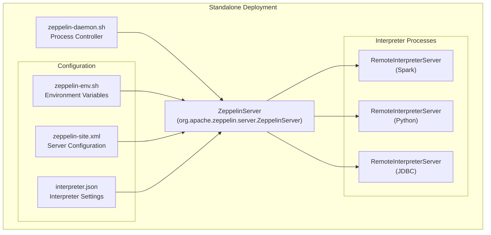
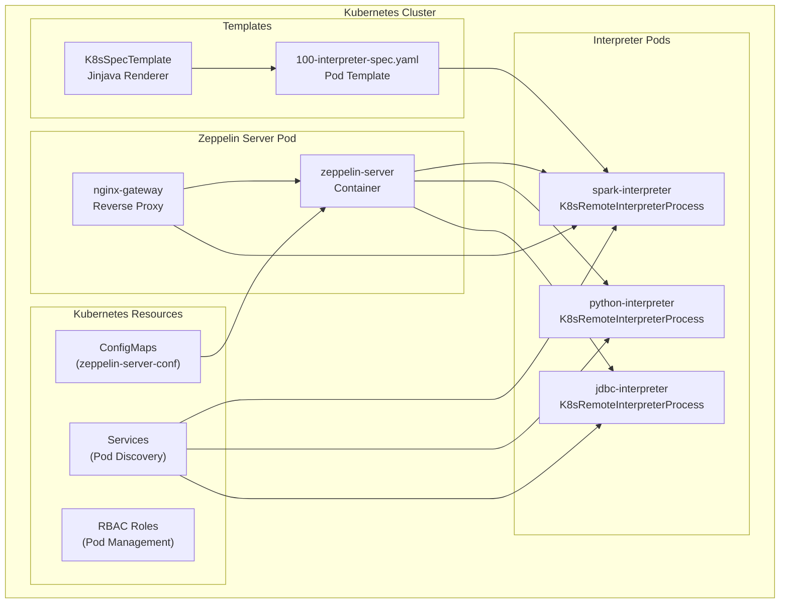
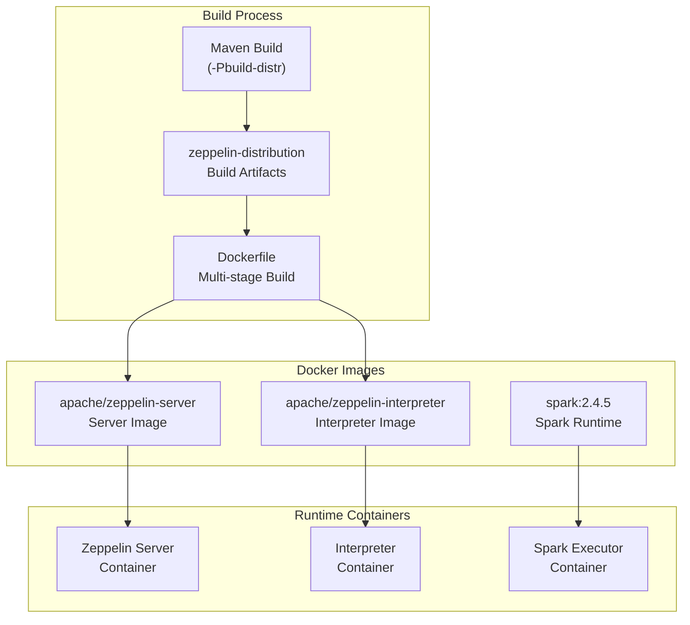
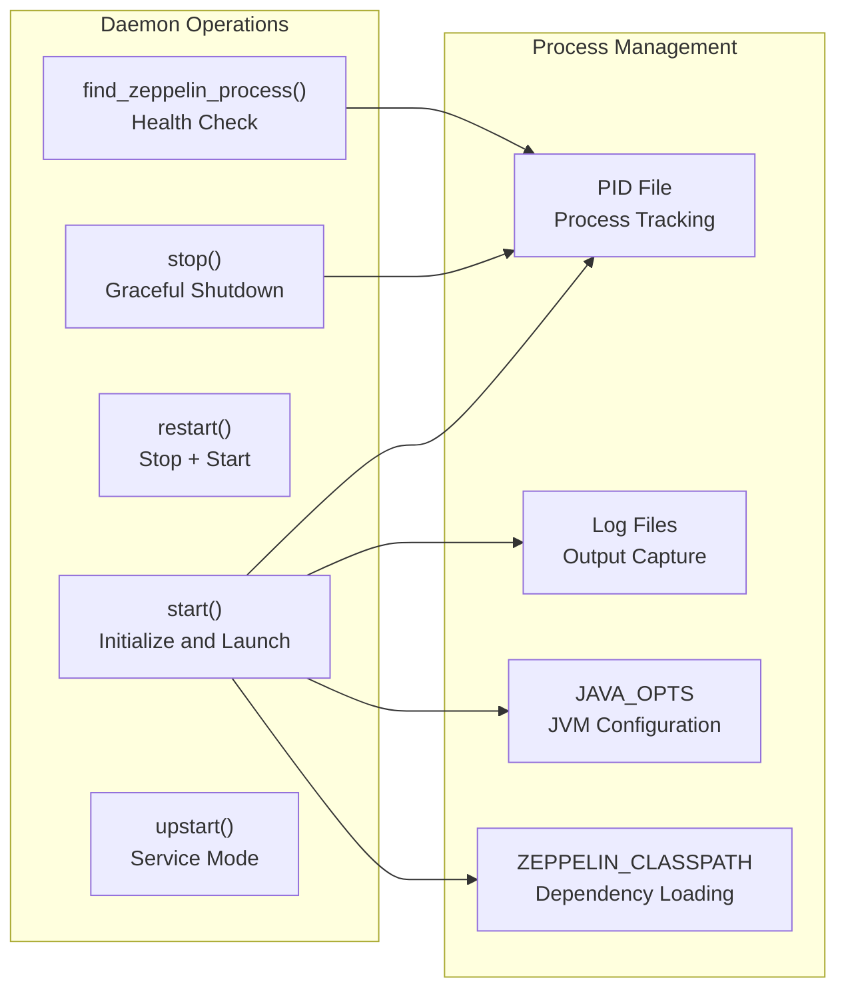
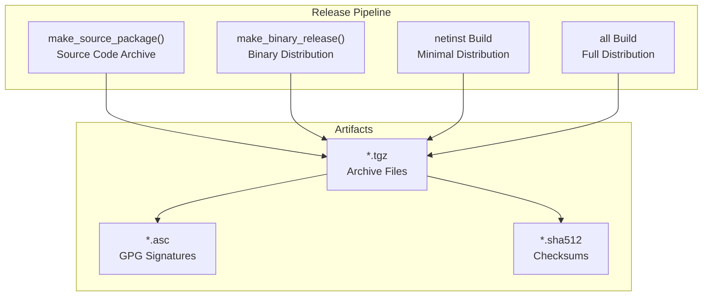

# Deployment and Operations

<details>
<summary>Relevant source files</summary>

The following files were used as context for generating this wiki page:

- [.github/workflows/core.yml](.github/workflows/core.yml)
- [.github/workflows/frontend.yml](.github/workflows/frontend.yml)
- [.github/workflows/quick.yml](.github/workflows/quick.yml)
- [.mvn/wrapper/MavenWrapperDownloader.java](.mvn/wrapper/MavenWrapperDownloader.java)
- [.mvn/wrapper/maven-wrapper.jar](.mvn/wrapper/maven-wrapper.jar)
- [.mvn/wrapper/maven-wrapper.properties](.mvn/wrapper/maven-wrapper.properties)
- [Dockerfile](Dockerfile)
- [bin/common.cmd](bin/common.cmd)
- [bin/common.sh](bin/common.sh)
- [bin/functions.sh](bin/functions.sh)
- [bin/interpreter.sh](bin/interpreter.sh)
- [bin/zeppelin-daemon.sh](bin/zeppelin-daemon.sh)
- [bin/zeppelin.sh](bin/zeppelin.sh)
- [conf/interpreter-list](conf/interpreter-list)
- [conf/zeppelin-env.cmd.template](conf/zeppelin-env.cmd.template)
- [conf/zeppelin-env.sh.template](conf/zeppelin-env.sh.template)
- [dev/common_release.sh](dev/common_release.sh)
- [dev/create_release.sh](dev/create_release.sh)
- [dev/publish_release.sh](dev/publish_release.sh)
- [docs/_includes/themes/zeppelin/_navigation.html](docs/_includes/themes/zeppelin/_navigation.html)
- [docs/index.md](docs/index.md)
- [docs/quickstart/kubernetes.md](docs/quickstart/kubernetes.md)
- [docs/setup/basics/how_to_build.md](docs/setup/basics/how_to_build.md)
- [docs/usage/interpreter/installation.md](docs/usage/interpreter/installation.md)
- [k8s/interpreter/100-interpreter-spec.yaml](k8s/interpreter/100-interpreter-spec.yaml)
- [k8s/zeppelin-server.yaml](k8s/zeppelin-server.yaml)
- [livy/README.md](livy/README.md)
- [scripts/docker/zeppelin-interpreter/Dockerfile](scripts/docker/zeppelin-interpreter/Dockerfile)
- [scripts/docker/zeppelin-server/Dockerfile](scripts/docker/zeppelin-server/Dockerfile)
- [zeppelin-interpreter/src/main/java/org/apache/zeppelin/interpreter/InterpreterNotFoundException.java](zeppelin-interpreter/src/main/java/org/apache/zeppelin/interpreter/InterpreterNotFoundException.java)
- [zeppelin-interpreter/src/main/java/org/apache/zeppelin/interpreter/InterpreterRunner.java](zeppelin-interpreter/src/main/java/org/apache/zeppelin/interpreter/InterpreterRunner.java)
- [zeppelin-interpreter/src/test/java/org/apache/zeppelin/interpreter/util/ByteBufferUtilTest.java](zeppelin-interpreter/src/test/java/org/apache/zeppelin/interpreter/util/ByteBufferUtilTest.java)
- [zeppelin-plugins/launcher/k8s-standard/src/main/java/org/apache/zeppelin/interpreter/launcher/K8sRemoteInterpreterProcess.java](zeppelin-plugins/launcher/k8s-standard/src/main/java/org/apache/zeppelin/interpreter/launcher/K8sRemoteInterpreterProcess.java)
- [zeppelin-plugins/launcher/k8s-standard/src/main/java/org/apache/zeppelin/interpreter/launcher/K8sSpecTemplate.java](zeppelin-plugins/launcher/k8s-standard/src/main/java/org/apache/zeppelin/interpreter/launcher/K8sSpecTemplate.java)
- [zeppelin-plugins/launcher/k8s-standard/src/main/java/org/apache/zeppelin/interpreter/launcher/K8sStandardInterpreterLauncher.java](zeppelin-plugins/launcher/k8s-standard/src/main/java/org/apache/zeppelin/interpreter/launcher/K8sStandardInterpreterLauncher.java)
- [zeppelin-plugins/launcher/k8s-standard/src/main/java/org/apache/zeppelin/interpreter/launcher/K8sUtils.java](zeppelin-plugins/launcher/k8s-standard/src/main/java/org/apache/zeppelin/interpreter/launcher/K8sUtils.java)
- [zeppelin-plugins/launcher/k8s-standard/src/main/java/org/apache/zeppelin/interpreter/launcher/PodPhaseWatcher.java](zeppelin-plugins/launcher/k8s-standard/src/main/java/org/apache/zeppelin/interpreter/launcher/PodPhaseWatcher.java)
- [zeppelin-plugins/launcher/k8s-standard/src/test/java/org/apache/zeppelin/interpreter/launcher/K8sRemoteInterpreterProcessTest.java](zeppelin-plugins/launcher/k8s-standard/src/test/java/org/apache/zeppelin/interpreter/launcher/K8sRemoteInterpreterProcessTest.java)
- [zeppelin-plugins/launcher/k8s-standard/src/test/java/org/apache/zeppelin/interpreter/launcher/K8sSpecTemplateTest.java](zeppelin-plugins/launcher/k8s-standard/src/test/java/org/apache/zeppelin/interpreter/launcher/K8sSpecTemplateTest.java)
- [zeppelin-plugins/launcher/k8s-standard/src/test/java/org/apache/zeppelin/interpreter/launcher/K8sStandardInterpreterLauncherTest.java](zeppelin-plugins/launcher/k8s-standard/src/test/java/org/apache/zeppelin/interpreter/launcher/K8sStandardInterpreterLauncherTest.java)
- [zeppelin-plugins/launcher/k8s-standard/src/test/java/org/apache/zeppelin/interpreter/launcher/K8sUtilsTest.java](zeppelin-plugins/launcher/k8s-standard/src/test/java/org/apache/zeppelin/interpreter/launcher/K8sUtilsTest.java)
- [zeppelin-plugins/launcher/k8s-standard/src/test/java/org/apache/zeppelin/interpreter/launcher/PodPhaseWatcherTest.java](zeppelin-plugins/launcher/k8s-standard/src/test/java/org/apache/zeppelin/interpreter/launcher/PodPhaseWatcherTest.java)
- [zeppelin-plugins/launcher/k8s-standard/src/test/resources/k8s-specs/interpreter-spec.yaml](zeppelin-plugins/launcher/k8s-standard/src/test/resources/k8s-specs/interpreter-spec.yaml)
- [zeppelin-plugins/launcher/k8s-standard/src/test/resources/log4j.properties](zeppelin-plugins/launcher/k8s-standard/src/test/resources/log4j.properties)
- [zeppelin-server/src/main/java/org/apache/zeppelin/server/ImmediateErrorHandlerImpl.java](zeppelin-server/src/main/java/org/apache/zeppelin/server/ImmediateErrorHandlerImpl.java)
- [zeppelin-server/src/main/java/org/apache/zeppelin/socket/SessionConfigurator.java](zeppelin-server/src/main/java/org/apache/zeppelin/socket/SessionConfigurator.java)
- [zeppelin-server/src/main/java/org/apache/zeppelin/utils/TestUtils.java](zeppelin-server/src/main/java/org/apache/zeppelin/utils/TestUtils.java)
- [zeppelin-server/src/test/java/org/apache/zeppelin/recovery/RecoveryTest.java](zeppelin-server/src/test/java/org/apache/zeppelin/recovery/RecoveryTest.java)
- [zeppelin-zengine/src/main/java/org/apache/zeppelin/interpreter/recovery/StopInterpreter.java](zeppelin-zengine/src/main/java/org/apache/zeppelin/interpreter/recovery/StopInterpreter.java)
- [zeppelin-zengine/src/test/java/org/apache/zeppelin/interpreter/SleepInterpreter.java](zeppelin-zengine/src/test/java/org/apache/zeppelin/interpreter/SleepInterpreter.java)

</details>


This document covers the deployment, configuration, and operational aspects of Apache Zeppelin. It describes how to deploy Zeppelin in various environments, manage its lifecycle, configure runtime settings, and handle operational concerns like monitoring and recovery.

For information about the core server architecture and interpreter framework, see [Server Components](#4) and [Interpreter Framework](#2.3). For details about specific interpreter implementations, see [Interpreters](#5).

## Deployment Environments

Apache Zeppelin supports multiple deployment modes, each with specific operational characteristics and management approaches.

### Standalone Deployment

Standalone deployment runs Zeppelin as a local process with interpreters launched as separate processes on the same machine or remote hosts.



The `zeppelin-daemon.sh` script provides standard daemon operations including start, stop, restart, and status checking. It uses the `ZeppelinServer` class as the main entry point and manages process lifecycle through PID files.

**Sources:** [bin/zeppelin-daemon.sh:1-281](), [bin/zeppelin.sh:1-143](), [bin/common.sh:1-177]()

### Kubernetes Deployment

Kubernetes deployment enables cloud-native operation with automatic scaling, resource management, and fault tolerance. The `K8sStandardInterpreterLauncher` creates interpreter pods dynamically using YAML templates.



The `K8sStandardInterpreterLauncher` uses the Fabric8 Kubernetes client to create pods based on templates in the `k8s/interpreter/` directory. Templates are processed using the Jinjava templating engine with interpreter properties and environment variables.

**Sources:** [zeppelin-plugins/launcher/k8s-standard/src/main/java/org/apache/zeppelin/interpreter/launcher/K8sStandardInterpreterLauncher.java:1-147](), [k8s/zeppelin-server.yaml:1-217](), [k8s/interpreter/100-interpreter-spec.yaml:1-217]()

### Docker Deployment

Docker deployment packages Zeppelin and its dependencies into container images for consistent deployment across environments.



The build process uses a multi-stage Dockerfile that compiles Zeppelin from source and creates optimized runtime images. The `zeppelin-distribution` build target creates the deployable artifacts.

**Sources:** [Dockerfile:1-34](), [scripts/docker/zeppelin-server/Dockerfile:1-71](), [scripts/docker/zeppelin-interpreter/Dockerfile:1-89]()

## Configuration Management

Zeppelin configuration is managed through multiple layers of configuration files and environment variables that control server behavior, interpreter settings, and runtime environment.

### Environment Configuration

The `zeppelin-env.sh` template defines environment variables for JVM settings, cluster integration, and interpreter configuration:

| Variable | Purpose | Default |
|----------|---------|---------|
| `ZEPPELIN_MEM` | Server JVM memory | `-Xms1024m -Xmx1024m` |
| `ZEPPELIN_INTP_MEM` | Interpreter JVM memory | `-Xms1024m -Xmx1024m` |
| `SPARK_HOME` | Spark installation path | None |
| `HADOOP_CONF_DIR` | Hadoop configuration | None |
| `ZEPPELIN_INTERPRETER_LAUNCHER` | Launcher type | `StandardInterpreterLauncher` |

The `common.sh` script provides utility functions for classpath construction, Java version checking, and environment setup used by both server and interpreter processes.

**Sources:** [conf/zeppelin-env.sh.template:1-113](), [bin/common.sh:68-83](), [bin/common.sh:140-172]()

### Interpreter Installation and Management

The interpreter installation system allows dynamic installation of community-managed and third-party interpreters:

```bash
# Install all community interpreters
./bin/install-interpreter.sh --all

# Install specific interpreters
./bin/install-interpreter.sh --name md,shell,jdbc,python

# List available interpreters
./bin/install-interpreter.sh --list
```

Available interpreters are defined in `conf/interpreter-list` with Maven coordinates and descriptions. The installation process downloads and extracts interpreter JARs to the appropriate directories.

**Sources:** [conf/interpreter-list:1-46](), [docs/usage/interpreter/installation.md:32-48]()

## Process Lifecycle Management

### Daemon Control

The `zeppelin-daemon.sh` script provides comprehensive process lifecycle management with functions for starting, stopping, and monitoring Zeppelin server:



The daemon script handles process initialization, environment setup, classpath construction, and graceful shutdown with configurable timeouts.

**Sources:** [bin/zeppelin-daemon.sh:188-216](), [bin/zeppelin-daemon.sh:218-234](), [bin/zeppelin-daemon.sh:236-251]()

### Interpreter Process Management

The `interpreter.sh` script launches remote interpreter processes with environment-specific configuration for different interpreter types (Spark, Flink, HBase, etc.):

The script performs several key functions:
- Downloads interpreter dependencies via `RemoteInterpreterDownloader`
- Configures interpreter-specific classpaths and environment variables
- Sets up user impersonation for security
- Launches interpreters using `spark-submit` for Spark or direct Java execution for others

**Sources:** [bin/interpreter.sh:27-34](), [bin/interpreter.sh:104-185](), [bin/interpreter.sh:278-299]()

## Build and Release Management

### Build System

Zeppelin uses a Maven-based build system with multiple profiles for different deployment scenarios:

| Profile | Purpose |
|---------|---------|
| `-Pbuild-distr` | Creates distribution package |
| `-Pspark-3.2` | Spark 3.2 compatibility |
| `-Phadoop3` | Hadoop 3.x integration |
| `-Pweb-angular` | Angular frontend build |
| `-Pk8s` | Kubernetes support |

The build process compiles all modules, runs tests, and packages distributable artifacts including Docker images.

**Sources:** [docs/setup/basics/how_to_build.md:62-67](), [Dockerfile:24-30]()

### Release Process

The release creation process is automated through `create_release.sh` which:
1. Creates source packages with GPG signatures
2. Builds binary distributions for different configurations
3. Generates checksums and digital signatures
4. Packages everything for distribution



**Sources:** [dev/create_release.sh:47-96](), [dev/publish_release.sh:105-174]()

## Continuous Integration and Testing

### CI/CD Pipeline

GitHub Actions workflows provide comprehensive testing across multiple environments and configurations:

- **Core Tests**: Tests core modules (interpreter, zengine, server) with different Hadoop versions
- **Interpreter Tests**: Tests individual interpreter implementations 
- **Integration Tests**: End-to-end testing with real cluster environments
- **Frontend Tests**: UI and Angular application testing

The CI system uses conditional matrix builds to test different combinations of Spark versions, Scala versions, and Python versions.

**Sources:** [.github/workflows/core.yml:28-80](), [.github/workflows/frontend.yml:25-55]()

### Build Environment

The CI environment is configured with:
- Java 8 (Temurin distribution)
- Maven with specific memory settings (`MAVEN_OPTS`)
- Conda environments for Python/R testing
- Docker for containerized testing
- Kubernetes (minikube) for K8s integration tests

**Sources:** [.github/workflows/core.yml:10-22](), [.github/workflows/core.yml:62-78]()

## Recovery and State Management

### Recovery Storage

Zeppelin provides pluggable recovery storage for interpreter state persistence. The `FileSystemRecoveryStorage` implementation stores interpreter metadata and state information to enable recovery after failures.

The recovery system tracks:
- Interpreter process information
- Session state and variables
- Notebook execution context
- Interpreter group configurations

Recovery storage is configured via `ZEPPELIN_RECOVERY_STORAGE_CLASS` and `ZEPPELIN_RECOVERY_DIR` environment variables.

**Sources:** [zeppelin-server/src/test/java/org/apache/zeppelin/recovery/RecoveryTest.java:63-67](), [zeppelin-server/src/test/java/org/apache/zeppelin/recovery/RecoveryTest.java:76-78]()

### Operational Monitoring

The daemon script includes health checking functionality through `find_zeppelin_process()` which verifies process status and provides operational feedback. For CI environments, additional monitoring includes log capture and automated health verification.

**Sources:** [bin/zeppelin-daemon.sh:166-174](), [bin/zeppelin-daemon.sh:144-158]()
