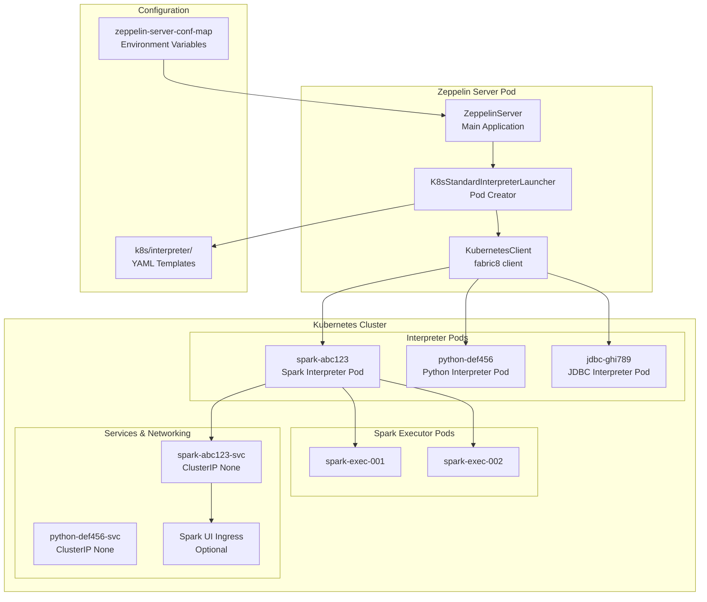
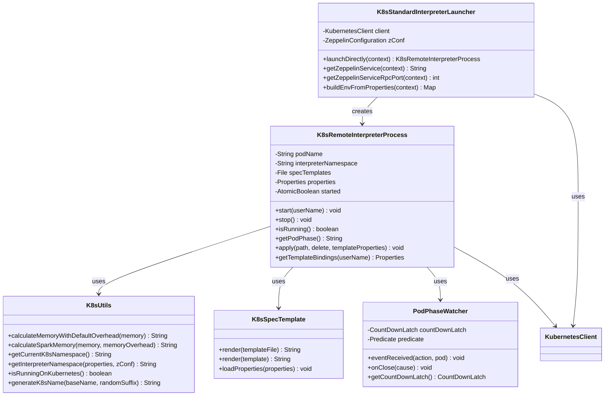
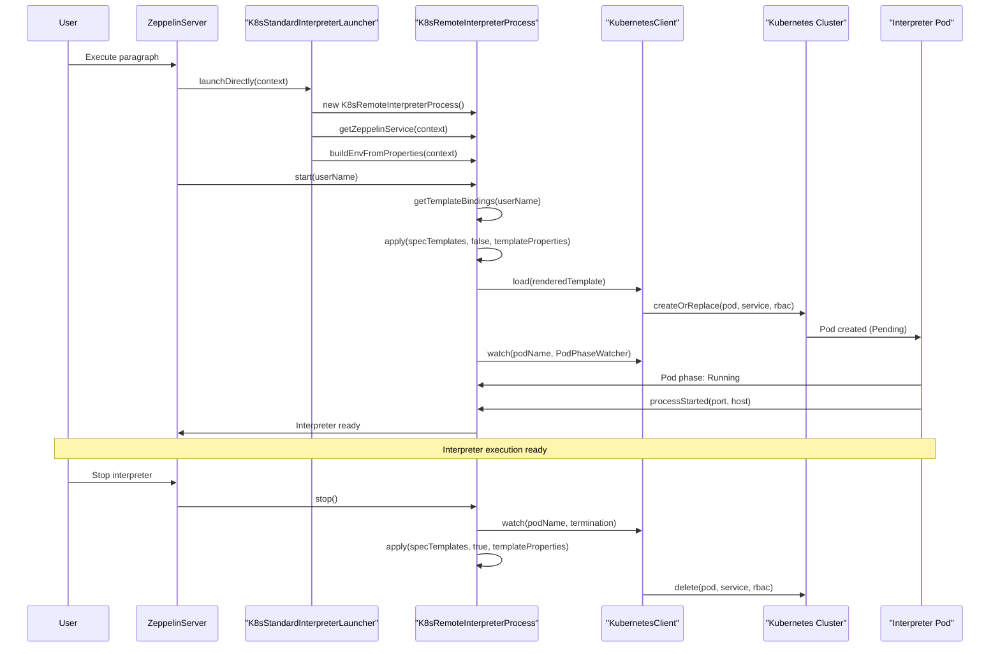

# Kubernetes Support

<details>
<summary>Relevant source files</summary>

The following files were used as context for generating this wiki page:

- [docs/quickstart/kubernetes.md](docs/quickstart/kubernetes.md)
- [k8s/interpreter/100-interpreter-spec.yaml](k8s/interpreter/100-interpreter-spec.yaml)
- [k8s/zeppelin-server.yaml](k8s/zeppelin-server.yaml)
- [scripts/docker/zeppelin-interpreter/Dockerfile](scripts/docker/zeppelin-interpreter/Dockerfile)
- [scripts/docker/zeppelin-server/Dockerfile](scripts/docker/zeppelin-server/Dockerfile)
- [zeppelin-interpreter/src/main/java/org/apache/zeppelin/interpreter/InterpreterNotFoundException.java](zeppelin-interpreter/src/main/java/org/apache/zeppelin/interpreter/InterpreterNotFoundException.java)
- [zeppelin-interpreter/src/main/java/org/apache/zeppelin/interpreter/InterpreterRunner.java](zeppelin-interpreter/src/main/java/org/apache/zeppelin/interpreter/InterpreterRunner.java)
- [zeppelin-interpreter/src/test/java/org/apache/zeppelin/interpreter/util/ByteBufferUtilTest.java](zeppelin-interpreter/src/test/java/org/apache/zeppelin/interpreter/util/ByteBufferUtilTest.java)
- [zeppelin-plugins/launcher/k8s-standard/src/main/java/org/apache/zeppelin/interpreter/launcher/K8sRemoteInterpreterProcess.java](zeppelin-plugins/launcher/k8s-standard/src/main/java/org/apache/zeppelin/interpreter/launcher/K8sRemoteInterpreterProcess.java)
- [zeppelin-plugins/launcher/k8s-standard/src/main/java/org/apache/zeppelin/interpreter/launcher/K8sSpecTemplate.java](zeppelin-plugins/launcher/k8s-standard/src/main/java/org/apache/zeppelin/interpreter/launcher/K8sSpecTemplate.java)
- [zeppelin-plugins/launcher/k8s-standard/src/main/java/org/apache/zeppelin/interpreter/launcher/K8sStandardInterpreterLauncher.java](zeppelin-plugins/launcher/k8s-standard/src/main/java/org/apache/zeppelin/interpreter/launcher/K8sStandardInterpreterLauncher.java)
- [zeppelin-plugins/launcher/k8s-standard/src/main/java/org/apache/zeppelin/interpreter/launcher/K8sUtils.java](zeppelin-plugins/launcher/k8s-standard/src/main/java/org/apache/zeppelin/interpreter/launcher/K8sUtils.java)
- [zeppelin-plugins/launcher/k8s-standard/src/main/java/org/apache/zeppelin/interpreter/launcher/PodPhaseWatcher.java](zeppelin-plugins/launcher/k8s-standard/src/main/java/org/apache/zeppelin/interpreter/launcher/PodPhaseWatcher.java)
- [zeppelin-plugins/launcher/k8s-standard/src/test/java/org/apache/zeppelin/interpreter/launcher/K8sRemoteInterpreterProcessTest.java](zeppelin-plugins/launcher/k8s-standard/src/test/java/org/apache/zeppelin/interpreter/launcher/K8sRemoteInterpreterProcessTest.java)
- [zeppelin-plugins/launcher/k8s-standard/src/test/java/org/apache/zeppelin/interpreter/launcher/K8sSpecTemplateTest.java](zeppelin-plugins/launcher/k8s-standard/src/test/java/org/apache/zeppelin/interpreter/launcher/K8sSpecTemplateTest.java)
- [zeppelin-plugins/launcher/k8s-standard/src/test/java/org/apache/zeppelin/interpreter/launcher/K8sStandardInterpreterLauncherTest.java](zeppelin-plugins/launcher/k8s-standard/src/test/java/org/apache/zeppelin/interpreter/launcher/K8sStandardInterpreterLauncherTest.java)
- [zeppelin-plugins/launcher/k8s-standard/src/test/java/org/apache/zeppelin/interpreter/launcher/K8sUtilsTest.java](zeppelin-plugins/launcher/k8s-standard/src/test/java/org/apache/zeppelin/interpreter/launcher/K8sUtilsTest.java)
- [zeppelin-plugins/launcher/k8s-standard/src/test/java/org/apache/zeppelin/interpreter/launcher/PodPhaseWatcherTest.java](zeppelin-plugins/launcher/k8s-standard/src/test/java/org/apache/zeppelin/interpreter/launcher/PodPhaseWatcherTest.java)
- [zeppelin-plugins/launcher/k8s-standard/src/test/resources/k8s-specs/interpreter-spec.yaml](zeppelin-plugins/launcher/k8s-standard/src/test/resources/k8s-specs/interpreter-spec.yaml)
- [zeppelin-plugins/launcher/k8s-standard/src/test/resources/log4j.properties](zeppelin-plugins/launcher/k8s-standard/src/test/resources/log4j.properties)
- [zeppelin-zengine/src/main/java/org/apache/zeppelin/interpreter/recovery/StopInterpreter.java](zeppelin-zengine/src/main/java/org/apache/zeppelin/interpreter/recovery/StopInterpreter.java)
- [zeppelin-zengine/src/test/java/org/apache/zeppelin/interpreter/SleepInterpreter.java](zeppelin-zengine/src/test/java/org/apache/zeppelin/interpreter/SleepInterpreter.java)

</details>


## Purpose and Scope

Zeppelin's Kubernetes support enables cloud-native deployment where the Zeppelin server runs in a Kubernetes cluster and launches interpreters as separate pods. This provides automatic scaling, resource isolation, and leverages Kubernetes' orchestration capabilities for interpreter lifecycle management.

This document covers the Kubernetes-specific interpreter launcher implementation and deployment configurations. For general interpreter architecture concepts, see [Interpreter Framework](#2.3). For Spark-specific configuration when running on Kubernetes, see [Spark Interpreters](#5.2).

## Architecture Overview

The Kubernetes support is implemented through a specialized launcher that replaces local process execution with pod-based interpreter deployment:



**Key Design Principles:**
- Each interpreter group runs in its own pod for isolation
- Templates in `k8s/interpreter/` define pod specifications
- Fabric8 Kubernetes client handles cluster communication
- Automatic resource cleanup via owner references

Sources: [zeppelin-plugins/launcher/k8s-standard/src/main/java/org/apache/zeppelin/interpreter/launcher/K8sStandardInterpreterLauncher.java:1-147](), [k8s/interpreter/100-interpreter-spec.yaml:1-217](), [k8s/zeppelin-server.yaml:1-228]()

## Core Components

The Kubernetes launcher implementation consists of several key classes that handle different aspects of pod management:



### Component Responsibilities

| Component | Primary Responsibility | Key Methods |
|-----------|----------------------|-------------|
| `K8sStandardInterpreterLauncher` | Entry point for creating interpreter pods | `launchDirectly()`, `buildEnvFromProperties()` |
| `K8sRemoteInterpreterProcess` | Manages individual interpreter pod lifecycle | `start()`, `stop()`, `apply()`, `getTemplateBindings()` |
| `K8sUtils` | Kubernetes utility functions and namespace resolution | `calculateMemoryWithDefaultOverhead()`, `isRunningOnKubernetes()` |
| `K8sSpecTemplate` | YAML template rendering using Jinjava | `render()`, `loadProperties()` |
| `PodPhaseWatcher` | Monitors pod state transitions | `eventReceived()`, `onClose()` |

Sources: [zeppelin-plugins/launcher/k8s-standard/src/main/java/org/apache/zeppelin/interpreter/launcher/K8sStandardInterpreterLauncher.java:39-147](), [zeppelin-plugins/launcher/k8s-standard/src/main/java/org/apache/zeppelin/interpreter/launcher/K8sRemoteInterpreterProcess.java:54-493](), [zeppelin-plugins/launcher/k8s-standard/src/main/java/org/apache/zeppelin/interpreter/launcher/K8sUtils.java:36-177]()

## Interpreter Pod Deployment Process

The deployment of interpreter pods follows a structured sequence involving template rendering, pod creation, and state monitoring:



### Template Processing Pipeline

The pod specification is generated through a multi-step template processing pipeline:

1. **Template Loading**: YAML files from `k8s/interpreter/` directory are loaded
2. **Property Binding**: Interpreter properties are converted to template variables via `getTemplateBindings()`
3. **Jinjava Rendering**: Templates are rendered with dynamic values using `K8sSpecTemplate.render()`
4. **Resource Creation**: Rendered YAML is applied to cluster via Fabric8 client

Sources: [zeppelin-plugins/launcher/k8s-standard/src/main/java/org/apache/zeppelin/interpreter/launcher/K8sRemoteInterpreterProcess.java:152-195](), [zeppelin-plugins/launcher/k8s-standard/src/main/java/org/apache/zeppelin/interpreter/launcher/K8sRemoteInterpreterProcess.java:254-285](), [zeppelin-plugins/launcher/k8s-standard/src/main/java/org/apache/zeppelin/interpreter/launcher/K8sSpecTemplate.java:32-81]()

## Configuration and Customization

### Server-Level Configuration

The Zeppelin server requires specific environment variables and configurations to enable Kubernetes mode:

| Environment Variable | Purpose | Default Value |
|---------------------|---------|---------------|
| `ZEPPELIN_RUN_MODE` | Activates Kubernetes launcher | `k8s` |
| `ZEPPELIN_K8S_CONTAINER_IMAGE` | Interpreter container image | `apache/zeppelin-interpreter:0.10.0` |
| `ZEPPELIN_K8S_SPARK_CONTAINER_IMAGE` | Spark container image | `spark:2.4.5` |
| `ZEPPELIN_K8S_NAMESPACE` | Default interpreter namespace | Current pod namespace |
| `ZEPPELIN_K8S_PORTFORWARD` | Enable port forwarding for development | `false` |

### Interpreter-Level Properties

Individual interpreters can be customized through properties in their settings:

| Property | Description | Example Value |
|----------|-------------|---------------|
| `zeppelin.k8s.interpreter.namespace` | Interpreter pod namespace | `zeppelin-interpreters` |
| `zeppelin.k8s.interpreter.serviceAccount` | Service account for pod | `zeppelin-interpreter` |
| `zeppelin.k8s.interpreter.container.image` | Custom interpreter image | `my-registry/zeppelin:latest` |
| `zeppelin.k8s.interpreter.cores` | CPU request/limit | `2` |
| `zeppelin.k8s.interpreter.memory` | Memory request | `4Gi` |
| `zeppelin.k8s.interpreter.gpu.type` | GPU resource type | `nvidia.com/gpu` |
| `zeppelin.k8s.interpreter.gpu.nums` | Number of GPUs | `1` |

### Template Customization

The pod specifications are defined in YAML templates under `k8s/interpreter/`. The main template structure includes:

- **Pod Specification**: Container image, resources, environment variables
- **Service Definition**: Headless service for pod discovery  
- **RBAC Resources**: Role and RoleBinding for Spark interpreters
- **Ingress Resources**: Optional Spark UI access (when `zeppelin.k8s.spark.useIngress=true`)

Key template variables populated by `getTemplateBindings()`:

```yaml
metadata:
  namespace: {{zeppelin.k8s.interpreter.namespace}}
  name: {{zeppelin.k8s.interpreter.pod.name}}
spec:
  serviceAccountName: {{zeppelin.k8s.interpreter.serviceAccount}}
  containers:
  - name: {{zeppelin.k8s.interpreter.container.name}}
    image: {{zeppelin.k8s.interpreter.container.image}}
    resources:
      requests:
        memory: "{{zeppelin.k8s.interpreter.memory}}"
        cpu: "{{zeppelin.k8s.interpreter.cores}}"
```

Sources: [k8s/interpreter/100-interpreter-spec.yaml:17-217](), [zeppelin-plugins/launcher/k8s-standard/src/main/java/org/apache/zeppelin/interpreter/launcher/K8sRemoteInterpreterProcess.java:288-375](), [k8s/zeppelin-server.yaml:17-39]()

## Spark on Kubernetes Integration

When the interpreter group is `spark`, additional Kubernetes-specific configurations are automatically applied:

### Automatic Spark Configuration

The `K8sRemoteInterpreterProcess.buildSparkSubmitOptions()` method generates Spark submit options for Kubernetes execution:

```bash
--master k8s://https://kubernetes.default.svc
--deploy-mode client
--conf spark.kubernetes.namespace=default
--conf spark.executor.instances=1
--conf spark.kubernetes.driver.pod.name=spark-abc123
--conf spark.kubernetes.container.image=spark:2.4.5
--conf spark.driver.bindAddress=0.0.0.0
--conf spark.driver.host=spark-abc123.default.svc
--conf spark.driver.port=22321
--conf spark.blockManager.port=22322
```

### Resource Calculation

Spark driver resources are automatically calculated from interpreter properties:

- **Memory**: Combines `spark.driver.memory` + `spark.driver.memoryOverhead` using `K8sUtils.calculateSparkMemory()`
- **CPU**: Maps `spark.driver.cores` to Kubernetes CPU requests/limits
- **Network**: Predefined ports for driver (22321) and block manager (22322)

### Spark UI Access

The Spark UI is accessible through multiple mechanisms:

1. **Reverse Proxy**: Via nginx sidecar using pattern `4040-{podName}.{serviceDomain}`
2. **Ingress**: When `zeppelin.k8s.spark.useIngress=true`, creates Kubernetes Ingress resource
3. **Port Forward**: For development with `ZEPPELIN_K8S_PORTFORWARD=true`

The UI URL template is configurable via `zeppelin.spark.uiWebUrl` property and rendered using `sparkUiWebUrlFromTemplate()`.

### RBAC Permissions

Spark interpreters require additional RBAC permissions to create executor pods:

```yaml
rules:
- apiGroups: [""]
  resources: ["pods", "services", "configmaps"]
  verbs: ["create", "get", "update", "list", "delete", "watch"]
```

Sources: [zeppelin-plugins/launcher/k8s-standard/src/main/java/org/apache/zeppelin/interpreter/launcher/K8sRemoteInterpreterProcess.java:406-428](), [zeppelin-plugins/launcher/k8s-standard/src/main/java/org/apache/zeppelin/interpreter/launcher/K8sRemoteInterpreterProcess.java:354-367](), [k8s/interpreter/100-interpreter-spec.yaml:146-185]()

## Development and Troubleshooting

### Development Mode

For development, Zeppelin server can run locally while launching interpreters in Kubernetes:

| Environment Variable | Value | Purpose |
|---------------------|-------|---------|
| `ZEPPELIN_RUN_MODE` | `k8s` | Force Kubernetes mode |
| `ZEPPELIN_K8S_PORTFORWARD` | `true` | Enable local port forwarding |
| `KUBERNETES_AUTH_TOKEN` | `<token>` | Cluster authentication |

This configuration uses `LocalPortForward` to tunnel interpreter connections through `kubectl port-forward`.

### Pod Lifecycle Monitoring

The `PodPhaseWatcher` class monitors pod state transitions:

- **Pending → Running**: Normal startup sequence
- **Failed**: Triggers cleanup and error reporting  
- **Succeeded**: Natural termination

Timeout behavior is controlled by `zeppelin.k8s.interpreter.timeout.during.pending` property.

### Common Issues and Diagnostics

| Issue | Diagnostic Method | Solution |
|-------|------------------|----------|
| Pod startup timeout | Check `getPodPhase()` and pod events | Increase timeout or check resource availability |
| Image pull failures | Verify `imagePullSecrets` configuration | Configure registry credentials |
| RBAC errors | Check service account permissions | Update ClusterRole/RoleBinding |
| Network connectivity | Test port forwarding with `processStarted()` | Verify service discovery and DNS |

### Resource Cleanup

Automatic cleanup is handled through Kubernetes owner references when server and interpreter pods are in the same namespace. The `ownerUID()` and `ownerName()` methods link interpreter pods to the Zeppelin server pod for garbage collection.

Sources: [docs/quickstart/kubernetes.md:274-287](), [zeppelin-plugins/launcher/k8s-standard/src/main/java/org/apache/zeppelin/interpreter/launcher/PodPhaseWatcher.java:32-70](), [zeppelin-plugins/launcher/k8s-standard/src/main/java/org/apache/zeppelin/interpreter/launcher/K8sRemoteInterpreterProcess.java:459-465]()
