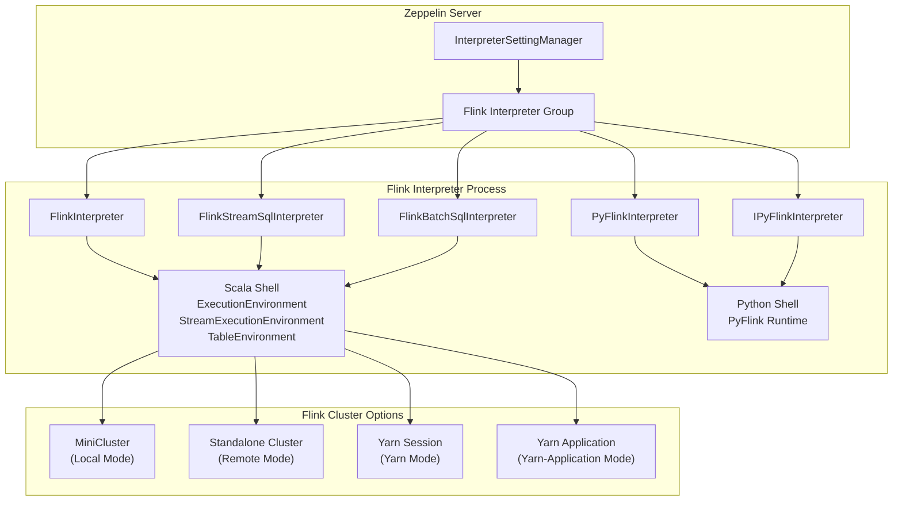
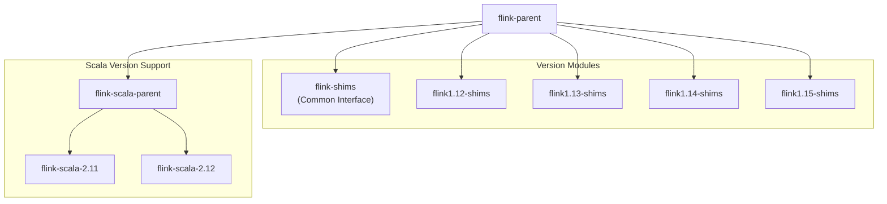
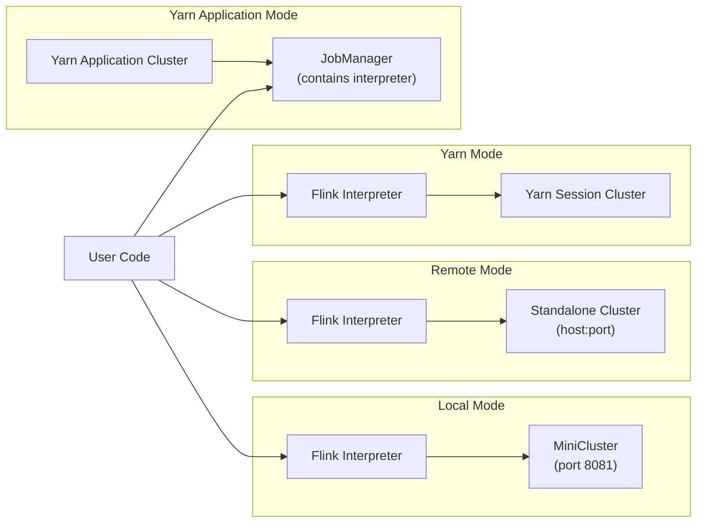
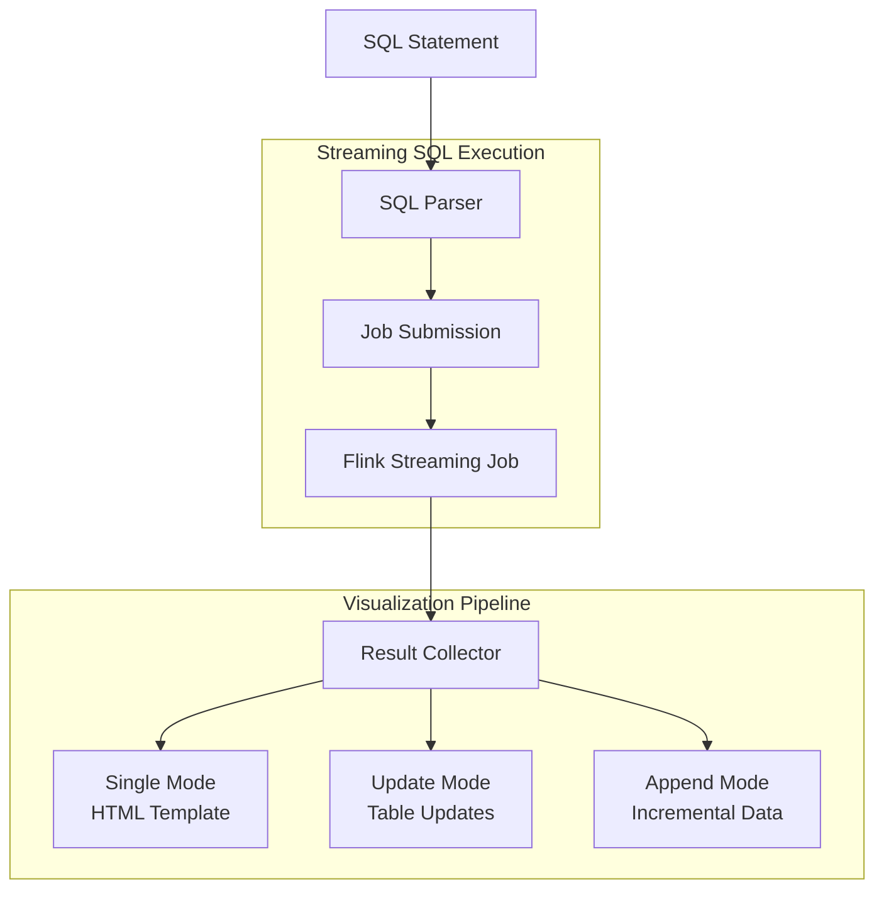
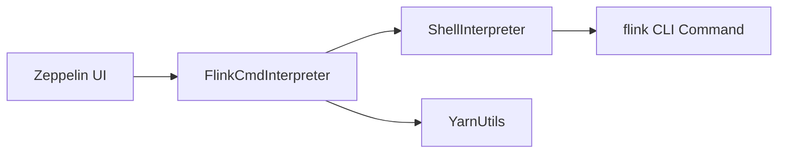

# Flink Interpreter

Relevant source files

The following files were used as context for generating this wiki page:

- [conf/log4j2.properties](conf/log4j2.properties)
- [docs/interpreter/flink.md](docs/interpreter/flink.md)
- [flink-cmd/src/main/java/org/apache/zeppelin/flink/cmd/FlinkCmdInterpreter.java](flink-cmd/src/main/java/org/apache/zeppelin/flink/cmd/FlinkCmdInterpreter.java)
- [flink-cmd/src/main/java/org/apache/zeppelin/flink/cmd/YarnUtils.java](flink-cmd/src/main/java/org/apache/zeppelin/flink/cmd/YarnUtils.java)
- [flink-cmd/src/main/resources/interpreter-setting.json](flink-cmd/src/main/resources/interpreter-setting.json)
- [flink-cmd/src/test/java/org/apache/zeppelin/flink/cmd/FlinkCmdInterpreterTest.java](flink-cmd/src/test/java/org/apache/zeppelin/flink/cmd/FlinkCmdInterpreterTest.java)
- [flink/pom.xml](flink/pom.xml)

This document covers Apache Zeppelin's Flink interpreter system, which provides integration with Apache Flink for stream and batch data processing. The Flink interpreter enables users to execute Scala, Python, and SQL code against Flink clusters in various deployment modes.

For general interpreter framework concepts, see [Interpreter Framework](#2.3). For information about other streaming interpreters, see [Remote Interpreter Infrastructure](#5.1).

## Overview and Architecture

The Flink interpreter system consists of multiple specialized interpreters that work together to provide comprehensive Flink support. The system acts as a Flink client responsible for compiling, submitting, and managing Flink job lifecycles.

Sources: [docs/interpreter/flink.md:155-169]()

## Interpreter Components

The Flink interpreter group provides five distinct interpreters, each serving specific use cases:

| Interpreter | Class | Description |
|-------------|-------|-------------|
| `%flink` | `FlinkInterpreter` | Scala environment with Flink execution contexts |
| `%flink.pyflink` | `PyFlinkInterpreter` | Python environment for PyFlink |
| `%flink.ipyflink` | `IPyFlinkInterpreter` | Enhanced IPython environment for PyFlink |
| `%flink.ssql` | `FlinkStreamSqlInterpreter` | Streaming SQL execution |
| `%flink.bsql` | `FlinkBatchSqlInterpreter` | Batch SQL execution |

### Built-in Variables

The Scala shell creates several built-in variables that are shared across interpreters:

- `senv` - `StreamExecutionEnvironment` for streaming jobs
- `benv` - `ExecutionEnvironment` for batch jobs  
- `stenv` - `StreamTableEnvironment` for streaming SQL
- `btenv` - `BatchTableEnvironment` for batch SQL
- `z` - `ZeppelinContext` for display and visualization

Sources: [docs/interpreter/flink.md:33-64](), [docs/interpreter/flink.md:386-398]()

## Multi-Version Support

The Flink interpreter supports multiple Flink and Scala versions through a modular architecture:

The system uses Maven profiles to build specific version combinations:
- `flink-112` (default): Flink 1.12 with Scala 2.11/2.12
- `flink-113`: Flink 1.13 with Scala 2.11/2.12  
- `flink-114`: Flink 1.14 with Scala 2.11/2.12
- `flink-115`: Flink 1.15 with Scala 2.12 only

Sources: [flink/pom.xml:36-90]()

## Execution Modes

The Flink interpreter supports four execution modes configured via `flink.execution.mode`:

### Local Mode
Creates a `MiniCluster` within the interpreter JVM. Default configuration uses port 8081 with 4 TaskManagers and 1 slot each.

### Remote Mode  
Connects to an existing Flink cluster. Requires `flink.execution.remote.host` and `flink.execution.remote.port` configuration.

### Yarn Mode
Launches a dedicated Flink session cluster on YARN. Requires `HADOOP_CONF_DIR` and `hadoop` command availability.

### Yarn Application Mode
Runs the Flink interpreter within the JobManager on YARN (Flink 1.11+). Recommended for production to reduce resource usage on Zeppelin server.

Sources: [docs/interpreter/flink.md:344-384]()

## Configuration System

The Flink interpreter provides extensive configuration options covering execution, resources, and integration settings:

### Core Configuration

| Property | Default | Description |
|----------|---------|-------------|
| `FLINK_HOME` | - | **Required** - Flink installation location |
| `flink.execution.mode` | `local` | Execution mode: local, remote, yarn, yarn-application |
| `jobmanager.memory.process.size` | `1024m` | JobManager total memory |
| `taskmanager.memory.process.size` | `1024m` | TaskManager total memory |
| `taskmanager.numberOfTaskSlots` | `1` | Slots per TaskManager |

### Dependencies and UDFs

The system supports multiple approaches for adding dependencies:

- `flink.execution.packages` - Maven-style dependencies (recommended)
- `flink.execution.jars` - Direct JAR file paths
- `flink.udf.jars` - Auto-registered UDF JARs with class scanning

### SQL-Specific Configuration

- `zeppelin.flink.concurrentBatchSql.max` - Max concurrent batch SQL (default: 10)
- `zeppelin.flink.concurrentStreamSql.max` - Max concurrent stream SQL (default: 10)  
- `zeppelin.flink.maxResult` - Max rows returned by SQL (default: 1000)

Sources: [docs/interpreter/flink.md:170-335]()

## SQL Interpreters and Visualization

The Flink SQL interpreters provide enhanced capabilities beyond standard Flink SQL Client:

### Stream SQL Visualization Modes

The `%flink.ssql` interpreter supports three visualization modes for streaming results:

1. **Single Mode** - Single row results with HTML template support
2. **Update Mode** - Multi-row results with continuous updates  
3. **Append Mode** - Append-only results for windowed aggregations

### Paragraph Properties

SQL execution behavior is controlled via paragraph-local properties:

- `type` - Visualization mode (single/update/append)
- `parallelism` - Job parallelism override
- `jobName` - Custom job name for insert statements
- `runAsOne` - Execute multiple inserts in single job
- `template` - HTML template for single mode visualization

Sources: [docs/interpreter/flink.md:442-528](), [docs/interpreter/flink.md:731-792]()

## Python Integration

The Flink interpreter provides comprehensive Python support through PyFlink:

### Python Interpreter Variants

- `%flink.pyflink` - Basic Python environment
- `%flink.ipyflink` - Enhanced IPython environment with Jupyter-like features

### Python Environment Variables

- `s_env` - `StreamExecutionEnvironment`
- `b_env` - `ExecutionEnvironment`  
- `st_env` - `StreamTableEnvironment`
- `bt_env` - `BatchTableEnvironment`

The Python shell shares the same underlying Flink context with the Scala shell, enabling cross-language UDF usage.

Sources: [docs/interpreter/flink.md:529-583]()

## Command-Line Integration

A separate `flink-cmd` module provides direct Flink CLI integration:

The `FlinkCmdInterpreter` extends `ShellInterpreter` to:
- Execute Flink CLI commands directly
- Extract YARN application URLs for job monitoring
- Provide timeout-free execution for long-running jobs

Sources: [flink-cmd/src/main/java/org/apache/zeppelin/flink/cmd/FlinkCmdInterpreter.java:32-52](), [flink-cmd/src/main/java/org/apache/zeppelin/flink/cmd/YarnUtils.java:34-58]()
