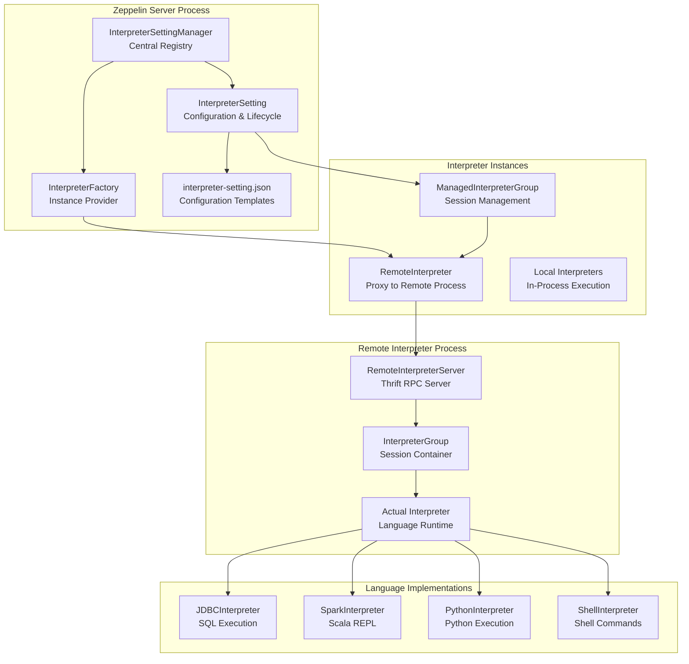
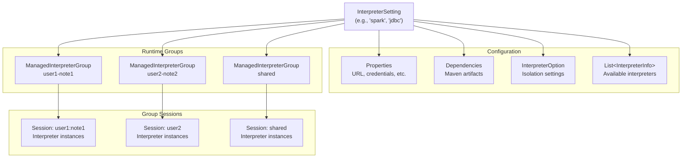
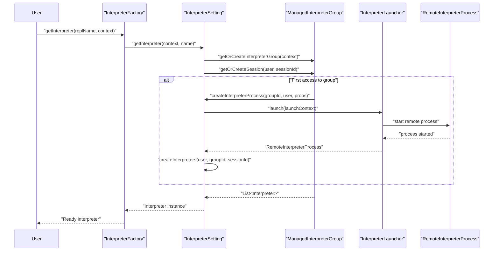
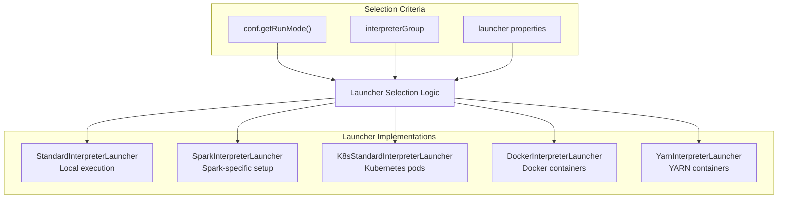
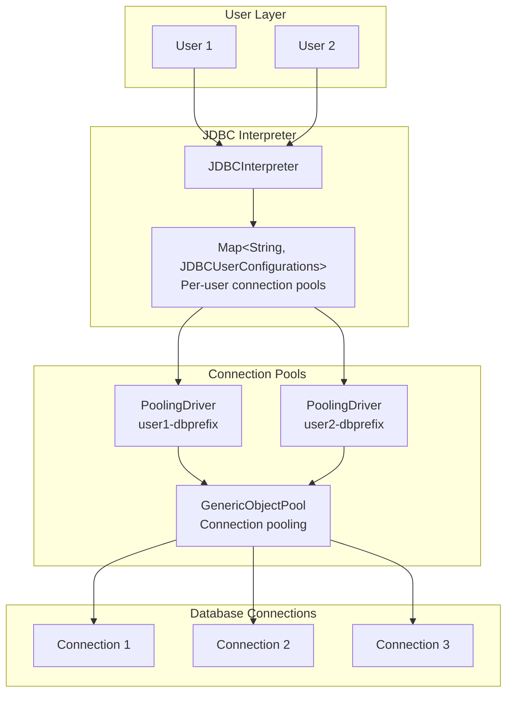
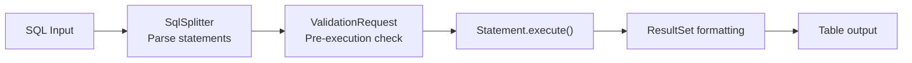
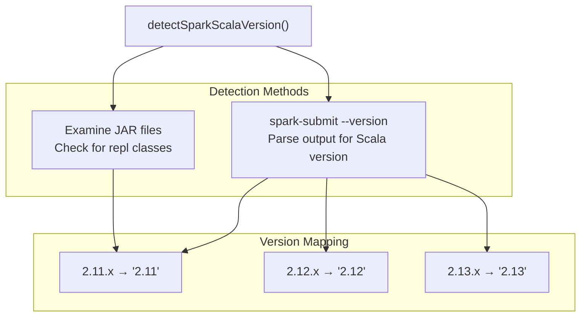

# Interpreters

<details>
<summary>Relevant source files</summary>

The following files were used as context for generating this wiki page:

- [docs/assets/themes/zeppelin/img/docs-img/jdbc_refresh.gif](docs/assets/themes/zeppelin/img/docs-img/jdbc_refresh.gif)
- [docs/assets/themes/zeppelin/img/screenshots/interpreter_setting_with_context_parameters.png](docs/assets/themes/zeppelin/img/screenshots/interpreter_setting_with_context_parameters.png)
- [docs/interpreter/jdbc.md](docs/interpreter/jdbc.md)
- [docs/interpreter/spark.md](docs/interpreter/spark.md)
- [docs/quickstart/sql_with_zeppelin.md](docs/quickstart/sql_with_zeppelin.md)
- [jdbc/pom.xml](jdbc/pom.xml)
- [jdbc/src/main/java/org/apache/zeppelin/jdbc/JDBCInterpreter.java](jdbc/src/main/java/org/apache/zeppelin/jdbc/JDBCInterpreter.java)
- [jdbc/src/main/java/org/apache/zeppelin/jdbc/JDBCUserConfigurations.java](jdbc/src/main/java/org/apache/zeppelin/jdbc/JDBCUserConfigurations.java)
- [jdbc/src/main/java/org/apache/zeppelin/jdbc/SqlCompleter.java](jdbc/src/main/java/org/apache/zeppelin/jdbc/SqlCompleter.java)
- [jdbc/src/main/java/org/apache/zeppelin/jdbc/ValidationRequest.java](jdbc/src/main/java/org/apache/zeppelin/jdbc/ValidationRequest.java)
- [jdbc/src/main/java/org/apache/zeppelin/jdbc/ValidationResponse.java](jdbc/src/main/java/org/apache/zeppelin/jdbc/ValidationResponse.java)
- [jdbc/src/main/java/org/apache/zeppelin/jdbc/hive/BeelineInPlaceUpdateStream.java](jdbc/src/main/java/org/apache/zeppelin/jdbc/hive/BeelineInPlaceUpdateStream.java)
- [jdbc/src/main/java/org/apache/zeppelin/jdbc/hive/HiveUtils.java](jdbc/src/main/java/org/apache/zeppelin/jdbc/hive/HiveUtils.java)
- [jdbc/src/main/java/org/apache/zeppelin/jdbc/hive/ProgressBar.java](jdbc/src/main/java/org/apache/zeppelin/jdbc/hive/ProgressBar.java)
- [jdbc/src/main/java/org/apache/zeppelin/jdbc/hive/YarnUtil.java](jdbc/src/main/java/org/apache/zeppelin/jdbc/hive/YarnUtil.java)
- [jdbc/src/main/java/org/apache/zeppelin/jdbc/security/JDBCSecurityImpl.java](jdbc/src/main/java/org/apache/zeppelin/jdbc/security/JDBCSecurityImpl.java)
- [jdbc/src/main/resources/interpreter-setting.json](jdbc/src/main/resources/interpreter-setting.json)
- [jdbc/src/test/java/org/apache/zeppelin/jdbc/JDBCInterpreterInterpolationTest.java](jdbc/src/test/java/org/apache/zeppelin/jdbc/JDBCInterpreterInterpolationTest.java)
- [jdbc/src/test/java/org/apache/zeppelin/jdbc/JDBCInterpreterTest.java](jdbc/src/test/java/org/apache/zeppelin/jdbc/JDBCInterpreterTest.java)
- [jdbc/src/test/java/org/apache/zeppelin/jdbc/SqlCompleterTest.java](jdbc/src/test/java/org/apache/zeppelin/jdbc/SqlCompleterTest.java)
- [jdbc/src/test/java/org/apache/zeppelin/jdbc/hive/HiveUtilsTest.java](jdbc/src/test/java/org/apache/zeppelin/jdbc/hive/HiveUtilsTest.java)
- [jdbc/src/test/resources/log4j.properties](jdbc/src/test/resources/log4j.properties)
- [kotlin/src/test/java/org/apache/zeppelin/kotlin/KotlinInterpreterTest.java](kotlin/src/test/java/org/apache/zeppelin/kotlin/KotlinInterpreterTest.java)
- [livy/src/main/java/org/apache/zeppelin/livy/SessionDeadException.java](livy/src/main/java/org/apache/zeppelin/livy/SessionDeadException.java)
- [spark-submit/src/main/java/org/apache/zeppelin/spark/submit/SparkSubmitInterpreter.java](spark-submit/src/main/java/org/apache/zeppelin/spark/submit/SparkSubmitInterpreter.java)
- [spark-submit/src/main/resources/interpreter-setting.json](spark-submit/src/main/resources/interpreter-setting.json)
- [spark/interpreter/src/main/resources/interpreter-setting.json](spark/interpreter/src/main/resources/interpreter-setting.json)
- [spark/interpreter/src/test/java/org/apache/zeppelin/spark/KotlinSparkInterpreterTest.java](spark/interpreter/src/test/java/org/apache/zeppelin/spark/KotlinSparkInterpreterTest.java)
- [zeppelin-interpreter-integration/README.md](zeppelin-interpreter-integration/README.md)
- [zeppelin-interpreter-integration/src/test/java/org/apache/zeppelin/integration/SparkIntegrationTest.java](zeppelin-interpreter-integration/src/test/java/org/apache/zeppelin/integration/SparkIntegrationTest.java)
- [zeppelin-interpreter-integration/src/test/java/org/apache/zeppelin/integration/SparkSubmitIntegrationTest.java](zeppelin-interpreter-integration/src/test/java/org/apache/zeppelin/integration/SparkSubmitIntegrationTest.java)
- [zeppelin-interpreter/src/main/java/org/apache/zeppelin/completer/CachedCompleter.java](zeppelin-interpreter/src/main/java/org/apache/zeppelin/completer/CachedCompleter.java)
- [zeppelin-interpreter/src/main/java/org/apache/zeppelin/completer/StringsCompleter.java](zeppelin-interpreter/src/main/java/org/apache/zeppelin/completer/StringsCompleter.java)
- [zeppelin-interpreter/src/main/java/org/apache/zeppelin/interpreter/AbstractInterpreter.java](zeppelin-interpreter/src/main/java/org/apache/zeppelin/interpreter/AbstractInterpreter.java)
- [zeppelin-interpreter/src/main/java/org/apache/zeppelin/interpreter/Interpreter.java](zeppelin-interpreter/src/main/java/org/apache/zeppelin/interpreter/Interpreter.java)
- [zeppelin-interpreter/src/main/java/org/apache/zeppelin/interpreter/InterpreterException.java](zeppelin-interpreter/src/main/java/org/apache/zeppelin/interpreter/InterpreterException.java)
- [zeppelin-interpreter/src/main/java/org/apache/zeppelin/interpreter/InterpreterOption.java](zeppelin-interpreter/src/main/java/org/apache/zeppelin/interpreter/InterpreterOption.java)
- [zeppelin-interpreter/src/main/java/org/apache/zeppelin/interpreter/launcher/InterpreterClient.java](zeppelin-interpreter/src/main/java/org/apache/zeppelin/interpreter/launcher/InterpreterClient.java)
- [zeppelin-interpreter/src/main/java/org/apache/zeppelin/interpreter/launcher/InterpreterLaunchContext.java](zeppelin-interpreter/src/main/java/org/apache/zeppelin/interpreter/launcher/InterpreterLaunchContext.java)
- [zeppelin-interpreter/src/main/java/org/apache/zeppelin/interpreter/util/SqlSplitter.java](zeppelin-interpreter/src/main/java/org/apache/zeppelin/interpreter/util/SqlSplitter.java)
- [zeppelin-interpreter/src/test/java/org/apache/zeppelin/interpreter/InterpreterTest.java](zeppelin-interpreter/src/test/java/org/apache/zeppelin/interpreter/InterpreterTest.java)
- [zeppelin-interpreter/src/test/java/org/apache/zeppelin/interpreter/ZeppCtxtVariableTest.java](zeppelin-interpreter/src/test/java/org/apache/zeppelin/interpreter/ZeppCtxtVariableTest.java)
- [zeppelin-interpreter/src/test/java/org/apache/zeppelin/interpreter/util/SqlSplitterTest.java](zeppelin-interpreter/src/test/java/org/apache/zeppelin/interpreter/util/SqlSplitterTest.java)
- [zeppelin-server/src/main/java/org/apache/zeppelin/rest/InterpreterRestApi.java](zeppelin-server/src/main/java/org/apache/zeppelin/rest/InterpreterRestApi.java)
- [zeppelin-server/src/test/java/org/apache/zeppelin/rest/InterpreterRestApiTest.java](zeppelin-server/src/test/java/org/apache/zeppelin/rest/InterpreterRestApiTest.java)
- [zeppelin-web/e2e/collaborativeMode.spec.js](zeppelin-web/e2e/collaborativeMode.spec.js)
- [zeppelin-zengine/src/main/java/org/apache/zeppelin/interpreter/InterpreterFactory.java](zeppelin-zengine/src/main/java/org/apache/zeppelin/interpreter/InterpreterFactory.java)
- [zeppelin-zengine/src/main/java/org/apache/zeppelin/interpreter/InterpreterSetting.java](zeppelin-zengine/src/main/java/org/apache/zeppelin/interpreter/InterpreterSetting.java)
- [zeppelin-zengine/src/main/java/org/apache/zeppelin/interpreter/InterpreterSettingManager.java](zeppelin-zengine/src/main/java/org/apache/zeppelin/interpreter/InterpreterSettingManager.java)
- [zeppelin-zengine/src/main/java/org/apache/zeppelin/interpreter/ManagedInterpreterGroup.java](zeppelin-zengine/src/main/java/org/apache/zeppelin/interpreter/ManagedInterpreterGroup.java)
- [zeppelin-zengine/src/main/java/org/apache/zeppelin/interpreter/launcher/SparkInterpreterLauncher.java](zeppelin-zengine/src/main/java/org/apache/zeppelin/interpreter/launcher/SparkInterpreterLauncher.java)
- [zeppelin-zengine/src/test/java/org/apache/zeppelin/interpreter/InterpreterFactoryTest.java](zeppelin-zengine/src/test/java/org/apache/zeppelin/interpreter/InterpreterFactoryTest.java)
- [zeppelin-zengine/src/test/java/org/apache/zeppelin/interpreter/InterpreterSettingManagerTest.java](zeppelin-zengine/src/test/java/org/apache/zeppelin/interpreter/InterpreterSettingManagerTest.java)
- [zeppelin-zengine/src/test/java/org/apache/zeppelin/interpreter/InterpreterSettingTest.java](zeppelin-zengine/src/test/java/org/apache/zeppelin/interpreter/InterpreterSettingTest.java)
- [zeppelin-zengine/src/test/java/org/apache/zeppelin/interpreter/launcher/SparkInterpreterLauncherTest.java](zeppelin-zengine/src/test/java/org/apache/zeppelin/interpreter/launcher/SparkInterpreterLauncherTest.java)
- [zeppelin-zengine/src/test/java/org/apache/zeppelin/interpreter/mock/MockInterpreter1.java](zeppelin-zengine/src/test/java/org/apache/zeppelin/interpreter/mock/MockInterpreter1.java)
- [zeppelin-zengine/src/test/java/org/apache/zeppelin/interpreter/mock/MockInterpreter2.java](zeppelin-zengine/src/test/java/org/apache/zeppelin/interpreter/mock/MockInterpreter2.java)

</details>


This document provides a comprehensive guide to Zeppelin's interpreter system, which enables execution of code in multiple programming languages and data processing frameworks within notebook paragraphs. The interpreter system provides a pluggable architecture for language support, configuration management, process isolation, and distributed execution.

For information about specific interpreter implementations and deployment patterns, see [Remote Interpreter Infrastructure](#5.1), [Spark Interpreters](#5.2), [Python Interpreter](#5.3), [JDBC Interpreter](#5.4), [Flink Interpreter](#5.5), and [Livy Interpreter](#5.6).

## Architecture Overview

The interpreter system is built around a multi-layered architecture that separates configuration management, instance creation, and execution environments. The system supports both local and remote execution modes with comprehensive lifecycle management.



Sources: [zeppelin-zengine/src/main/java/org/apache/zeppelin/interpreter/InterpreterSettingManager.java:104-109](), [zeppelin-zengine/src/main/java/org/apache/zeppelin/interpreter/InterpreterFactory.java:29-36](), [zeppelin-zengine/src/main/java/org/apache/zeppelin/interpreter/InterpreterSetting.java:76-142]()

## Core Components

### InterpreterSettingManager

The `InterpreterSettingManager` serves as the central registry for all interpreter configurations and provides the primary interface for interpreter lifecycle management.

| Component | Responsibility | Key Methods |
|-----------|---------------|-------------|
| Template Management | Load interpreter definitions from `interpreter-setting.json` | `loadInterpreterSettingFromDefaultDir()` |
| Instance Registry | Maintain active interpreter settings | `interpreterSettings` Map |
| Configuration Persistence | Save/load interpreter configurations | `saveToFile()`, `loadFromFile()` |
| Factory Integration | Coordinate with InterpreterFactory | `getByName()`, `createNewSetting()` |

The manager maintains two key data structures:
- `interpreterSettingTemplates`: Default configurations loaded from interpreter directories
- `interpreterSettings`: Active interpreter instances with user customizations

Sources: [zeppelin-zengine/src/main/java/org/apache/zeppelin/interpreter/InterpreterSettingManager.java:121-134](), [zeppelin-zengine/src/main/java/org/apache/zeppelin/interpreter/InterpreterSettingManager.java:361-385]()

### InterpreterSetting

`InterpreterSetting` represents a configured interpreter group with its properties, dependencies, and runtime options. Each setting can spawn multiple interpreter groups based on isolation requirements.



The interpreter group ID generation follows specific patterns based on isolation settings:
- **Per-user isolation**: `{settingId}-{userId}`
- **Per-note isolation**: `{settingId}-{userId}-{noteId}`
- **Shared mode**: `{settingId}-shared_process`

Sources: [zeppelin-zengine/src/main/java/org/apache/zeppelin/interpreter/InterpreterSetting.java:400-426](), [zeppelin-zengine/src/main/java/org/apache/zeppelin/interpreter/InterpreterSetting.java:428-443]()

### InterpreterFactory

The `InterpreterFactory` provides the main entry point for obtaining interpreter instances, resolving interpreter names to actual implementations.

The resolution process follows this hierarchy:
1. **Fully qualified**: `{group}.{interpreter}` (e.g., `spark.sql`)
2. **Group only**: `{group}` resolves to default interpreter in group
3. **Interpreter only**: `{interpreter}` within default group

Sources: [zeppelin-zengine/src/main/java/org/apache/zeppelin/interpreter/InterpreterFactory.java:38-83]()

## Interpreter Configuration System

### Configuration Templates

Interpreter configuration is defined in `interpreter-setting.json` files located in each interpreter's directory. These templates define available interpreters, their properties, and default values.

```json
{
  "group": "jdbc",
  "name": "sql", 
  "className": "org.apache.zeppelin.jdbc.JDBCInterpreter",
  "properties": {
    "default.url": {
      "defaultValue": "jdbc:postgresql://localhost:5432/",
      "description": "The URL for JDBC",
      "type": "string"
    }
  }
}
```

### Property Types and Validation

The system supports various property types with built-in validation:

| Type | Description | Example |
|------|-------------|---------|
| `string` | Text values | Database URLs, usernames |
| `password` | Masked input | Database passwords |
| `number` | Numeric values | Connection limits, timeouts |
| `checkbox` | Boolean flags | Enable/disable features |
| `textarea` | Multi-line text | SQL precode, custom configurations |

Sources: [jdbc/src/main/resources/interpreter-setting.json:6-69](), [spark/interpreter/src/main/resources/interpreter-setting.json:7-164]()

### Runtime Property Resolution

Properties are resolved with the following precedence:
1. User-configured values in interpreter settings
2. Default values from templates  
3. Environment variables (for properties with `envName`)
4. System defaults

Sources: [zeppelin-zengine/src/main/java/org/apache/zeppelin/interpreter/InterpreterSetting.java:626-651]()

## Process Lifecycle Management

### Interpreter Creation and Initialization

The interpreter creation process involves multiple phases with clear separation of concerns:



### Process Isolation Strategies

The system supports multiple isolation levels configured via `InterpreterOption`:

| Mode | Scope | Process Sharing | Use Case |
|------|-------|-----------------|----------|
| `shared_process` | Global | All users, all notes | Development, testing |
| `scoped` per user | Per user | User's notes only | Multi-tenant deployment |
| `scoped` per note | Per note | Single note only | Production isolation |
| `isolated` | Per execution | No sharing | Maximum security |

Sources: [zeppelin-zengine/src/main/java/org/apache/zeppelin/interpreter/InterpreterSetting.java:410-422](), [zeppelin-interpreter/src/main/java/org/apache/zeppelin/interpreter/InterpreterOption.java:1-200]()

### Launcher System

Different launcher implementations handle various deployment scenarios:



The launcher selection logic in `InterpreterSetting.getLauncherPlugin()` determines the appropriate launcher based on deployment configuration and interpreter type.

Sources: [zeppelin-zengine/src/main/java/org/apache/zeppelin/interpreter/InterpreterSetting.java:763-791](), [zeppelin-zengine/src/main/java/org/apache/zeppelin/interpreter/launcher/SparkInterpreterLauncher.java:47-60]()

## JDBC Interpreter Deep Dive

The `JDBCInterpreter` demonstrates the interpreter pattern with sophisticated connection management, SQL execution, and database-specific optimizations.

### Connection Pool Architecture



### Multi-Database Configuration

The JDBC interpreter supports multiple database connections through property prefixing:

```properties
# Default database
default.driver=org.postgresql.Driver
default.url=jdbc:postgresql://localhost:5432/
default.user=postgres

# MySQL database  
mysql.driver=com.mysql.cj.jdbc.Driver
mysql.url=jdbc:mysql://localhost:3306/
mysql.user=mysql_user

# Oracle database
oracle.driver=oracle.jdbc.driver.OracleDriver
oracle.url=jdbc:oracle:thin:@localhost:1521:xe
oracle.user=oracle_user
```

Users can specify the database prefix in paragraph local properties:
- `%jdbc(db=mysql)` - Use MySQL connection
- `%jdbc(db=oracle)` - Use Oracle connection  
- `%jdbc` - Use default connection

Sources: [jdbc/src/main/java/org/apache/zeppelin/jdbc/JDBCInterpreter.java:219-234](), [jdbc/src/main/java/org/apache/zeppelin/jdbc/JDBCInterpreter.java:466-472]()

### SQL Processing Pipeline

The JDBC interpreter implements a sophisticated SQL processing pipeline:

1. **SQL Splitting**: Parse multiple statements separated by semicolons
2. **Validation**: Optional pre-execution validation via external service
3. **Execution**: Statement execution with timeout and monitoring
4. **Result Processing**: Format results for display with pagination



The validation system integrates with external services for query analysis and security checks, supporting fail-fast mechanisms for queries missing partition filters or accessing deprecated tables.

Sources: [jdbc/src/main/java/org/apache/zeppelin/jdbc/JDBCInterpreter.java:827-839](), [jdbc/src/main/java/org/apache/zeppelin/jdbc/JDBCInterpreter.java:872-924](), [zeppelin-interpreter/src/main/java/org/apache/zeppelin/interpreter/util/SqlSplitter.java:1-200]()

## Spark Interpreter Integration

The Spark interpreter showcases advanced launcher integration with environment detection and configuration management.

### Scala Version Detection

The `SparkInterpreterLauncher` automatically detects the Spark Scala version to ensure compatibility:



This version information drives JAR selection and classpath construction for proper Spark integration.

Sources: [zeppelin-zengine/src/main/java/org/apache/zeppelin/interpreter/launcher/SparkInterpreterLauncher.java:268-293](), [zeppelin-zengine/src/main/java/org/apache/zeppelin/interpreter/launcher/SparkInterpreterLauncher.java:295-328]()

### Environment Configuration

The Spark launcher builds comprehensive environment configurations:

| Environment Variable | Purpose | Configuration Source |
|---------------------|---------|---------------------|
| `SPARK_HOME` | Spark installation directory | Interpreter properties or `zeppelin-env.sh` |
| `SPARK_CONF_DIR` | Spark configuration directory | Derived from `SPARK_HOME` or explicit setting |
| `HADOOP_CONF_DIR` | Hadoop configuration | Required for YARN mode |
| `ZEPPELIN_SPARK_CONF` | Spark properties | Generated from interpreter properties |
| `HADOOP_USER_NAME` | User impersonation | Set when `zeppelin.spark.run.asLoginUser=true` |

Sources: [zeppelin-zengine/src/main/java/org/apache/zeppelin/interpreter/launcher/SparkInterpreterLauncher.java:215-264]()
