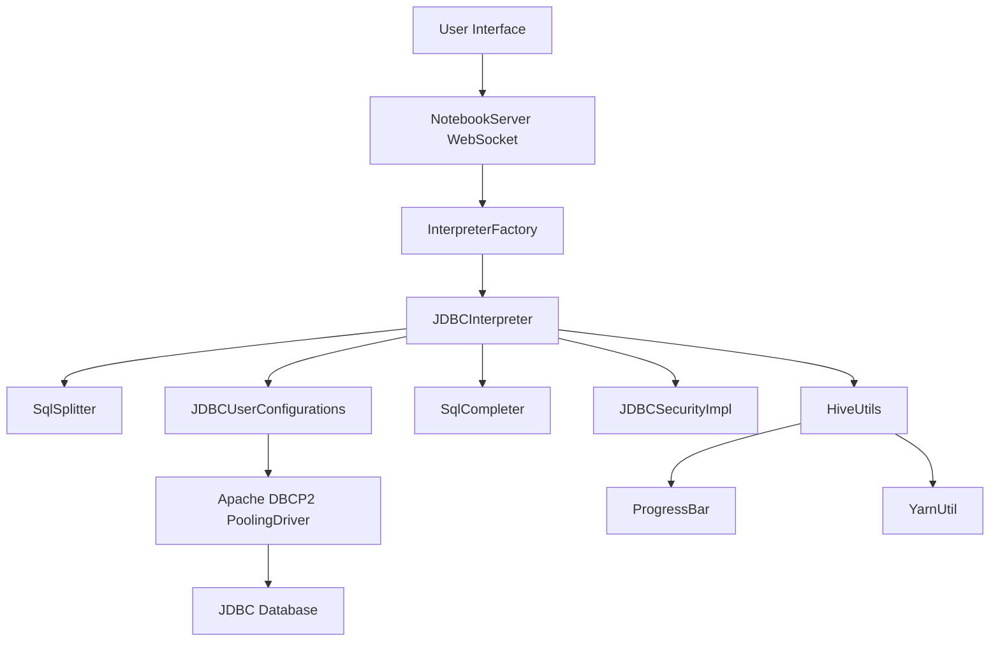
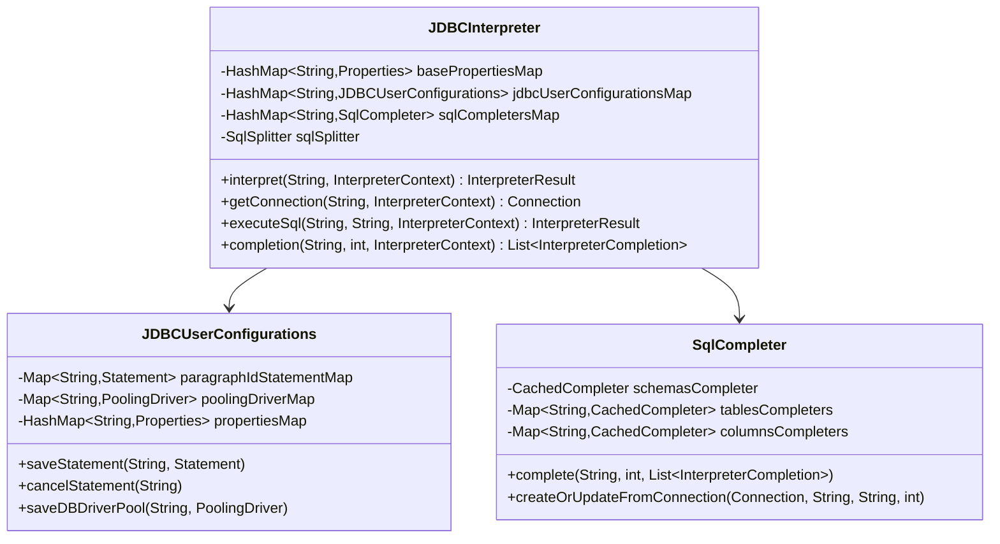
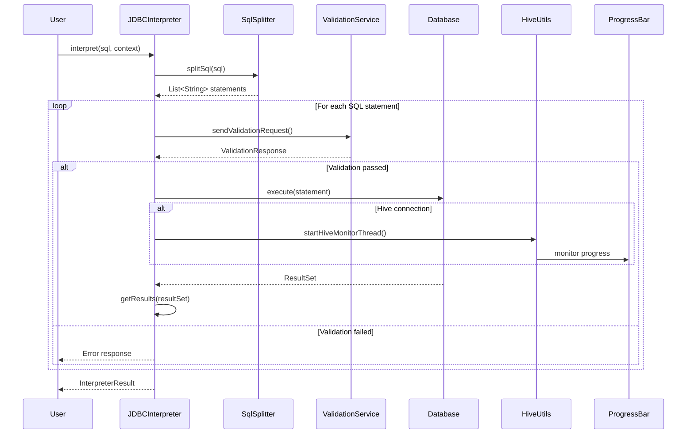
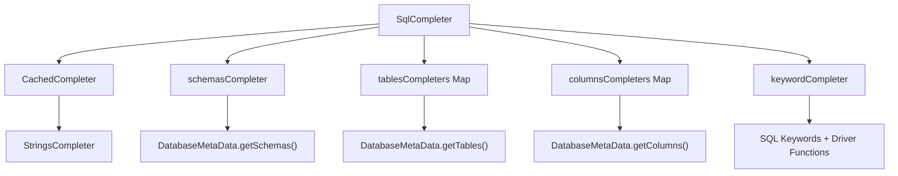
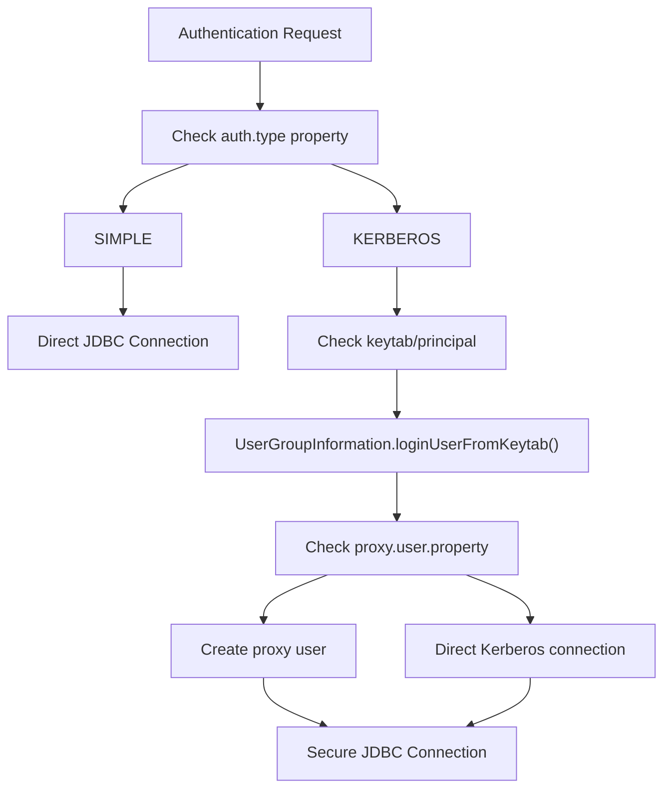
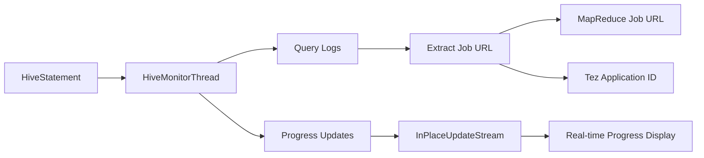
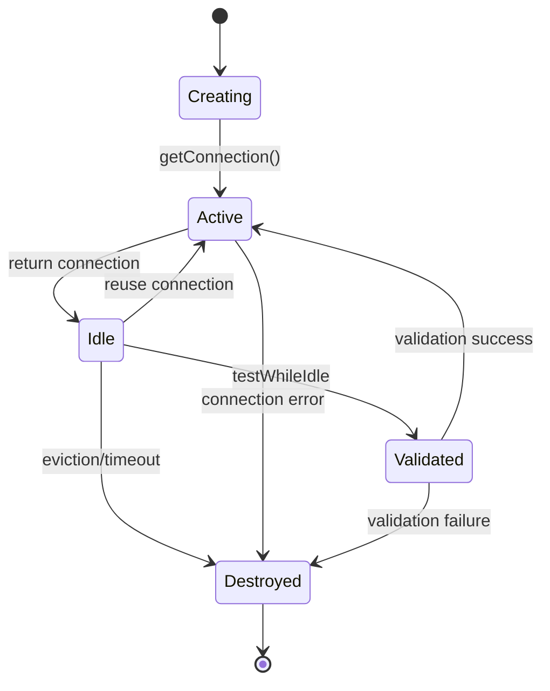

# JDBC Interpreter

<details>
<summary>Relevant source files</summary>

The following files were used as context for generating this wiki page:

- [docs/assets/themes/zeppelin/img/docs-img/jdbc_refresh.gif](docs/assets/themes/zeppelin/img/docs-img/jdbc_refresh.gif)
- [docs/interpreter/jdbc.md](docs/interpreter/jdbc.md)
- [docs/quickstart/sql_with_zeppelin.md](docs/quickstart/sql_with_zeppelin.md)
- [jdbc/pom.xml](jdbc/pom.xml)
- [jdbc/src/main/java/org/apache/zeppelin/jdbc/JDBCInterpreter.java](jdbc/src/main/java/org/apache/zeppelin/jdbc/JDBCInterpreter.java)
- [jdbc/src/main/java/org/apache/zeppelin/jdbc/JDBCUserConfigurations.java](jdbc/src/main/java/org/apache/zeppelin/jdbc/JDBCUserConfigurations.java)
- [jdbc/src/main/java/org/apache/zeppelin/jdbc/SqlCompleter.java](jdbc/src/main/java/org/apache/zeppelin/jdbc/SqlCompleter.java)
- [jdbc/src/main/java/org/apache/zeppelin/jdbc/ValidationRequest.java](jdbc/src/main/java/org/apache/zeppelin/jdbc/ValidationRequest.java)
- [jdbc/src/main/java/org/apache/zeppelin/jdbc/ValidationResponse.java](jdbc/src/main/java/org/apache/zeppelin/jdbc/ValidationResponse.java)
- [jdbc/src/main/java/org/apache/zeppelin/jdbc/hive/BeelineInPlaceUpdateStream.java](jdbc/src/main/java/org/apache/zeppelin/jdbc/hive/BeelineInPlaceUpdateStream.java)
- [jdbc/src/main/java/org/apache/zeppelin/jdbc/hive/HiveUtils.java](jdbc/src/main/java/org/apache/zeppelin/jdbc/hive/HiveUtils.java)
- [jdbc/src/main/java/org/apache/zeppelin/jdbc/hive/ProgressBar.java](jdbc/src/main/java/org/apache/zeppelin/jdbc/hive/ProgressBar.java)
- [jdbc/src/main/java/org/apache/zeppelin/jdbc/hive/YarnUtil.java](jdbc/src/main/java/org/apache/zeppelin/jdbc/hive/YarnUtil.java)
- [jdbc/src/main/java/org/apache/zeppelin/jdbc/security/JDBCSecurityImpl.java](jdbc/src/main/java/org/apache/zeppelin/jdbc/security/JDBCSecurityImpl.java)
- [jdbc/src/main/resources/interpreter-setting.json](jdbc/src/main/resources/interpreter-setting.json)
- [jdbc/src/test/java/org/apache/zeppelin/jdbc/JDBCInterpreterInterpolationTest.java](jdbc/src/test/java/org/apache/zeppelin/jdbc/JDBCInterpreterInterpolationTest.java)
- [jdbc/src/test/java/org/apache/zeppelin/jdbc/JDBCInterpreterTest.java](jdbc/src/test/java/org/apache/zeppelin/jdbc/JDBCInterpreterTest.java)
- [jdbc/src/test/java/org/apache/zeppelin/jdbc/SqlCompleterTest.java](jdbc/src/test/java/org/apache/zeppelin/jdbc/SqlCompleterTest.java)
- [jdbc/src/test/java/org/apache/zeppelin/jdbc/hive/HiveUtilsTest.java](jdbc/src/test/java/org/apache/zeppelin/jdbc/hive/HiveUtilsTest.java)
- [jdbc/src/test/resources/log4j.properties](jdbc/src/test/resources/log4j.properties)
- [kotlin/src/test/java/org/apache/zeppelin/kotlin/KotlinInterpreterTest.java](kotlin/src/test/java/org/apache/zeppelin/kotlin/KotlinInterpreterTest.java)
- [livy/src/main/java/org/apache/zeppelin/livy/SessionDeadException.java](livy/src/main/java/org/apache/zeppelin/livy/SessionDeadException.java)
- [spark/interpreter/src/test/java/org/apache/zeppelin/spark/KotlinSparkInterpreterTest.java](spark/interpreter/src/test/java/org/apache/zeppelin/spark/KotlinSparkInterpreterTest.java)
- [zeppelin-interpreter/src/main/java/org/apache/zeppelin/completer/CachedCompleter.java](zeppelin-interpreter/src/main/java/org/apache/zeppelin/completer/CachedCompleter.java)
- [zeppelin-interpreter/src/main/java/org/apache/zeppelin/completer/StringsCompleter.java](zeppelin-interpreter/src/main/java/org/apache/zeppelin/completer/StringsCompleter.java)
- [zeppelin-interpreter/src/main/java/org/apache/zeppelin/interpreter/InterpreterException.java](zeppelin-interpreter/src/main/java/org/apache/zeppelin/interpreter/InterpreterException.java)
- [zeppelin-interpreter/src/main/java/org/apache/zeppelin/interpreter/util/SqlSplitter.java](zeppelin-interpreter/src/main/java/org/apache/zeppelin/interpreter/util/SqlSplitter.java)
- [zeppelin-interpreter/src/test/java/org/apache/zeppelin/interpreter/util/SqlSplitterTest.java](zeppelin-interpreter/src/test/java/org/apache/zeppelin/interpreter/util/SqlSplitterTest.java)
- [zeppelin-zengine/src/test/java/org/apache/zeppelin/interpreter/mock/MockInterpreter1.java](zeppelin-zengine/src/test/java/org/apache/zeppelin/interpreter/mock/MockInterpreter1.java)
- [zeppelin-zengine/src/test/java/org/apache/zeppelin/interpreter/mock/MockInterpreter2.java](zeppelin-zengine/src/test/java/org/apache/zeppelin/interpreter/mock/MockInterpreter2.java)

</details>


The JDBC Interpreter provides database connectivity for Apache Zeppelin notebooks, enabling users to execute SQL queries against any JDBC-compatible database. This interpreter supports a wide range of databases including PostgreSQL, MySQL, Apache Hive, Presto/Trino, and many others through standard JDBC drivers.

For information about other SQL interpreters in Zeppelin, see [Spark Interpreters](#5.2) for SparkSQL support, [Flink Interpreter](#5.5) for Flink SQL, and [Python Interpreter](#5.3) for pandasSQL.

## Architecture Overview

The JDBC Interpreter follows Zeppelin's standard interpreter architecture with specialized components for database connectivity, user authentication, and SQL processing.



Sources: [jdbc/src/main/java/org/apache/zeppelin/jdbc/JDBCInterpreter.java:108](), [jdbc/src/main/java/org/apache/zeppelin/jdbc/JDBCUserConfigurations.java:30](), [jdbc/src/main/java/org/apache/zeppelin/jdbc/SqlCompleter.java:41]()

## Core Components

### JDBCInterpreter Class

The `JDBCInterpreter` class extends `KerberosInterpreter` and serves as the main entry point for SQL execution. It manages database connections, user configurations, and SQL processing.



Sources: [jdbc/src/main/java/org/apache/zeppelin/jdbc/JDBCInterpreter.java:166-178](), [jdbc/src/main/java/org/apache/zeppelin/jdbc/JDBCUserConfigurations.java:31-44](), [jdbc/src/main/java/org/apache/zeppelin/jdbc/SqlCompleter.java:60-78]()

### Connection Management

The interpreter uses Apache Commons DBCP2 for connection pooling with per-user connection isolation. Each user maintains separate connection pools for different database prefixes.

| Component | Purpose | Configuration |
|-----------|---------|---------------|
| `PoolingDriver` | JDBC connection pooling | `maxTotal`, `maxIdle`, `minIdle` |
| `JDBCUserConfigurations` | Per-user connection state | User credentials, properties |
| `ConnectionFactory` | Connection creation | Driver-specific properties |

Sources: [jdbc/src/main/java/org/apache/zeppelin/jdbc/JDBCInterpreter.java:524-563](), [jdbc/src/main/java/org/apache/zeppelin/jdbc/JDBCUserConfigurations.java:89-105]()

## Configuration Properties

The JDBC Interpreter supports extensive configuration through properties defined in `interpreter-setting.json`:

### Database Connection Properties

| Property | Default | Description |
|----------|---------|-------------|
| `default.url` | `jdbc:postgresql://localhost:5432/` | JDBC URL |
| `default.user` | `gpadmin` | Database username |
| `default.password` | `` | Database password |
| `default.driver` | `org.postgresql.Driver` | JDBC driver class |

### Execution Control Properties

| Property | Default | Description |
|----------|---------|-------------|
| `common.max_count` | `1000` | Maximum result rows to display |
| `zeppelin.jdbc.maxRows` | `1000` | Maximum rows fetched from query |
| `zeppelin.jdbc.concurrent.use` | `true` | Enable parallel execution |
| `zeppelin.jdbc.concurrent.max_connection` | `10` | Concurrent connection limit |

### Security Properties

| Property | Default | Description |
|----------|---------|-------------|
| `zeppelin.jdbc.auth.type` | `` | Authentication type (SIMPLE, KERBEROS) |
| `zeppelin.jdbc.principal` | `` | Kerberos principal |
| `zeppelin.jdbc.keytab.location` | `` | Kerberos keytab path |

Sources: [jdbc/src/main/resources/interpreter-setting.json:7-153](), [jdbc/src/main/java/org/apache/zeppelin/jdbc/JDBCInterpreter.java:111-154]()

## SQL Execution Flow

The SQL execution process involves statement splitting, validation, and result processing:



Sources: [jdbc/src/main/java/org/apache/zeppelin/jdbc/JDBCInterpreter.java:800-924](), [zeppelin-interpreter/src/main/java/org/apache/zeppelin/interpreter/util/SqlSplitter.java:79-178](), [jdbc/src/main/java/org/apache/zeppelin/jdbc/hive/HiveUtils.java:58-121]()

### SQL Statement Processing

The `SqlSplitter` class handles multi-statement SQL parsing with support for comments and string literals:

```mermaid
graph LR
    Input["SQL Text"] --> SqlSplitter["SqlSplitter.splitSql()"]
    SqlSplitter --> Parser["Parse characters"]
    Parser --> Comments["Handle comments<br/>-- and /* */"]
    Parser --> Strings["Handle string literals<br/>' and \""]
    Parser --> Semicolon["Split on semicolons"]
    Semicolon --> Refine["Refine statements<br/>preserve line numbers"]
    Refine --> Output["List<String> statements"]
```

Sources: [zeppelin-interpreter/src/main/java/org/apache/zeppelin/interpreter/util/SqlSplitter.java:79-178](), [zeppelin-interpreter/src/test/java/org/apache/zeppelin/interpreter/util/SqlSplitterTest.java]()

## Auto-Completion System

The `SqlCompleter` provides intelligent SQL auto-completion with database metadata caching:

### Completion Components



### Completion Types

| Completion Type | Trigger | Cache Key | TTL |
|----------------|---------|-----------|-----|
| Keywords | Any SQL context | Global | Permanent |
| Schemas | After `FROM`, `JOIN` | Global | `completer.ttlInSeconds` |
| Tables | After schema prefix | Schema name | `completer.ttlInSeconds` |
| Columns | After table reference | `schema.table` | `completer.ttlInSeconds` |

Sources: [jdbc/src/main/java/org/apache/zeppelin/jdbc/SqlCompleter.java:277-343](), [jdbc/src/main/java/org/apache/zeppelin/jdbc/SqlCompleter.java:60-83]()

## Authentication and Security

### Kerberos Authentication

The `JDBCSecurityImpl` class handles Kerberos authentication for secure database connections:



### User Impersonation

For multi-user environments, the interpreter supports user impersonation through:

- **Credential Management**: Per-user username/password storage
- **Proxy Users**: Kerberos proxy user creation  
- **Connection Isolation**: Separate connection pools per user

Sources: [jdbc/src/main/java/org/apache/zeppelin/jdbc/security/JDBCSecurityImpl.java:41-82](), [jdbc/src/main/java/org/apache/zeppelin/jdbc/JDBCInterpreter.java:593-631]()

## Hive-Specific Features

### Progress Monitoring

For Apache Hive connections, the interpreter provides enhanced monitoring through `HiveUtils`:



### Supported Hive Features

| Feature | Implementation | Requirements |
|---------|----------------|--------------|
| Progress Bar | `ProgressBar` + `BeelineInPlaceUpdateStream` | Hive ≥ 2.3 |
| Job Monitoring | `HiveMonitorThread` | Hive JDBC driver |
| Query Logs | `HiveStatement.getQueryLog()` | Enabled in properties |
| Application Tags | URL parameter injection | `hive.engines.tag.enable` |

Sources: [jdbc/src/main/java/org/apache/zeppelin/jdbc/hive/HiveUtils.java:58-121](), [jdbc/src/main/java/org/apache/zeppelin/jdbc/hive/ProgressBar.java:32-54](), [jdbc/src/main/java/org/apache/zeppelin/jdbc/hive/BeelineInPlaceUpdateStream.java:40-77]()

## Connection Pooling Configuration

The interpreter uses Apache Commons DBCP2 with extensive pooling configuration:

### Pool Properties

| Property | Type | Description | Default |
|----------|------|-------------|---------|
| `testOnBorrow` | Boolean | Validate connections before use | `false` |
| `testWhileIdle` | Boolean | Validate idle connections | `false` |
| `maxTotal` | Integer | Maximum active connections | `-1` (unlimited) |
| `maxIdle` | Integer | Maximum idle connections | `8` |
| `minIdle` | Integer | Minimum idle connections | `0` |
| `maxWaitMillis` | Long | Connection wait timeout | `-1` (indefinite) |

### Pool Lifecycle



Sources: [jdbc/src/main/java/org/apache/zeppelin/jdbc/JDBCInterpreter.java:500-522](), [jdbc/src/main/java/org/apache/zeppelin/jdbc/JDBCInterpreter.java:545-562]()

## Dependencies and Build Configuration

The JDBC interpreter includes core database drivers and security dependencies:

### Core Dependencies

- **PostgreSQL Driver**: `org.postgresql:postgresql:42.3.3` (included by default)
- **Connection Pooling**: `org.apache.commons:commons-dbcp2:2.0.1`
- **Hadoop Security**: `org.apache.hadoop:hadoop-common` (for Kerberos)
- **Hive Support**: `org.apache.hive:hive-jdbc:2.3.4` (provided scope)

### Build Profiles

| Profile | Purpose | Additional Dependencies |
|---------|---------|------------------------|
| `jdbc-phoenix` | Apache Phoenix support | `phoenix-core` |
| `jdbc-hadoop2` | Hadoop 2.x compatibility | `hadoop-common:2.7.x` |
| `jdbc-hadoop3` | Hadoop 3.x compatibility | `hadoop-common:3.0.x` |

Sources: [jdbc/pom.xml:47-208](), [jdbc/pom.xml:233-374]()
