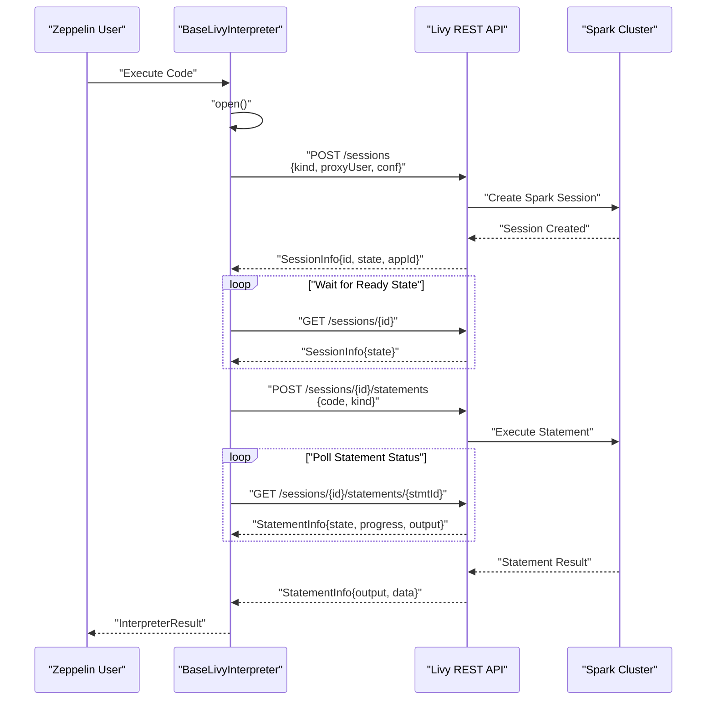

# Livy Interpreter

Relevant source files

The following files were used as context for generating this wiki page:

- [docs/interpreter/livy.md](docs/interpreter/livy.md)
- [livy/src/main/java/org/apache/zeppelin/livy/BaseLivyInterpreter.java](livy/src/main/java/org/apache/zeppelin/livy/BaseLivyInterpreter.java)
- [livy/src/main/java/org/apache/zeppelin/livy/LivyException.java](livy/src/main/java/org/apache/zeppelin/livy/LivyException.java)
- [livy/src/main/java/org/apache/zeppelin/livy/LivyPySpark3Interpreter.java](livy/src/main/java/org/apache/zeppelin/livy/LivyPySpark3Interpreter.java)
- [livy/src/main/java/org/apache/zeppelin/livy/LivyPySparkBaseInterpreter.java](livy/src/main/java/org/apache/zeppelin/livy/LivyPySparkBaseInterpreter.java)
- [livy/src/main/java/org/apache/zeppelin/livy/LivyPySparkInterpreter.java](livy/src/main/java/org/apache/zeppelin/livy/LivyPySparkInterpreter.java)
- [livy/src/main/java/org/apache/zeppelin/livy/LivySharedInterpreter.java](livy/src/main/java/org/apache/zeppelin/livy/LivySharedInterpreter.java)
- [livy/src/main/java/org/apache/zeppelin/livy/LivySparkInterpreter.java](livy/src/main/java/org/apache/zeppelin/livy/LivySparkInterpreter.java)
- [livy/src/main/java/org/apache/zeppelin/livy/LivySparkRInterpreter.java](livy/src/main/java/org/apache/zeppelin/livy/LivySparkRInterpreter.java)
- [livy/src/main/java/org/apache/zeppelin/livy/LivySparkSQLInterpreter.java](livy/src/main/java/org/apache/zeppelin/livy/LivySparkSQLInterpreter.java)
- [livy/src/main/java/org/apache/zeppelin/livy/LivyVersion.java](livy/src/main/java/org/apache/zeppelin/livy/LivyVersion.java)
- [livy/src/main/java/org/apache/zeppelin/livy/SessionNotFoundException.java](livy/src/main/java/org/apache/zeppelin/livy/SessionNotFoundException.java)
- [livy/src/main/resources/interpreter-setting.json](livy/src/main/resources/interpreter-setting.json)
- [livy/src/test/java/org/apache/zeppelin/livy/LivyInterpreterIT.java](livy/src/test/java/org/apache/zeppelin/livy/LivyInterpreterIT.java)
- [livy/src/test/java/org/apache/zeppelin/livy/LivySQLInterpreterTest.java](livy/src/test/java/org/apache/zeppelin/livy/LivySQLInterpreterTest.java)
- [livy/src/test/resources/livy_tutorial_1.scala](livy/src/test/resources/livy_tutorial_1.scala)

The Livy Interpreter provides remote execution of Apache Spark code through Apache Livy's REST interface. It enables Zeppelin to execute Spark applications (Scala, Python, R, SQL) on remote clusters without requiring direct Spark dependencies in the Zeppelin server process. This interpreter supports multiple language runtimes within shared Spark sessions and provides features like session management, user impersonation, and resource configuration.

For information about direct Spark interpreters that run in the same JVM as Zeppelin, see [Spark Interpreters](#5.2).

## Architecture Overview

The Livy interpreter consists of a hierarchy of interpreter classes that communicate with Apache Livy server via REST API to execute code remotely on Spark clusters.

**Sources:** [livy/src/main/java/org/apache/zeppelin/livy/BaseLivyInterpreter.java:85-106](), [livy/src/main/resources/interpreter-setting.json:1-270]()

## Interpreter Implementations

### Base Interpreter Class

`BaseLivyInterpreter` provides the core functionality for communicating with Livy server, including session management, REST API calls, and result processing.

**Sources:** [livy/src/main/java/org/apache/zeppelin/livy/BaseLivyInterpreter.java:85-134](), [livy/src/main/java/org/apache/zeppelin/livy/BaseLivyInterpreter.java:301-340]()

### Language-Specific Implementations

| Interpreter Class | Session Kind | Purpose | App ID Extraction |
|-------------------|--------------|---------|-------------------|
| `LivySparkInterpreter` | `spark` | Scala/Spark execution | `sc.applicationId` |
| `LivySparkSQLInterpreter` | `spark` | SQL query execution | Delegates to `LivySparkInterpreter` |
| `LivyPySparkInterpreter` | `pyspark` | Python/PySpark execution | `sc.applicationId` |
| `LivyPySpark3Interpreter` | `pyspark3` | Python 3/PySpark execution | `sc.applicationId` |
| `LivySparkRInterpreter` | `sparkr` | R/SparkR execution | Not implemented |
| `LivySharedInterpreter` | `shared` | Multi-language session sharing | Not applicable |

**Sources:** [livy/src/main/java/org/apache/zeppelin/livy/LivySparkInterpreter.java:25-34](), [livy/src/main/java/org/apache/zeppelin/livy/LivySparkSQLInterpreter.java:49-75](), [livy/src/main/java/org/apache/zeppelin/livy/LivyPySparkInterpreter.java:26-35]()

### SQL Interpreter Special Features

`LivySparkSQLInterpreter` has unique functionality for SQL result processing:

- **Result Parsing**: Converts Spark SQL tabular output to Zeppelin table format
- **UTF Character Support**: Handles international characters in table data via `tableWithUTFCharacter()` property
- **Field Truncation**: Configurable via `ZEPPELIN_LIVY_SPARK_SQL_FIELD_TRUNCATE`
- **Concurrent Execution**: Optional parallel SQL execution via `concurrentSQL()` property

**Sources:** [livy/src/main/java/org/apache/zeppelin/livy/LivySparkSQLInterpreter.java:115-172](), [livy/src/main/java/org/apache/zeppelin/livy/LivySparkSQLInterpreter.java:377-398]()

## Session Management

### Session Lifecycle

**Sources:** [livy/src/main/java/org/apache/zeppelin/livy/BaseLivyInterpreter.java:301-340](), [livy/src/main/java/org/apache/zeppelin/livy/BaseLivyInterpreter.java:351-430]()

### Session Recovery and Error Handling

The interpreter handles session failures through multiple mechanisms:

- **Session Expiration**: Detects expired sessions via `SessionNotFoundException` and recreates them automatically
- **Session Death**: Optionally restarts dead sessions when `zeppelin.livy.restart_dead_session` is enabled  
- **Connection Timeout**: Configurable session creation timeout via `zeppelin.livy.session.create_timeout`

**Sources:** [livy/src/main/java/org/apache/zeppelin/livy/BaseLivyInterpreter.java:372-399](), [livy/src/main/java/org/apache/zeppelin/livy/BaseLivyInterpreter.java:452-461]()

### Shared Sessions (Livy 0.5+)

`LivySharedInterpreter` enables sharing SparkContext across multiple language interpreters when Livy version supports it:

**Sources:** [livy/src/main/java/org/apache/zeppelin/livy/LivySharedInterpreter.java:34-74](), [livy/src/main/java/org/apache/zeppelin/livy/BaseLivyInterpreter.java:158-165]()

## Configuration

### Core Connection Properties

| Property | Default | Purpose |
|----------|---------|---------|
| `zeppelin.livy.url` | `http://localhost:8998` | Livy server endpoint |
| `zeppelin.livy.session.create_timeout` | `120` | Session creation timeout (seconds) |
| `zeppelin.livy.pull_status.interval.millis` | `1000` | Status polling interval |
| `zeppelin.livy.maxLogLines` | `1000` | Maximum log lines to retrieve |

### Spark Resource Configuration

All Spark configuration properties can be passed with `livy.spark.` prefix:

| Property | Purpose |
|----------|---------|
| `livy.spark.driver.cores` | Driver CPU cores |
| `livy.spark.driver.memory` | Driver memory allocation |
| `livy.spark.executor.instances` | Number of executors |
| `livy.spark.executor.cores` | Executor CPU cores |
| `livy.spark.executor.memory` | Executor memory allocation |
| `livy.spark.dynamicAllocation.enabled` | Enable dynamic resource allocation |

**Sources:** [livy/src/main/resources/interpreter-setting.json:7-123](), [livy/src/main/java/org/apache/zeppelin/livy/BaseLivyInterpreter.java:304-311]()

### Security Configuration

The interpreter supports multiple authentication and security mechanisms:

- **Kerberos Authentication**: Via `zeppelin.livy.principal` and `zeppelin.livy.keytab`
- **SSL/TLS**: Configurable truststore and keystore settings
- **Custom HTTP Headers**: Via `zeppelin.livy.http.headers` for additional authentication
- **User Impersonation**: Automatic when Zeppelin authentication is enabled

**Sources:** [livy/src/main/java/org/apache/zeppelin/livy/BaseLivyInterpreter.java:619-677](), [livy/src/main/java/org/apache/zeppelin/livy/BaseLivyInterpreter.java:124-135]()

## Code Execution Flow

### Statement Execution Process

**Sources:** [livy/src/main/java/org/apache/zeppelin/livy/BaseLivyInterpreter.java:351-430](), [livy/src/main/java/org/apache/zeppelin/livy/BaseLivyInterpreter.java:485-556]()

### SQL Result Processing

`LivySparkSQLInterpreter` implements specialized parsing for SQL output formats:

- **Standard Table Format**: Parses ASCII table output with `parseSQLOutput()`
- **JSON Format**: Handles UTF characters via `parseSQLJsonOutput()` when `tableWithUTFCharacter` is enabled
- **Field Truncation**: Configurable truncation of long field values
- **Result Limits**: Enforced via `ZEPPELIN_LIVY_SPARK_SQL_MAX_RESULT`

**Sources:** [livy/src/main/java/org/apache/zeppelin/livy/LivySparkSQLInterpreter.java:179-270](), [livy/src/main/java/org/apache/zeppelin/livy/LivySparkSQLInterpreter.java:124-158]()

## Version Compatibility

The interpreter adapts behavior based on Livy server version through `LivyVersion` class:

| Feature | Minimum Version | Implementation |
|---------|----------------|----------------|
| Statement Cancellation | Livy 0.3.0 | `isCancelSupported()` |
| Progress Reporting | Livy 0.4.0 | `isGetProgressSupported()` |
| Shared Sessions | Livy 0.5.0 | `isSharedSupported()` |
| Code Completion | Livy 0.5.0 | `/completion` API endpoint |

**Sources:** [livy/src/main/java/org/apache/zeppelin/livy/LivyVersion.java:75-85](), [livy/src/main/java/org/apache/zeppelin/livy/BaseLivyInterpreter.java:258-270]()
