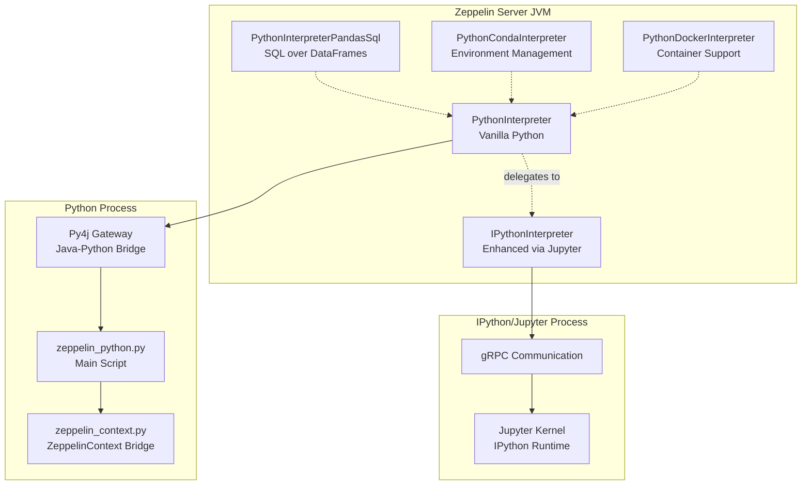
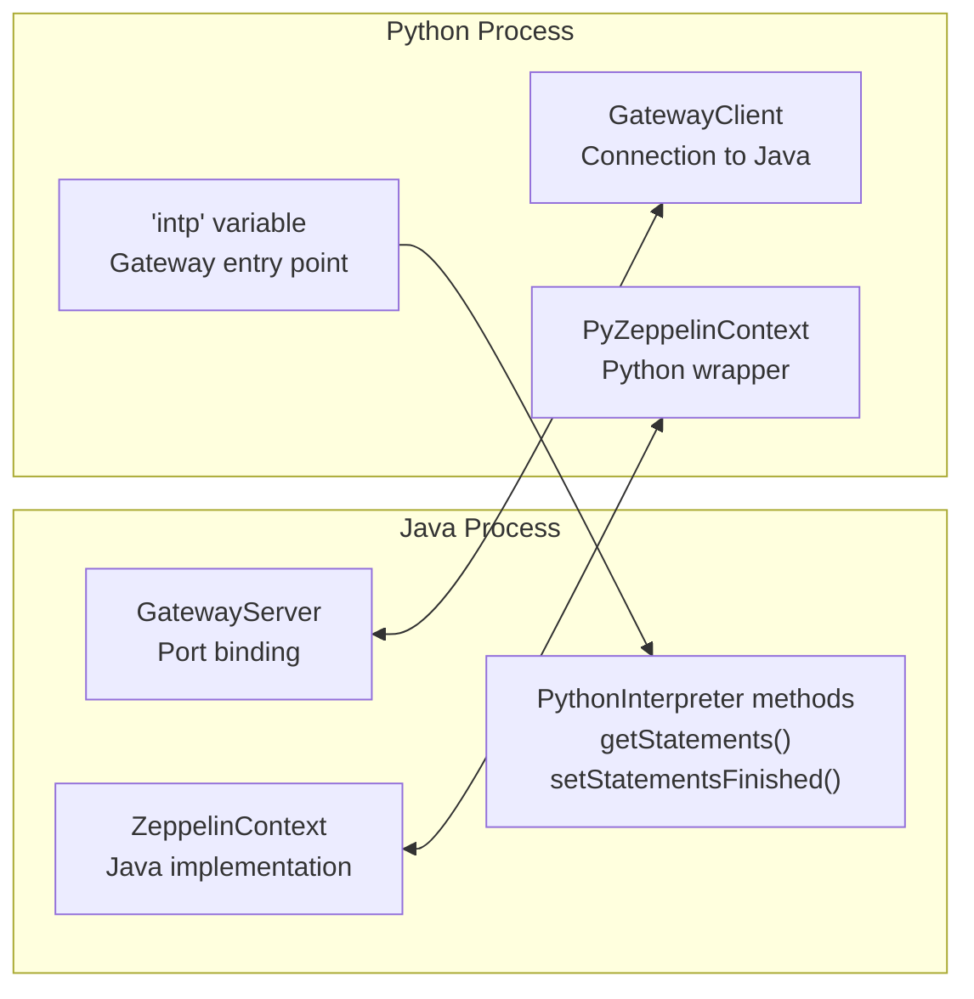
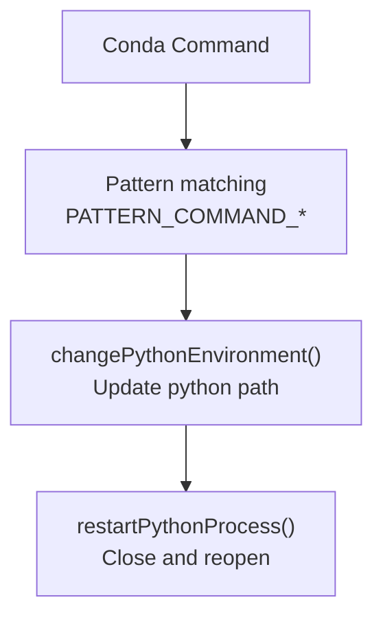
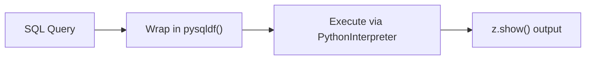

# Python Interpreter

Relevant source files

The following files were used as context for generating this wiki page:

- [docs/assets/themes/zeppelin/img/docs-img/python_pandas_sql.png](docs/assets/themes/zeppelin/img/docs-img/python_pandas_sql.png)
- [docs/assets/themes/zeppelin/img/docs-img/python_zshow_df.png](docs/assets/themes/zeppelin/img/docs-img/python_zshow_df.png)
- [docs/interpreter/python.md](docs/interpreter/python.md)
- [python/pom.xml](python/pom.xml)
- [python/src/main/java/org/apache/zeppelin/python/IPythonInterpreter.java](python/src/main/java/org/apache/zeppelin/python/IPythonInterpreter.java)
- [python/src/main/java/org/apache/zeppelin/python/PythonCondaInterpreter.java](python/src/main/java/org/apache/zeppelin/python/PythonCondaInterpreter.java)
- [python/src/main/java/org/apache/zeppelin/python/PythonDockerInterpreter.java](python/src/main/java/org/apache/zeppelin/python/PythonDockerInterpreter.java)
- [python/src/main/java/org/apache/zeppelin/python/PythonInterpreter.java](python/src/main/java/org/apache/zeppelin/python/PythonInterpreter.java)
- [python/src/main/java/org/apache/zeppelin/python/PythonInterpreterPandasSql.java](python/src/main/java/org/apache/zeppelin/python/PythonInterpreterPandasSql.java)
- [python/src/main/proto/ipython.proto](python/src/main/proto/ipython.proto)
- [python/src/main/resources/interpreter-setting.json](python/src/main/resources/interpreter-setting.json)
- [python/src/main/resources/output_templates/conda_usage.html](python/src/main/resources/output_templates/conda_usage.html)
- [python/src/main/resources/output_templates/docker_usage.html](python/src/main/resources/output_templates/docker_usage.html)
- [python/src/main/resources/python/zeppelin_python.py](python/src/main/resources/python/zeppelin_python.py)
- [python/src/test/java/org/apache/zeppelin/python/BasePythonInterpreterTest.java](python/src/test/java/org/apache/zeppelin/python/BasePythonInterpreterTest.java)
- [python/src/test/java/org/apache/zeppelin/python/IPythonInterpreterTest.java](python/src/test/java/org/apache/zeppelin/python/IPythonInterpreterTest.java)
- [python/src/test/java/org/apache/zeppelin/python/PythonCondaInterpreterTest.java](python/src/test/java/org/apache/zeppelin/python/PythonCondaInterpreterTest.java)
- [python/src/test/java/org/apache/zeppelin/python/PythonDockerInterpreterTest.java](python/src/test/java/org/apache/zeppelin/python/PythonDockerInterpreterTest.java)
- [python/src/test/java/org/apache/zeppelin/python/PythonInterpreterMatplotlibTest.java](python/src/test/java/org/apache/zeppelin/python/PythonInterpreterMatplotlibTest.java)
- [python/src/test/java/org/apache/zeppelin/python/PythonInterpreterPandasSqlTest.java](python/src/test/java/org/apache/zeppelin/python/PythonInterpreterPandasSqlTest.java)
- [python/src/test/java/org/apache/zeppelin/python/PythonInterpreterTest.java](python/src/test/java/org/apache/zeppelin/python/PythonInterpreterTest.java)
- [python/src/test/resources/log4j.properties](python/src/test/resources/log4j.properties)
- [spark/interpreter/src/test/resources/log4j.properties](spark/interpreter/src/test/resources/log4j.properties)
- [zeppelin-interpreter-integration/src/test/resources/log4j.properties](zeppelin-interpreter-integration/src/test/resources/log4j.properties)

This document covers Zeppelin's Python interpreter system, which provides multiple Python execution environments and integration capabilities. The Python interpreter supports both vanilla Python and IPython execution, environment management through Conda and Docker, and advanced features like SQL over Pandas DataFrames.

For information about the broader interpreter framework, see [Interpreter Framework](#2.3). For Spark-specific Python integration, see [Spark Interpreters](#5.2).

## Architecture Overview

Zeppelin's Python interpreter system consists of multiple interpreter implementations that can work together to provide different execution environments and capabilities. The system is designed around process separation and communication bridges between the JVM and Python processes.

Sources: [python/src/main/java/org/apache/zeppelin/python/PythonInterpreter.java:52-77](), [python/src/main/java/org/apache/zeppelin/python/IPythonInterpreter.java:42-47](), [python/src/main/resources/interpreter-setting.json:1-97]()

## Core Interpreter Implementations

### PythonInterpreter - Vanilla Python Implementation

The `PythonInterpreter` class provides the fundamental Python execution capability with minimal dependencies. It launches a separate Python process and communicates via Py4j gateway server.

```mermaid
graph TB
    subgraph "PythonInterpreter Lifecycle"
        OPEN["open()<br/>Check IPython availability"]
        GATEWAY["createGatewayServerAndStartScript()<br/>Start Py4j gateway"]
        PYTHON["Launch Python process<br/>zeppelin_python.py"]
        EXECUTE["interpret()<br/>Send code via gateway"]
        CLOSE["close()<br/>Shutdown processes"]
    end
    
    subgraph "Process Communication"
        JAVA["Java Side<br/>GatewayServer"]
        GATEWAY_COMM["Py4j Protocol<br/>Method calls"]
        PYTHON_SIDE["Python Side<br/>Gateway client"]
    end
    
    OPEN --> GATEWAY
    GATEWAY --> PYTHON
    PYTHON --> EXECUTE
    EXECUTE --> CLOSE
    
    JAVA <--> GATEWAY_COMM
    GATEWAY_COMM <--> PYTHON_SIDE
```

The interpreter can automatically delegate to `IPythonInterpreter` when IPython prerequisites are available and `zeppelin.python.useIPython` is true.

Sources: [python/src/main/java/org/apache/zeppelin/python/PythonInterpreter.java:79-125](), [python/src/main/java/org/apache/zeppelin/python/PythonInterpreter.java:127-173]()

### IPythonInterpreter - Enhanced Jupyter Integration

The `IPythonInterpreter` extends `JupyterKernelInterpreter` to provide advanced features like magic commands, rich output formatting, and better code completion through Jupyter protocol.

Key features:
- Inherits Jupyter kernel capabilities from `JupyterKernelInterpreter`
- Sets up Py4j gateway for ZeppelinContext integration
- Supports advanced IPython features like `%timeit`, `%matplotlib inline`
- Better error handling and output formatting

Sources: [python/src/main/java/org/apache/zeppelin/python/IPythonInterpreter.java:47-62](), [python/src/main/java/org/apache/zeppelin/python/IPythonInterpreter.java:108-120]()

## Communication Mechanisms

### Py4j Gateway Communication

The vanilla Python interpreter uses Py4j to enable bidirectional communication between Java and Python processes. The gateway allows Python to call Java methods and vice versa.

Sources: [python/src/main/java/org/apache/zeppelin/python/PythonInterpreter.java:127-137](), [python/src/main/resources/python/zeppelin_python.py:89-114]()

### Statement Execution Flow

The execution flow involves synchronization between Java and Python processes using wait/notify mechanisms:

1. Java calls `callPython()` with `PythonInterpretRequest`
2. Python calls `getStatements()` to retrieve code
3. Python executes code and calls `setStatementsFinished()` with results
4. Java thread is notified and returns results

Sources: [python/src/main/java/org/apache/zeppelin/python/PythonInterpreter.java:360-377](), [python/src/main/java/org/apache/zeppelin/python/PythonInterpreter.java:314-347](), [python/src/main/resources/python/zeppelin_python.py:120-206]()

## Environment Management

### Conda Integration

The `PythonCondaInterpreter` provides conda environment management capabilities:

| Command Pattern | Functionality |
|-----------------|---------------|
| `env list` | List available conda environments |
| `activate [ENV_NAME]` | Switch to specified environment |
| `deactivate` | Return to default Python |
| `create [ARGS]` | Create new conda environment |
| `install [PACKAGE]` | Install packages in current environment |

Sources: [python/src/main/java/org/apache/zeppelin/python/PythonCondaInterpreter.java:83-129](), [python/src/main/java/org/apache/zeppelin/python/PythonCondaInterpreter.java:142-171]()

### Docker Support

The `PythonDockerInterpreter` enables running Python in Docker containers by modifying the Python execution command to use `docker run`:

- Mounts Python working directory into container
- Sets up PYTHONPATH for Zeppelin integration
- Supports image pulling and environment activation/deactivation

Sources: [python/src/main/java/org/apache/zeppelin/python/PythonDockerInterpreter.java:69-113]()

## Integration Features

### SQL over Pandas DataFrames

The `PythonInterpreterPandasSql` interpreter enables SQL queries on Pandas DataFrames using the `pandasql` library:

The interpreter transforms SQL like `SELECT * FROM df` into Python code: `z.show(pysqldf('SELECT * FROM df'))`.

Sources: [python/src/main/java/org/apache/zeppelin/python/PythonInterpreterPandasSql.java:67-72]()

### ZeppelinContext Integration

The `PyZeppelinContext` class provides Python access to Zeppelin's display system and notebook features:

| Method | Purpose |
|--------|---------|
| `z.show(dataframe)` | Display Pandas DataFrames as tables |
| `z.input(name, default)` | Create dynamic form inputs |
| `z.select(name, options)` | Create dropdown forms |
| `z.put(key, value)` | Store data in distributed resource pool |
| `z.get(key)` | Retrieve shared data |

Sources: [python/src/main/resources/python/zeppelin_context.py](), [python/src/main/java/org/apache/zeppelin/python/PythonZeppelinContext.java]()

### Matplotlib Integration

The Python interpreter includes built-in matplotlib backend support for inline plotting. The `backend_zinline.py` provides a custom matplotlib backend that integrates with Zeppelin's display system.

Sources: [python/src/main/java/org/apache/zeppelin/python/PythonInterpreter.java:190-194](), [docs/interpreter/python.md:139-185]()

## Configuration Properties

The interpreter system supports several configuration properties defined in `interpreter-setting.json`:

| Property | Default | Description |
|----------|---------|-------------|
| `zeppelin.python` | `python` | Path to Python executable |
| `zeppelin.python.maxResult` | `1000` | Maximum DataFrame rows to display |
| `zeppelin.python.useIPython` | `true` | Whether to use IPython when available |
| `zeppelin.ipython.launch.timeout` | `30000` | IPython launch timeout (ms) |
| `zeppelin.ipython.grpc.message_size` | `33554432` | gRPC message size limit |

Sources: [python/src/main/resources/interpreter-setting.json:7-51]()
