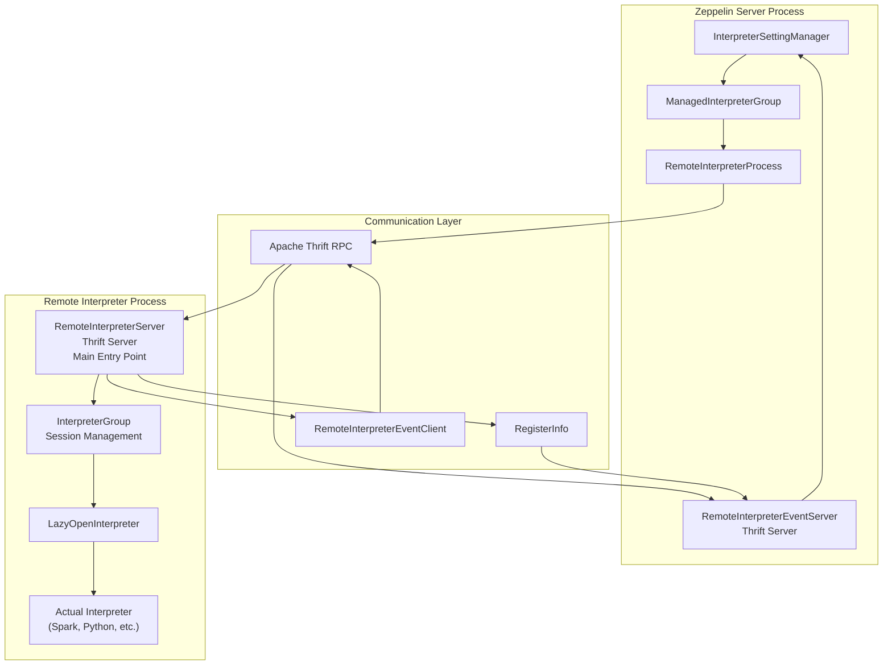
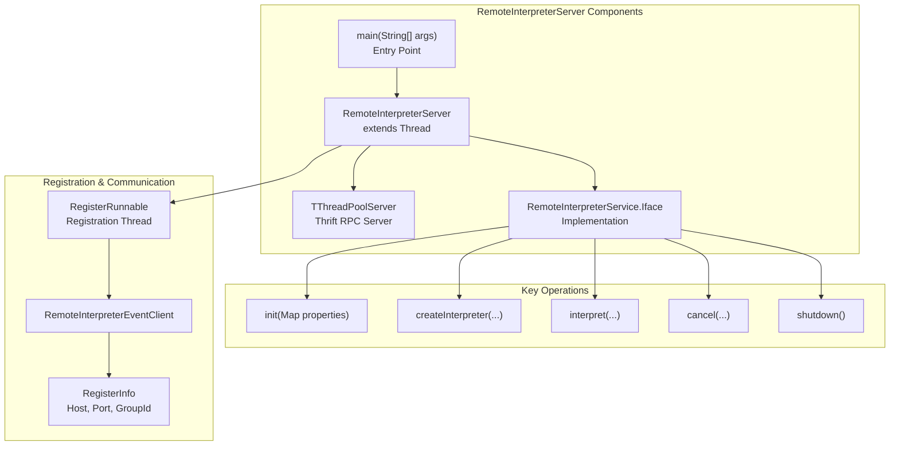
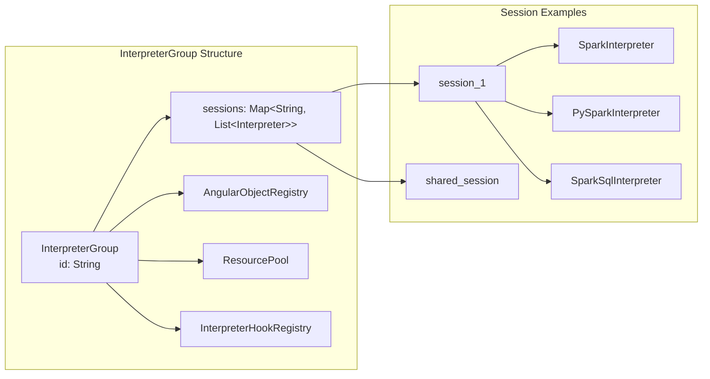
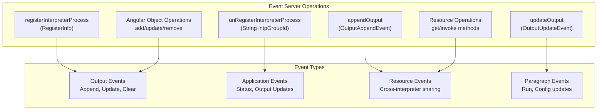
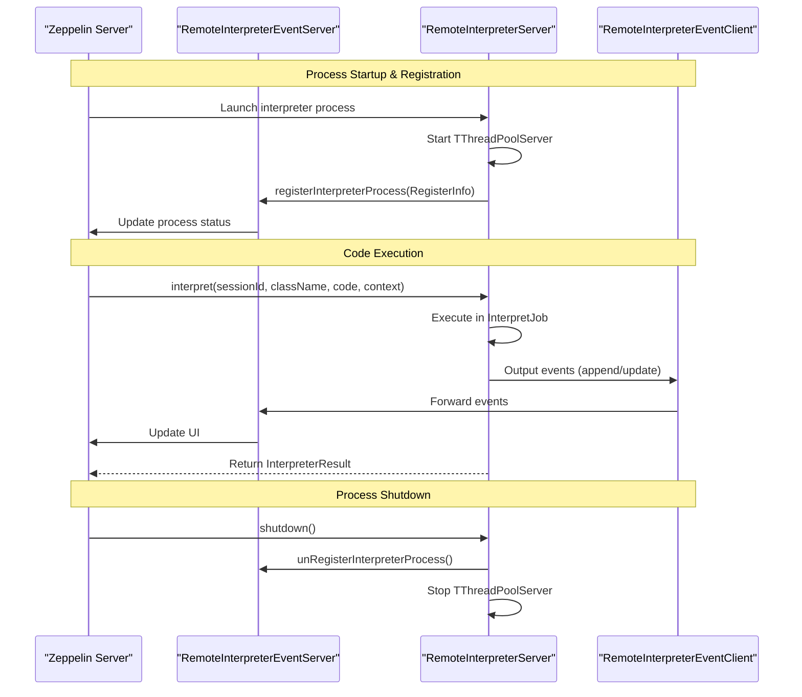
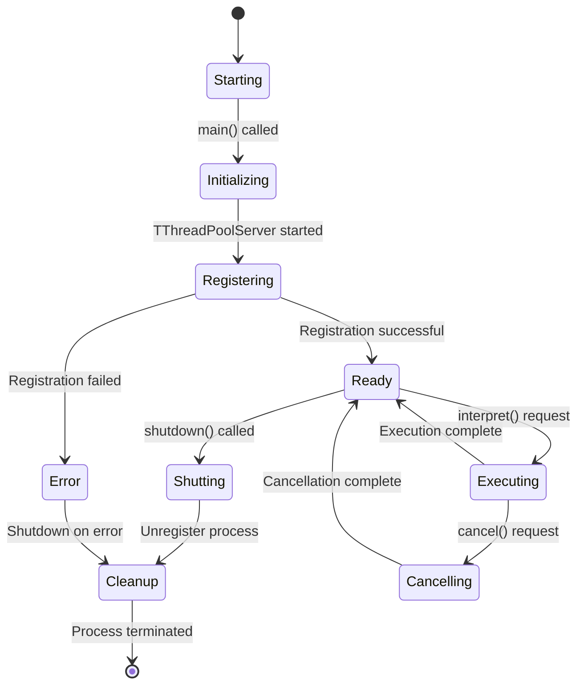
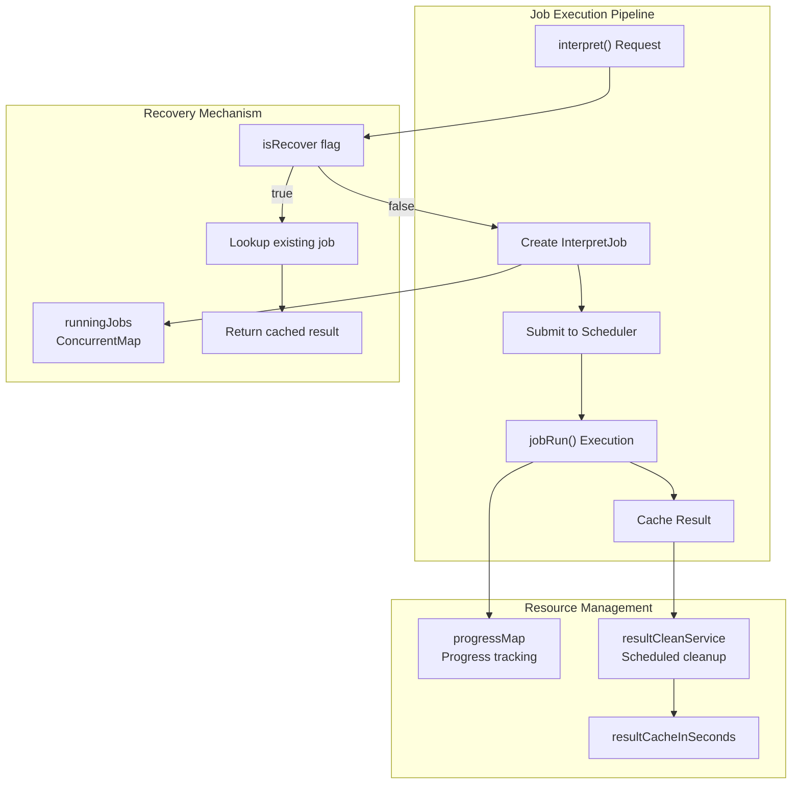
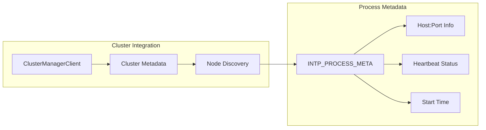

# Remote Interpreter Infrastructure

Relevant source files

The following files were used as context for generating this wiki page:

- [helium-dev/src/main/java/org/apache/zeppelin/helium/ZeppelinDevServer.java](helium-dev/src/main/java/org/apache/zeppelin/helium/ZeppelinDevServer.java)
- [zeppelin-interpreter/src/main/java/org/apache/zeppelin/interpreter/InterpreterGroup.java](zeppelin-interpreter/src/main/java/org/apache/zeppelin/interpreter/InterpreterGroup.java)
- [zeppelin-interpreter/src/main/java/org/apache/zeppelin/interpreter/remote/RemoteInterpreterServer.java](zeppelin-interpreter/src/main/java/org/apache/zeppelin/interpreter/remote/RemoteInterpreterServer.java)
- [zeppelin-interpreter/src/main/java/org/apache/zeppelin/interpreter/remote/RemoteInterpreterUtils.java](zeppelin-interpreter/src/main/java/org/apache/zeppelin/interpreter/remote/RemoteInterpreterUtils.java)
- [zeppelin-interpreter/src/test/java/org/apache/zeppelin/interpreter/remote/RemoteInterpreterServerTest.java](zeppelin-interpreter/src/test/java/org/apache/zeppelin/interpreter/remote/RemoteInterpreterServerTest.java)
- [zeppelin-interpreter/src/test/java/org/apache/zeppelin/interpreter/remote/RemoteInterpreterUtilsTest.java](zeppelin-interpreter/src/test/java/org/apache/zeppelin/interpreter/remote/RemoteInterpreterUtilsTest.java)
- [zeppelin-zengine/src/main/java/org/apache/zeppelin/interpreter/RemoteInterpreterEventServer.java](zeppelin-zengine/src/main/java/org/apache/zeppelin/interpreter/RemoteInterpreterEventServer.java)

## Purpose and Scope

The Remote Interpreter Infrastructure enables Apache Zeppelin to execute interpreters in separate processes from the main Zeppelin server, providing process isolation, resource management, and distributed execution capabilities. This document covers the core components, communication protocols, and lifecycle management of remote interpreter processes.

For information about interpreter configuration and management, see [Interpreter Framework](#2.3). For specific interpreter implementations, see [Spark Interpreters](#5.2), [Python Interpreter](#5.3), and other interpreter-specific sections.

## Architecture Overview

The remote interpreter infrastructure consists of separate processes communicating via Apache Thrift RPC. The main Zeppelin server manages interpreter processes through a client-server architecture where interpreter processes register themselves and handle execution requests.

### System Architecture

Sources: [zeppelin-interpreter/src/main/java/org/apache/zeppelin/interpreter/remote/RemoteInterpreterServer.java:106-107](), [zeppelin-zengine/src/main/java/org/apache/zeppelin/interpreter/RemoteInterpreterEventServer.java:76](), [zeppelin-interpreter/src/main/java/org/apache/zeppelin/interpreter/InterpreterGroup.java:45]()

## Core Components

### RemoteInterpreterServer

The `RemoteInterpreterServer` is the main entry point for interpreter processes, running as a separate thread and implementing the `RemoteInterpreterService.Iface` interface. It manages interpreter instances and handles RPC requests from the Zeppelin server.

Sources: [zeppelin-interpreter/src/main/java/org/apache/zeppelin/interpreter/remote/RemoteInterpreterServer.java:298-334](), [zeppelin-interpreter/src/main/java/org/apache/zeppelin/interpreter/remote/RemoteInterpreterServer.java:616-659]()

### InterpreterGroup and Session Management

The `InterpreterGroup` manages collections of interpreter sessions, where each session can contain multiple interpreters sharing the same execution context.

Sources: [zeppelin-interpreter/src/main/java/org/apache/zeppelin/interpreter/InterpreterGroup.java:32-44](), [zeppelin-interpreter/src/main/java/org/apache/zeppelin/interpreter/InterpreterGroup.java:90-107]()

### RemoteInterpreterEventServer

The `RemoteInterpreterEventServer` runs in the main Zeppelin server process and handles events and registration from remote interpreter processes.

Sources: [zeppelin-zengine/src/main/java/org/apache/zeppelin/interpreter/RemoteInterpreterEventServer.java:168-203](), [zeppelin-zengine/src/main/java/org/apache/zeppelin/interpreter/RemoteInterpreterEventServer.java:218-284]()

## Communication Protocol

### Thrift RPC Interface

The communication between Zeppelin server and remote interpreter processes uses Apache Thrift with two main service interfaces:

| Service Interface | Location | Purpose |
|-------------------|----------|---------|
| `RemoteInterpreterService.Iface` | Interpreter Process | Handles execution requests from server |
| `RemoteInterpreterEventService.Iface` | Zeppelin Server | Handles events from interpreter processes |

### Communication Flow

Sources: [zeppelin-interpreter/src/main/java/org/apache/zeppelin/interpreter/remote/RemoteInterpreterServer.java:542-614](), [zeppelin-zengine/src/main/java/org/apache/zeppelin/interpreter/RemoteInterpreterEventServer.java:168-186]()

## Process Lifecycle Management

### Interpreter Process Lifecycle

The remote interpreter process follows a specific lifecycle from startup to shutdown, with proper resource management and error handling.

### Key Lifecycle Components

| Component | Class | Responsibility |
|-----------|-------|----------------|
| Startup | `RemoteInterpreterServer.main()` | Process entry point and argument parsing |
| Initialization | `RemoteInterpreterServer.init()` | Configuration setup and client creation |
| Registration | `RegisterRunnable` | Register with Zeppelin server |
| Execution | `InterpretJob` | Handle code interpretation requests |
| Shutdown | `ShutdownThread` | Clean resource cleanup and process termination |

Sources: [zeppelin-interpreter/src/main/java/org/apache/zeppelin/interpreter/remote/RemoteInterpreterServer.java:298-334](), [zeppelin-interpreter/src/main/java/org/apache/zeppelin/interpreter/remote/RemoteInterpreterServer.java:661-753]()

### Job Execution and Recovery

The system supports job recovery for long-running operations through the `runningJobs` cache and result caching mechanisms.

Sources: [zeppelin-interpreter/src/main/java/org/apache/zeppelin/interpreter/remote/RemoteInterpreterServer.java:557-599](), [zeppelin-interpreter/src/main/java/org/apache/zeppelin/interpreter/remote/RemoteInterpreterServer.java:769-932]()

## Network and Port Management

### Port Allocation and Host Discovery

The remote interpreter infrastructure includes utilities for network configuration and port management to support various deployment scenarios.

| Function | Purpose | Configuration |
|----------|---------|---------------|
| `findAvailablePort()` | Allocate ports within specified ranges | `portRange` parameter (e.g., "30000:40000") |
| `findAvailableHostAddress()` | Discover accessible host addresses | `ZEPPELIN_LOCAL_IP` environment variable |
| `checkIfRemoteEndpointAccessible()` | Verify connectivity to remote endpoints | Socket connection testing |

### Cluster Mode Integration

In cluster mode, the system integrates with cluster management for process discovery and metadata registration:

Sources: [zeppelin-interpreter/src/main/java/org/apache/zeppelin/interpreter/remote/RemoteInterpreterUtils.java:52-79](), [zeppelin-interpreter/src/main/java/org/apache/zeppelin/interpreter/remote/RemoteInterpreterServer.java:337-354]()
