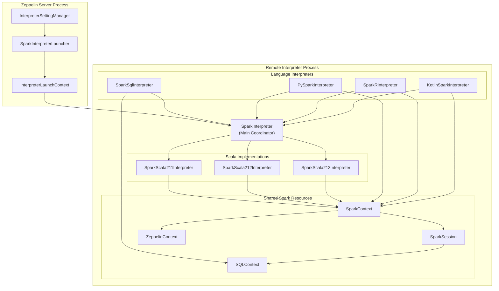
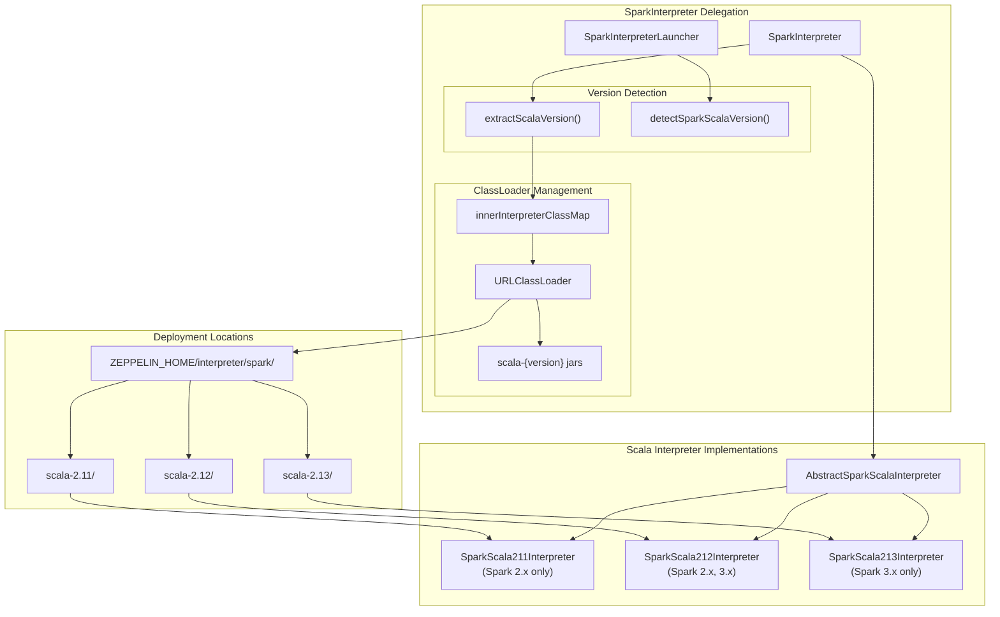
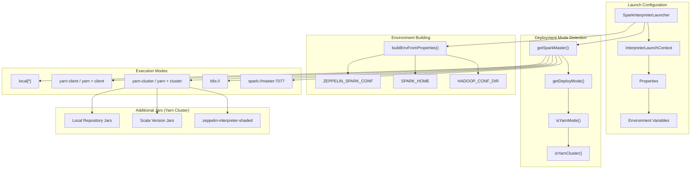
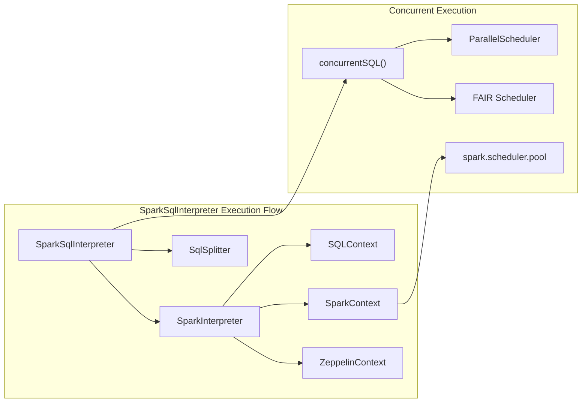

# Spark Interpreters

Relevant source files

The following files were used as context for generating this wiki page:

- [docs/interpreter/spark.md](docs/interpreter/spark.md)
- [spark-submit/src/main/java/org/apache/zeppelin/spark/submit/SparkSubmitInterpreter.java](spark-submit/src/main/java/org/apache/zeppelin/spark/submit/SparkSubmitInterpreter.java)
- [spark-submit/src/main/resources/interpreter-setting.json](spark-submit/src/main/resources/interpreter-setting.json)
- [spark/interpreter/src/main/java/org/apache/zeppelin/spark/AbstractSparkScalaInterpreter.java](spark/interpreter/src/main/java/org/apache/zeppelin/spark/AbstractSparkScalaInterpreter.java)
- [spark/interpreter/src/main/java/org/apache/zeppelin/spark/KotlinSparkInterpreter.java](spark/interpreter/src/main/java/org/apache/zeppelin/spark/KotlinSparkInterpreter.java)
- [spark/interpreter/src/main/java/org/apache/zeppelin/spark/SparkInterpreter.java](spark/interpreter/src/main/java/org/apache/zeppelin/spark/SparkInterpreter.java)
- [spark/interpreter/src/main/java/org/apache/zeppelin/spark/SparkSqlInterpreter.java](spark/interpreter/src/main/java/org/apache/zeppelin/spark/SparkSqlInterpreter.java)
- [spark/interpreter/src/main/resources/interpreter-setting.json](spark/interpreter/src/main/resources/interpreter-setting.json)
- [spark/interpreter/src/test/java/org/apache/zeppelin/spark/SparkInterpreterTest.java](spark/interpreter/src/test/java/org/apache/zeppelin/spark/SparkInterpreterTest.java)
- [spark/scala-2.11/src/main/scala/org/apache/zeppelin/spark/SparkScala211Interpreter.scala](spark/scala-2.11/src/main/scala/org/apache/zeppelin/spark/SparkScala211Interpreter.scala)
- [spark/scala-2.12/src/main/scala/org/apache/zeppelin/spark/SparkScala212Interpreter.scala](spark/scala-2.12/src/main/scala/org/apache/zeppelin/spark/SparkScala212Interpreter.scala)
- [spark/scala-2.13/src/main/scala/org/apache/zeppelin/spark/SparkScala213Interpreter.scala](spark/scala-2.13/src/main/scala/org/apache/zeppelin/spark/SparkScala213Interpreter.scala)
- [zeppelin-interpreter-integration/README.md](zeppelin-interpreter-integration/README.md)
- [zeppelin-interpreter-integration/src/test/java/org/apache/zeppelin/integration/SparkIntegrationTest.java](zeppelin-interpreter-integration/src/test/java/org/apache/zeppelin/integration/SparkIntegrationTest.java)
- [zeppelin-interpreter-integration/src/test/java/org/apache/zeppelin/integration/SparkSubmitIntegrationTest.java](zeppelin-interpreter-integration/src/test/java/org/apache/zeppelin/integration/SparkSubmitIntegrationTest.java)
- [zeppelin-interpreter/src/main/java/org/apache/zeppelin/interpreter/launcher/InterpreterClient.java](zeppelin-interpreter/src/main/java/org/apache/zeppelin/interpreter/launcher/InterpreterClient.java)
- [zeppelin-interpreter/src/main/java/org/apache/zeppelin/interpreter/launcher/InterpreterLaunchContext.java](zeppelin-interpreter/src/main/java/org/apache/zeppelin/interpreter/launcher/InterpreterLaunchContext.java)
- [zeppelin-web/e2e/collaborativeMode.spec.js](zeppelin-web/e2e/collaborativeMode.spec.js)
- [zeppelin-zengine/src/main/java/org/apache/zeppelin/interpreter/launcher/SparkInterpreterLauncher.java](zeppelin-zengine/src/main/java/org/apache/zeppelin/interpreter/launcher/SparkInterpreterLauncher.java)
- [zeppelin-zengine/src/test/java/org/apache/zeppelin/interpreter/launcher/SparkInterpreterLauncherTest.java](zeppelin-zengine/src/test/java/org/apache/zeppelin/interpreter/launcher/SparkInterpreterLauncherTest.java)

This document covers the Spark interpreter system in Apache Zeppelin, which provides multi-language support for Apache Spark through a collection of specialized interpreters. The Spark interpreters enable users to execute Scala, Python, R, SQL, and Kotlin code against Spark clusters in various deployment modes.

For information about the broader interpreter framework that manages these interpreters, see [Interpreter Framework](#2.3). For details about remote interpreter execution infrastructure, see [Remote Interpreter Infrastructure](#5.1).

## Architecture Overview

The Spark interpreter system is built around a delegation pattern where a main `SparkInterpreter` coordinates with language-specific sub-interpreters, all sharing the same `SparkContext` and `SparkSession`.

**Sources:** [spark/interpreter/src/main/java/org/apache/zeppelin/spark/SparkInterpreter.java:54-96](), [spark/interpreter/src/main/java/org/apache/zeppelin/spark/AbstractSparkScalaInterpreter.java:47-72](), [zeppelin-zengine/src/main/java/org/apache/zeppelin/interpreter/launcher/SparkInterpreterLauncher.java:47-59]()

## Interpreter Types and Language Support

The Spark interpreter group consists of multiple specialized interpreters that share a common Spark runtime:

| Interpreter Name | Class | Language | Description |
|------------------|-------|----------|-------------|
| `%spark` | `SparkInterpreter` | Scala | Main Scala environment with SparkContext/SparkSession |
| `%spark.sql` | `SparkSqlInterpreter` | SQL | SQL environment using shared SparkSession |
| `%spark.pyspark` | `PySparkInterpreter` | Python | Python environment with PySpark |
| `%spark.ipyspark` | `IPySparkInterpreter` | Python | IPython-enhanced Python environment |
| `%spark.r` | `SparkRInterpreter` | R | Vanilla R environment with SparkR |
| `%spark.ir` | `SparkIRInterpreter` | R | Jupyter IRKernel-based R environment |
| `%spark.shiny` | `SparkShinyInterpreter` | R | R Shiny app creation with SparkR |
| `%spark.kotlin` | `KotlinSparkInterpreter` | Kotlin | Kotlin environment with Spark support |

**Sources:** [spark/interpreter/src/main/resources/interpreter-setting.json:1-368](), [docs/interpreter/spark.md:31-77]()

## Scala Version Support Architecture

The `SparkInterpreter` delegates to version-specific Scala implementations to support multiple Scala versions (2.11, 2.12, 2.13) within the same Zeppelin instance:

**Sources:** [spark/interpreter/src/main/java/org/apache/zeppelin/spark/SparkInterpreter.java:158-189](), [zeppelin-zengine/src/main/java/org/apache/zeppelin/interpreter/launcher/SparkInterpreterLauncher.java:268-293](), [spark/interpreter/src/main/java/org/apache/zeppelin/spark/SparkInterpreter.java:92-95]()

The version detection process involves:

1. **Launcher Detection**: `SparkInterpreterLauncher.detectSparkScalaVersion()` runs `spark-submit --version` to determine Scala version
2. **Runtime Confirmation**: `SparkInterpreter.extractScalaVersion()` uses `scala.util.Properties.versionString()` for final determination
3. **Dynamic Loading**: Version-specific jars are loaded from `ZEPPELIN_HOME/interpreter/spark/scala-{version}/` directories

**Sources:** [zeppelin-zengine/src/main/java/org/apache/zeppelin/interpreter/launcher/SparkInterpreterLauncher.java:268-293](), [spark/interpreter/src/main/java/org/apache/zeppelin/spark/SparkInterpreter.java:268-292]()

## Launcher and Process Management

The `SparkInterpreterLauncher` handles Spark-specific process configuration and deployment across different execution modes:

**Sources:** [zeppelin-zengine/src/main/java/org/apache/zeppelin/interpreter/launcher/SparkInterpreterLauncher.java:62-266](), [zeppelin-zengine/src/main/java/org/apache/zeppelin/interpreter/launcher/SparkInterpreterLauncher.java:405-447]()

### Yarn Cluster Mode Special Handling

For `yarn-cluster` mode, the launcher automatically includes additional jars in `spark.jars`:
- Local repository jars from `zeppelin.interpreter.localRepo`
- Scala version-specific jars from `ZEPPELIN_HOME/interpreter/spark/scala-{version}/`
- `zeppelin-interpreter-shaded` jar for remote communication

**Sources:** [zeppelin-zengine/src/main/java/org/apache/zeppelin/interpreter/launcher/SparkInterpreterLauncher.java:141-193]()

## Configuration System

Spark interpreters support extensive configuration through the `interpreter-setting.json` file and runtime properties:

### Core Spark Properties

| Property | Default | Description |
|----------|---------|-------------|
| `SPARK_HOME` | - | Location of Spark distribution |
| `spark.master` | `local[*]` | Spark master URI |
| `spark.submit.deployMode` | - | Deploy mode: `client` or `cluster` |
| `spark.app.name` | `Zeppelin` | Spark application name |
| `spark.driver.memory` | `1g` | Driver memory allocation |
| `spark.executor.memory` | `1g` | Executor memory allocation |

### Zeppelin-Specific Properties

| Property | Default | Description |
|----------|---------|-------------|
| `zeppelin.spark.useHiveContext` | `true` | Enable Hive support in SparkSession |
| `zeppelin.spark.printREPLOutput` | `true` | Print Scala REPL output |
| `zeppelin.spark.maxResult` | `1000` | Max rows in SQL results |
| `zeppelin.spark.concurrentSQL` | `false` | Enable concurrent SQL execution |
| `zeppelin.pyspark.useIPython` | `true` | Use IPython for PySpark |

**Sources:** [spark/interpreter/src/main/resources/interpreter-setting.json:7-164](), [docs/interpreter/spark.md:145-297]()

## SQL Interpreter Integration

The `SparkSqlInterpreter` demonstrates shared resource management by reusing the main Spark interpreter's context:

**Sources:** [spark/interpreter/src/main/java/org/apache/zeppelin/spark/SparkSqlInterpreter.java:45-185](), [spark/interpreter/src/main/java/org/apache/zeppelin/spark/SparkSqlInterpreter.java:61-63](), [spark/interpreter/src/main/java/org/apache/zeppelin/spark/SparkSqlInterpreter.java:165-184]()

The SQL interpreter supports:
- **Concurrent SQL execution** via `zeppelin.spark.concurrentSQL` property
- **Statement splitting** using `SqlSplitter` for multi-statement paragraphs  
- **Shared spark context** with job group and pool management
- **Error handling** with optional stack trace display

**Sources:** [spark/interpreter/src/main/java/org/apache/zeppelin/spark/SparkSqlInterpreter.java:79-146]()

## Deployment and Testing

The integration tests demonstrate various deployment scenarios:

### Test Coverage Matrix

| Test Class | Deployment Modes | Key Features |
|------------|------------------|--------------|
| `SparkIntegrationTest` | Local, Yarn-Client, Yarn-Cluster | Multi-language, Scoped mode |
| `SparkSubmitIntegrationTest` | Yarn-Cluster via spark-submit | External submission, cancellation |
| `SparkInterpreterLauncherTest` | All modes | Launcher configuration testing |

**Sources:** [zeppelin-interpreter-integration/src/test/java/org/apache/zeppelin/integration/SparkIntegrationTest.java:59-395](), [zeppelin-interpreter-integration/src/test/java/org/apache/zeppelin/integration/SparkSubmitIntegrationTest.java:52-191](), [zeppelin-zengine/src/test/java/org/apache/zeppelin/interpreter/launcher/SparkInterpreterLauncherTest.java:42-318]()

### SparkSubmit Integration

The `SparkSubmitInterpreter` provides `%spark-submit` functionality for external Spark application submission:

- **Command wrapping**: Prepends `SPARK_HOME/bin/spark-submit` to user commands
- **Yarn application tracking**: Extracts application IDs for monitoring and cancellation
- **UI integration**: Automatically detects and reports Spark UI URLs

**Sources:** [spark-submit/src/main/java/org/apache/zeppelin/spark/submit/SparkSubmitInterpreter.java:44-157]()
