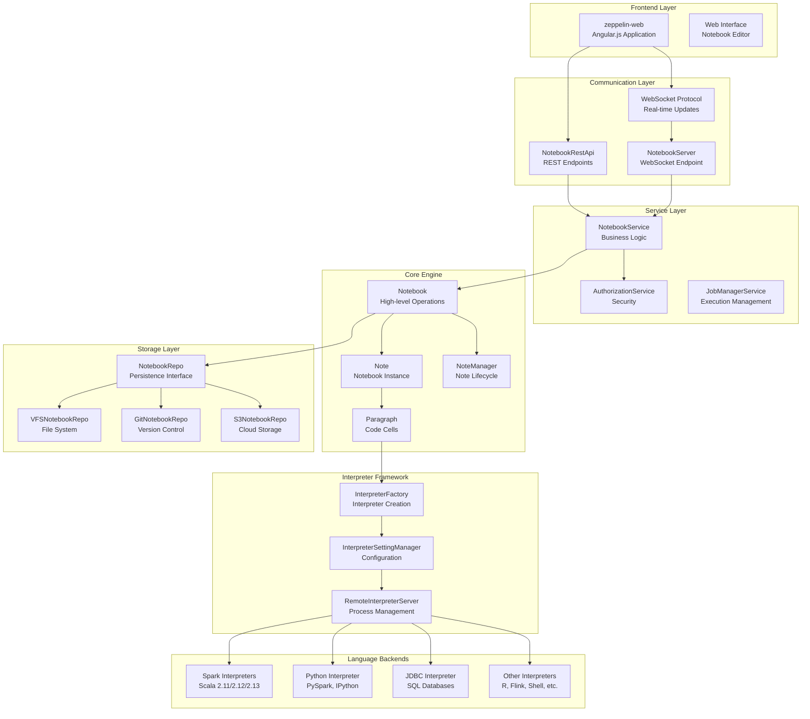
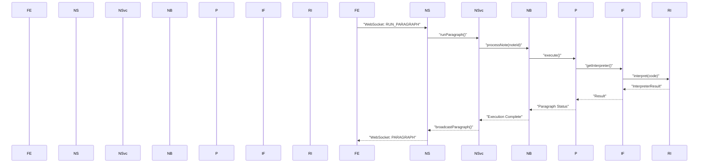

# Overview

Relevant source files

The following files were used as context for generating this wiki page:

- [.github/workflows/core.yml](.github/workflows/core.yml)
- [.github/workflows/frontend.yml](.github/workflows/frontend.yml)
- [.github/workflows/quick.yml](.github/workflows/quick.yml)
- [.gitignore](.gitignore)
- [.mvn/wrapper/MavenWrapperDownloader.java](.mvn/wrapper/MavenWrapperDownloader.java)
- [.mvn/wrapper/maven-wrapper.jar](.mvn/wrapper/maven-wrapper.jar)
- [.mvn/wrapper/maven-wrapper.properties](.mvn/wrapper/maven-wrapper.properties)
- [Dockerfile](Dockerfile)
- [README.md](README.md)
- [conf/interpreter-list](conf/interpreter-list)
- [dev/common_release.sh](dev/common_release.sh)
- [dev/create_release.sh](dev/create_release.sh)
- [dev/publish_release.sh](dev/publish_release.sh)
- [docs/_includes/themes/zeppelin/_navigation.html](docs/_includes/themes/zeppelin/_navigation.html)
- [docs/index.md](docs/index.md)
- [docs/setup/basics/how_to_build.md](docs/setup/basics/how_to_build.md)
- [docs/usage/interpreter/installation.md](docs/usage/interpreter/installation.md)
- [livy/README.md](livy/README.md)
- [pom.xml](pom.xml)
- [spark/pom.xml](spark/pom.xml)
- [zeppelin-display/pom.xml](zeppelin-display/pom.xml)
- [zeppelin-distribution/pom.xml](zeppelin-distribution/pom.xml)
- [zeppelin-interpreter/pom.xml](zeppelin-interpreter/pom.xml)
- [zeppelin-interpreter/src/main/java/org/apache/zeppelin/scheduler/Job.java](zeppelin-interpreter/src/main/java/org/apache/zeppelin/scheduler/Job.java)
- [zeppelin-interpreter/src/main/java/org/apache/zeppelin/scheduler/JobWithProgressPoller.java](zeppelin-interpreter/src/main/java/org/apache/zeppelin/scheduler/JobWithProgressPoller.java)
- [zeppelin-interpreter/src/test/java/org/apache/zeppelin/scheduler/JobTest.java](zeppelin-interpreter/src/test/java/org/apache/zeppelin/scheduler/JobTest.java)
- [zeppelin-server/pom.xml](zeppelin-server/pom.xml)
- [zeppelin-server/src/main/java/org/apache/zeppelin/rest/NotebookRestApi.java](zeppelin-server/src/main/java/org/apache/zeppelin/rest/NotebookRestApi.java)
- [zeppelin-server/src/main/java/org/apache/zeppelin/service/NotebookService.java](zeppelin-server/src/main/java/org/apache/zeppelin/service/NotebookService.java)
- [zeppelin-server/src/main/java/org/apache/zeppelin/socket/NotebookServer.java](zeppelin-server/src/main/java/org/apache/zeppelin/socket/NotebookServer.java)
- [zeppelin-server/src/test/java/org/apache/zeppelin/rest/AbstractTestRestApi.java](zeppelin-server/src/test/java/org/apache/zeppelin/rest/AbstractTestRestApi.java)
- [zeppelin-server/src/test/java/org/apache/zeppelin/rest/NotebookRestApiTest.java](zeppelin-server/src/test/java/org/apache/zeppelin/rest/NotebookRestApiTest.java)
- [zeppelin-server/src/test/java/org/apache/zeppelin/rest/ZeppelinRestApiTest.java](zeppelin-server/src/test/java/org/apache/zeppelin/rest/ZeppelinRestApiTest.java)
- [zeppelin-server/src/test/java/org/apache/zeppelin/service/NotebookServiceTest.java](zeppelin-server/src/test/java/org/apache/zeppelin/service/NotebookServiceTest.java)
- [zeppelin-server/src/test/java/org/apache/zeppelin/socket/NotebookServerTest.java](zeppelin-server/src/test/java/org/apache/zeppelin/socket/NotebookServerTest.java)
- [zeppelin-web/pom.xml](zeppelin-web/pom.xml)
- [zeppelin-zengine/pom.xml](zeppelin-zengine/pom.xml)
- [zeppelin-zengine/src/main/java/org/apache/zeppelin/notebook/Note.java](zeppelin-zengine/src/main/java/org/apache/zeppelin/notebook/Note.java)
- [zeppelin-zengine/src/main/java/org/apache/zeppelin/notebook/Notebook.java](zeppelin-zengine/src/main/java/org/apache/zeppelin/notebook/Notebook.java)
- [zeppelin-zengine/src/main/java/org/apache/zeppelin/notebook/Paragraph.java](zeppelin-zengine/src/main/java/org/apache/zeppelin/notebook/Paragraph.java)
- [zeppelin-zengine/src/test/java/org/apache/zeppelin/helium/HeliumApplicationFactoryTest.java](zeppelin-zengine/src/test/java/org/apache/zeppelin/helium/HeliumApplicationFactoryTest.java)
- [zeppelin-zengine/src/test/java/org/apache/zeppelin/notebook/NoteTest.java](zeppelin-zengine/src/test/java/org/apache/zeppelin/notebook/NoteTest.java)
- [zeppelin-zengine/src/test/java/org/apache/zeppelin/notebook/NotebookTest.java](zeppelin-zengine/src/test/java/org/apache/zeppelin/notebook/NotebookTest.java)
- [zeppelin-zengine/src/test/java/org/apache/zeppelin/notebook/ParagraphTest.java](zeppelin-zengine/src/test/java/org/apache/zeppelin/notebook/ParagraphTest.java)

This document provides an overview of Apache Zeppelin, a web-based notebook platform for interactive data analytics. This page covers the high-level architecture, core components, and system relationships within the Zeppelin codebase. For detailed information about specific subsystems, see [Architecture](#2) for the overall system design, [Web Interface](#3) for frontend components, [Server Components](#4) for backend services, [Interpreters](#5) for language execution engines, and [Deployment and Operations](#6) for deployment workflows.

Apache Zeppelin is a multi-purpose notebook that enables data ingestion, discovery, analytics, and visualization through support for 20+ language backends including Spark, Python, SQL, and R. The system follows a modular architecture with a web-based frontend, RESTful and WebSocket APIs, a core notebook engine, and pluggable interpreter framework.

## System Architecture

**System Architecture Overview**

Sources: [pom.xml:54-103](), [zeppelin-server/src/main/java/org/apache/zeppelin/socket/NotebookServer.java:117-123](), [zeppelin-zengine/src/main/java/org/apache/zeppelin/notebook/Notebook.java:73]()

## Core Components

### Web-based Notebook Interface

The frontend is built as an Angular.js single-page application in the `zeppelin-web` module. It provides an interactive notebook interface with real-time collaboration features, dynamic forms, and rich data visualization capabilities.

**Key Frontend Components:**
- Notebook editor with paragraph-based code cells
- Real-time output rendering and progress tracking  
- Interpreter management interface
- Navigation and home page components

Sources: [zeppelin-web/pom.xml:29-31](), [docs/_includes/themes/zeppelin/_navigation.html:1-20]()

### Server and API Layer

The `zeppelin-server` module provides both REST and WebSocket APIs for notebook operations. The `NotebookServer` class handles WebSocket connections for real-time communication, while `NotebookRestApi` provides RESTful endpoints for CRUD operations.

**Key Server Classes:**
- `NotebookServer`: WebSocket endpoint for real-time updates at `/ws`
- `NotebookRestApi`: REST API endpoints under `/api/notebook`  
- `NotebookService`: Business logic layer with permission checking
- `AuthorizationService`: Security and access control

Sources: [zeppelin-server/src/main/java/org/apache/zeppelin/socket/NotebookServer.java:112-117](), [zeppelin-server/src/main/java/org/apache/zeppelin/rest/NotebookRestApi.java:75-77](), [zeppelin-server/src/main/java/org/apache/zeppelin/service/NotebookService.java:80]()

### Notebook Engine (zeppelin-zengine)

The core notebook engine manages notebook lifecycle, execution, and persistence. The `Notebook` class provides high-level operations, while `Note` and `Paragraph` represent the data model.

**Core Engine Classes:**
- `Notebook`: High-level notebook operations and management
- `Note`: Individual notebook instance with metadata and paragraphs
- `Paragraph`: Executable code cell with interpreter binding
- `NoteManager`: Note lifecycle and folder management
- `ParagraphJobListener`: Execution event handling

Sources: [zeppelin-zengine/src/main/java/org/apache/zeppelin/notebook/Notebook.java:73](), [zeppelin-zengine/src/main/java/org/apache/zeppelin/notebook/Note.java:74](), [zeppelin-zengine/src/main/java/org/apache/zeppelin/notebook/Paragraph.java:69]()

### Interpreter Framework

Zeppelin's interpreter framework provides pluggable language backends through a common interface. Interpreters can run locally or as remote processes for isolation and scalability.

**Interpreter Components:**
- `InterpreterFactory`: Creates and manages interpreter instances
- `InterpreterSettingManager`: Configuration and interpreter settings  
- `RemoteInterpreterServer`: Manages remote interpreter processes
- Language-specific interpreters in separate modules (spark, python, jdbc, etc.)

Sources: [zeppelin-zengine/pom.xml:52-56](), [spark/pom.xml:58-67]()

## Communication Flow

**Paragraph Execution Flow**

The diagram shows how code execution flows from the frontend through the server layers to the interpreter and back. The `NotebookServer` handles WebSocket messages, delegates to `NotebookService` for business logic, which uses the `Notebook` engine to execute paragraphs via the interpreter framework.

Sources: [zeppelin-server/src/main/java/org/apache/zeppelin/socket/NotebookServer.java:274-500](), [zeppelin-server/src/main/java/org/apache/zeppelin/service/NotebookService.java:1000-1100](), [zeppelin-zengine/src/main/java/org/apache/zeppelin/notebook/Paragraph.java:322-392]()

## Module Structure

The project follows a multi-module Maven structure with clear separation of concerns:

| Module | Purpose | Key Classes |
|--------|---------|-------------|
| `zeppelin-web` | Angular.js frontend application | Web UI components |
| `zeppelin-server` | REST and WebSocket APIs | `NotebookServer`, `NotebookRestApi` |
| `zeppelin-zengine` | Core notebook engine | `Notebook`, `Note`, `Paragraph` |
| `zeppelin-interpreter` | Base interpreter framework | `Interpreter`, `InterpreterContext` |
| `spark/*` | Spark interpreter with multiple Scala versions | Spark integration |
| `python` | Python and PySpark interpreter | Python execution |
| `jdbc` | SQL database connectivity | JDBC connections |
| `zeppelin-distribution` | Packaging and distribution | Assembly configuration |

**Technology Stack:**
- **Frontend**: Angular.js, Node.js build system
- **Backend**: Java 8, Maven, Jetty web server
- **Communication**: WebSocket, REST APIs, Apache Thrift
- **Storage**: Pluggable backends (Git, S3, Azure, local filesystem)
- **Interpreters**: JVM and native process execution

Sources: [pom.xml:54-103](), [zeppelin-web/pom.xml:29-31](), [zeppelin-server/pom.xml:29-31](), [zeppelin-zengine/pom.xml:30-33]()

The modular architecture enables independent development and deployment of different components, while the interpreter framework provides extensibility for new language backends. The WebSocket-based communication ensures real-time collaboration and responsive user experience.
