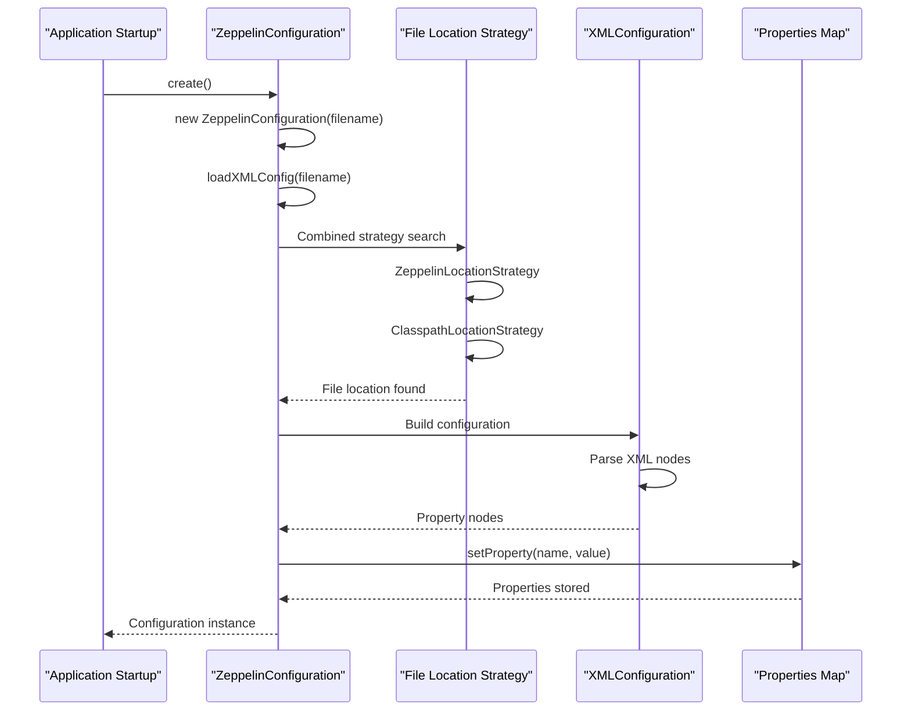

# Configuration Management

<details>
<summary>Relevant source files</summary>

The following files were used as context for generating this wiki page:

- [conf/zeppelin-site.xml.template](conf/zeppelin-site.xml.template)
- [docs/setup/operation/configuration.md](docs/setup/operation/configuration.md)
- [zeppelin-interpreter/src/main/java/org/apache/zeppelin/conf/ZeppelinConfiguration.java](zeppelin-interpreter/src/main/java/org/apache/zeppelin/conf/ZeppelinConfiguration.java)
- [zeppelin-interpreter/src/main/java/org/apache/zeppelin/interpreter/launcher/InterpreterLauncher.java](zeppelin-interpreter/src/main/java/org/apache/zeppelin/interpreter/launcher/InterpreterLauncher.java)
- [zeppelin-interpreter/src/main/java/org/apache/zeppelin/interpreter/lifecycle/TimeoutLifecycleManager.java](zeppelin-interpreter/src/main/java/org/apache/zeppelin/interpreter/lifecycle/TimeoutLifecycleManager.java)
- [zeppelin-interpreter/src/test/java/org/apache/zeppelin/conf/ZeppelinConfigurationTest.java](zeppelin-interpreter/src/test/java/org/apache/zeppelin/conf/ZeppelinConfigurationTest.java)
- [zeppelin-server/src/main/java/org/apache/zeppelin/server/ZeppelinServer.java](zeppelin-server/src/main/java/org/apache/zeppelin/server/ZeppelinServer.java)
- [zeppelin-zengine/src/main/java/org/apache/zeppelin/interpreter/recovery/RecoveryUtils.java](zeppelin-zengine/src/main/java/org/apache/zeppelin/interpreter/recovery/RecoveryUtils.java)
- [zeppelin-zengine/src/main/java/org/apache/zeppelin/interpreter/remote/RemoteInterpreter.java](zeppelin-zengine/src/main/java/org/apache/zeppelin/interpreter/remote/RemoteInterpreter.java)
- [zeppelin-zengine/src/test/java/org/apache/zeppelin/conf/ZeppelinConfigurationTest.java](zeppelin-zengine/src/test/java/org/apache/zeppelin/conf/ZeppelinConfigurationTest.java)
- [zeppelin-zengine/src/test/java/org/apache/zeppelin/interpreter/launcher/StandardInterpreterLauncherTest.java](zeppelin-zengine/src/test/java/org/apache/zeppelin/interpreter/launcher/StandardInterpreterLauncherTest.java)
- [zeppelin-zengine/src/test/java/org/apache/zeppelin/interpreter/lifecycle/TimeoutLifecycleManagerTest.java](zeppelin-zengine/src/test/java/org/apache/zeppelin/interpreter/lifecycle/TimeoutLifecycleManagerTest.java)
- [zeppelin-zengine/src/test/java/org/apache/zeppelin/interpreter/remote/RemoteInterpreterTest.java](zeppelin-zengine/src/test/java/org/apache/zeppelin/interpreter/remote/RemoteInterpreterTest.java)

</details>


## Purpose and Scope

This document covers the server-side configuration management system in Apache Zeppelin, focusing on how configuration properties are loaded, processed, and used throughout the server components. It explains the architecture of the `ZeppelinConfiguration` class, configuration source precedence, and the integration with various server subsystems.

For information about interpreter framework configuration, see [Interpreter Framework](#2.3). For details about process lifecycle management, see [Process Lifecycle Management](#4.3).

## Configuration Architecture Overview

Zeppelin's configuration system is built around a centralized `ZeppelinConfiguration` class that manages all server and interpreter settings. The system supports multiple configuration sources with a clear precedence hierarchy and provides type-safe access to configuration values.

```mermaid
graph TB
    subgraph "Configuration Sources"
        EnvVars[Environment Variables<br/>"ZEPPELIN_*"]
        SysProps[System Properties<br/>"-Dzeppelin.*"]
        XmlFile[XML Configuration<br/>"zeppelin-site.xml"]
    end
    
    subgraph "ZeppelinConfiguration Class"
        ConfVars[ConfVars Enum<br/>"Configuration Definitions"]
        Properties[Properties Map<br/>"Loaded Values"]
        Getters[Type-Safe Getters<br/>"getString(), getInt(), etc."]
    end
    
    subgraph "Server Components"
        ZeppelinServer[ZeppelinServer<br/>"Main Application"]
        InterpreterMgr[InterpreterSettingManager<br/>"Interpreter Management"]
        NotebookServer[NotebookServer<br/>"WebSocket/REST APIs"]
        JettyServer[Jetty Configuration<br/>"Web Server Setup"]
    end
    
    EnvVars --> Properties
    SysProps --> Properties
    XmlFile --> Properties
    ConfVars --> Getters
    Properties --> Getters
    
    Getters --> ZeppelinServer
    Getters --> InterpreterMgr
    Getters --> NotebookServer
    Getters --> JettyServer
```

Sources: [zeppelin-interpreter/src/main/java/org/apache/zeppelin/conf/ZeppelinConfiguration.java:62-118](), [conf/zeppelin-site.xml.template:20-830]()

## Configuration Source Precedence

The configuration system follows a strict precedence hierarchy where higher-priority sources override lower-priority ones. This allows for flexible deployment scenarios while maintaining predictable behavior.

```mermaid
graph TD
    EnvConfig[EnvironmentConfiguration<br/>"Highest Priority"]
    SysConfig[SystemConfiguration<br/>"Medium Priority"] 
    XmlConfig[XMLConfiguration<br/>"Lowest Priority"]
    
    EnvConfig --> |"envConfig.containsKey()"| Getter[Configuration Getter Methods]
    SysConfig --> |"sysConfig.containsKey()"| Getter
    XmlConfig --> |"getStringValue()"| Getter
    
    Getter --> Result[Final Configuration Value]
    
    style EnvConfig fill:#f9f9f9
    style SysConfig fill:#f9f9f9
    style XmlConfig fill:#f9f9f9
```

The precedence implementation is handled in methods like `getString()`, `getInt()`, and `getBoolean()`:

Sources: [zeppelin-interpreter/src/main/java/org/apache/zeppelin/conf/ZeppelinConfiguration.java:215-223](), [zeppelin-interpreter/src/main/java/org/apache/zeppelin/conf/ZeppelinConfiguration.java:229-237]()

## ZeppelinConfiguration Class Architecture

The `ZeppelinConfiguration` class serves as the central configuration management component, implementing a singleton pattern with lazy initialization and comprehensive type conversion capabilities.

| Component | Purpose | Key Methods |
|-----------|---------|-------------|
| `ConfVars` enum | Configuration variable definitions | `getVarName()`, `getStringValue()`, `getIntValue()` |
| Properties map | Runtime configuration storage | `setProperty()`, `getStringValue()` |
| Type-safe getters | Type conversion and validation | `getString()`, `getInt()`, `getBoolean()`, `getTime()` |
| File location strategies | Configuration file discovery | `ZeppelinLocationStrategy`, `ClasspathLocationStrategy` |

```mermaid
graph TB
    subgraph "ZeppelinConfiguration Singleton"
        ConfVarsEnum[ConfVars Enum<br/>"ZEPPELIN_PORT, ZEPPELIN_SSL, etc."]
        PropertiesMap[properties Map&lt;String,String&gt;<br/>"Runtime configuration storage"]
        LoadXMLConfig[loadXMLConfig Method<br/>"Parse zeppelin-site.xml"]
        TypeGetters[Type-Safe Getters<br/>"getString(), getInt(), getBoolean()"]
    end
    
    subgraph "Configuration Loading"
        ZeppelinLocationStrategy[ZeppelinLocationStrategy<br/>"Local file system search"]
        ClasspathLocationStrategy[ClasspathLocationStrategy<br/>"Classpath resource search"]
        XMLConfiguration[XMLConfiguration<br/>"Apache Commons Config"]
    end
    
    LoadXMLConfig --> ZeppelinLocationStrategy
    LoadXMLConfig --> ClasspathLocationStrategy
    ZeppelinLocationStrategy --> XMLConfiguration
    ClasspathLocationStrategy --> XMLConfiguration
    XMLConfiguration --> PropertiesMap
    
    ConfVarsEnum --> TypeGetters
    PropertiesMap --> TypeGetters
```

Sources: [zeppelin-interpreter/src/main/java/org/apache/zeppelin/conf/ZeppelinConfiguration.java:83-118](), [zeppelin-interpreter/src/main/java/org/apache/zeppelin/conf/ZeppelinConfiguration.java:129-147]()

## Configuration Categories

Zeppelin configuration properties are organized into logical categories, each serving specific aspects of the system:

### Server Configuration
- **Network Settings**: `zeppelin.server.addr`, `zeppelin.server.port`, `zeppelin.server.ssl.port`
- **Context Path**: `zeppelin.server.context.path`
- **Security Headers**: `zeppelin.server.xframe.options`, `zeppelin.server.xxss.protection`

### Notebook Storage Configuration
- **Storage Backend**: `zeppelin.notebook.storage` (GitNotebookRepo, S3NotebookRepo, etc.)
- **Storage Paths**: `zeppelin.notebook.dir`, `zeppelin.notebook.s3.bucket`
- **Synchronization**: `zeppelin.notebook.one.way.sync`

### Interpreter Configuration
- **Directory Paths**: `zeppelin.interpreter.dir`, `zeppelin.interpreter.localRepo`
- **Connection Settings**: `zeppelin.interpreter.connect.timeout`, `zeppelin.interpreter.output.limit`
- **Deployment Mode**: `zeppelin.run.mode` (auto, local, k8s, docker)

### SSL and Security Configuration
- **SSL Enable**: `zeppelin.ssl`, `zeppelin.ssl.client.auth`
- **Certificate Paths**: `zeppelin.ssl.keystore.path`, `zeppelin.ssl.truststore.path`
- **PEM Support**: `zeppelin.ssl.pem.key`, `zeppelin.ssl.pem.cert`

Sources: [conf/zeppelin-site.xml.template:22-830](), [zeppelin-interpreter/src/main/java/org/apache/zeppelin/conf/ZeppelinConfiguration.java:911-1439]()

## Configuration Loading Process

The configuration loading process involves multiple stages, from file discovery to property resolution, with robust error handling and fallback mechanisms.



The loading process handles various scenarios:
- Missing configuration files (uses defaults)
- Invalid XML syntax (logs warning, continues with defaults)
- Environment variable overrides
- System property overrides

Sources: [zeppelin-interpreter/src/main/java/org/apache/zeppelin/conf/ZeppelinConfiguration.java:92-118](), [zeppelin-interpreter/src/main/java/org/apache/zeppelin/conf/ZeppelinConfiguration.java:129-147]()

## Remote Interpreter Configuration

Remote interpreter processes require special configuration handling, including connection timeouts, port ranges, and environment variable propagation.

```mermaid
graph TB
    subgraph "ZeppelinConfiguration"
        InterpTimeout[getTime Method<br/>"ZEPPELIN_INTERPRETER_CONNECT_TIMEOUT"]
        InterpPortRange[getInterpreterPortRange<br/>"Port allocation"]
        RunMode[getRunMode<br/>"LOCAL, K8S, DOCKER"]
    end
    
    subgraph "InterpreterLauncher"
        ConnTimeout[getConnectTimeout<br/>"Timeout resolution"]
        ConnPoolSize[getConnectPoolSize<br/>"Connection pooling"]
        LaunchContext[InterpreterLaunchContext<br/>"Launch parameters"]
    end
    
    subgraph "Remote Process"
        RemoteInterpProcess[RemoteInterpreterProcess<br/>"Process management"]
        ThriftClient[Thrift RPC Client<br/>"Communication"]
        RecoveryStorage[RecoveryStorage<br/>"State persistence"]
    end
    
    InterpTimeout --> ConnTimeout
    InterpPortRange --> LaunchContext
    RunMode --> LaunchContext
    ConnTimeout --> RemoteInterpProcess
    ConnPoolSize --> ThriftClient
    LaunchContext --> RemoteInterpProcess
    RemoteInterpProcess --> RecoveryStorage
```

Key configuration properties for remote interpreters:
- `zeppelin.interpreter.connect.timeout`: Connection timeout with time unit support (e.g., "600s")
- `zeppelin.interpreter.rpc.portRange`: Port range for RPC communication
- `zeppelin.recovery.storage.class`: Recovery storage implementation
- `zeppelin.run.mode`: Deployment mode affecting interpreter launcher selection

Sources: [zeppelin-interpreter/src/main/java/org/apache/zeppelin/interpreter/launcher/InterpreterLauncher.java:56-65](), [zeppelin-zengine/src/main/java/org/apache/zeppelin/interpreter/recovery/RecoveryUtils.java:74-106]()

## Environment and Runtime Configuration

The configuration system integrates with environment variables and runtime settings to support different deployment scenarios, including development, testing, and production environments.

### Time Unit Configuration
Zeppelin supports time unit suffixes for timeout configurations:
- `ms`: milliseconds
- `s`: seconds  
- `m`: minutes
- `h`: hours

Example: `zeppelin.interpreter.connect.timeout=600s`

### Runtime Mode Detection
The `zeppelin.run.mode` property supports automatic detection:
- `auto`: Detects Kubernetes vs local environment
- `local`: Forces local interpreter processes
- `k8s`: Forces Kubernetes pod deployment
- `docker`: Forces Docker container deployment

```mermaid
graph LR
    AutoMode[run.mode = "auto"]
    K8sCheck["/var/run/secrets/kubernetes.io/<br/>serviceaccount/namespace exists?"]
    K8sMode[RUN_MODE.K8S]
    LocalMode[RUN_MODE.LOCAL]
    
    AutoMode --> K8sCheck
    K8sCheck -->|Yes| K8sMode
    K8sCheck -->|No| LocalMode
```

### Configuration Validation and Error Handling
The system includes comprehensive error handling for configuration parsing:
- Invalid numeric values fall back to defaults with warnings
- Missing configuration files proceed with built-in defaults
- Type conversion errors are logged but don't prevent startup

Sources: [zeppelin-interpreter/src/main/java/org/apache/zeppelin/conf/ZeppelinConfiguration.java:259-265](), [zeppelin-interpreter/src/main/java/org/apache/zeppelin/conf/ZeppelinConfiguration.java:840-851](), [zeppelin-interpreter/src/main/java/org/apache/zeppelin/conf/ZeppelinConfiguration.java:167-177]()
