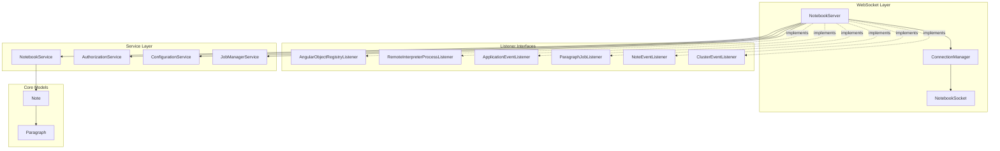
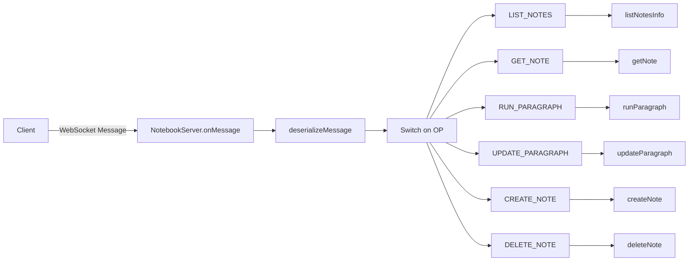
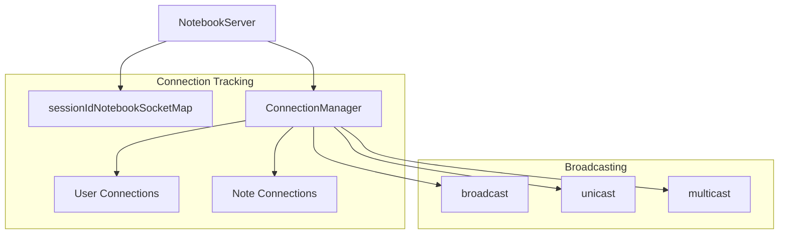
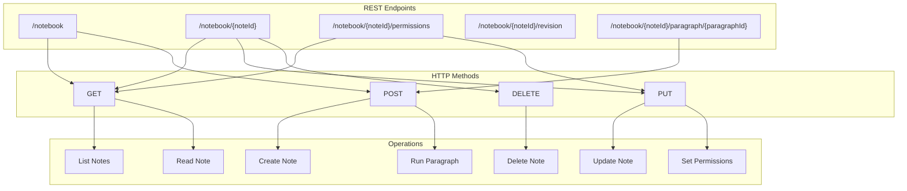
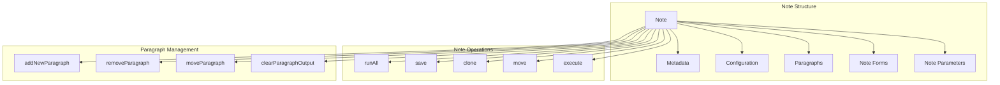
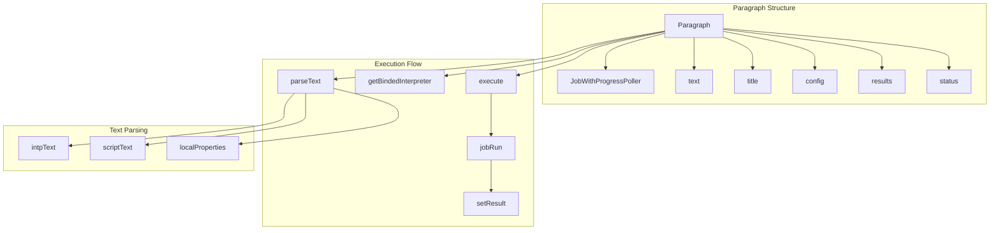
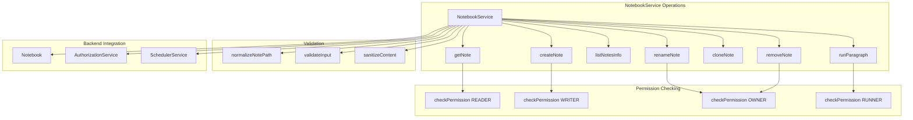
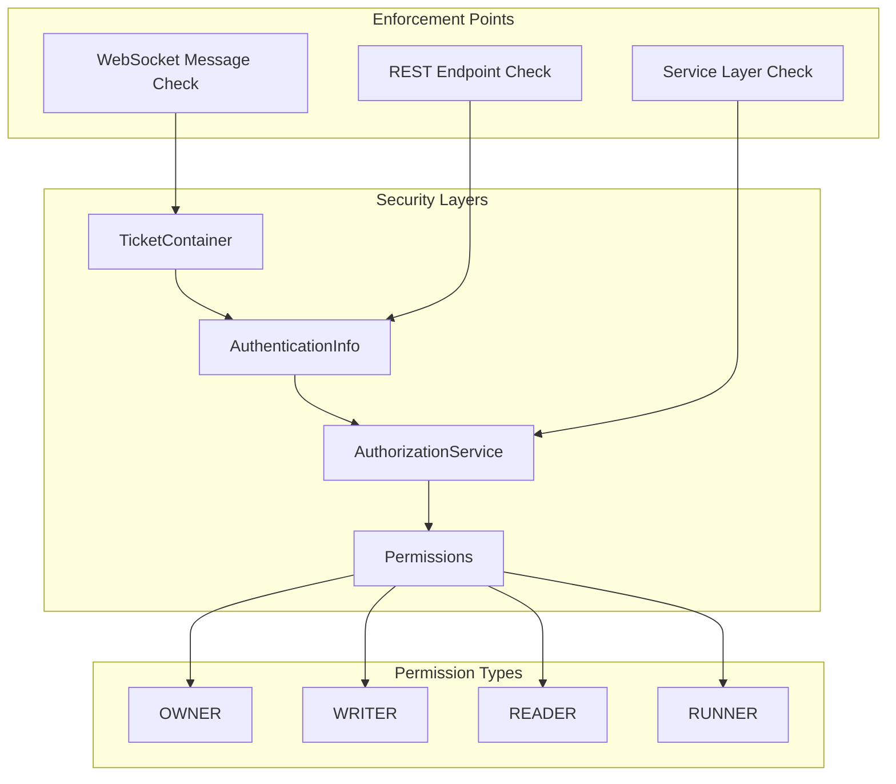

# Notebook Server and APIs

<details>
<summary>Relevant source files</summary>

The following files were used as context for generating this wiki page:

- [zeppelin-interpreter/src/main/java/org/apache/zeppelin/scheduler/Job.java](zeppelin-interpreter/src/main/java/org/apache/zeppelin/scheduler/Job.java)
- [zeppelin-interpreter/src/main/java/org/apache/zeppelin/scheduler/JobWithProgressPoller.java](zeppelin-interpreter/src/main/java/org/apache/zeppelin/scheduler/JobWithProgressPoller.java)
- [zeppelin-interpreter/src/test/java/org/apache/zeppelin/scheduler/JobTest.java](zeppelin-interpreter/src/test/java/org/apache/zeppelin/scheduler/JobTest.java)
- [zeppelin-server/src/main/java/org/apache/zeppelin/rest/NotebookRestApi.java](zeppelin-server/src/main/java/org/apache/zeppelin/rest/NotebookRestApi.java)
- [zeppelin-server/src/main/java/org/apache/zeppelin/service/NotebookService.java](zeppelin-server/src/main/java/org/apache/zeppelin/service/NotebookService.java)
- [zeppelin-server/src/main/java/org/apache/zeppelin/socket/NotebookServer.java](zeppelin-server/src/main/java/org/apache/zeppelin/socket/NotebookServer.java)
- [zeppelin-server/src/test/java/org/apache/zeppelin/rest/AbstractTestRestApi.java](zeppelin-server/src/test/java/org/apache/zeppelin/rest/AbstractTestRestApi.java)
- [zeppelin-server/src/test/java/org/apache/zeppelin/rest/NotebookRestApiTest.java](zeppelin-server/src/test/java/org/apache/zeppelin/rest/NotebookRestApiTest.java)
- [zeppelin-server/src/test/java/org/apache/zeppelin/rest/ZeppelinRestApiTest.java](zeppelin-server/src/test/java/org/apache/zeppelin/rest/ZeppelinRestApiTest.java)
- [zeppelin-server/src/test/java/org/apache/zeppelin/service/NotebookServiceTest.java](zeppelin-server/src/test/java/org/apache/zeppelin/service/NotebookServiceTest.java)
- [zeppelin-server/src/test/java/org/apache/zeppelin/socket/NotebookServerTest.java](zeppelin-server/src/test/java/org/apache/zeppelin/socket/NotebookServerTest.java)
- [zeppelin-zengine/src/main/java/org/apache/zeppelin/notebook/Note.java](zeppelin-zengine/src/main/java/org/apache/zeppelin/notebook/Note.java)
- [zeppelin-zengine/src/main/java/org/apache/zeppelin/notebook/Notebook.java](zeppelin-zengine/src/main/java/org/apache/zeppelin/notebook/Notebook.java)
- [zeppelin-zengine/src/main/java/org/apache/zeppelin/notebook/Paragraph.java](zeppelin-zengine/src/main/java/org/apache/zeppelin/notebook/Paragraph.java)
- [zeppelin-zengine/src/test/java/org/apache/zeppelin/helium/HeliumApplicationFactoryTest.java](zeppelin-zengine/src/test/java/org/apache/zeppelin/helium/HeliumApplicationFactoryTest.java)
- [zeppelin-zengine/src/test/java/org/apache/zeppelin/notebook/NoteTest.java](zeppelin-zengine/src/test/java/org/apache/zeppelin/notebook/NoteTest.java)
- [zeppelin-zengine/src/test/java/org/apache/zeppelin/notebook/NotebookTest.java](zeppelin-zengine/src/test/java/org/apache/zeppelin/notebook/NotebookTest.java)
- [zeppelin-zengine/src/test/java/org/apache/zeppelin/notebook/ParagraphTest.java](zeppelin-zengine/src/test/java/org/apache/zeppelin/notebook/ParagraphTest.java)

</details>


This document covers Zeppelin's notebook server implementation and API layer, which provides both WebSocket and REST interfaces for notebook operations. The notebook server handles real-time communication between the frontend and backend, managing notebook execution, collaborative editing, and state synchronization. For information about the underlying notebook storage and persistence mechanisms, see [Storage and Persistence](#2.4). For details about interpreter execution and management, see [Interpreter Framework](#2.3).

## Overview

The notebook server consists of two primary communication interfaces:

- **WebSocket Server** (`NotebookServer`) - Real-time bidirectional communication for interactive operations like paragraph execution, collaborative editing, and live updates
- **REST API** (`NotebookRestApi`) - HTTP endpoints for CRUD operations on notebooks, permissions management, and file operations

Both interfaces operate on the same underlying data models (`Note`, `Paragraph`) and utilize shared services (`NotebookService`, `AuthorizationService`) for business logic and security.

## WebSocket Server Architecture

The `NotebookServer` class serves as the primary WebSocket endpoint, implementing multiple listener interfaces to handle different types of events and providing real-time communication capabilities.



Sources: [zeppelin-server/src/main/java/org/apache/zeppelin/socket/NotebookServer.java:118-123](), [zeppelin-server/src/main/java/org/apache/zeppelin/socket/NotebookServer.java:156-164]()

### Message Handling

The WebSocket server processes messages through a centralized `onMessage` method that deserializes incoming messages and routes them to appropriate handlers based on the operation type.



Sources: [zeppelin-server/src/main/java/org/apache/zeppelin/socket/NotebookServer.java:280-500]()

Key message operations include:

| Operation | Handler Method | Description |
|-----------|---------------|-------------|
| `LIST_NOTES` | `listNotesInfo` | Retrieve available notebooks |
| `GET_NOTE` | `getNote` | Load specific notebook content |
| `RUN_PARAGRAPH` | `runParagraph` | Execute paragraph code |
| `COMMIT_PARAGRAPH` | `updateParagraph` | Save paragraph changes |
| `NEW_NOTE` | `createNote` | Create new notebook |
| `DEL_NOTE` | `deleteNote` | Remove notebook |
| `ANGULAR_OBJECT_UPDATED` | `angularObjectUpdated` | Sync UI state |

Sources: [zeppelin-server/src/main/java/org/apache/zeppelin/socket/NotebookServer.java:330-491]()

### Connection Management

The `ConnectionManager` handles WebSocket connections, user sessions, and broadcasting capabilities. Connections are tracked both globally and per-notebook for efficient message distribution.



Sources: [zeppelin-server/src/main/java/org/apache/zeppelin/socket/NotebookServer.java:157](), [zeppelin-server/src/main/java/org/apache/zeppelin/socket/NotebookServer.java:202-208]()

## REST API Structure

The `NotebookRestApi` provides HTTP endpoints for notebook management operations, implementing standard REST patterns with proper authentication and authorization.



Sources: [zeppelin-server/src/main/java/org/apache/zeppelin/rest/NotebookRestApi.java:75-78](), [zeppelin-server/src/main/java/org/apache/zeppelin/rest/NotebookRestApi.java:311-317]()

### Key REST Endpoints

| Endpoint | Method | Description |
|----------|--------|-------------|
| `/notebook` | GET | List all accessible notebooks |
| `/notebook` | POST | Create new notebook |
| `/notebook/{noteId}` | GET | Retrieve notebook content |
| `/notebook/{noteId}` | PUT | Update notebook metadata |
| `/notebook/{noteId}` | DELETE | Delete notebook |
| `/notebook/{noteId}/permissions` | GET/PUT | Manage permissions |
| `/notebook/{noteId}/paragraph/{paragraphId}` | POST | Execute paragraph |
| `/notebook/{noteId}/revision` | GET/POST | Version control operations |

Sources: [zeppelin-server/src/main/java/org/apache/zeppelin/rest/NotebookRestApi.java:118-131](), [zeppelin-server/src/main/java/org/apache/zeppelin/rest/NotebookRestApi.java:327-334]()

## Core Data Models

### Note Model

The `Note` class represents a complete notebook document containing metadata, configuration, and a collection of paragraphs.



Sources: [zeppelin-zengine/src/main/java/org/apache/zeppelin/notebook/Note.java:125-150](), [zeppelin-zengine/src/main/java/org/apache/zeppelin/notebook/Note.java:452-533]()

Key Note properties:
- `id`: Unique identifier generated by `IdHashes.generateId()`
- `name`: Display name derived from path
- `path`: Hierarchical location in notebook tree
- `paragraphs`: List of executable code cells
- `defaultInterpreterGroup`: Default interpreter for new paragraphs
- `config`: Notebook-level configuration including cron settings
- `noteParams`/`noteForms`: Shared parameters and form inputs

Sources: [zeppelin-zengine/src/main/java/org/apache/zeppelin/notebook/Note.java:125-150]()

### Paragraph Model

The `Paragraph` class represents individual executable code cells within notebooks, extending `JobWithProgressPoller` to support asynchronous execution with progress tracking.



Sources: [zeppelin-zengine/src/main/java/org/apache/zeppelin/notebook/Paragraph.java:69-101](), [zeppelin-zengine/src/main/java/org/apache/zeppelin/notebook/Paragraph.java:180-195](), [zeppelin-zengine/src/main/java/org/apache/zeppelin/notebook/Paragraph.java:332-392]()

Key Paragraph features:
- **Text Parsing**: Separates interpreter directive (`%interpreter`) from script content
- **Async Execution**: Implements job scheduling with status tracking and progress updates
- **Results Management**: Stores `InterpreterResult` with typed output messages
- **Personalized Mode**: Supports per-user paragraph instances for collaborative editing
- **Form Integration**: Handles dynamic form inputs and parameter substitution

Sources: [zeppelin-zengine/src/main/java/org/apache/zeppelin/notebook/Paragraph.java:186-195](), [zeppelin-zengine/src/main/java/org/apache/zeppelin/notebook/Paragraph.java:332-392]()

## Service Layer Architecture

### NotebookService

The `NotebookService` provides high-level business logic for notebook operations, abstracting the complexity of permission checking, validation, and coordination between different components.



Sources: [zeppelin-server/src/main/java/org/apache/zeppelin/service/NotebookService.java:80-101](), [zeppelin-server/src/main/java/org/apache/zeppelin/service/NotebookService.java:191-221]()

The service layer implements the callback pattern for asynchronous operations, calling `ServiceCallback.onSuccess()` or `ServiceCallback.onFailure()` based on operation results.

Sources: [zeppelin-server/src/main/java/org/apache/zeppelin/service/NotebookService.java:75-77]()

## Message Flow and Broadcasting

The notebook server implements sophisticated message broadcasting to keep all connected clients synchronized with notebook state changes.

```mermaid
sequenceDiagram
    participant C1 as "Client 1"
    participant C2 as "Client 2" 
    participant NS as "NotebookServer"
    participant NBS as "NotebookService"
    participant NOTE as "Note"
    participant PARA as "Paragraph"
    
    C1->>NS: "RUN_PARAGRAPH message"
    NS->>NBS: "runParagraph()"
    NBS->>NOTE: "run(paragraphId)"
    NOTE->>PARA: "execute()"
    PARA->>PARA: "jobRun()"
    PARA->>NOTE: "result ready"
    NOTE->>NS: "onParagraphFinish()"
    NS->>NS: "broadcastParagraph()"
    NS->>C1: "PARAGRAPH update"
    NS->>C2: "PARAGRAPH update"
```

Sources: [zeppelin-server/src/main/java/org/apache/zeppelin/socket/NotebookServer.java:385-387](), [zeppelin-server/src/main/java/org/apache/zeppelin/socket/NotebookServer.java:669-672]()

### Broadcasting Patterns

The system supports multiple broadcasting patterns:

| Method | Scope | Description |
|--------|-------|-------------|
| `broadcast()` | All connections | Send to all connected clients |
| `unicast()` | Single connection | Send to specific client |
| `multicastToUser()` | User connections | Send to all sessions for a user |
| `broadcastNote()` | Note subscribers | Send to clients viewing a note |

Sources: [zeppelin-server/src/main/java/org/apache/zeppelin/socket/NotebookServer.java:544-546](), [zeppelin-server/src/main/java/org/apache/zeppelin/socket/NotebookServer.java:648-656]()

## Authentication and Authorization Integration

Both WebSocket and REST interfaces integrate with Zeppelin's authentication and authorization system to enforce permissions at multiple levels.



Sources: [zeppelin-server/src/main/java/org/apache/zeppelin/socket/NotebookServer.java:294-308](), [zeppelin-server/src/main/java/org/apache/zeppelin/rest/NotebookRestApi.java:154-196]()

The authentication flow validates tickets for WebSocket connections and uses standard HTTP authentication for REST calls, while authorization checks are performed at the service layer using `AuthorizationService.checkPermission()`.

Sources: [zeppelin-server/src/main/java/org/apache/zeppelin/socket/NotebookServer.java:294-308](), [zeppelin-server/src/main/java/org/apache/zeppelin/service/NotebookService.java:110-120]()
