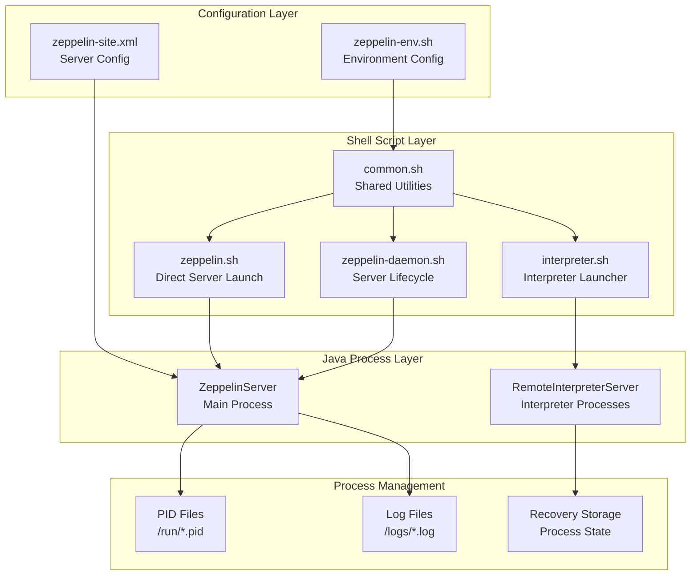
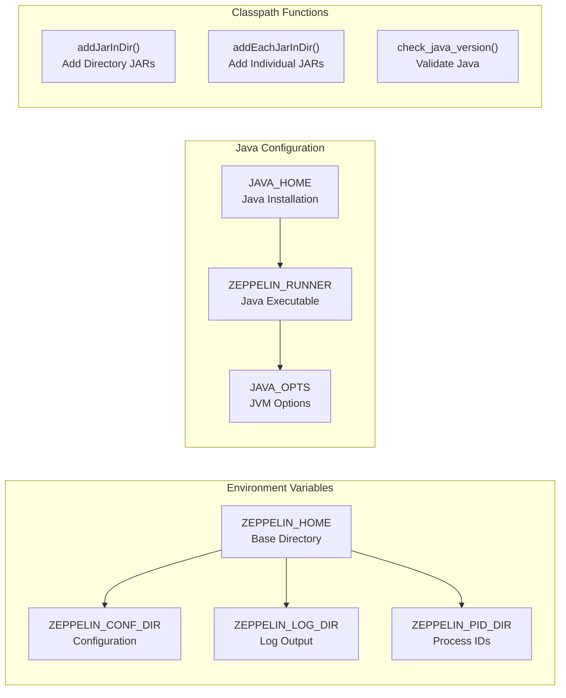
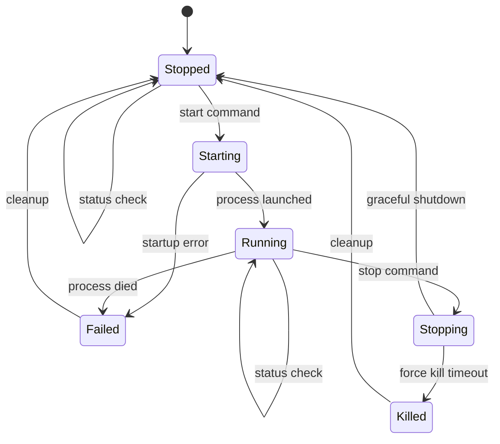
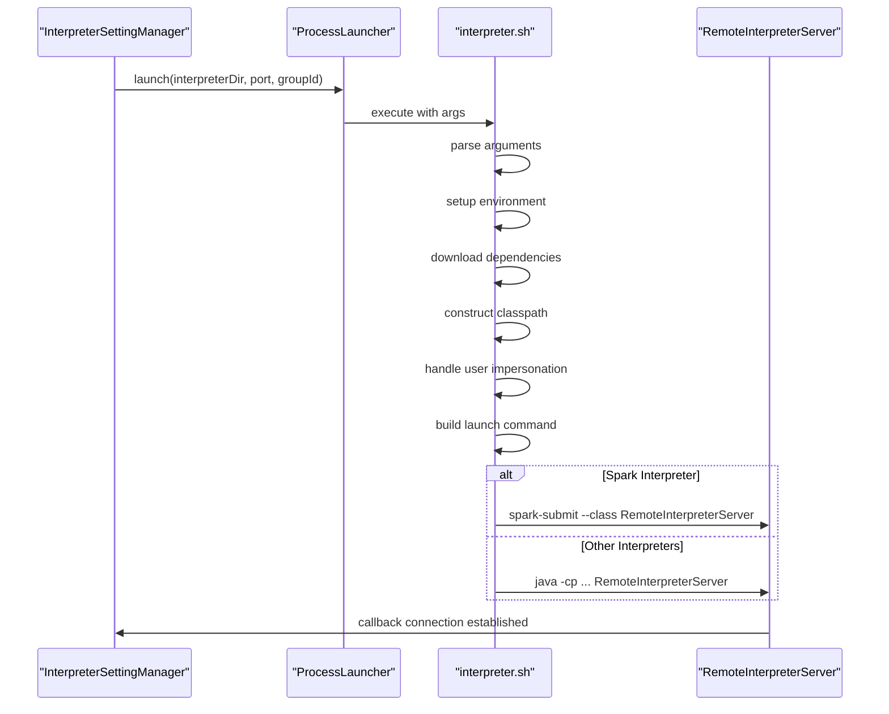
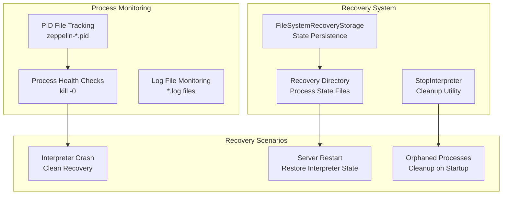

# Process Lifecycle Management

Relevant source files

The following files were used as context for generating this wiki page:

- [bin/common.cmd](bin/common.cmd)
- [bin/common.sh](bin/common.sh)
- [bin/functions.sh](bin/functions.sh)
- [bin/interpreter.sh](bin/interpreter.sh)
- [bin/zeppelin-daemon.sh](bin/zeppelin-daemon.sh)
- [bin/zeppelin.sh](bin/zeppelin.sh)
- [conf/zeppelin-env.cmd.template](conf/zeppelin-env.cmd.template)
- [conf/zeppelin-env.sh.template](conf/zeppelin-env.sh.template)
- [zeppelin-server/src/main/java/org/apache/zeppelin/server/ImmediateErrorHandlerImpl.java](zeppelin-server/src/main/java/org/apache/zeppelin/server/ImmediateErrorHandlerImpl.java)
- [zeppelin-server/src/main/java/org/apache/zeppelin/socket/SessionConfigurator.java](zeppelin-server/src/main/java/org/apache/zeppelin/socket/SessionConfigurator.java)
- [zeppelin-server/src/main/java/org/apache/zeppelin/utils/TestUtils.java](zeppelin-server/src/main/java/org/apache/zeppelin/utils/TestUtils.java)
- [zeppelin-server/src/test/java/org/apache/zeppelin/recovery/RecoveryTest.java](zeppelin-server/src/test/java/org/apache/zeppelin/recovery/RecoveryTest.java)

This document describes the shell scripts, daemon management, and interpreter process lifecycle in Apache Zeppelin. It covers how Zeppelin manages the lifecycle of both the main server process and remote interpreter processes through a collection of shell scripts and Java components.

For information about the interpreter framework architecture, see [Interpreter Framework](#2.3). For details about remote interpreter infrastructure, see [Remote Interpreter Infrastructure](#5.1).

## Overview

Zeppelin's process lifecycle management consists of three main components:

1. **Server Process Management** - Managing the main Zeppelin server daemon
2. **Interpreter Process Management** - Launching and managing remote interpreter processes
3. **Environment Configuration** - Setting up runtime environments for all processes

The system uses a combination of shell scripts, Java classes, and configuration files to orchestrate process creation, monitoring, and termination across different deployment scenarios.

Sources: [bin/zeppelin-daemon.sh:1-281](), [bin/zeppelin.sh:1-143](), [bin/interpreter.sh:1-300](), [bin/common.sh:1-177]()

## Shell Script Infrastructure

### Common Utilities (`common.sh`)

The `common.sh` script provides shared functionality used by all other scripts. It establishes the foundational environment for Zeppelin processes.

**Key Functions:**
- **Environment Setup**: Defines `ZEPPELIN_HOME`, `ZEPPELIN_CONF_DIR`, `ZEPPELIN_LOG_DIR`, and `ZEPPELIN_PID_DIR`
- **Java Configuration**: Sets up `JAVA_OPTS` and `ZEPPELIN_RUNNER` based on available Java installation
- **Classpath Management**: Provides functions like `addJarInDir()` and `addEachJarInDir()` for building classpaths
- **Version Checking**: Implements `check_java_version()` to ensure Java 8+ compatibility

Sources: [bin/common.sh:25-42](), [bin/common.sh:68-83](), [bin/common.sh:85-119]()

### Environment Configuration

The environment is configured through `zeppelin-env.sh` (created from the template) and various environment variables.

**Key Configuration Areas:**
- **Memory Settings**: `ZEPPELIN_MEM`, `ZEPPELIN_INTP_MEM` for server and interpreter memory
- **Java Options**: `ZEPPELIN_JAVA_OPTS`, `ZEPPELIN_INTP_JAVA_OPTS` for JVM tuning
- **Hadoop Integration**: `HADOOP_CONF_DIR`, `USE_HADOOP` for Hadoop ecosystem support
- **Spark Configuration**: `SPARK_HOME`, `SPARK_SUBMIT_OPTIONS` for Spark integration

Sources: [conf/zeppelin-env.sh.template:19-113](), [bin/common.sh:140-164]()

## Server Daemon Management

### Daemon Operations (`zeppelin-daemon.sh`)

The `zeppelin-daemon.sh` script manages the Zeppelin server as a system daemon with support for standard lifecycle operations.

**Supported Operations:**
- `start` - Launch server daemon with PID tracking
- `stop` - Gracefully shutdown server with timeout
- `restart` - Stop and start sequence
- `status` - Check if server process is running
- `upstart` - Run as managed service (no daemon fork)

**Process Management Functions:**
- `start()` - Creates PID file, launches server with nohup, monitors startup
- `stop()` - Reads PID, sends TERM signal, waits for graceful shutdown, force kills if needed
- `wait_for_zeppelin_to_die()` - Implements timeout-based process termination
- `check_if_process_is_alive()` - Validates process health using PID

Sources: [bin/zeppelin-daemon.sh:188-216](), [bin/zeppelin-daemon.sh:218-234](), [bin/zeppelin-daemon.sh:117-142](), [bin/zeppelin-daemon.sh:166-174]()

### Direct Server Launch (`zeppelin.sh`)

The `zeppelin.sh` script provides direct server execution without daemon functionality, useful for development and containerized environments.

**Key Features:**
- Supports `--config` for custom configuration directory
- Supports `--run <noteId>` for automated notebook execution
- Uses `exec` for direct process replacement (no PID management)
- Shares classpath construction logic with daemon script

Sources: [bin/zeppelin.sh:45-87](), [bin/zeppelin.sh:94-142]()

## Interpreter Process Lifecycle

### Interpreter Launcher (`interpreter.sh`)

The `interpreter.sh` script is responsible for launching remote interpreter processes with complex environment setup and configuration management.

**Command Line Arguments:**
- `-p <port>` - Callback port for server communication
- `-r <intp_port>` - Interpreter process port
- `-d <interpreter_dir>` - Interpreter directory to load
- `-l <local_repo>` - Local interpreter repository
- `-g <interpreter_group>` - Interpreter group name
- `-u <user>` - User impersonation
- `-c <callback_host>` - Callback host for server

**Environment Setup Process:**
1. **Container Detection**: Checks if running in container and sets up user entry
2. **Argument Parsing**: Processes command line options using `getopts`
3. **Java Validation**: Calls `check_java_version()` from `common.sh`
4. **Classpath Construction**: Builds interpreter-specific classpath
5. **Dependency Download**: Downloads interpreter libraries if needed
6. **Interpreter-Specific Setup**: Configures environment for Spark, Flink, HBase, etc.
7. **User Impersonation**: Sets up sudo commands if impersonation is enabled
8. **Launch Command Construction**: Builds final execution command
9. **Process Execution**: Uses `exec` to replace shell with interpreter process

Sources: [bin/interpreter.sh:36-57](), [bin/interpreter.sh:59-94](), [bin/interpreter.sh:97-135](), [bin/interpreter.sh:278-299]()

### Interpreter-Specific Configuration

Different interpreter types require specialized environment setup:

**Spark Interpreter:**
- Sets up `SPARK_HOME` and `SPARK_SUBMIT` variables
- Configures `PYTHONPATH` for PySpark support
- Handles Kerberos authentication with `kinit`
- Manages Hadoop configuration directory
- Uses `spark-submit` for launching instead of direct Java execution

**Flink Interpreter:**
- Adds Flink JAR files to classpath recursively
- Handles Flink Python JAR inclusion
- Supports application mode execution with `flink run-application`
- Manages Hadoop classpath integration

**HBase Interpreter:**
- Configures `HBASE_CONF_DIR` or `HBASE_HOME`
- Adds HBase configuration to classpath

Sources: [bin/interpreter.sh:165-184](), [bin/interpreter.sh:230-261](), [bin/interpreter.sh:200-207]()

## Process Recovery and Monitoring

### Recovery Storage

Zeppelin implements process recovery through the recovery storage system to handle server restarts and interpreter process failures.

**Recovery Components:**
- `FileSystemRecoveryStorage` - Stores interpreter state to filesystem
- Recovery directory (`ZEPPELIN_RECOVERY_DIR`) - Contains process state files
- `StopInterpreter` utility - Cleanly terminates orphaned interpreter processes

**Recovery Process:**
1. **State Persistence**: Interpreter groups save state to recovery storage
2. **Server Startup**: Recovery system checks for existing interpreter processes
3. **Process Validation**: Attempts to reconnect to running interpreters
4. **Cleanup**: Terminates orphaned or invalid processes
5. **State Restoration**: Restores interpreter group state where possible

Sources: [zeppelin-server/src/test/java/org/apache/zeppelin/recovery/RecoveryTest.java:61-79](), [zeppelin-server/src/test/java/org/apache/zeppelin/recovery/RecoveryTest.java:240-242]()

### PID and Log Management

Process lifecycle management relies on PID files and log files for monitoring and control.

**PID File Structure:**
- Server PID: `${ZEPPELIN_PID_DIR}/zeppelin-${ZEPPELIN_IDENT_STRING}-${HOSTNAME}.pid`
- Interpreter PID: `${ZEPPELIN_PID_DIR}/zeppelin-interpreter-${INTP_GROUP_ID}-${ZEPPELIN_IDENT_STRING}-${HOSTNAME}-${PORT}.pid`

**Log File Structure:**
- Server Log: `${ZEPPELIN_LOG_DIR}/zeppelin-${ZEPPELIN_IDENT_STRING}-${HOSTNAME}.log`
- Interpreter Log: `${ZEPPELIN_LOG_DIR}/zeppelin-interpreter-${INTERPRETER_GROUP_ID}-${USER}-${HOSTNAME}.log`

Sources: [bin/zeppelin-daemon.sh:53](), [bin/interpreter.sh:132](), [bin/zeppelin-daemon.sh:51](), [bin/interpreter.sh:142-156]()

## Advanced Process Management

### User Impersonation

Zeppelin supports running interpreter processes as different users through the impersonation system.

**Configuration:**
- `ZEPPELIN_IMPERSONATE_USER` - Target user for impersonation
- `ZEPPELIN_IMPERSONATE_CMD` - Custom impersonation command
- `ZEPPELIN_IMPERSONATE_SPARK_PROXY_USER` - Spark-specific proxy user settings

**Implementation:**
- Uses SSH or custom commands to switch user context
- Maintains environment variable inheritance
- Supports both individual interpreter and Spark-specific impersonation modes

Sources: [bin/interpreter.sh:144-150](), [bin/interpreter.sh:266-276](), [conf/zeppelin-env.sh.template:110-113]()

### Container Support

The scripts include special handling for containerized environments:

**Container Detection:**
- Checks `/proc/self/cgroup` for container indicators
- Uses `getent` to validate user entries
- Automatically creates user entries in `/etc/passwd` if missing

**Container-Specific Adaptations:**
- Handles anonymous UID scenarios
- Manages container-specific logging configurations
- Adapts PID management for container lifecycle

Sources: [bin/interpreter.sh:36-57](), [bin/zeppelin.sh:22-43]()
