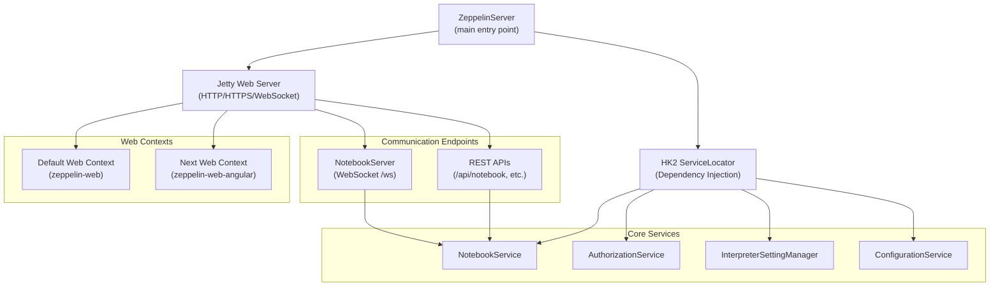
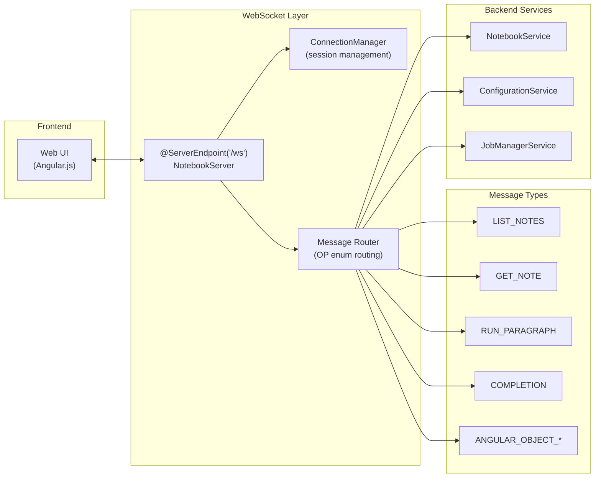
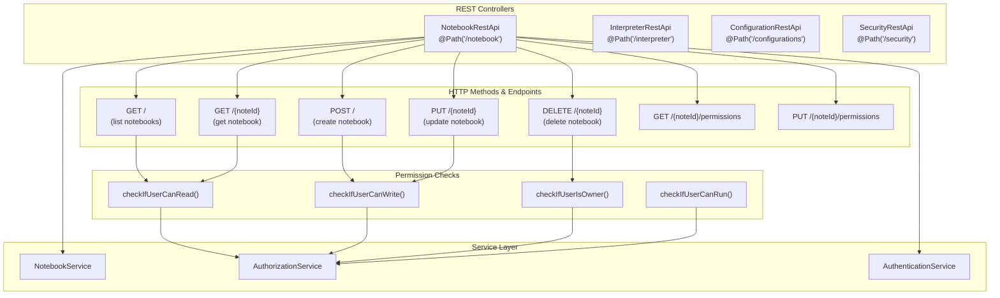
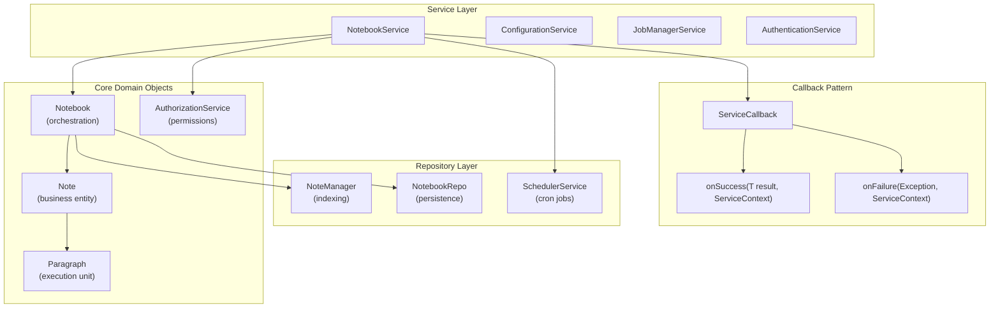
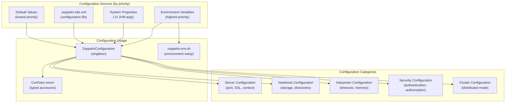
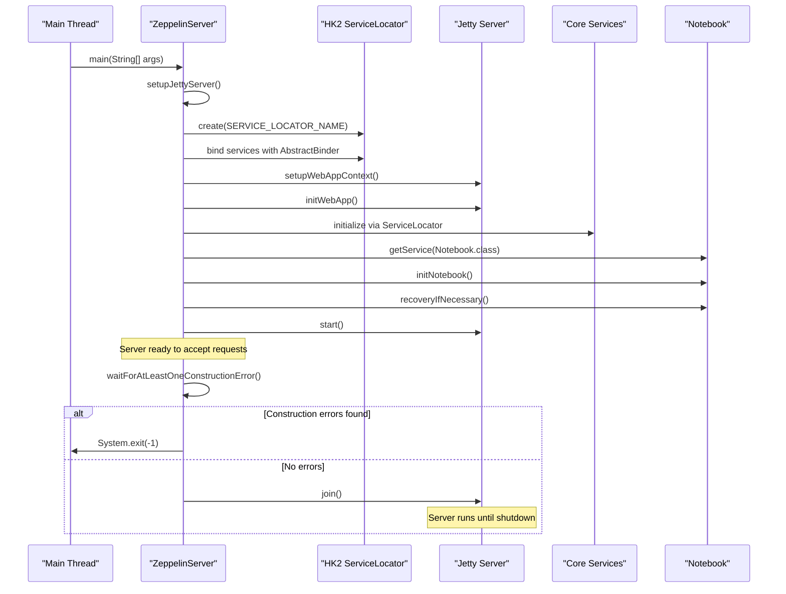

# Server Components

Relevant source files

The following files were used as context for generating this wiki page:

- [bin/common.cmd](bin/common.cmd)
- [bin/common.sh](bin/common.sh)
- [bin/functions.sh](bin/functions.sh)
- [bin/interpreter.sh](bin/interpreter.sh)
- [bin/zeppelin-daemon.sh](bin/zeppelin-daemon.sh)
- [bin/zeppelin.sh](bin/zeppelin.sh)
- [conf/zeppelin-env.cmd.template](conf/zeppelin-env.cmd.template)
- [conf/zeppelin-env.sh.template](conf/zeppelin-env.sh.template)
- [conf/zeppelin-site.xml.template](conf/zeppelin-site.xml.template)
- [docs/setup/operation/configuration.md](docs/setup/operation/configuration.md)
- [zeppelin-interpreter/src/main/java/org/apache/zeppelin/conf/ZeppelinConfiguration.java](zeppelin-interpreter/src/main/java/org/apache/zeppelin/conf/ZeppelinConfiguration.java)
- [zeppelin-interpreter/src/main/java/org/apache/zeppelin/interpreter/launcher/InterpreterLauncher.java](zeppelin-interpreter/src/main/java/org/apache/zeppelin/interpreter/launcher/InterpreterLauncher.java)
- [zeppelin-interpreter/src/main/java/org/apache/zeppelin/interpreter/lifecycle/TimeoutLifecycleManager.java](zeppelin-interpreter/src/main/java/org/apache/zeppelin/interpreter/lifecycle/TimeoutLifecycleManager.java)
- [zeppelin-interpreter/src/main/java/org/apache/zeppelin/scheduler/Job.java](zeppelin-interpreter/src/main/java/org/apache/zeppelin/scheduler/Job.java)
- [zeppelin-interpreter/src/main/java/org/apache/zeppelin/scheduler/JobWithProgressPoller.java](zeppelin-interpreter/src/main/java/org/apache/zeppelin/scheduler/JobWithProgressPoller.java)
- [zeppelin-interpreter/src/test/java/org/apache/zeppelin/conf/ZeppelinConfigurationTest.java](zeppelin-interpreter/src/test/java/org/apache/zeppelin/conf/ZeppelinConfigurationTest.java)
- [zeppelin-interpreter/src/test/java/org/apache/zeppelin/scheduler/JobTest.java](zeppelin-interpreter/src/test/java/org/apache/zeppelin/scheduler/JobTest.java)
- [zeppelin-server/src/main/java/org/apache/zeppelin/rest/NotebookRestApi.java](zeppelin-server/src/main/java/org/apache/zeppelin/rest/NotebookRestApi.java)
- [zeppelin-server/src/main/java/org/apache/zeppelin/server/ImmediateErrorHandlerImpl.java](zeppelin-server/src/main/java/org/apache/zeppelin/server/ImmediateErrorHandlerImpl.java)
- [zeppelin-server/src/main/java/org/apache/zeppelin/server/ZeppelinServer.java](zeppelin-server/src/main/java/org/apache/zeppelin/server/ZeppelinServer.java)
- [zeppelin-server/src/main/java/org/apache/zeppelin/service/NotebookService.java](zeppelin-server/src/main/java/org/apache/zeppelin/service/NotebookService.java)
- [zeppelin-server/src/main/java/org/apache/zeppelin/socket/NotebookServer.java](zeppelin-server/src/main/java/org/apache/zeppelin/socket/NotebookServer.java)
- [zeppelin-server/src/main/java/org/apache/zeppelin/socket/SessionConfigurator.java](zeppelin-server/src/main/java/org/apache/zeppelin/socket/SessionConfigurator.java)
- [zeppelin-server/src/main/java/org/apache/zeppelin/utils/TestUtils.java](zeppelin-server/src/main/java/org/apache/zeppelin/utils/TestUtils.java)
- [zeppelin-server/src/test/java/org/apache/zeppelin/recovery/RecoveryTest.java](zeppelin-server/src/test/java/org/apache/zeppelin/recovery/RecoveryTest.java)
- [zeppelin-server/src/test/java/org/apache/zeppelin/rest/AbstractTestRestApi.java](zeppelin-server/src/test/java/org/apache/zeppelin/rest/AbstractTestRestApi.java)
- [zeppelin-server/src/test/java/org/apache/zeppelin/rest/NotebookRestApiTest.java](zeppelin-server/src/test/java/org/apache/zeppelin/rest/NotebookRestApiTest.java)
- [zeppelin-server/src/test/java/org/apache/zeppelin/rest/ZeppelinRestApiTest.java](zeppelin-server/src/test/java/org/apache/zeppelin/rest/ZeppelinRestApiTest.java)
- [zeppelin-server/src/test/java/org/apache/zeppelin/service/NotebookServiceTest.java](zeppelin-server/src/test/java/org/apache/zeppelin/service/NotebookServiceTest.java)
- [zeppelin-server/src/test/java/org/apache/zeppelin/socket/NotebookServerTest.java](zeppelin-server/src/test/java/org/apache/zeppelin/socket/NotebookServerTest.java)
- [zeppelin-zengine/src/main/java/org/apache/zeppelin/interpreter/recovery/RecoveryUtils.java](zeppelin-zengine/src/main/java/org/apache/zeppelin/interpreter/recovery/RecoveryUtils.java)
- [zeppelin-zengine/src/main/java/org/apache/zeppelin/interpreter/remote/RemoteInterpreter.java](zeppelin-zengine/src/main/java/org/apache/zeppelin/interpreter/remote/RemoteInterpreter.java)
- [zeppelin-zengine/src/main/java/org/apache/zeppelin/notebook/Note.java](zeppelin-zengine/src/main/java/org/apache/zeppelin/notebook/Note.java)
- [zeppelin-zengine/src/main/java/org/apache/zeppelin/notebook/Notebook.java](zeppelin-zengine/src/main/java/org/apache/zeppelin/notebook/Notebook.java)
- [zeppelin-zengine/src/main/java/org/apache/zeppelin/notebook/Paragraph.java](zeppelin-zengine/src/main/java/org/apache/zeppelin/notebook/Paragraph.java)
- [zeppelin-zengine/src/test/java/org/apache/zeppelin/conf/ZeppelinConfigurationTest.java](zeppelin-zengine/src/test/java/org/apache/zeppelin/conf/ZeppelinConfigurationTest.java)
- [zeppelin-zengine/src/test/java/org/apache/zeppelin/helium/HeliumApplicationFactoryTest.java](zeppelin-zengine/src/test/java/org/apache/zeppelin/helium/HeliumApplicationFactoryTest.java)
- [zeppelin-zengine/src/test/java/org/apache/zeppelin/interpreter/launcher/StandardInterpreterLauncherTest.java](zeppelin-zengine/src/test/java/org/apache/zeppelin/interpreter/launcher/StandardInterpreterLauncherTest.java)
- [zeppelin-zengine/src/test/java/org/apache/zeppelin/interpreter/lifecycle/TimeoutLifecycleManagerTest.java](zeppelin-zengine/src/test/java/org/apache/zeppelin/interpreter/lifecycle/TimeoutLifecycleManagerTest.java)
- [zeppelin-zengine/src/test/java/org/apache/zeppelin/interpreter/remote/RemoteInterpreterTest.java](zeppelin-zengine/src/test/java/org/apache/zeppelin/interpreter/remote/RemoteInterpreterTest.java)
- [zeppelin-zengine/src/test/java/org/apache/zeppelin/notebook/NoteTest.java](zeppelin-zengine/src/test/java/org/apache/zeppelin/notebook/NoteTest.java)
- [zeppelin-zengine/src/test/java/org/apache/zeppelin/notebook/NotebookTest.java](zeppelin-zengine/src/test/java/org/apache/zeppelin/notebook/NotebookTest.java)
- [zeppelin-zengine/src/test/java/org/apache/zeppelin/notebook/ParagraphTest.java](zeppelin-zengine/src/test/java/org/apache/zeppelin/notebook/ParagraphTest.java)

This document covers the server-side components of Apache Zeppelin that handle web requests, manage notebook operations, and coordinate with interpreter processes. These components form the backend infrastructure that serves the web UI and manages the execution environment.

For information about interpreter framework and remote process management, see [Interpreter Framework](#2.3). For details about the web frontend, see [Web Interface](#3).

## Main Server Architecture

The Zeppelin server is built around a Jetty-based web server with dependency injection provided by HK2. The main entry point is the `ZeppelinServer` class, which bootstraps all server components and manages the application lifecycle.

The server startup process initializes metrics collection, configures SSL if enabled, sets up cluster mode for distributed deployments, and registers all service components through dependency injection.

**Sources:** [zeppelin-server/src/main/java/org/apache/zeppelin/server/ZeppelinServer.java:134-352]()

## WebSocket Communication Layer

The `NotebookServer` class provides real-time bidirectional communication between the web frontend and server using WebSockets. It handles connection management, message routing, and real-time updates for collaborative editing.

The WebSocket server supports authentication through ticket validation, handles connection multiplexing for multiple users, and provides broadcasting capabilities for collaborative features and cluster synchronization.

**Sources:** [zeppelin-server/src/main/java/org/apache/zeppelin/socket/NotebookServer.java:112-123](), [zeppelin-server/src/main/java/org/apache/zeppelin/socket/NotebookServer.java:330-491]()

## REST API Layer

The REST API provides HTTP endpoints for notebook operations, configuration management, and administrative tasks. The main notebook operations are handled by `NotebookRestApi` with comprehensive permission checking.

Each REST endpoint performs authentication and authorization checks before delegating to the appropriate service layer component. The API supports both JSON and form-encoded request bodies depending on the operation.

**Sources:** [zeppelin-server/src/main/java/org/apache/zeppelin/rest/NotebookRestApi.java:75-113](), [zeppelin-server/src/main/java/org/apache/zeppelin/rest/NotebookRestApi.java:154-227]()

## Service Layer Architecture

The service layer provides business logic for notebook operations while maintaining separation from the presentation layer. `NotebookService` is the primary service class that orchestrates notebook management operations.

The service layer uses an asynchronous callback pattern where operations are executed and results are provided through `ServiceCallback` implementations. This allows for consistent error handling and supports both synchronous and asynchronous execution patterns.

**Sources:** [zeppelin-server/src/main/java/org/apache/zeppelin/service/NotebookService.java:80-101](), [zeppelin-zengine/src/main/java/org/apache/zeppelin/notebook/Notebook.java:73-114]()

## Configuration Management System

Zeppelin's configuration system supports multiple sources with a clear precedence hierarchy. Configuration is centralized through the `ZeppelinConfiguration` class with XML file backing and environment variable overrides.

The configuration system provides type-safe access through the `ConfVars` enum and supports runtime reconfiguration for certain properties. Configuration templates are provided for common deployment scenarios.

**Sources:** [zeppelin-interpreter/src/main/java/org/apache/zeppelin/conf/ZeppelinConfiguration.java:62-150](), [conf/zeppelin-site.xml.template:20-829](), [conf/zeppelin-env.sh.template:19-185]()

## Process Lifecycle Management

Zeppelin uses shell scripts to manage the server daemon and interpreter processes. The process management system handles startup, shutdown, logging, and process monitoring across different deployment modes.

```mermaid
graph TB
    subgraph "Process Management Scripts"
        ZeppelinDaemon["zeppelin-daemon.sh<br/>(server lifecycle)"]
        ZeppelinSh["zeppelin.sh<br/>(direct execution)"]
        InterpreterSh["interpreter.sh<br/>(interpreter processes)"]
        CommonSh["common.sh<br/>(shared utilities)"]
    end
    
    subgraph "Daemon Operations"
        Start["start<br/>(background process)"]
        Stop["stop<br/>(graceful shutdown)"]
        Restart["restart<br/>(stop + start)"]
        Status["status<br/>(process health)"]
        Reload["reload<br/>(configuration refresh)"]
    end
    
    subgraph "Process Configuration"
        PIDFiles["PID Files<br/>(${ZEPPELIN_PID_DIR})"]
        LogFiles["Log Files<br/>(${ZEPPELIN_LOG_DIR})"]
        ClassPath["CLASSPATH<br/>(jar aggregation)"]
        JavaOpts["JAVA_OPTS<br/>(JVM configuration)"]
    end
    
    subgraph "Runtime Environment"
        ZeppelinHome["ZEPPELIN_HOME<br/>(installation directory)"]
        ZeppelinConf["ZEPPELIN_CONF_DIR<br/>(configuration directory)"]
        JavaHome["JAVA_HOME<br/>(JDK location)"]
        ZeppelinRunner["ZEPPELIN_RUNNER<br/>(java executable)"]
    end
    
    ZeppelinDaemon --> Start
    ZeppelinDaemon --> Stop
    ZeppelinDaemon --> Restart
    ZeppelinDaemon --> Status
    ZeppelinDaemon --> Reload
    
    ZeppelinDaemon --> PIDFiles
    ZeppelinDaemon --> LogFiles
    ZeppelinDaemon --> ClassPath
    ZeppelinDaemon --> JavaOpts
    
    CommonSh --> ZeppelinHome
    CommonSh --> ZeppelinConf
    CommonSh --> JavaHome
    CommonSh --> ZeppelinRunner
    
    InterpreterSh --> CommonSh
    ZeppelinDaemon --> CommonSh
    ZeppelinSh --> CommonSh
```

The daemon script provides standard Unix daemon operations and integrates with system init scripts. It manages process IDs, log rotation, and graceful shutdown procedures while supporting different deployment environments including Docker containers.

**Sources:** [bin/zeppelin-daemon.sh:22-273](), [bin/interpreter.sh:19-94](), [bin/common.sh:19-177]()

## Server Startup and Initialization Sequence

The server initialization follows a structured sequence that ensures all components are properly configured and started in the correct order.

The initialization process includes metrics setup, cluster configuration, JMX enablement, and notebook recovery for fault tolerance. Error handling during startup ensures that construction failures result in clean server termination.

**Sources:** [zeppelin-server/src/main/java/org/apache/zeppelin/server/ZeppelinServer.java:148-310]()
