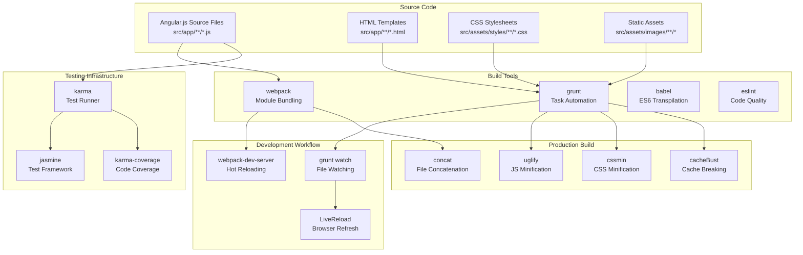
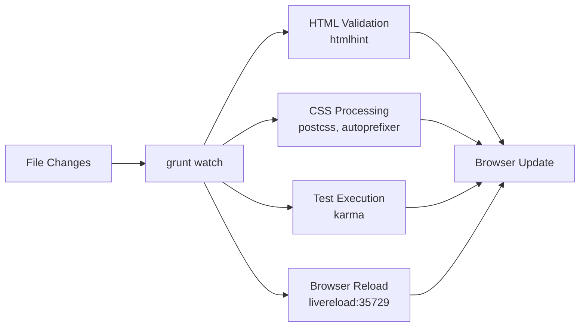
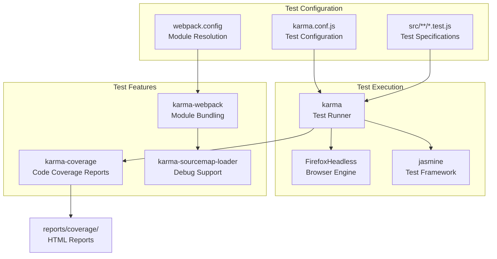
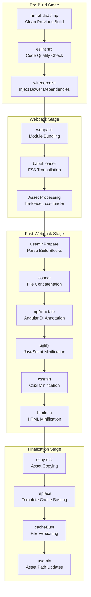

# Frontend Build System

<details>
<summary>Relevant source files</summary>

The following files were used as context for generating this wiki page:

- [zeppelin-distribution/src/bin_license/licenses/LICENSE-patuaOne-font](zeppelin-distribution/src/bin_license/licenses/LICENSE-patuaOne-font)
- [zeppelin-distribution/src/bin_license/licenses/LICENSE-source_code_pro-font](zeppelin-distribution/src/bin_license/licenses/LICENSE-source_code_pro-font)
- [zeppelin-web/.eslintrc](zeppelin-web/.eslintrc)
- [zeppelin-web/Gruntfile.js](zeppelin-web/Gruntfile.js)
- [zeppelin-web/karma.conf.js](zeppelin-web/karma.conf.js)
- [zeppelin-web/package-lock.json](zeppelin-web/package-lock.json)
- [zeppelin-web/package.json](zeppelin-web/package.json)
- [zeppelin-web/src/app/app.controller.test.js](zeppelin-web/src/app/app.controller.test.js)
- [zeppelin-web/src/app/notebook/notebook.controller.test.js](zeppelin-web/src/app/notebook/notebook.controller.test.js)
- [zeppelin-web/src/app/notebook/paragraph/paragraph.controller.test.js](zeppelin-web/src/app/notebook/paragraph/paragraph.controller.test.js)
- [zeppelin-web/src/app/tabledata/tabledata.test.js](zeppelin-web/src/app/tabledata/tabledata.test.js)
- [zeppelin-web/src/components/navbar/navbar.controller.test.js](zeppelin-web/src/components/navbar/navbar.controller.test.js)

</details>


This document describes the build system, development workflow, and testing infrastructure for Zeppelin's Angular.js frontend application located in the `zeppelin-web` module. It covers the compilation, bundling, testing, and deployment processes that transform the source code into a production-ready web application.

For information about the UI components and controllers themselves, see [Notebook and Paragraph UI](#3.1), [Interpreter Management UI](#3.2), and [Navigation and Core UI](#3.3).

## Overview and Architecture

The Zeppelin frontend build system is a hybrid approach combining modern JavaScript tooling with traditional task runners. It uses Webpack for module bundling and hot reloading during development, while Grunt handles asset processing, minification, and production optimization tasks.

### Build System Architecture



Sources: [zeppelin-web/package.json:1-108](), [zeppelin-web/Gruntfile.js:1-422]()

## Build Configuration and Dependencies

### Package Management and Dependencies

The build system manages dependencies through multiple package managers:

| Tool | Purpose | Configuration File |
|------|---------|-------------------|
| npm | Build tools and dev dependencies | `package.json` |
| bower | Frontend libraries and frameworks | `bower.json` |

Key build dependencies include:

- **webpack** (4.24.0): Module bundler and development server
- **grunt** (0.4.1): Task automation and asset processing
- **babel** (6.26.x): ES6+ transpilation to ES5
- **karma** (3.1.3): Test runner with browser automation
- **eslint** (3.19.0): JavaScript linting and code quality

Sources: [zeppelin-web/package.json:39-103](), [zeppelin-web/package.json:26-38]()

### Build Scripts and Commands

The `package.json` defines key build commands:

```bash
# Development workflow
npm run dev              # Start development server with hot reloading
npm run dev:helium       # Development with Helium bundle support
npm run lint:watch       # Continuous code linting

# Production builds  
npm run build:dist       # Full production build
npm run build:ci         # Continuous integration build

# Testing
npm run karma-test       # Run unit tests
npm run test:watch       # Continuous testing
npm run e2e             # End-to-end tests
```

Sources: [zeppelin-web/package.json:8-25]()

## Development Workflow

### Webpack Development Configuration

During development, Webpack provides module bundling and hot reloading through `webpack-dev-server`. The development workflow supports:

- **Hot Module Replacement**: Live code updates without page refresh
- **Source Maps**: Debug support with original source file mapping  
- **Live Reloading**: Automatic browser refresh on file changes
- **Helium Bundle Development**: Special mode for plugin development

The development server runs on a separate port and proxies API requests to the backend Zeppelin server.

Sources: [zeppelin-web/package.json:16-20]()

### Grunt Watch System

Grunt provides file watching and automated task execution for non-JavaScript assets:



The watch system monitors these file patterns:
- `src/**/*.html` - HTML templates and components
- `src/app/**/*.css` - Application stylesheets  
- `test/spec/**/*.js` - Test specifications
- `Gruntfile.js` - Build configuration changes

Sources: [zeppelin-web/Gruntfile.js:77-117]()

## Testing Infrastructure

### Karma Test Runner Configuration

The testing system uses Karma with Jasmine for unit testing and Firefox for browser automation:



Test file patterns and dependencies:
- Test files: `src/**/*.test.js`
- Polyfills: `babel-polyfill` for ES6+ features
- External libraries: jQuery, Angular, D3, Ace Editor

Sources: [zeppelin-web/karma.conf.js:25-165](), [zeppelin-web/karma.conf.js:39-100]()

### Code Quality and Linting

ESLint enforces code standards with the Google JavaScript style guide:

Key linting rules:
- **Style**: Single quotes, semicolons required, 120 character line limit
- **Quality**: No unused variables, camelCase naming, strict mode
- **Angular**: Global variables for `angular`, `jQuery`, `_`, framework libraries

Sources: [zeppelin-web/.eslintrc:1-54]()

### Test Structure and Examples

Unit tests follow Jasmine conventions with Angular mocking:

```javascript
// Controller testing pattern
describe('Controller: NotebookCtrl', function() {
  beforeEach(angular.mock.module('zeppelinWebApp'));
  // Test implementation...
});
```

Common test categories:
- **Controller Tests**: `*.controller.test.js` - UI controller logic
- **Service Tests**: Component and data service testing  
- **Utility Tests**: `tabledata.test.js` - Data transformation logic

Sources: [zeppelin-web/src/app/notebook/notebook.controller.test.js:1-140](), [zeppelin-web/src/app/tabledata/tabledata.test.js:1-131]()

## Production Build Process

### Multi-Stage Build Pipeline

The production build process combines Webpack bundling with Grunt post-processing:



Sources: [zeppelin-web/package.json:11-13](), [zeppelin-web/Gruntfile.js:392-417]()

### Asset Processing and Optimization

The build system handles various asset types:

| Asset Type | Processing | Output Location |
|------------|------------|-----------------|
| JavaScript | Babel → Concat → Uglify → Cache bust | `dist/scripts/*.js` |
| CSS | PostCSS → Autoprefixer → CSSMin | `dist/styles/*.css` |
| HTML | HTMLHint → HTMLMin → Template cache | `dist/**/*.html` |
| Images | Copy → SVGMin | `dist/assets/images/` |
| Fonts | Copy from bower components | `dist/fonts/` |

Special asset handling:
- **MathJax**: Mathematical rendering library with extensions and fonts
- **DataTables**: UI grid images and assets
- **Bootstrap**: Icon fonts and themes
- **jQuery UI**: Theme images and components

Sources: [zeppelin-web/Gruntfile.js:266-323](), [zeppelin-web/Gruntfile.js:199-264]()

### Cache Busting and Versioning

The build system implements cache busting through multiple mechanisms:

1. **File Revisioning**: `grunt-filerev` adds content hashes to filenames
2. **Template Versioning**: Timestamp-based cache busting for templates
3. **Asset Path Updates**: `usemin` updates references to versioned files

Template cache busting pattern:
```javascript
// Before: templateUrl: "template.html"  
// After:  templateUrl: "template.html?v=1634567890123"
```

Sources: [zeppelin-web/Gruntfile.js:66-75](), [zeppelin-web/Gruntfile.js:351-370]()

## Integration with Zeppelin Server

The frontend build integrates with the larger Zeppelin server architecture through Maven:

- **Maven Integration**: The `zeppelin-web` module builds during the main Maven lifecycle
- **Distribution**: Built assets are packaged into `zeppelin-distribution`
- **Development Proxy**: Webpack dev server proxies API calls to the backend
- **Production Deployment**: Built files are served by the Jetty web server

The build output becomes part of the overall Zeppelin server deployment, providing the web interface for notebook management and code execution.

Sources: [zeppelin-web/package.json:1-4](), [zeppelin-web/Gruntfile.js:28-32]()
