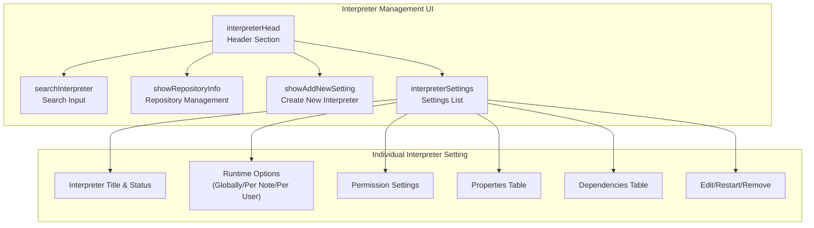
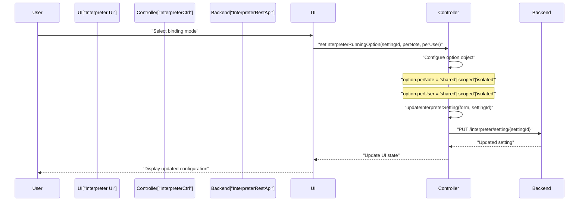
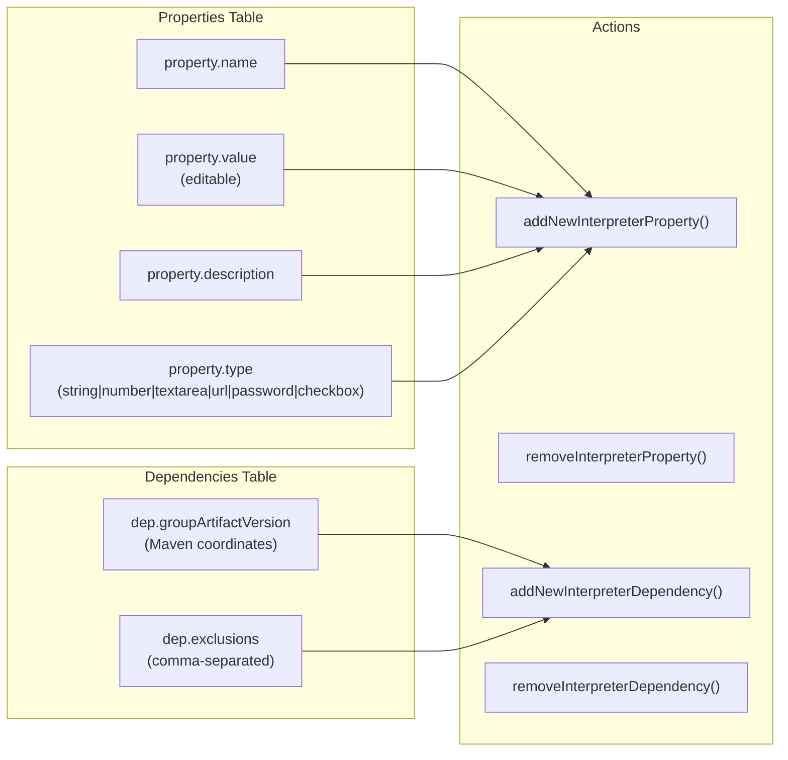
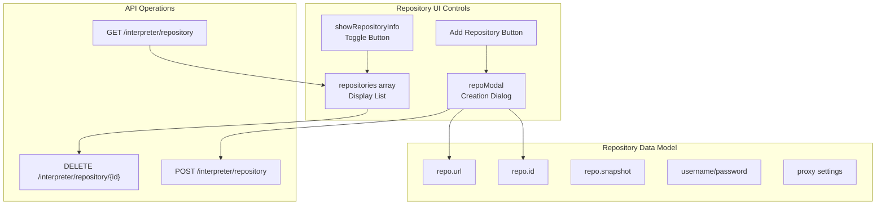
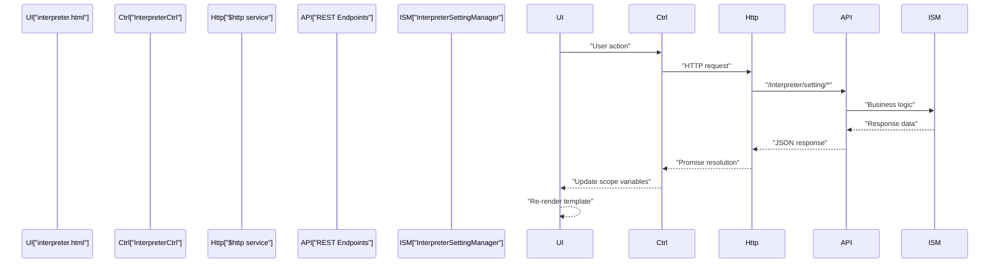

# Interpreter Management UI

Relevant source files

The following files were used as context for generating this wiki page:

- [zeppelin-web/src/app/interpreter/interpreter.controller.js](zeppelin-web/src/app/interpreter/interpreter.controller.js)
- [zeppelin-web/src/app/interpreter/interpreter.css](zeppelin-web/src/app/interpreter/interpreter.css)
- [zeppelin-web/src/app/interpreter/interpreter.html](zeppelin-web/src/app/interpreter/interpreter.html)
- [zeppelin-web/src/assets/styles/looknfeel/default.css](zeppelin-web/src/assets/styles/looknfeel/default.css)
- [zeppelin-web/src/assets/styles/looknfeel/report.css](zeppelin-web/src/assets/styles/looknfeel/report.css)
- [zeppelin-web/src/assets/styles/looknfeel/simple.css](zeppelin-web/src/assets/styles/looknfeel/simple.css)
- [zeppelin-web/src/assets/styles/printMode.css](zeppelin-web/src/assets/styles/printMode.css)

The Interpreter Management UI provides a web-based interface for configuring and managing interpreter settings in Apache Zeppelin. This interface allows administrators and users to create, edit, and manage interpreter configurations, dependencies, and runtime options through a centralized dashboard.

For information about the underlying interpreter framework and backend services, see [Interpreter Framework](#2.3). For details about individual interpreter implementations, see [Interpreters](#5).

## Overview

The Interpreter Management UI is implemented as an Angular.js application located in the `zeppelin-web` module. It consists of three main components: the HTML template, the Angular controller, and associated CSS styling. The interface provides comprehensive management capabilities for interpreter settings, including configuration of properties, dependencies, repositories, and runtime options.

**Main UI Components Architecture**

Sources: [zeppelin-web/src/app/interpreter/interpreter.html:14-89](), [zeppelin-web/src/app/interpreter/interpreter.html:91-540]()

## Core Controller Functions

The `InterpreterCtrl` controller manages all interpreter management operations through a comprehensive set of functions that handle CRUD operations, configuration management, and user interactions.

**Controller Function Categories**

| Category | Functions | Purpose |
|----------|-----------|---------|
| Settings Management | `getInterpreterSettings`, `updateInterpreterSetting`, `removeInterpreterSetting` | Core CRUD operations for interpreter settings |
| Runtime Options | `setInterpreterRunningOption`, `setPerNoteOption`, `setPerUserOption` | Configure interpreter binding modes |
| Properties & Dependencies | `addNewInterpreterProperty`, `removeInterpreterProperty`, `addNewInterpreterDependency` | Manage interpreter configuration |
| Repository Management | `getRepositories`, `addNewRepository`, `removeRepository` | Handle Maven repository settings |
| Lifecycle Operations | `restartInterpreterSetting`, `checkDownloadingDependencies` | Control interpreter lifecycle |

Sources: [zeppelin-web/src/app/interpreter/interpreter.controller.js:111-129](), [zeppelin-web/src/app/interpreter/interpreter.controller.js:343-416](), [zeppelin-web/src/app/interpreter/interpreter.controller.js:464-484]()

## Interpreter Binding Modes

The UI provides sophisticated options for configuring how interpreters are instantiated and shared across notes and users. These binding modes control the lifecycle and isolation of interpreter processes.

**Binding Mode Configuration Flow**

The binding modes include:
- **Globally**: Single interpreter instance shared across all notes and users (`perNote: 'shared', perUser: 'shared'`)
- **Per Note**: Separate interpreter instances per note (`perNote: 'scoped'` or `'isolated'`)
- **Per User**: Separate interpreter instances per user with additional per-note options

Sources: [zeppelin-web/src/app/interpreter/interpreter.controller.js:288-341](), [zeppelin-web/src/app/interpreter/interpreter.html:147-249]()

## Properties and Dependencies Management

The UI provides dynamic tables for managing interpreter properties and dependencies with inline editing capabilities using the `editable-form` directive.

**Properties Management Structure**

The properties system supports multiple data types with appropriate UI widgets:
- `string`: Standard text input
- `number`: Numeric input with validation
- `textarea`: Multi-line text input
- `url`: URL input with link display
- `password`: Masked password input
- `checkbox`: Boolean checkbox input

Sources: [zeppelin-web/src/app/interpreter/interpreter.html:392-467](), [zeppelin-web/src/app/interpreter/interpreter.controller.js:607-632](), [zeppelin-web/src/app/interpreter/interpreter.controller.js:634-683]()

## Repository Management

The UI includes a collapsible repository management section for configuring Maven repositories used to resolve interpreter dependencies.

**Repository Operations**

Default repositories (`central` and `local`) cannot be removed and are identified by the `isDefaultRepository()` function.

Sources: [zeppelin-web/src/app/interpreter/interpreter.html:60-86](), [zeppelin-web/src/app/interpreter/interpreter.controller.js:700-747]()

## Status Management and Error Handling

The UI provides real-time status updates for interpreter settings, particularly during dependency download operations and error states.

**Status Indicator System**

| Status | Icon | Color | Meaning |
|--------|------|-------|---------|
| `READY` | `fa-circle` | Green | Interpreter is ready to use |
| `ERROR` | `fa-circle` | Red | Error occurred (clickable for details) |
| `DOWNLOADING_DEPENDENCIES` | `fa-spinner` | Blue | Dependencies being downloaded |

The `checkDownloadingDependencies()` function polls the server every 2 seconds when downloads are in progress, automatically updating the UI to reflect current status.

Sources: [zeppelin-web/src/app/interpreter/interpreter.html:108-125](), [zeppelin-web/src/app/interpreter/interpreter.controller.js:131-155](), [zeppelin-web/src/app/interpreter/interpreter.controller.js:749-754]()

## Integration with Backend Services

The Interpreter Management UI integrates with several REST API endpoints provided by the Zeppelin server to perform operations on interpreter settings.

**API Integration Pattern**

Key API endpoints used:
- `GET /interpreter/setting` - Retrieve all interpreter settings
- `POST /interpreter/setting` - Create new interpreter setting
- `PUT /interpreter/setting/{id}` - Update existing interpreter setting
- `DELETE /interpreter/setting/{id}` - Remove interpreter setting
- `PUT /interpreter/setting/restart/{id}` - Restart interpreter
- `GET /interpreter/repository` - Get repository list
- `GET /interpreter/property/types` - Get available property types

Sources: [zeppelin-web/src/app/interpreter/interpreter.controller.js:112-113](), [zeppelin-web/src/app/interpreter/interpreter.controller.js:396-397](), [zeppelin-web/src/app/interpreter/interpreter.controller.js:547-548]()
