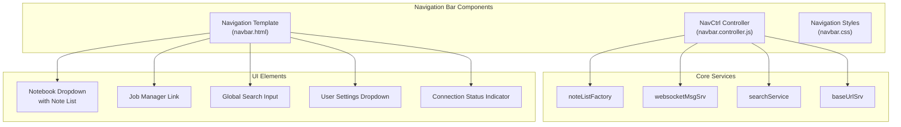
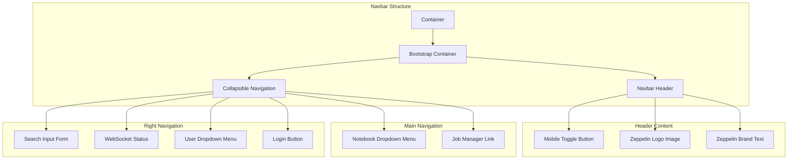
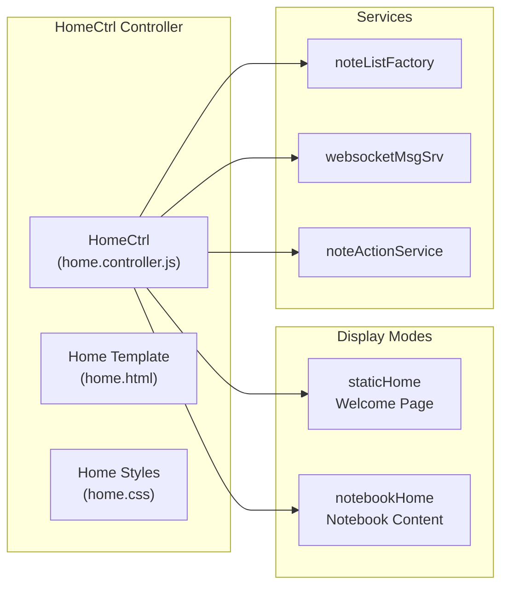
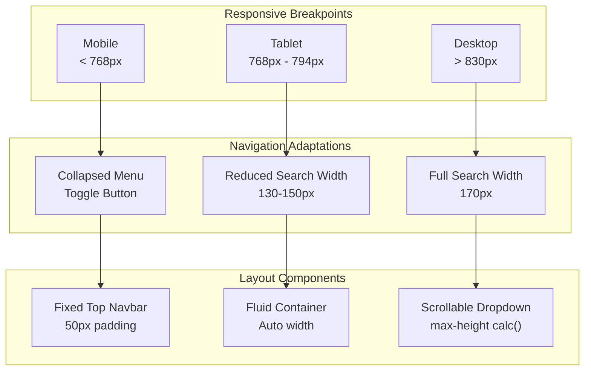
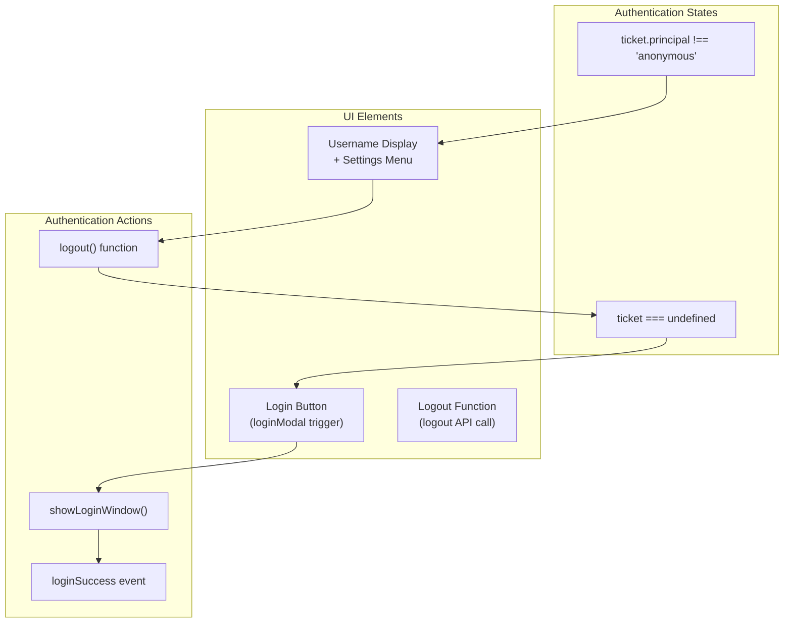

# Navigation and Core UI

Relevant source files

The following files were used as context for generating this wiki page:

- [zeppelin-web/src/app/home/home.controller.js](zeppelin-web/src/app/home/home.controller.js)
- [zeppelin-web/src/app/home/home.css](zeppelin-web/src/app/home/home.css)
- [zeppelin-web/src/app/home/home.html](zeppelin-web/src/app/home/home.html)
- [zeppelin-web/src/components/navbar/navbar.controller.js](zeppelin-web/src/components/navbar/navbar.controller.js)
- [zeppelin-web/src/components/navbar/navbar.css](zeppelin-web/src/components/navbar/navbar.css)
- [zeppelin-web/src/components/navbar/navbar.html](zeppelin-web/src/components/navbar/navbar.html)

This document covers the core user interface components and navigation system of Apache Zeppelin's web frontend. It focuses on the navigation bar, home page, and foundational UI elements that provide the primary user interaction layer.

For information about notebook-specific UI components, see [Notebook and Paragraph UI](#3.1). For interpreter management interfaces, see [Interpreter Management UI](#3.2).

## Purpose and Scope

The Navigation and Core UI system provides the primary interface layer for Apache Zeppelin, including:

- Top-level navigation bar with menu systems
- Home page with notebook listing and welcome content
- Core styling framework and responsive design
- User authentication and session management UI
- Global search and connection status indicators

## Navigation Bar Architecture

The navigation bar is implemented as an Angular.js component using the `NavCtrl` controller and provides the primary navigation interface for Zeppelin.

**Sources:** [zeppelin-web/src/components/navbar/navbar.controller.js](), [zeppelin-web/src/components/navbar/navbar.html](), [zeppelin-web/src/components/navbar/navbar.css]()

### Navigation Controller Structure

The `NavCtrl` controller manages navigation state and user interactions:

| Function | Purpose | Key Dependencies |
|----------|---------|------------------|
| `isActive()` | Determines active navigation state | `$routeParams.noteId` |
| `logout()` | Handles user logout process | `baseUrlSrv`, `$http` |
| `search()` | Redirects to search results | `$location` |
| `loadNotes()` | Fetches notebook list | `websocketMsgSrv.getNoteList()` |
| `getZeppelinVersion()` | Retrieves version information | `baseUrlSrv.getRestApiBase()` |

The controller maintains several key state variables:
- `vm.connected`: WebSocket connection status [zeppelin-web/src/components/navbar/navbar.controller.js:24]()
- `vm.notes`: Reference to note list factory [zeppelin-web/src/components/navbar/navbar.controller.js:27]()
- `vm.numberOfNotesDisplayed`: Pagination control [zeppelin-web/src/components/navbar/navbar.controller.js:33]()

**Sources:** [zeppelin-web/src/components/navbar/navbar.controller.js:15-276]()

### Navigation Bar Template Structure

The navigation bar template implements a Bootstrap-based responsive design:

**Sources:** [zeppelin-web/src/components/navbar/navbar.html:13-121]()

## Home Page System

The home page provides the main landing interface and is implemented through the `HomeCtrl` controller with dual display modes.

### Home Page Controller Architecture

**Sources:** [zeppelin-web/src/app/home/home.controller.js:15-160](), [zeppelin-web/src/app/home/home.html]()

### Home Page Display Modes

The home page operates in two distinct modes controlled by authentication state:

1. **Static Home Mode** (`vm.staticHome = true`): Displays welcome content and community links when user is not authenticated [zeppelin-web/src/app/home/home.controller.js:32-35]()

2. **Notebook Home Mode** (`vm.notebookHome = true`): Shows a designated home notebook as the landing page when authenticated [zeppelin-web/src/app/home/home.controller.js:81-82]()

The mode switching is handled through event listeners:
- `setNoteContent` event toggles between modes [zeppelin-web/src/app/home/home.controller.js:67-87]()
- `initHome()` function initializes notebook home mode [zeppelin-web/src/app/home/home.html:14]()

**Sources:** [zeppelin-web/src/app/home/home.controller.js:29-86]()

### Notebook List Management

The home page includes sophisticated notebook list management with filtering and infinite scroll:

| Feature | Implementation | Location |
|---------|----------------|----------|
| Note Filtering | `isFilterNote()` function | [zeppelin-web/src/app/home/home.controller.js:137-147]() |
| Infinite Scroll | `loadMoreNotes()` increments display count | [zeppelin-web/src/app/home/home.controller.js:89-91]() |
| Note Actions | Rename, trash, restore operations | [zeppelin-web/src/app/home/home.controller.js:93-131]() |
| Folder Operations | Toggle, rename, trash folder actions | [zeppelin-web/src/app/home/home.controller.js:51-53]() |

**Sources:** [zeppelin-web/src/app/home/home.controller.js:46-160](), [zeppelin-web/src/app/home/home.html:27-56]()

## Core UI Components

### Responsive Design System

The core UI implements a Bootstrap-based responsive design with custom extensions:

**Sources:** [zeppelin-web/src/app/home/home.css:218-234](), [zeppelin-web/src/components/navbar/navbar.css:61-73](), [zeppelin-web/src/components/navbar/navbar.css:137-174]()

### Animation System

The UI includes custom CSS animations for smooth transitions:

- **Slide Animations**: Top, right, left, down slide transitions with cubic-bezier easing [zeppelin-web/src/app/home/home.css:370-697]()
- **Navbar Transitions**: Headroom.js integration for navbar pin/unpin effects [zeppelin-web/src/components/navbar/navbar.css:76-84]()
- **Modal Backdrop**: Z-index management for modal layering [zeppelin-web/src/app/home/home.css:359-365]()

**Sources:** [zeppelin-web/src/app/home/home.css:370-697](), [zeppelin-web/src/components/navbar/navbar.css:76-84]()

### Connection Status Indicator

The navigation bar includes a real-time WebSocket connection status indicator:

- **Connected State**: Green circle with "WebSocket Connected" tooltip [zeppelin-web/src/components/navbar/navbar.html:88-89]()
- **Disconnected State**: Red circle with "WebSocket Disconnected" tooltip [zeppelin-web/src/components/navbar/navbar.html:90-91]()
- **Status Updates**: Managed through `setConnectedStatus` event [zeppelin-web/src/components/navbar/navbar.controller.js:224-226]()

The status styling is defined with specific colors and positioning [zeppelin-web/src/app/home/home.css:255-265]().

**Sources:** [zeppelin-web/src/components/navbar/navbar.html:88-91](), [zeppelin-web/src/components/navbar/navbar.controller.js:224-226](), [zeppelin-web/src/app/home/home.css:255-265]()

## User Authentication Interface

### Login/Logout Flow

The navigation system manages user authentication state through several mechanisms:

**Sources:** [zeppelin-web/src/components/navbar/navbar.html:92-117](), [zeppelin-web/src/components/navbar/navbar.controller.js:101-177](), [zeppelin-web/src/components/navbar/navbar.controller.js:228-233]()

The logout process includes browser-specific handling for authentication cache clearing, particularly for Internet Explorer [zeppelin-web/src/components/navbar/navbar.controller.js:125-151]().

### User Settings Menu

When authenticated, the user dropdown provides access to system configuration:

| Menu Item | Route | Purpose |
|-----------|-------|---------|
| About Zeppelin | Modal trigger | Version and license information |
| Interpreter | `#/interpreter` | Interpreter configuration |
| Notebook Repos | `#/notebookRepos` | Repository settings |
| Credential | `#/credential` | Security credentials |
| Helium | `#/helium` | Plugin management |
| Configuration | `#/configuration` | System settings |
| Cluster | `#/cluster` | Cluster management (conditional) |

**Sources:** [zeppelin-web/src/components/navbar/navbar.html:97-109]()
