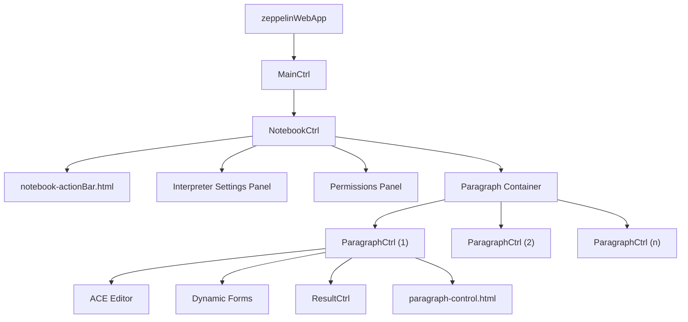
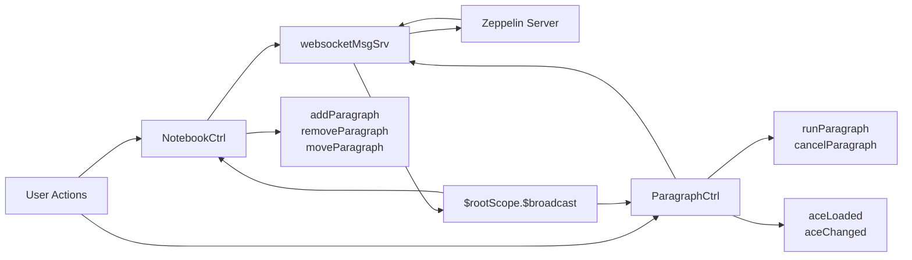
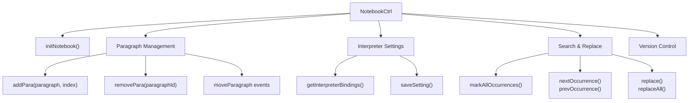
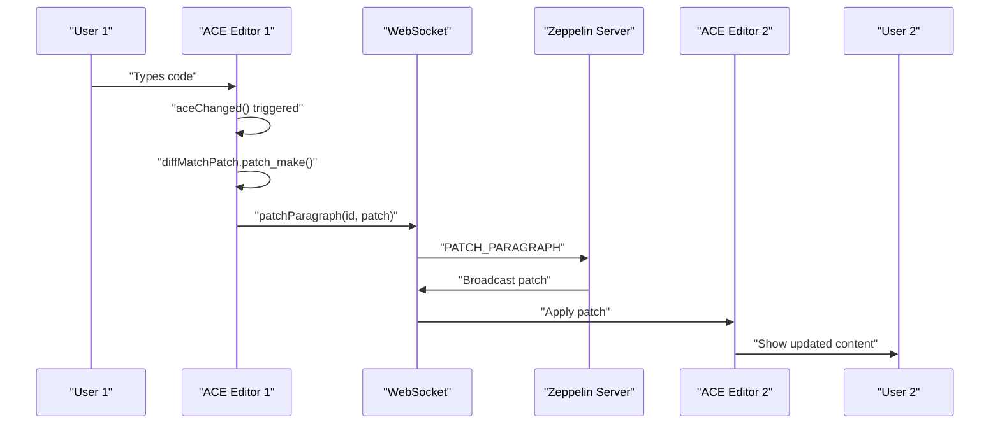
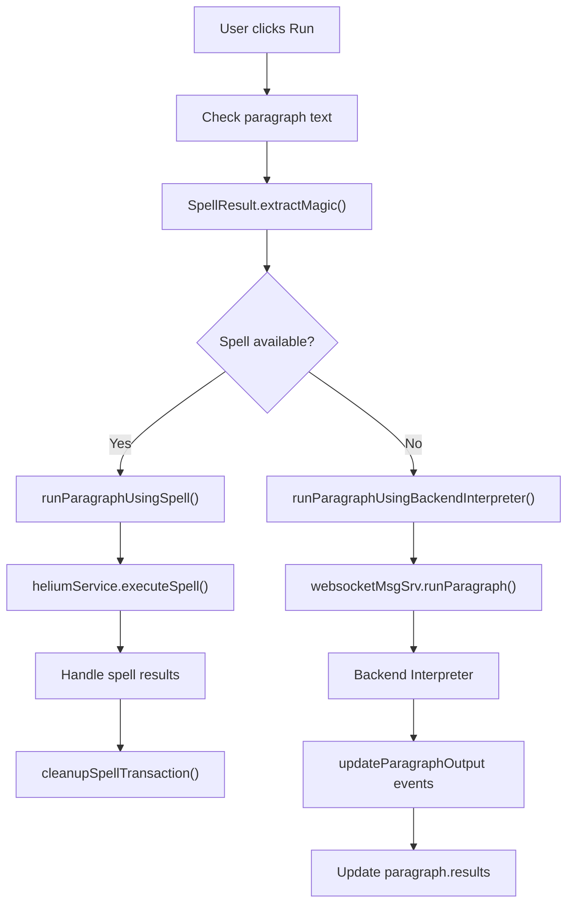
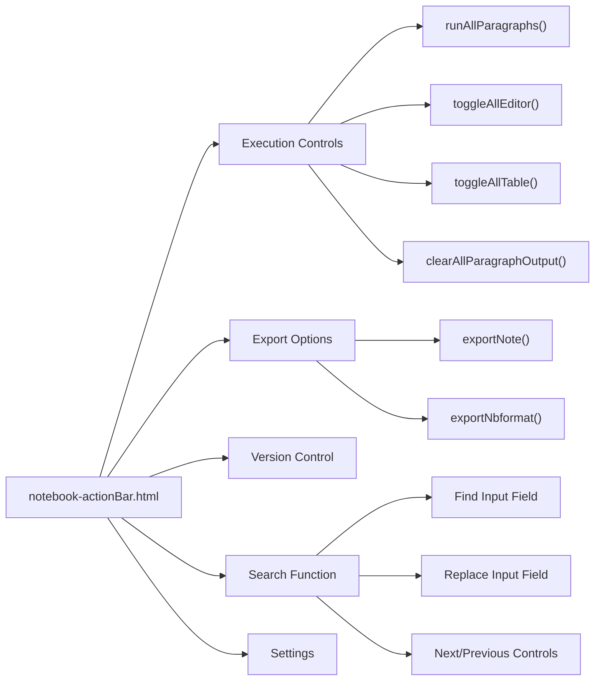

# Notebook and Paragraph UI

Relevant source files

The following files were used as context for generating this wiki page:

- [zeppelin-distribution/src/bin_license/LICENSE](zeppelin-distribution/src/bin_license/LICENSE)
- [zeppelin-web/bower.json](zeppelin-web/bower.json)
- [zeppelin-web/src/app/app.js](zeppelin-web/src/app/app.js)
- [zeppelin-web/src/app/notebook/notebook-actionBar.html](zeppelin-web/src/app/notebook/notebook-actionBar.html)
- [zeppelin-web/src/app/notebook/notebook.controller.js](zeppelin-web/src/app/notebook/notebook.controller.js)
- [zeppelin-web/src/app/notebook/notebook.css](zeppelin-web/src/app/notebook/notebook.css)
- [zeppelin-web/src/app/notebook/notebook.html](zeppelin-web/src/app/notebook/notebook.html)
- [zeppelin-web/src/app/notebook/paragraph/paragraph-control.html](zeppelin-web/src/app/notebook/paragraph/paragraph-control.html)
- [zeppelin-web/src/app/notebook/paragraph/paragraph.controller.js](zeppelin-web/src/app/notebook/paragraph/paragraph.controller.js)
- [zeppelin-web/src/app/notebook/paragraph/paragraph.css](zeppelin-web/src/app/notebook/paragraph/paragraph.css)
- [zeppelin-web/src/app/notebook/paragraph/paragraph.html](zeppelin-web/src/app/notebook/paragraph/paragraph.html)
- [zeppelin-web/src/index.html](zeppelin-web/src/index.html)

This document covers the frontend user interface components for Zeppelin's notebook and paragraph editing functionality. It describes the AngularJS-based web interface that allows users to create, edit, and execute code paragraphs within notebooks, including collaborative editing features, code completion, and real-time execution feedback.

For information about the backend notebook server and WebSocket APIs, see [Notebook Server and APIs](#4.1). For details about interpreter management and configuration, see [Interpreter Management UI](#3.2).

## Architecture Overview

The notebook UI is built on AngularJS 1.5.7 and follows a hierarchical component structure where a single `NotebookCtrl` manages multiple `ParagraphCtrl` instances. The interface integrates the ACE code editor for syntax highlighting and provides real-time collaboration features through WebSocket connections.

### Component Hierarchy

Sources: [zeppelin-web/src/app/app.js:86-109](), [zeppelin-web/src/app/notebook/notebook.html:153-158](), [zeppelin-web/src/app/notebook/paragraph/paragraph.html:1-89]()

### Controller Communication Pattern

Sources: [zeppelin-web/src/app/notebook/notebook.controller.js:97-181](), [zeppelin-web/src/app/notebook/paragraph/paragraph.controller.js:31-35](), [zeppelin-web/src/app/notebook/paragraph/paragraph.controller.js:726-742]()

## Core UI Components

### NotebookCtrl Controller

The `NotebookCtrl` serves as the main controller for notebook-level operations and manages the overall notebook state. It handles notebook metadata, paragraph lifecycle, and coordination between multiple paragraphs.

**Key Responsibilities:**
- Notebook initialization via `initNotebook()`
- Paragraph management through `addPara()`, `removePara()`, and move operations
- Interpreter binding configuration
- Permissions and access control
- Search and replace functionality across paragraphs
- Version control and revision management

Sources: [zeppelin-web/src/app/notebook/notebook.controller.js:172-199](), [zeppelin-web/src/app/notebook/notebook.controller.js:582-627](), [zeppelin-web/src/app/notebook/notebook.controller.js:717-738](), [zeppelin-web/src/app/notebook/notebook.controller.js:879-1015]()

### ParagraphCtrl Controller

The `ParagraphCtrl` manages individual paragraph execution, editing, and display. Each paragraph instance has its own controller that handles code editing, execution, and result rendering.

**Key Features:**
- ACE editor integration with syntax highlighting and autocompletion
- Code execution via `runParagraph()` with support for both interpreter and spell execution
- Real-time collaboration through differential synchronization
- Dynamic forms for interactive parameters
- Progress tracking and status updates

The controller initializes with paragraph data and maintains state for:
- `$scope.editor` - ACE editor instance
- `$scope.originalText` - Original paragraph text for dirty checking
- `$scope.dirtyText` - Current editor content
- `$scope.paragraphFocused` - Focus state for keyboard navigation

Sources: [zeppelin-web/src/app/notebook/paragraph/paragraph.controller.js:134-158](), [zeppelin-web/src/app/notebook/paragraph/paragraph.controller.js:455-480](), [zeppelin-web/src/app/notebook/paragraph/paragraph.controller.js:751-1018]()

## Code Editor Integration

### ACE Editor Configuration

The paragraph UI integrates the ACE editor for code editing with extensive customization for Zeppelin's requirements. The editor configuration includes:

**Editor Setup:**
- Syntax highlighting for multiple languages (Scala, Python, SQL, R, etc.)
- Custom autocompletion via `remoteCompleter` that communicates with interpreters
- Emacs key bindings on macOS, standard bindings on other platforms
- Dynamic height adjustment based on content

**Autocompletion System:**
The autocompletion system provides intelligent code suggestions by communicating with backend interpreters:

```mermaid
graph LR
    UserTypes["User Types"] --> ACEEditor["ACE Editor"]
    ACEEditor --> RemoteCompleter["remoteCompleter.getCompletions()"]
    RemoteCompleter --> WSMessage["websocketMsgSrv.completion()"]
    WSMessage --> Backend["Interpreter Backend"]
    Backend --> WSResponse["completionList event"]
    WSResponse --> FilterResults["filterCompletions()"]
    FilterResults --> DisplaySuggestions["ACE Suggestions UI"]
```

**Key Editor Methods:**
- `aceLoaded(_editor)` - Initializes editor with custom configuration
- `aceChanged(_, editor)` - Handles content changes and dirty state tracking
- `setParagraphMode(session, text)` - Sets appropriate syntax highlighting mode
- `autoAdjustEditorHeight(editor)` - Dynamically resizes editor

Sources: [zeppelin-web/src/app/notebook/paragraph/paragraph.controller.js:751-1018](), [zeppelin-web/src/app/notebook/paragraph/paragraph.controller.js:806-866](), [zeppelin-web/src/app/notebook/paragraph/paragraph.controller.js:1104-1139]()

### Keyboard Shortcuts and Navigation

The editor supports extensive keyboard shortcuts for efficient notebook navigation and editing:

**Execution Shortcuts:**
- `Shift+Enter` - Run current paragraph
- `Ctrl+Enter` - Run current paragraph (alternative)
- `Ctrl+Shift+Enter` - Run all paragraphs above/below current

**Navigation Shortcuts:**
- `Ctrl+Alt+N` - Insert new paragraph below
- `Ctrl+Alt+K` - Move paragraph up  
- `Ctrl+Alt+J` - Move paragraph down
- `Ctrl+Alt+D` - Delete paragraph

**Editor Shortcuts:**
- `Ctrl+Alt+E` - Toggle editor visibility
- `Ctrl+Alt+O` - Toggle output visibility
- `Ctrl+Alt+T` - Toggle title
- `Ctrl+Alt+M` - Toggle line numbers

Sources: [zeppelin-web/src/app/notebook/paragraph/paragraph-control.html:49-211](), [zeppelin-web/src/app/notebook/paragraph/paragraph.controller.js:911-1016]()

## Real-time Collaboration Features

### Collaborative Editing

Zeppelin supports real-time collaborative editing using a differential synchronization approach. When `collaborativeMode` is enabled, changes are synchronized between multiple users editing the same notebook.

**Collaboration Workflow:**
1. User makes changes in ACE editor
2. `aceChanged()` detects modifications and calls `sendPatch()`
3. `diffMatchPatch.patch_make()` generates a patch between original and current text
4. Patch is sent via WebSocket to other collaborators
5. Remote users receive and apply patches to their editors

**Collaborative State Management:**
- `$scope.collaborativeMode` - Enables/disables collaborative features
- `$scope.collaborativeModeUsers` - List of active users viewing the notebook
- `$scope.diffMatchPatch` - Instance for generating and applying patches

Sources: [zeppelin-web/src/app/notebook/paragraph/paragraph.controller.js:744-749](), [zeppelin-web/src/app/notebook/notebook.controller.js:38-39](), [zeppelin-web/src/app/notebook/paragraph/paragraph.controller.js:47]()

## Paragraph Execution and Results

### Execution Flow

Paragraph execution supports both traditional interpreter execution and spell-based execution (for frontend-only computations). The execution flow varies based on the paragraph content and available execution engines.

**Execution Decision Tree:**

**Key Execution Methods:**
- `runParagraph(paragraphText, digestRequired, propagated)` - Main execution entry point
- `runParagraphUsingSpell()` - Frontend spell execution
- `runParagraphUsingBackendInterpreter()` - Traditional interpreter execution
- `cancelParagraph()` - Cancels running paragraphs

Sources: [zeppelin-web/src/app/notebook/paragraph/paragraph.controller.js:455-480](), [zeppelin-web/src/app/notebook/paragraph/paragraph.controller.js:362-398](), [zeppelin-web/src/app/notebook/paragraph/paragraph.controller.js:400-403]()

### Result Rendering

Paragraph results are handled by the `ResultCtrl` which supports multiple output formats including text, HTML, tables, and visualizations. The result system is extensible and supports dynamic table displays with sorting and filtering.

**Result Types:**
- `TEXT` - Plain text output
- `HTML` - Rendered HTML content  
- `TABLE` - Tabular data with interactive features
- `IMG` - Image outputs
- `SVG` - Vector graphics

The result rendering pipeline processes interpreter output and applies appropriate formatting and interactive features based on the result type.

Sources: [zeppelin-web/src/app/notebook/paragraph/paragraph.html:63-73](), [zeppelin-web/src/app/notebook/paragraph/paragraph.controller.js:206-231]()

## Action Bar and Controls

### Notebook Action Bar

The notebook action bar provides global notebook operations and is implemented as a fixed header that remains visible during scrolling. It includes notebook-level controls for execution, export, version control, and configuration.

**Action Bar Features:**
- **Execution Controls**: Run all paragraphs, toggle editor/output visibility
- **Export Options**: Export as `.zpln` format or Jupyter `.ipynb` format  
- **Version Control**: Commit changes, browse revisions, compare versions
- **Search**: Find and replace across all paragraphs
- **Settings**: Interpreter bindings, permissions, look and feel

Sources: [zeppelin-web/src/app/notebook/notebook-actionBar.html:30-242](), [zeppelin-web/src/app/notebook/notebook.controller.js:395-465]()

### Paragraph Controls

Each paragraph has an individual control panel that provides paragraph-specific operations accessible through a dropdown menu. The controls are contextually enabled/disabled based on notebook and paragraph state.

**Control Categories:**
- **Execution**: Run, cancel, auto-run configuration
- **Layout**: Column width, font size, title visibility, line numbers
- **Navigation**: Move up/down, insert new paragraph
- **Management**: Clone, clear output, remove paragraph
- **Utility**: Copy paragraph ID, link to paragraph

The control system respects the notebook's running state and revision view mode, disabling inappropriate actions when necessary.

Sources: [zeppelin-web/src/app/notebook/paragraph/paragraph-control.html:70-214](), [zeppelin-web/src/app/notebook/paragraph/paragraph.controller.js:529-612]()
