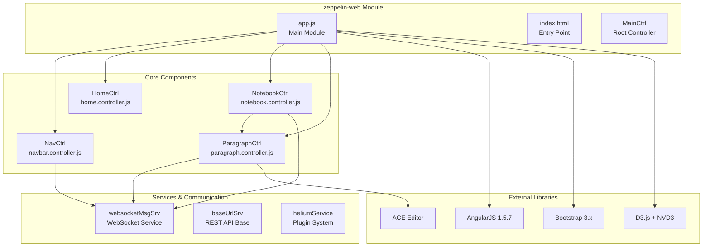
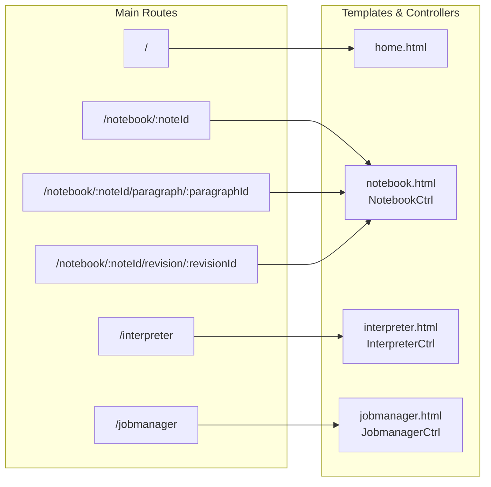
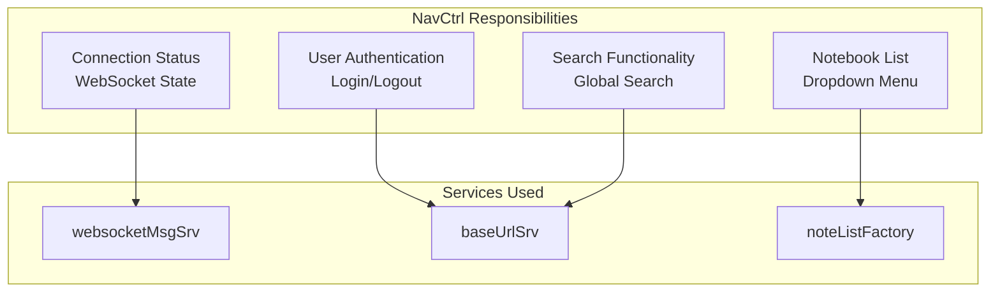
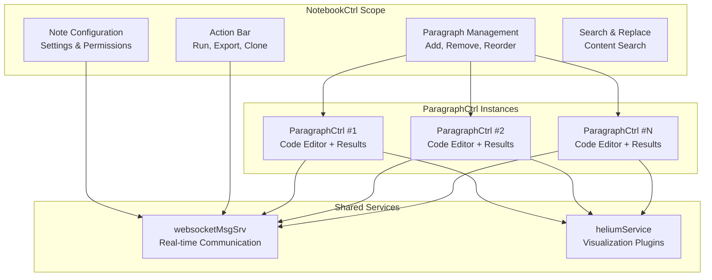
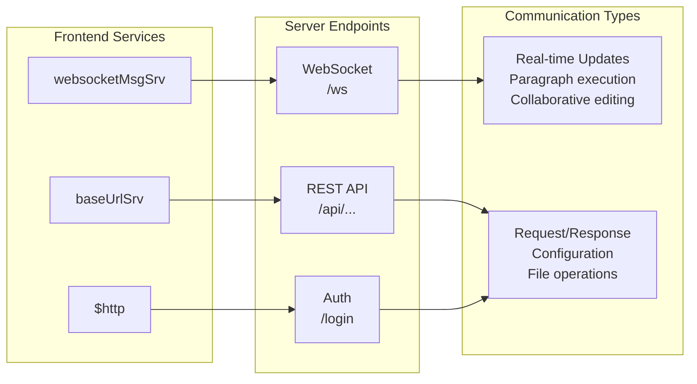
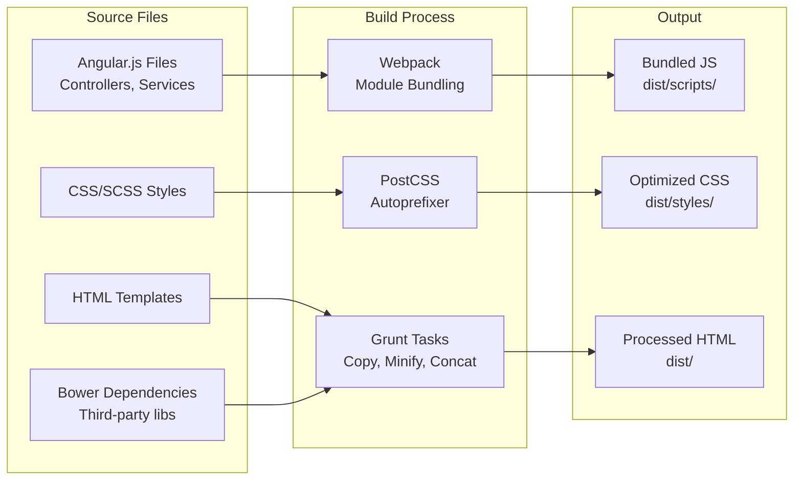

# Web Interface

Relevant source files

The following files were used as context for generating this wiki page:

- [zeppelin-distribution/src/bin_license/LICENSE](zeppelin-distribution/src/bin_license/LICENSE)
- [zeppelin-distribution/src/bin_license/licenses/LICENSE-patuaOne-font](zeppelin-distribution/src/bin_license/licenses/LICENSE-patuaOne-font)
- [zeppelin-distribution/src/bin_license/licenses/LICENSE-source_code_pro-font](zeppelin-distribution/src/bin_license/licenses/LICENSE-source_code_pro-font)
- [zeppelin-web/.eslintrc](zeppelin-web/.eslintrc)
- [zeppelin-web/Gruntfile.js](zeppelin-web/Gruntfile.js)
- [zeppelin-web/bower.json](zeppelin-web/bower.json)
- [zeppelin-web/karma.conf.js](zeppelin-web/karma.conf.js)
- [zeppelin-web/package-lock.json](zeppelin-web/package-lock.json)
- [zeppelin-web/package.json](zeppelin-web/package.json)
- [zeppelin-web/src/app/app.controller.test.js](zeppelin-web/src/app/app.controller.test.js)
- [zeppelin-web/src/app/app.js](zeppelin-web/src/app/app.js)
- [zeppelin-web/src/app/home/home.controller.js](zeppelin-web/src/app/home/home.controller.js)
- [zeppelin-web/src/app/home/home.css](zeppelin-web/src/app/home/home.css)
- [zeppelin-web/src/app/home/home.html](zeppelin-web/src/app/home/home.html)
- [zeppelin-web/src/app/notebook/notebook-actionBar.html](zeppelin-web/src/app/notebook/notebook-actionBar.html)
- [zeppelin-web/src/app/notebook/notebook.controller.js](zeppelin-web/src/app/notebook/notebook.controller.js)
- [zeppelin-web/src/app/notebook/notebook.controller.test.js](zeppelin-web/src/app/notebook/notebook.controller.test.js)
- [zeppelin-web/src/app/notebook/notebook.css](zeppelin-web/src/app/notebook/notebook.css)
- [zeppelin-web/src/app/notebook/notebook.html](zeppelin-web/src/app/notebook/notebook.html)
- [zeppelin-web/src/app/notebook/paragraph/paragraph-control.html](zeppelin-web/src/app/notebook/paragraph/paragraph-control.html)
- [zeppelin-web/src/app/notebook/paragraph/paragraph.controller.js](zeppelin-web/src/app/notebook/paragraph/paragraph.controller.js)
- [zeppelin-web/src/app/notebook/paragraph/paragraph.controller.test.js](zeppelin-web/src/app/notebook/paragraph/paragraph.controller.test.js)
- [zeppelin-web/src/app/notebook/paragraph/paragraph.css](zeppelin-web/src/app/notebook/paragraph/paragraph.css)
- [zeppelin-web/src/app/notebook/paragraph/paragraph.html](zeppelin-web/src/app/notebook/paragraph/paragraph.html)
- [zeppelin-web/src/app/tabledata/tabledata.test.js](zeppelin-web/src/app/tabledata/tabledata.test.js)
- [zeppelin-web/src/components/navbar/navbar.controller.js](zeppelin-web/src/components/navbar/navbar.controller.js)
- [zeppelin-web/src/components/navbar/navbar.controller.test.js](zeppelin-web/src/components/navbar/navbar.controller.test.js)
- [zeppelin-web/src/components/navbar/navbar.css](zeppelin-web/src/components/navbar/navbar.css)
- [zeppelin-web/src/components/navbar/navbar.html](zeppelin-web/src/components/navbar/navbar.html)
- [zeppelin-web/src/index.html](zeppelin-web/src/index.html)

The Apache Zeppelin web interface is a browser-based frontend application that provides an interactive notebook environment for data analytics. This document covers the architecture, components, and implementation details of the client-side web application.

For information about server-side notebook management and APIs, see [Notebook Server and APIs](#4.1). For details about interpreter configuration interfaces, see [Interpreter Management UI](#3.2).

## Frontend Architecture Overview

The Zeppelin web interface is built as a single-page application (SPA) using AngularJS 1.5.7. The application follows a modular architecture with distinct controllers, services, and templates for different functional areas.

### Application Structure

Sources: [zeppelin-web/src/app/app.js:67-106](), [zeppelin-web/src/index.html:15-223](), [zeppelin-web/bower.json:4-43]()

### Module Dependencies

The main application module `zeppelinWebApp` integrates numerous Angular modules and third-party libraries:

| Category | Modules | Purpose |
|----------|---------|---------|
| Core Angular | `ngCookies`, `ngAnimate`, `ngRoute`, `ngSanitize` | Basic Angular functionality |
| UI Components | `ui.bootstrap`, `ui.ace`, `as.sortable` | UI widgets and editor |
| Communication | `angular-websocket`, `ngResource` | Server communication |
| Data Processing | `angular.filter`, `ui.grid` | Data manipulation and display |
| Utilities | `ngToast`, `ngclipboard`, `xeditable` | User experience enhancements |

Sources: [zeppelin-web/src/app/app.js:27-59](), [zeppelin-web/bower.json:5-39]()

## Routing and Navigation

The application uses Angular's `$routeProvider` to define client-side routes that map URLs to templates and controllers.

### Route Configuration

Sources: [zeppelin-web/src/app/app.js:86-130]()

The routing system supports:
- **Notebook Display**: `/notebook/:noteId` routes to the main notebook interface
- **Paragraph Focus**: `/notebook/:noteId/paragraph/:paragraphId` for direct paragraph access
- **Revision Viewing**: `/notebook/:noteId/revision/:revisionId` for version control
- **Management Interfaces**: Dedicated routes for interpreter and job management

## Core User Interface Components

### Navigation Bar Component

The `NavCtrl` controller manages the top-level navigation, search functionality, and user authentication state.

**Key Functions:**
- `search(searchTerm)` - Navigate to search results ([zeppelin-web/src/components/navbar/navbar.controller.js:205-207]())
- `logout()` - Handle user logout process ([zeppelin-web/src/components/navbar/navbar.controller.js:101-177]())
- `loadNotes()` - Fetch and display notebook list ([zeppelin-web/src/components/navbar/navbar.controller.js:93-95]())

Sources: [zeppelin-web/src/components/navbar/navbar.controller.js:17-276](), [zeppelin-web/src/components/navbar/navbar.html:13-154]()

### Home Page Interface

The `HomeCtrl` manages the landing page, displaying available notebooks and providing creation/import functionality.

**Key Features:**
- Note list with filtering capabilities
- Import/export note functionality  
- Folder-based organization
- Real-time updates via WebSocket

Sources: [zeppelin-web/src/app/home/home.controller.js:17-139](), [zeppelin-web/src/app/home/home.html:14-128]()

### Notebook Interface Architecture

The notebook interface consists of the main `NotebookCtrl` controller and multiple `ParagraphCtrl` instances for individual code/text blocks.

Sources: [zeppelin-web/src/app/notebook/notebook.controller.js:21-1319](), [zeppelin-web/src/app/notebook/paragraph/paragraph.controller.js:31-1519]()

## Communication Layer

The frontend communicates with the Zeppelin server through two primary channels:

### WebSocket Communication

Real-time bidirectional communication is handled by `websocketMsgSrv` for:
- **Paragraph Execution**: `runParagraph()`, `cancelParagraphRun()`
- **Note Management**: `getNote()`, `updateNote()`, `cloneNote()`
- **Interpreter Control**: `getInterpreterBindings()`, `saveInterpreterBindings()`
- **Real-time Updates**: Paragraph results, status changes, collaborative editing

### REST API Integration

HTTP requests through `baseUrlSrv` for:
- **Authentication**: Login/logout operations
- **File Operations**: Note import/export
- **Configuration**: System settings and version info
- **Permissions**: Note access control

Sources: [zeppelin-web/src/components/websocket/websocket-event.factory.js](), [zeppelin-web/src/components/baseUrl/baseurl.service.js]()

## Code Editor Integration

The paragraph interface integrates the ACE editor for code editing with extensive customization and language support.

### Editor Configuration

The `ParagraphCtrl` configures ACE editor instances with:
- **Syntax Highlighting**: Multiple language modes (Scala, Python, SQL, etc.)
- **Autocompletion**: Custom completion provider with backend integration
- **Key Bindings**: Emacs/default key bindings based on platform
- **Real-time Collaboration**: Patch-based synchronization

**Key Editor Functions:**
- `aceLoaded(_editor)` - Initialize editor instance ([zeppelin-web/src/app/notebook/paragraph/paragraph.controller.js:751-1018]())
- `aceChanged(_, editor)` - Handle content changes ([zeppelin-web/src/app/notebook/paragraph/paragraph.controller.js:726-742]())
- `sendPatch()` - Collaborative editing synchronization ([zeppelin-web/src/app/notebook/paragraph/paragraph.controller.js:744-749]())

Sources: [zeppelin-web/src/app/notebook/paragraph/paragraph.controller.js:751-1018](), [zeppelin-web/bower.json:17-18]()

## Build System and Development Workflow

The frontend uses a modern JavaScript build pipeline combining Grunt, Webpack, and npm.

### Build Tools Configuration

| Tool | Purpose | Key Files |
|------|---------|-----------|
| **Grunt** | Task automation | [zeppelin-web/Gruntfile.js]() |
| **Webpack** | Module bundling | [zeppelin-web/webpack.config.js]() |
| **npm** | Dependency management | [zeppelin-web/package.json]() |
| **Bower** | Frontend dependencies | [zeppelin-web/bower.json]() |

### Development Scripts

The [zeppelin-web/package.json:8-24]() defines key npm scripts:
- `npm run dev` - Development server with hot reload
- `npm run build:dist` - Production build
- `npm run lint:watch` - Continuous linting
- `npm run karma-test` - Unit test execution

### Asset Processing Pipeline

Sources: [zeppelin-web/Gruntfile.js:18-342](), [zeppelin-web/package.json:8-24](), [zeppelin-web/webpack.config.js]()
