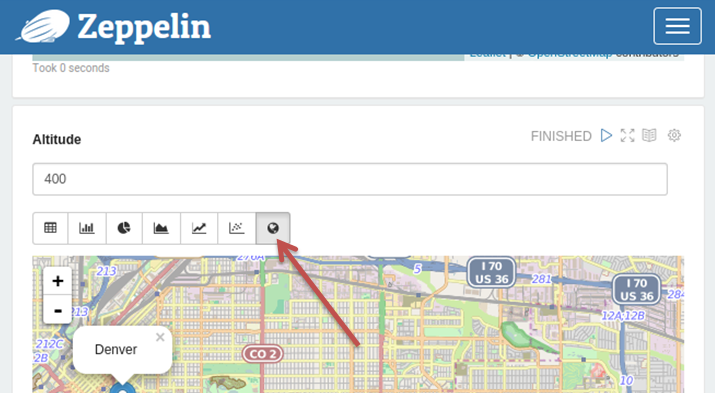



### Why Charts are important in zeppelin?
Zeppelin is mostly used for data analysis and visualization. Depending on the user requirements and datasets the types of charts needed could differ. So Zeppelin let user to add different chart libraries and chart types.

<br />
### Add New Chart Library
When needed a new JS chart library than D3 (nvd3) which is included in zeppelin, a new JS library for zeppelin-web is added by adding name in zeppelin-web/bower.json

eg: Adding map visualization to Zeppelin using leaflet

```
"leaflet": "~0.7.3" for dependencies
```

<br />
### Add New Chart Type

Firstly add a button to view the new chart. Append to paragraph.html (zeppelin-web/src/app/notebook/paragraph/paragraph.html) the following lines depending on the chart you use.

```xml
<button type="button" class="btn btn-default btn-sm"
  ng-class="{'active': isGraphMode('mapChart')}"
  ng-click="setGraphMode('mapChart', true)"><i class="fa fa-globe"></i>
</button>
```

After successful addition the zeppelin user will be able to see a new chart button added to the button group as follows. 

<div class="row">
  <div class="col-md-8">
    
  </div>
</div>

Defining the chart area of the new chart type.
To define the chart view of the new chart type add the following lines to paragraph.html

```html
<div ng-if="getGraphMode()=='mapChart'"
  id="p{{paragraph.id}}_mapChart">
    <leaflet></leaflet>
</div>
```

Different charts have different attributes and features. To handle such features of the new chart type map those beahaviours and features in the function `setGraphMode()` in the file paragraph.controller.js as follows.

```javascript
if (!type || type === 'mapChart') {
  //setup new chart type
}
```
The current Dataset can be retrived by `$scope.paragraph.result` inside the `setGraphMode()` function. 

<br />
### Best Practices for setup a new chart.

A new function can be used to setup the new chart types. Afterwards that function could be called inside the `setMapChart()` function.
