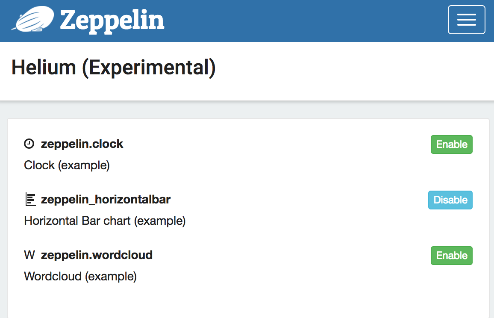
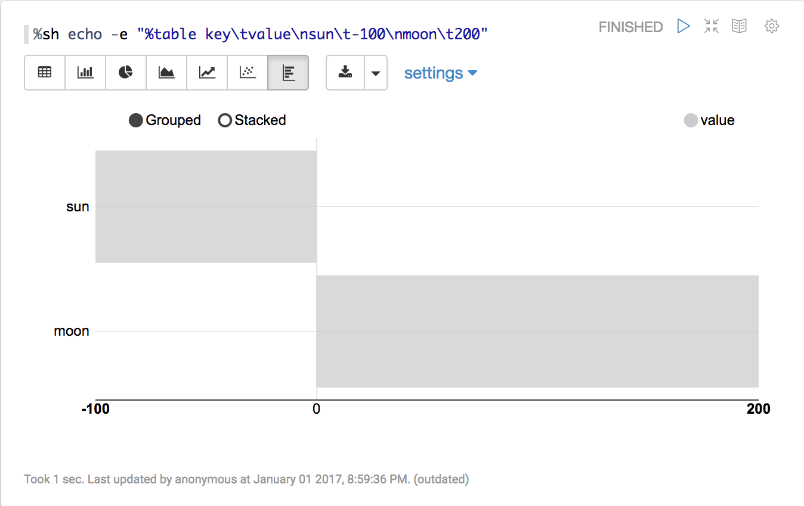

<!--
Licensed under the Apache License, Version 2.0 (the "License");
you may not use this file except in compliance with the License.
You may obtain a copy of the License at

http://www.apache.org/licenses/LICENSE-2.0

Unless required by applicable law or agreed to in writing, software
distributed under the License is distributed on an "AS IS" BASIS,
WITHOUT WARRANTIES OR CONDITIONS OF ANY KIND, either express or implied.
See the License for the specific language governing permissions and
limitations under the License.
-->


# Writing a new Visualization (Experimental)

<div id="toc"></div>

## What is Apache Zeppelin Visualization

Apache Zeppelin Visualization is a pluggable package that can be loaded/unloaded on runtime through Helium framework in Zeppelin. A Visualization is a javascript npm package and user can use them just like any other built-in visualization in notebook.


## How it works


#### 1. Load Helium package files from registry
Zeppelin needs to know what Visualization packages are available. Zeppelin searches _Helium package file_ from local registry (by default helium/ directory) by default.
_Helium package file_ provides informations like name, artifact, and so on. It's similar to _package.json_ in npm package.

Here's an example `helium/zeppelin-example-horizontalbar.json`

```
{
  "type" : "VISUALIZATION",
  "name" : "zeppelin_horizontalbar",
  "description" : "Horizontal Bar chart (example)",
  "artifact" : "./zeppelin-examples/zeppelin-example-horizontalbar",
  "license" : "Apache-2.0",
  "icon" : "<i class='fa fa-bar-chart rotate90flipX'></i>"
}
```

Check [Create helium package file](#3-create-helium-package-file) section to learn about it.


#### 2. Enable packages
Once Zeppelin loads _Helium package files_ from local registry, available packages are displayed in Helium menu.

Click 'enable' button.




#### 3. Create and load visualization bundle on the fly

Once a Visualization package is enabled, [HeliumVisualizationFactory](https://github.com/apache/zeppelin/blob/master/zeppelin-zengine/src/main/java/org/apache/zeppelin/helium/HeliumVisualizationPackage.java) creates a js bundle. The js bundle is served by `helium/visualization/load` rest api endpoint.


#### 4. Run visualization

Zeppelin shows additional button for loaded Visualizations.
User can use just like any other built-in visualizations.




## Write new Visualization

#### 1. Create a npm package

Create a [package.json](https://docs.npmjs.com/files/package.json) in your new Visualization directory. Normally, you can add any dependencies in package.json however Zeppelin Visualization package only allows two dependencies: [zeppelin-vis](https://github.com/apache/zeppelin/tree/master/zeppelin-web/src/app/visualization) and [zeppelin-tabledata](https://github.com/apache/zeppelin/tree/master/zeppelin-web/src/app/tabledata).

Here's an example

```
{
  "name": "zeppelin_horizontalbar",
  "description" : "Horizontal Bar chart",
  "version": "1.0.0",
  "main": "horizontalbar",
  "author": "",
  "license": "Apache-2.0",
  "dependencies": {
    "zeppelin-tabledata": "*",
    "zeppelin-vis": "*"
  }
}
```

#### 2. Create your own visualization

To create your own visualization, you need to create a js file and import [Visualization](https://github.com/apache/zeppelin/blob/master/zeppelin-web/src/app/visualization/visualization.js) class from [zeppelin-vis](https://github.com/apache/zeppelin/tree/master/zeppelin-web/src/app/visualization) package and extend the class. [zeppelin-tabledata](https://github.com/apache/zeppelin/tree/master/zeppelin-web/src/app/tabledata) package provides some useful transformations, like pivot, you can use in your visualization. (you can create your own transformation, too).

[Visualization](https://github.com/apache/zeppelin/blob/master/zeppelin-web/src/app/visualization/visualization.js) class, there're several methods that you need to override and implement. Here's simple visualization that just prints `Hello world`.

```
import Visualization from 'zeppelin-vis'
import PassthroughTransformation from 'zeppelin-tabledata/passthrough'

export default class helloworld extends Visualization {
  constructor(targetEl, config) {
    super(targetEl, config)
    this.passthrough = new PassthroughTransformation(config);
  }

  render(tableData) {
    this.targetEl.html('Hello world!')
  }

  getTransformation() {
    return this.passthrough
  }
}
```

To learn more about `Visualization` class, check [visualization.js](https://github.com/apache/zeppelin/blob/master/zeppelin-web/src/app/visualization/visualization.js).

You can check complete visualization package example [here](https://github.com/apache/zeppelin/tree/master/zeppelin-examples/zeppelin-example-horizontalbar).

Zeppelin's built-in visualization uses the same API, so you can check [built-in visualizations](https://github.com/apache/zeppelin/tree/master/zeppelin-web/src/app/visualization/builtins) as additional examples.


#### 3. Create __Helium package file__

__Helium Package file__ is a json file that provides information about the application.
Json file contains the following information

```
{
  "type" : "VISUALIZATION",
  "name" : "zeppelin_horizontalbar",
  "description" : "Horizontal Bar chart (example)",
  "license" : "Apache-2.0",
  "artifact" : "./zeppelin-examples/zeppelin-example-horizontalbar",
  "icon" : "<i class='fa fa-bar-chart rotate90flipX'></i>"
}
```

##### type

When you're creating a visualization, 'type' should be 'VISUALIZATION'.
Check [application](./writingzeppelinapplication.html) type if you're interested in the other types of package.

##### name

Name of visualization. Should be unique. Allows `[A-Za-z90-9_]`.


##### description

A short description about visualization.

##### artifact

Location of the visualization npm package. Support npm package with version or local filesystem path.

e.g.

When artifact exists in npm repository

```
artifact: "my-visualiztion@1.0.0"
```


When artifact exists in local file system

```
artifact: "/path/to/my/visualization"
```

##### license

License information.

e.g.

```
license: "Apache-2.0"
```

##### icon

Icon to be used in visualization select button. String in this field will be rendered as a HTML tag.

e.g.

```
icon: "<i class='fa fa-coffee'></i>"
```


#### 4. Run in dev mode

Place your __Helium package file__ in local registry (ZEPPELIN_HOME/helium).
Run Zeppelin. And then run zeppelin-web in visualization dev mode.

```
cd zeppelin-web
yarn run visdev
```

You can browse localhost:9000. Everytime refresh your browser, Zeppelin will rebuild your visualization and reload changes.
