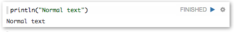
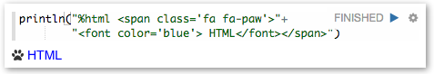
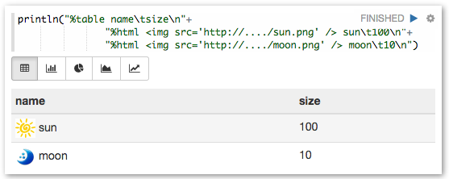
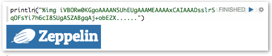



### Display

Zeppelin prints output of language backend in text, by default.
However, if output contains some magic keyword, Zeppelin automatically formatting the output as Table, Chart, Image, or Html.

 
#### Display as Text

If output has no magic keyword provided Zeppelin print the output in text.

 
#### Display as Html

If output starts with %html, it is interpreted as an html code.

 
#### Display as Table, Chart

If output starts with %table, it is interpreted as a table. Table can be seen as chart.

Output's format should be, row separated by '\n' (newline) and column separated by '\t' (tab). First row is header.

If table contents start with %html, it is interpreted as an HTML.

 
#### Display as Image

If output starts with %img, it is interpreted as base64 encoded image.

