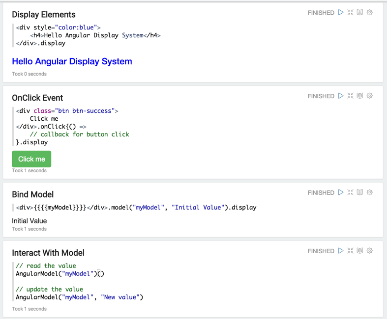

<!--
Licensed under the Apache License, Version 2.0 (the "License");
you may not use this file except in compliance with the License.
You may obtain a copy of the License at

http://www.apache.org/licenses/LICENSE-2.0

Unless required by applicable law or agreed to in writing, software
distributed under the License is distributed on an "AS IS" BASIS,
WITHOUT WARRANTIES OR CONDITIONS OF ANY KIND, either express or implied.
See the License for the specific language governing permissions and
limitations under the License.
-->


# Back-end Angular API in Apache Zeppelin

<div id="toc"></div>

## Overview

Angular display system treats output as a view template for [AngularJS](https://angularjs.org/).
It compiles templates and displays them inside of Apache Zeppelin. Zeppelin provides a gateway between your interpreter and your compiled **AngularJS view** templates.
Therefore, you can not only update scope variables from your interpreter but also watch them in the interpreter, which is JVM process.

## Basic Usage 
### Print AngularJS view

To use angular display system, you should start with `%angular`.


Since `name` is not defined, `Hello {{name}}` will display `Hello`.
> **Please Note:** Display system is backend independent.

<br />
### Bind / Unbind Variables

Through **ZeppelinContext**, you can bind / unbind variables to **AngularJS view**. Currently, it only works in **Spark Interpreter ( scala )**.

```scala
// bind my 'object' as angular scope variable 'name' in current notebook.
z.angularBind(String name, Object object)

// bind my 'object' as angular scope variable 'name' in all notebooks related to current interpreter.
z.angularBindGlobal(String name, Object object)

// unbind angular scope variable 'name' in current notebook.
z.angularUnbind(String name)

// unbind angular scope variable 'name' in all notebooks related to current interpreter.
z.angularUnbindGlobal(String name)

```

Using the above example, let's bind `world` variable to `name`. Then you can see **AngularJs view** is immediately updated.


<br />
### Watch / Unwatch Variables

Through **ZeppelinContext**, you can watch / unwatch variables in **AngularJs view**. Currently, it only works in **Spark Interpreter ( scala )**.

```scala
// register for angular scope variable 'name' (notebook)
z.angularWatch(String name, (before, after) => { ... })

// unregister watcher for angular variable 'name' (notebook)
z.angularUnwatch(String name)

// register for angular scope variable 'name' (global)
z.angularWatchGlobal(String name, (before, after) => { ... })

// unregister watcher for angular variable 'name' (global)
z.angularUnwatchGlobal(String name)


```

Let's make a button. When it is clicked, the value of `run` will be increased 1 by 1.


`z.angularBind("run", 0)` will initialize `run` to zero. And then, it will be also applied to `run` in `z.angularWatch()`.
When the button is clicked, you'll see both `run` and `numWatched` are incremented by 1.


## Let's make it Simpler and more Intuitive
In this section, we will introduce a simpler and more intuitive way of using **Angular Display System** in Zeppelin.

Here are some usages.

### Import
```scala
// In notebook scope
import org.apache.zeppelin.display.angular.notebookscope._
import AngularElem._

// In paragraph scope
import org.apache.zeppelin.display.angular.paragraphscope._
import AngularElem._
```

### Display Element
```scala
// automatically convert to string and print with %angular display system directive in front.
<div><div>.display
```
### Event Handler
```scala
// on click
<div></div>.onClick(() => {
   my callback routine
}).display

// on change
<div></div>.onChange(() => {
  my callback routine
}).display

// arbitrary event
<div></div>.onEvent("ng-click", () => {
  my callback routine
}).display
```

### Bind Model
```scala
// bind model
<div></div>.model("myModel").display

// bind model with initial value
<div></div>.model("myModel", initialValue).display
```

### Interact with Model
```scala
// read model
AngularModel("myModel")()

// update model
AngularModel("myModel", "newValue")
```

<br/>
### Example: Basic Usage
Using the above basic usages, you can apply them like below examples.

#### Display Elements

```scala
<div style="color:blue">
  <h4>Hello Angular Display System</h4>
</div>.display
```

#### OnClick Event
```scala
<div class="btn btn-success">
  Click me
</div>.onClick{() =>
  // callback for button click
}.display
```

#### Bind Model


```scala
  <div>{{{{myModel}}}}</div>.model("myModel", "Initial Value").display
```


#### Interact With Model
```scala
// read the value
AngularModel("myModel")()

// update the value
AngularModel("myModel", "New value")
```



### Example: String Converter
Using below example, you can convert the lowercase string to uppercase.


```scala
// clear previously created angular object.
AngularElem.disassociate

val button = <div class="btn btn-success btn-sm">Convert</div>.onClick{() =>
  val inputString = AngularModel("input")().toString
  AngularModel("title", inputString.toUpperCase)
}

<div>
  { <h4> {{{{title}}}}</h4>.model("title", "Please type text to convert uppercase") }
   Your text { <input type="text"></input>.model("input", "") }
  {button}
</div>.display
```



