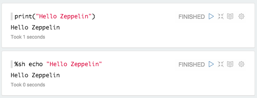
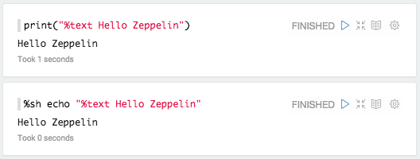
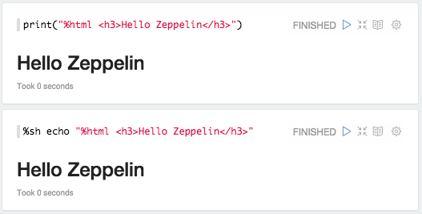
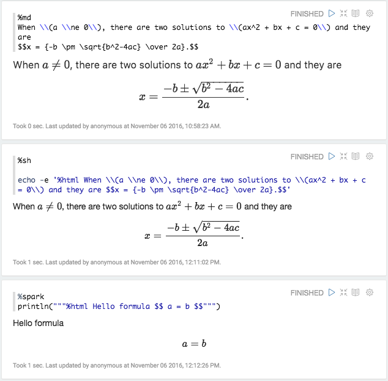
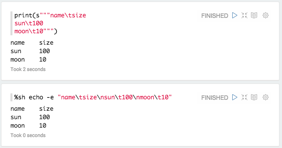
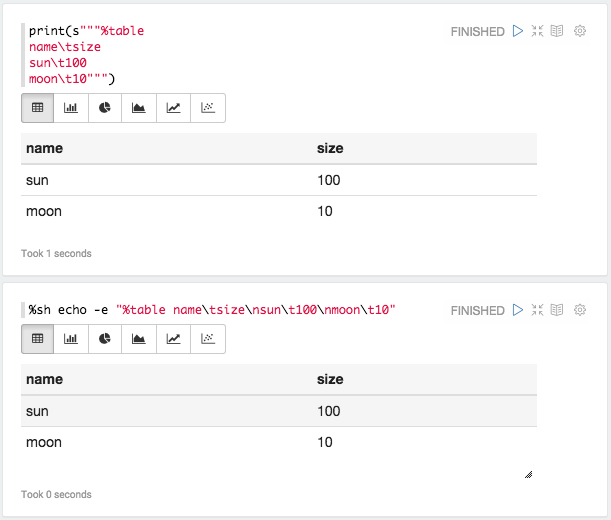
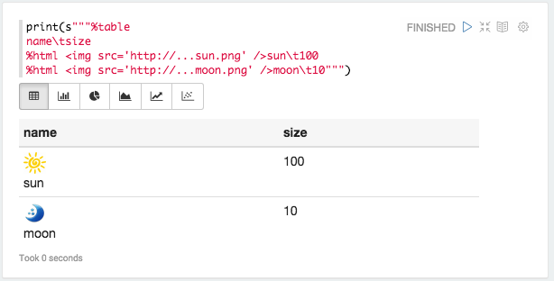

<!--
Licensed under the Apache License, Version 2.0 (the "License");
you may not use this file except in compliance with the License.
You may obtain a copy of the License at

http://www.apache.org/licenses/LICENSE-2.0

Unless required by applicable law or agreed to in writing, software
distributed under the License is distributed on an "AS IS" BASIS,
WITHOUT WARRANTIES OR CONDITIONS OF ANY KIND, either express or implied.
See the License for the specific language governing permissions and
limitations under the License.
-->


# Basic Display System in Apache Zeppelin

## Text

By default, Apache Zeppelin prints interpreter response as a plain text using `text` display system.

You can explicitly say you're using `text` display system.

## Html

With `%html` directive, Zeppelin treats your output as HTML

### Mathematical expressions
HTML display system automatically formats mathematical expression using [MathJax](https://www.mathjax.org/). You can use
`\\( INLINE EXPRESSION \\)` and `$$ EXPRESSION $$` to format. For example

## Table

If you have data that row separated by `\n` (newline) and column separated by `\t` (tab) with first row as header row, for example

You can simply use `%table` display system to leverage Zeppelin's built in visualization.

If table contents start with `%html`, it is interpreted as an HTML.

> **Note :** Display system is backend independent.
