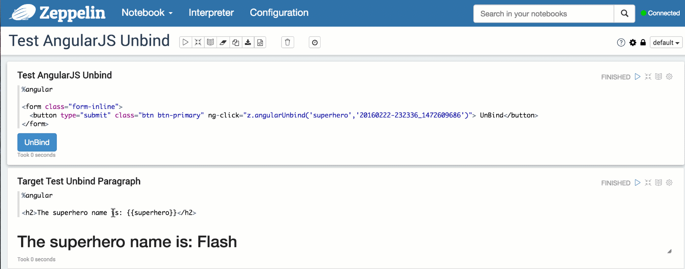

<!--
Licensed under the Apache License, Version 2.0 (the "License");
you may not use this file except in compliance with the License.
You may obtain a copy of the License at

http://www.apache.org/licenses/LICENSE-2.0

Unless required by applicable law or agreed to in writing, software
distributed under the License is distributed on an "AS IS" BASIS,
WITHOUT WARRANTIES OR CONDITIONS OF ANY KIND, either express or implied.
See the License for the specific language governing permissions and
limitations under the License.
-->



## Front-end Angular API in Zeppelin

In addition to the back-end API to handle Angular objects binding, Zeppelin also exposes a simple AngularJS **`z`** object on the front-end side to expose the same capabilities.

This **`z`** object is accessible in the Angular isolated scope for each paragraph.

<br />
### Bind / Unbind Variables

Through the **`z`**, you can bind / unbind variables to **AngularJS view**

Bind a value to an angular object and a **mandatory** target paragraph:

```html

%angular

<form class="form-inline">
  <div class="form-group">
    <label for="superheroId">Super Hero: </label>
    <input type="text" class="form-control" id="superheroId" placeholder="Superhero name ..." ng-model="superhero"></input>
  </div>
  <button type="submit" class="btn btn-primary" ng-click="z.angularBind('superhero',superhero,'20160222-232336_1472609686')"> Bind</button>
</form>

```


<hr/>

Unbind/remove a value from angular object and a **mandatory** target paragraph:

```html

%angular

<form class="form-inline">
  <button type="submit" class="btn btn-primary" ng-click="z.angularUnbind('superhero','20160222-232336_1472609686')"> UnBind</button>
</form>

```



The signature for the **`z.angularBind() / z.angularUnbind()`** functions are:

```javascript

z.angularBind(angularObjectName, angularObjectValue, paragraphId);

z.angularUnbind(angularObjectName, angularObjectValue, paragraphId);

```

All the parameters are mandatory.


<br />
### Run Paragraph

You can also trigger paragraph execution by calling **`z.runParagraph()`** function passing the appropriate paragraphId: 

```html

%angular

<form class="form-inline">
  <div class="form-group">
    <label for="paragraphId">Paragraph Id: </label>
    <input type="text" class="form-control" id="paragraphId" placeholder="Paragraph Id ..." ng-model="paragraph"></input>
  </div>
  <button type="submit" class="btn btn-primary" ng-click="z.runParagraph(paragraph)"> Run Paragraph</button>
</form>

```


<br />
### Overriding dynamic form with Angular Object

The front-end Angular Interaction API has been designed to offer richer form capabilities and variable binding. With the existing **Dynamic Form** system you can already create input text, select and checkbox forms but the choice is rather limited and the look & feel cannot be changed.

The idea is to create a custom form using plain HTML/AngularJS code and bind actions on this form to push/remove Angular variables to targeted paragraphs using this new API. 

Consequently if you use the **Dynamic Form** syntax in a paragraph and there is a bound Angular object having the same name as the _${formName}_, the Angular object will have higher priority and the **Dynamic Form** will not be displayed. Example: 
 


<br />
### Feature matrix comparison

How does the front-end AngularJS API compares to the back-end API ? Below is a comparison matrix for both APIs:

<table>
    <thead>
        <tr>
            <th>Actions</th>
            <th>Front-end API</th>
            <th>Back-end API</th>
        </tr>
    </thead>
        <tr>
            <td>Initiate binding</td>
            <td>z.angularbind(var, initialValue, paragraphId)</td>
            <td>z.angularBind(var, initialValue)</td>
        </tr>
        <tr>
            <td>Update value</td>
            <td>same to ordinary angularjs scope variable, or z.angularbind(var, newValue, paragraphId)</td>
            <td>z.angularBind(var, newValue)</td>
        </tr>
        <tr>
            <td>Watching value</td>
            <td>same to ordinary angularjs scope variable</td>
            <td>z.angularWatch(var, (oldVal, newVal) => ...)</td>
        </tr>
        <tr>
            <td>Destroy binding</td>
            <td>z.angularUnbind(var, paragraphId)</td>
            <td>z.angularUnbind(var)</td>
        </tr>
        <tr>
            <td>Executing Paragraph</td>
            <td>z.runParagraph(paragraphId)</td>
            <td>z.run(paragraphId)</td>
        </tr>                                
    <tbody>
    <tbody>    
</table>

Both APIs are pretty similar, except for value watching where it is done naturally by AngularJS internals on the front-end and by user custom watcher functions in the back-end.

There is also a slight difference in term of scope. Front-end API limits the Angular object binding to a paragraph scope whereas back-end API allows you to bind an Angular object at the global or note scope. This restriction has been designed purposely to avoid Angular object leaks and scope pollution.
