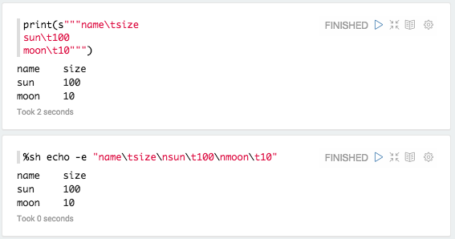



### Table

If you have data that row seprated by '\n' (newline) and column separated by '\t' (tab) with first row as header row, for example

You can simply use %table display system to leverage Zeppelin's built in visualization.

Note that display system is backend independent.

If table contents start with %html, it is interpreted as an HTML.

