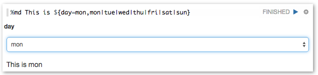
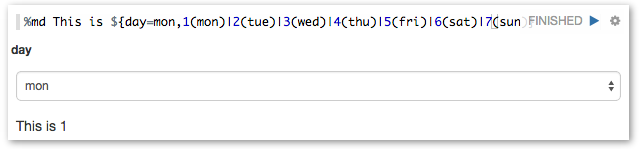
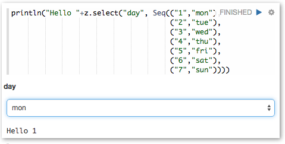



## Dynamic Form

Zeppelin dynamically creates input forms. Depending on language backend, there're two different ways to create dynamic form.
Custom language backend can select which type of form creation it wants to use.

 
### Using form Templates

This mode creates form using simple template language. It's simple and easy to use. For example Markdown, Shell, SparkSql language backend uses it.

 
#### Text input form

To create text input form, use _${formName}_ templates.

for example

Also you can provide default value, using _${formName=defaultValue}_.

 
#### Select form

To create select form, use _${formName=defaultValue,option1|option2...}_

for example

Also you can separate option's display name and value, using _${formName=defaultValue,option1(DisplayName)|option2(DisplayName)...}_

 
### Creates Programmatically

Some language backend uses programmatic way to create form. For example [ZeppelinContext](./interpreter/spark.html#zeppelincontext) provides form creation API

Here're some examples.

Text input form

Text input form with default value

Select form

