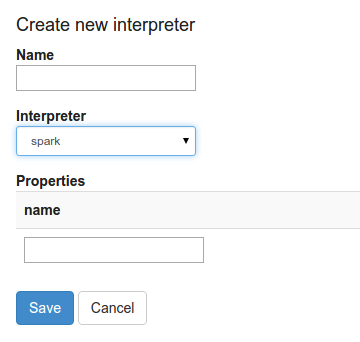
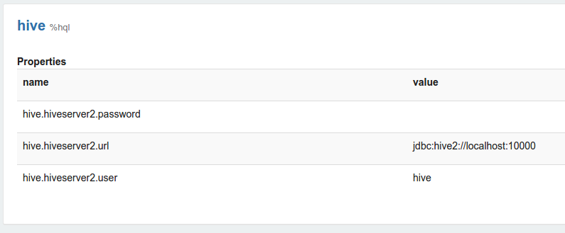
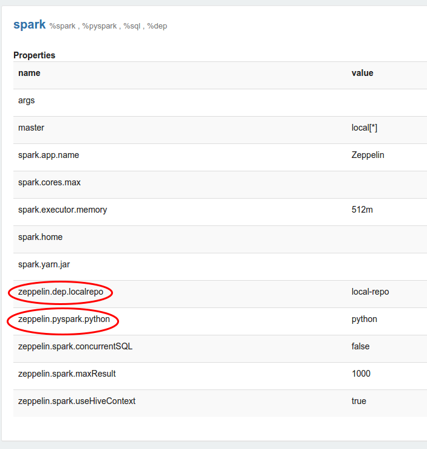




## Interpreters in zeppelin

This section explain the role of Interpreters, interpreters group and interpreters settings in Zeppelin.
Zeppelin interpreter concept allows any language/data-processing-backend to be plugged into Zeppelin.
Currently Zeppelin supports many interpreters such as Scala(with Apache Spark), Python(with Apache Spark), SparkSQL, Hive, Markdown and Shell.

### What is zeppelin interpreter?

Zeppelin Interpreter is the plug-in which enable zeppelin user to use a specific language/data-processing-backend. For example to use scala code in Zeppelin, you need ```spark``` interpreter.

When you click on the ```+Create``` button in the interpreter page the interpreter drop-down list box will present all the available interpreters on your server.



### What is zeppelin interpreter setting?

Zeppelin interpreter setting is the configuration of a given interpreter on zeppelin server. For example, the properties requried for hive  JDBC interpreter to connect to the Hive server.


### What is zeppelin interpreter group?

Every Interpreter belongs to an InterpreterGroup. InterpreterGroup is a unit of start/stop interpreter.
By default, every interpreter belong to a single group but the group might contain more interpreters. For example, spark interpreter group include spark support, pySpark, 
SparkSQL and the dependency loader.

Technically, Zeppelin interpreters from the same group are running in the same JVM.

Interpreters belong to a single group a registered together and all of their properties are listed in the interpreter setting.


### Programming langages for interpreter

If the interpreter uses a specific programming language (like Scala, Python, SQL), it is generally a good idea to add syntax highlighting support for that to the notebook paragraph editor.  
  
To check out the list of languages supported, see the mode-*.js files under zeppelin-web/bower_components/ace-builds/src-noconflict or from github https://github.com/ajaxorg/ace-builds/tree/master/src-noconflict  
  
To add a new set of syntax highlighting,  
1. add the mode-*.js file to zeppelin-web/bower.json (when built, zeppelin-web/src/index.html will be changed automatically)  
2. add to the list of `editorMode` in zeppelin-web/src/app/notebook/paragraph/paragraph.controller.js - it follows the pattern 'ace/mode/x' where x is the name  
3. add to the code that checks for `%` prefix and calls `session.setMode(editorMode.x)` in `setParagraphMode` in zeppelin-web/src/app/notebook/paragraph/paragraph.controller.js  
  

