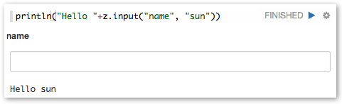
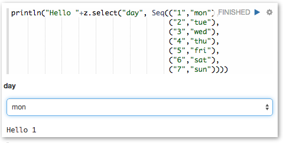



## Dynamic Form

Zeppelin dynamically creates input forms. Depend on language backend, there're two different way to create dynamic form.
Custom lanaugage backend can select which type of form creation he want to use.

 
### Using form Templates

This mode creates form using simple template language. It's simple and easy to use. For example Markdown, Shell, SparkSql language backend uses it.

 
#### Text input form

To create text input form, use _${formName}_ templates.

for example

Also you can provide default value, using _${formName=defaultValue}_.

 
#### Select form

To create select form, use _${formName=defaultValue,option1|option2...}_

for example

Also you can separate option's display name and value, using _${formName=defaultValue,option1(DisplayName)|option2(DisplayName)...}_

 
### Creates Programatically

Some language backend use programtic way to create form. for example [ZeppelinContext](./interpreter/spark.html#zeppelincontext) provides form creation API

Here're some examples.

Text input form

Text input form with default value

Select form

