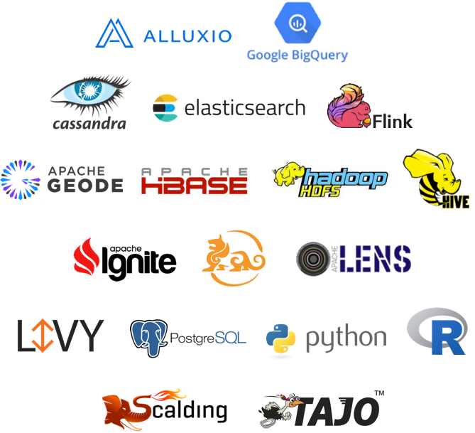
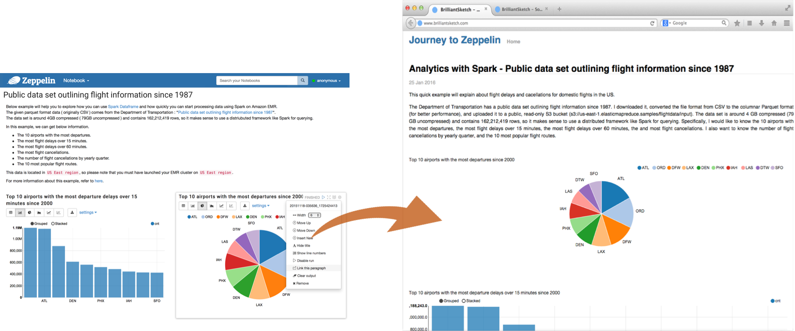

<!--
Licensed under the Apache License, Version 2.0 (the "License");
you may not use this file except in compliance with the License.
You may obtain a copy of the License at

http://www.apache.org/licenses/LICENSE-2.0

Unless required by applicable law or agreed to in writing, software
distributed under the License is distributed on an "AS IS" BASIS,
WITHOUT WARRANTIES OR CONDITIONS OF ANY KIND, either express or implied.
See the License for the specific language governing permissions and
limitations under the License.
-->

 

  

    <h1 style="color:#4c555a">Multi-purpose Notebook</h1>
    

      The Notebook is the place for all your needs
    

    <ul style="list-style-type: none;padding-left:10px;" >
      <li style="font-size:18px; margin: 5px;"> Data Ingestion</li>
      <li style="font-size:18px; margin: 5px;"> Data Discovery</li>
      <li style="font-size:18px; margin: 5px;"> Data Analytics</li>
      <li style="font-size:18px; margin: 5px;"> Data Visualization & Collaboration</li>
    </ul>
  

  

    
  

 
## Multiple Language Backend
[Apache Zeppelin interpreter](./manual/interpreters.html) concept allows any language/data-processing-backend to be plugged into Zeppelin.
Currently Apache Zeppelin supports many interpreters such as Apache Spark, Python, JDBC, Markdown and Shell.

Adding new language-backend is really simple. Learn [how to create your own interpreter](./development/writingzeppelininterpreter.html#make-your-own-interpreter).

#### Apache Spark integration
Especially, Apache Zeppelin provides built-in [Apache Spark](http://spark.apache.org/) integration. You don't need to build a separate module, plugin or library for it.

Apache Zeppelin with Spark integration provides

- Automatic SparkContext and SQLContext injection
- Runtime jar dependency loading from local filesystem or maven repository. Learn more about [dependency loader](./interpreter/spark.html#dependencyloading).
- Canceling job and displaying its progress

For the further information about Apache Spark in Apache Zeppelin, please see [Spark interpreter for Apache Zeppelin](./interpreter/spark.html).

 
## Data visualization

Some basic charts are already included in Apache Zeppelin. Visualizations are not limited to Spark SQL query, any output from any language backend can be recognized and visualized.

  

    
  

  

    
  

### Pivot chart

Apache Zeppelin aggregates values and displays them in pivot chart with simple drag and drop. You can easily create chart with multiple aggregated values including sum, count, average, min, max.

  

    
  

Learn more about [display systems](#display-system) in Apache Zeppelin.

 
## Dynamic forms

Apache Zeppelin can dynamically create some input forms in your notebook.

  

    
  

Learn more about [Dynamic Forms](./manual/dynamicform.html).

 
## Collaborate by sharing your Notebook & Paragraph
Your notebook URL can be shared among collaborators. Then Apache Zeppelin will broadcast any changes in realtime, just like the collaboration in Google docs.

  

    
  

Apache Zeppelin provides an URL to display the result only, that page does not include any menus and buttons inside of notebooks.
You can easily embed it as an iframe inside of your website in this way.
If you want to learn more about this feature, please visit [this page](./manual/publish.html).

 
## 100% Opensource

Apache Zeppelin is Apache2 Licensed software. Please check out the [source repository](http://git.apache.org/zeppelin.git) and [how to contribute](https://zeppelin.apache.org/contribution/contributions.html).
Apache Zeppelin has a very active development community.
Join to our [Mailing list](https://zeppelin.apache.org/community.html) and report issues on [Jira Issue tracker](https://issues.apache.org/jira/browse/ZEPPELIN).

## What is the next ?

####Quick Start

* Getting Started
  * [Quick Start](./install/install.html) for basic instructions on installing Apache Zeppelin
  * [Configuration](./install/install.html#apache-zeppelin-configuration) lists for Apache Zeppelin
  * [Explore Apache Zeppelin UI](./quickstart/explorezeppelinui.html): basic components of Apache Zeppelin home
  * [Tutorial](./quickstart/tutorial.html): a short walk-through tutorial that uses Apache Spark backend
* Basic Feature Guide
  * [Dynamic Form](./manual/dynamicform.html): a step by step guide for creating dynamic forms
  * [Publish your Paragraph](./manual/publish.html) results into your external website
  * [Customize Zeppelin Homepage](./manual/notebookashomepage.html) with one of your notebooks
* More
  * [Upgrade Apache Zeppelin Version](./install/upgrade.html): a manual procedure of upgrading Apache Zeppelin version
  * [Build](./install/build.html): Build from source

####Interpreter

* [Interpreters in Apache Zeppelin](./manual/interpreters.html): what is interpreter group? how can you set interpreters in Apache Zeppelin?
* Usage
  * [Interpreter Installation](./manual/interpreterinstallation.html): Install not only community managed interpreters but also 3rd party interpreters
  * [Interpreter Dependency Management](./manual/dependencymanagement.html) when you include external libraries to interpreter
  * [Interpreter User Impersonation](./manual/userimpersonation.html) when you want to run interpreter as end user
  * [Interpreter Execution Hooks](./manual/interpreterexechooks.html) to specify additional code to be executed by an interpreter at pre and post-paragraph code execution
* Available Interpreters: currently, about 20 interpreters are available in Apache Zeppelin.

####Display System

* Basic Display System: [Text](./displaysystem/basicdisplaysystem.html#text), [HTML](./displaysystem/basicdisplaysystem.html#html), [Table](./displaysystem/basicdisplaysystem.html#table) is available
* Angular API: a description about avilable backend and frontend AngularJS API with examples
  * [Angular (backend API)](./displaysystem/back-end-angular.html)
  * [Angular (frontend API)](./displaysystem/front-end-angular.html)

####More

* Notebook Storage: a guide about saving notebooks to external storage
  * [Git Storage](./storage/storage.html#notebook-storage-in-local-git-repository)
  * [S3 Storage](./storage/storage.html#notebook-storage-in-s3)
  * [Azure Storage](./storage/storage.html#notebook-storage-in-azure)
  * [ZeppelinHub Storage](./storage/storage.html#storage-in-zeppelinhub)
* REST API: available REST API list in Apache Zeppelin
  * [Interpreter API](./rest-api/rest-interpreter.html)
  * [Notebook API](./rest-api/rest-notebook.html)
  * [Configuration API](./rest-api/rest-configuration.html)
  * [Credential API](./rest-api/rest-credential.html)
* Security: available security support in Apache Zeppelin
  * [Authentication for NGINX](./security/authentication.html)
  * [Shiro Authentication](./security/shiroauthentication.html)
  * [Notebook Authorization](./security/notebook_authorization.html)
  * [Data Source Authorization](./security/datasource_authorization.html)
* Advanced
  * [Apache Zeppelin on Vagrant VM](./install/virtual_machine.html)
  * [Zeppelin on Spark Cluster Mode (Standalone via Docker)](./install/spark_cluster_mode.html#spark-standalone-mode)
  * [Zeppelin on Spark Cluster Mode (YARN via Docker)](./install/spark_cluster_mode.html#spark-on-yarn-mode)
  * [Zeppelin on Spark Cluster Mode (Mesos via Docker)](./install/spark_cluster_mode.html#spark-on-mesos-mode)
  * [Zeppelin on CDH (via Docker)](./install/cdh.html)
* Contribute
  * [Writing Zeppelin Interpreter](./development/writingzeppelininterpreter.html)
  * [Writing Zeppelin Application (Experimental)](./development/writingzeppelinapplication.html)
  * [How to contribute (code)](./development/howtocontribute.html)
  * [How to contribute (documentation website)](./development/howtocontributewebsite.html)

#### External Resources
  * [Mailing List](https://zeppelin.apache.org/community.html)
  * [Apache Zeppelin Wiki](https://cwiki.apache.org/confluence/display/ZEPPELIN/Zeppelin+Home)
  * [StackOverflow tag `apache-zeppelin`](http://stackoverflow.com/questions/tagged/apache-zeppelin)
