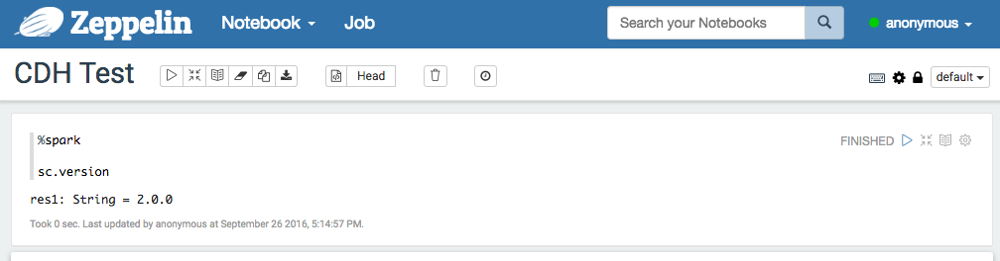
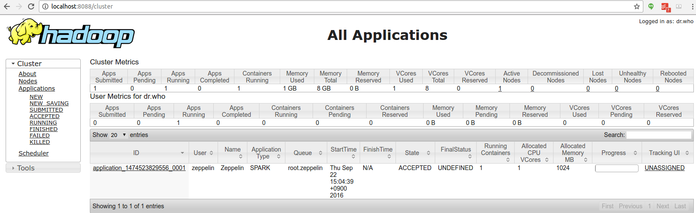

<!--
Licensed under the Apache License, Version 2.0 (the "License");
you may not use this file except in compliance with the License.
You may obtain a copy of the License at

http://www.apache.org/licenses/LICENSE-2.0

Unless required by applicable law or agreed to in writing, software
distributed under the License is distributed on an "AS IS" BASIS,
WITHOUT WARRANTIES OR CONDITIONS OF ANY KIND, either express or implied.
See the License for the specific language governing permissions and
limitations under the License.
-->


# Apache Zeppelin on CDH

Cloudera officially provide docker container so we can easily build CDH docker environment following the [link](http://www.cloudera.com/documentation/enterprise/latest/topics/quickstart_docker_container.html).

### 1. Importing the Cloudera QuickStart Docker Image

```
docker pull cloudera/quickstart:latest
```


### 2. Run docker

```
docker run -it \
 -p 80:80 \
 -p 4040:4040 \
 -p 8020:8020 \
 -p 8022:8022 \
 -p 8030:8030 \
 -p 8032:8032 \
 -p 8033:8033 \
 -p 8040:8040 \
 -p 8042:8042 \
 -p 8088:8088 \
 -p 8480:8480 \
 -p 8485:8485 \
 -p 8888:8888 \
 -p 9083:9083 \
 -p 10020:10020 \
 -p 10033:10033 \
 -p 18088:18088 \
 -p 19888:19888 \
 -p 25000:25000 \
 -p 25010:25010 \
 -p 25020:25020 \
 -p 50010:50010 \
 -p 50020:50020 \
 -p 50070:50070 \
 -p 50075:50075 \
 -h quickstart.cloudera --privileged=true \
 agitated_payne_backup /usr/bin/docker-quickstart;
```

### 3. Verify running CDH.

You can see each application web UI for HDFS on `http://<hostname>:50070/`, YARN on `http://<hostname>:8088/cluster`.


### 4. Configure Spark interpreter in Zeppelin
Set following configurations to `conf/zeppelin-env.sh`.

```
export MASTER=yarn-client
export HADOOP_CONF_DIR=[your_hadoop_conf_path]
export SPARK_HOME=[your_spark_home_path]
```

`HADOOP_CONF_DIR`(Hadoop configuration path) is defined in `/scripts/docker/spark-cluster-managers/cdh/hdfs_conf`.

Don't forget to set Spark `master` as `yarn-client` in Zeppelin **Interpreters** setting page like below.


### 5. Run Zeppelin with Spark interpreter
After running a single paragraph with Spark interpreter in Zeppelin,



You can browse `http://<hostname>:8088/cluster/apps` for Zeppelin application is running well or not.


