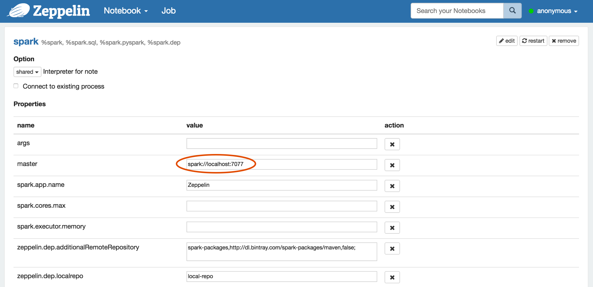
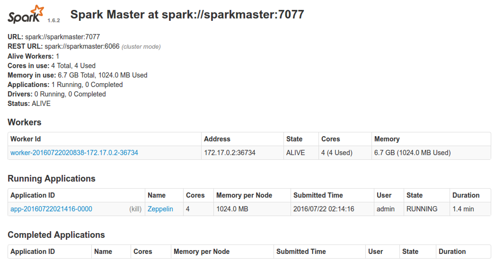
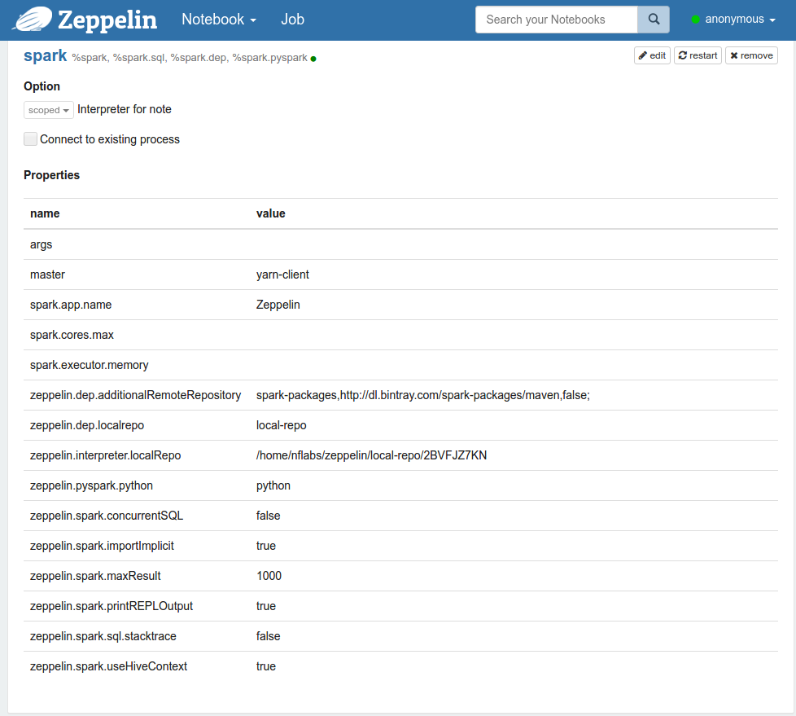
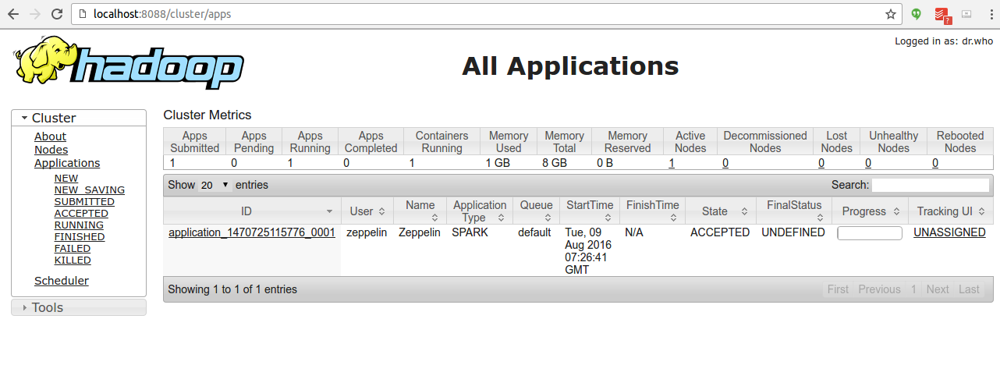
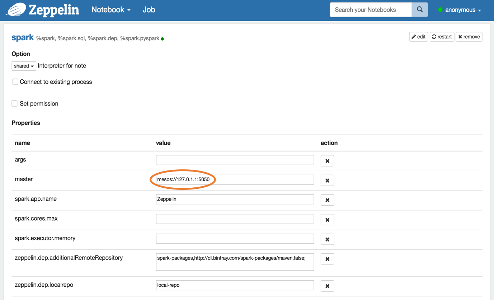
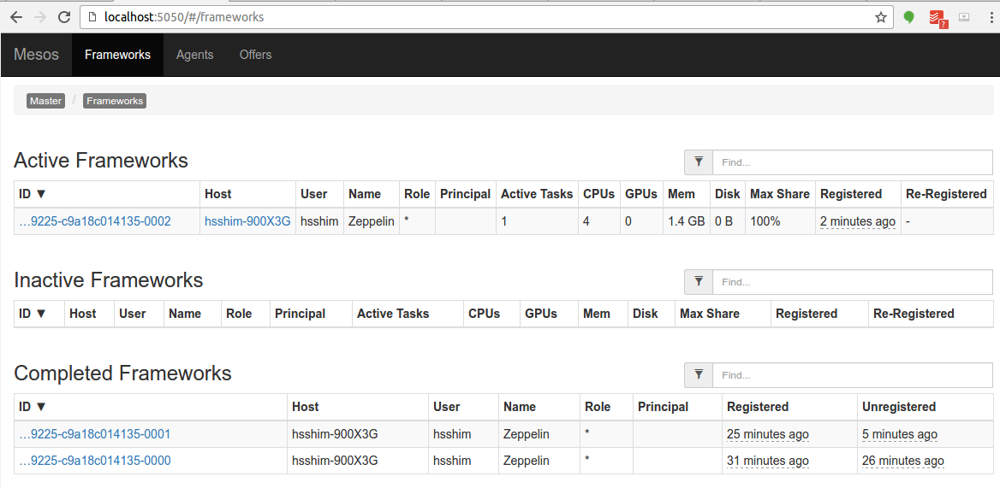

<!--
Licensed under the Apache License, Version 2.0 (the "License");
you may not use this file except in compliance with the License.
You may obtain a copy of the License at

http://www.apache.org/licenses/LICENSE-2.0

Unless required by applicable law or agreed to in writing, software
distributed under the License is distributed on an "AS IS" BASIS,
WITHOUT WARRANTIES OR CONDITIONS OF ANY KIND, either express or implied.
See the License for the specific language governing permissions and
limitations under the License.
-->


# Apache Zeppelin on Spark Cluster Mode

<div id="toc"></div>

## Overview
[Apache Spark](http://spark.apache.org/) has supported three cluster manager types([Standalone](http://spark.apache.org/docs/latest/spark-standalone.html), [Apache Mesos](http://spark.apache.org/docs/latest/running-on-mesos.html) and [Hadoop YARN](http://spark.apache.org/docs/latest/running-on-yarn.html)) so far.
This document will guide you how you can build and configure the environment on 3 types of Spark cluster manager with Apache Zeppelin using [Docker](https://www.docker.com/) scripts.
So [install docker](https://docs.docker.com/engine/installation/) on the machine first.

## Spark standalone mode
[Spark standalone](http://spark.apache.org/docs/latest/spark-standalone.html) is a simple cluster manager included with Spark that makes it easy to set up a cluster.
You can simply set up Spark standalone environment with below steps.

> **Note :** Since Apache Zeppelin and Spark use same `8080` port for their web UI, you might need to change `zeppelin.server.port` in `conf/zeppelin-site.xml`.


### 1. Build Docker file
You can find docker script files under `scripts/docker/spark-cluster-managers`.

```
cd $ZEPPELIN_HOME/scripts/docker/spark-cluster-managers/spark_standalone
docker build -t "spark_standalone" .
```

### 2. Run docker

```
docker run -it \
-p 8080:8080 \
-p 7077:7077 \
-p 8888:8888 \
-p 8081:8081 \
-h sparkmaster \
--name spark_standalone \
spark_standalone bash;
```

Note that `sparkmaster` hostname used here to run docker container should be defined in your `/etc/hosts`.

### 3. Configure Spark interpreter in Zeppelin
Set Spark master as `spark://<hostname>:7077` in Zeppelin **Interpreters** setting page.



### 4. Run Zeppelin with Spark interpreter
After running single paragraph with Spark interpreter in Zeppelin, browse `https://<hostname>:8080` and check whether Spark cluster is running well or not.



You can also simply verify that Spark is running well in Docker with below command.

```
ps -ef | grep spark
```


## Spark on YARN mode
You can simply set up [Spark on YARN](http://spark.apache.org/docs/latest/running-on-yarn.html) docker environment with below steps.

> **Note :** Since Apache Zeppelin and Spark use same `8080` port for their web UI, you might need to change `zeppelin.server.port` in `conf/zeppelin-site.xml`.

### 1. Build Docker file
You can find docker script files under `scripts/docker/spark-cluster-managers`.

```
cd $ZEPPELIN_HOME/scripts/docker/spark-cluster-managers/spark_yarn_cluster
docker build -t "spark_yarn" .
```

### 2. Run docker

```
docker run -it \
 -p 5000:5000 \
 -p 9000:9000 \
 -p 9001:9001 \
 -p 8088:8088 \
 -p 8042:8042 \
 -p 8030:8030 \
 -p 8031:8031 \
 -p 8032:8032 \
 -p 8033:8033 \
 -p 8080:8080 \
 -p 7077:7077 \
 -p 8888:8888 \
 -p 8081:8081 \
 -p 50010:50010 \
 -p 50075:50075 \
 -p 50020:50020 \
 -p 50070:50070 \
 --name spark_yarn \
 -h sparkmaster \
 spark_yarn bash;
```

Note that `sparkmaster` hostname used here to run docker container should be defined in your `/etc/hosts`.

### 3. Verify running Spark on YARN.

You can simply verify the processes of Spark and YARN are running well in Docker with below command.

```
ps -ef
```

You can also check each application web UI for HDFS on `http://<hostname>:50070/`, YARN on `http://<hostname>:8088/cluster` and Spark on `http://<hostname>:8080/`.

### 4. Configure Spark interpreter in Zeppelin
Set following configurations to `conf/zeppelin-env.sh`.

```
export MASTER=yarn-client
export HADOOP_CONF_DIR=[your_hadoop_conf_path]
export SPARK_HOME=[your_spark_home_path]
```

`HADOOP_CONF_DIR`(Hadoop configuration path) is defined in `/scripts/docker/spark-cluster-managers/spark_yarn_cluster/hdfs_conf`.

Don't forget to set Spark `master` as `yarn-client` in Zeppelin **Interpreters** setting page like below.



### 5. Run Zeppelin with Spark interpreter
After running a single paragraph with Spark interpreter in Zeppelin, browse `http://<hostname>:8088/cluster/apps` and check Zeppelin application is running well or not.




## Spark on Mesos mode
You can simply set up [Spark on Mesos](http://spark.apache.org/docs/latest/running-on-mesos.html) docker environment with below steps.


### 1. Build Docker file

```
cd $ZEPPELIN_HOME/scripts/docker/spark-cluster-managers/spark_mesos
docker build -t "spark_mesos" .
```


### 2. Run docker

```
docker run --net=host -it \
-p 8080:8080 \
-p 7077:7077 \
-p 8888:8888 \
-p 8081:8081 \
-p 8082:8082 \
-p 5050:5050 \
-p 5051:5051 \
-p 4040:4040 \
-h sparkmaster \
--name spark_mesos \
spark_mesos bash;
```

Note that `sparkmaster` hostname used here to run docker container should be defined in your `/etc/hosts`.

### 3. Verify running Spark on Mesos.

You can simply verify the processes of Spark and Mesos are running well in Docker with below command.

```
ps -ef
```

You can also check each application web UI for Mesos on `http://<hostname>:5050/cluster` and Spark on `http://<hostname>:8080/`.


### 4. Configure Spark interpreter in Zeppelin

```
export MASTER=mesos://127.0.1.1:5050
export MESOS_NATIVE_JAVA_LIBRARY=[PATH OF libmesos.so]
export SPARK_HOME=[PATH OF SPARK HOME]
```


Don't forget to set Spark `master` as `mesos://127.0.1.1:5050` in Zeppelin **Interpreters** setting page like below.




### 5. Run Zeppelin with Spark interpreter
After running a single paragraph with Spark interpreter in Zeppelin, browse `http://<hostname>:5050/#/frameworks` and check Zeppelin application is running well or not.


