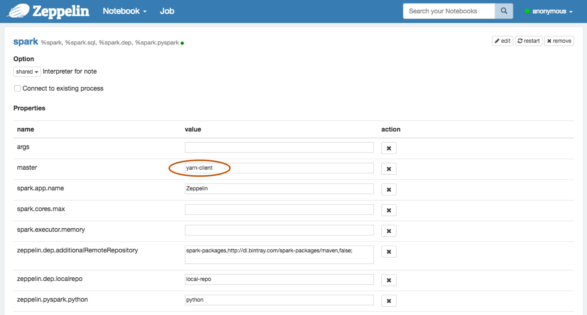

<!--
Licensed under the Apache License, Version 2.0 (the "License");
you may not use this file except in compliance with the License.
You may obtain a copy of the License at

http://www.apache.org/licenses/LICENSE-2.0

Unless required by applicable law or agreed to in writing, software
distributed under the License is distributed on an "AS IS" BASIS,
WITHOUT WARRANTIES OR CONDITIONS OF ANY KIND, either express or implied.
See the License for the specific language governing permissions and
limitations under the License.
-->


# Apache Zeppelin on Spark Cluster Mode

<div id="toc"></div>

## Overview 
[Apache Spark](http://spark.apache.org/) has supported three cluster manager types([Standalone](http://spark.apache.org/docs/latest/spark-standalone.html), [Apache Mesos](http://spark.apache.org/docs/latest/running-on-mesos.html) and [Hadoop YARN](http://spark.apache.org/docs/latest/running-on-yarn.html)) so far.
This document will guide you how you can build and configure the environment on 3 types of Spark cluster manager with Apache Zeppelin using [Docker](https://www.docker.com/) scripts.
So [install docker](https://docs.docker.com/engine/installation/) on the machine first.

## Spark standalone mode
[Spark standalone](http://spark.apache.org/docs/latest/spark-standalone.html) is a simple cluster manager included with Spark that makes it easy to set up a cluster.
You can simply set up Spark standalone environment with below steps. 

> **Note :** Since Apache Zeppelin and Spark use same `8080` port for their web UI, you might need to change `zeppelin.server.port` in `conf/zeppelin-site.xml`.

### 1. Build Docker file
You can find docker script files under `scripts/docker/spark-cluster-managers`.

```
cd $ZEPPELIN_HOME/scripts/docker/spark-cluster-managers/spark_standalone
docker build -t "spark_standalone" .
```

### 2. Run docker

```
docker run -it \
-p 8080:8080 \
-p 7077:7077 \
-p 8888:8888 \
-p 8081:8081 \
-h sparkmaster \
--name spark_standalone \
spark_standalone bash; 
```

### 3. Configure Spark interpreter in Zeppelin
Set Spark master as `spark://localhost:7077` in Zeppelin **Interpreters** setting page.


### 4. Run Zeppelin with Spark interpreter
After running single paragraph with Spark interpreter in Zeppelin, browse `https://localhost:8080` and check whether Spark cluster is running well or not.


You can also simply verify that Spark is running well in Docker with below command.

```
ps -ef | grep spark
```


## Spark on Yarn mode
You can simply set up [Spark on Yarn](http://spark.apache.org/docs/latest/running-on-yarn.html) docker environment with below steps.

> **Note :** Since Apache Zeppelin and Spark use same `8080` port for their web UI, you might need to change `zeppelin.server.port` in `conf/zeppelin-site.xml`.

### 1. Build Docker file
You can find docker script files under `scripts/docker/spark-cluster-managers`.

```
cd $ZEPPELIN_HOME/scripts/docker/spark-cluster-managers/spark_yarn
docker build -t "spark_yarn" .
```

### 2. Run docker

```
docker run -it \
 -p 5000:5000 \
 -p 9000:9000 \
 -p 9001:9001 \
 -p 8088:8088 \
 -p 8042:8042 \
 -p 8030:8030 \
 -p 8031:8031 \
 -p 8032:8032 \
 -p 8033:8033 \
 -p 8080:8080 \
 -p 7077:7077 \
 -p 8888:8888 \
 -p 8081:8081 \
 -p 50010:50010 \
 -p 50075:50075 \
 -p 50020:50020 \
 -p 50070:50070 \
 --name spark_yarn \
 -h sparkmaster \
 spark_yarn bash;
```

### 3. Verify running Spark on Yarn.

You can simply verify the processes of Spark and Yarn is running well in Docker with below command.


```
ps -ef
```

and also You can see the hdfs web ui on `http://localhost:50070/` and yarn ui on `http://localhost:8088/cluster` and spark ui on `http://localhost:8080/`.


### 4. Configure Spark interpreter in Zeppelin
Set following configurations to the `zeppelin-env.sh`.

```
export MASTER=yarn-client
export HADOOP_CONF_DIR=[PATH OF HADOOP CONF]
export SPARK_HOME=[PATH OF SPARK HOME]
```
Hadoop configuration path(HADOOP_CONF_DIR) is the `scripts/docker/spark-cluster-managers/spark_yarn_cluster/hdfs_conf`.

Please make sure the spark master as `yarn-client` in Zeppelin **Interpreters** setting page.



### 5. Run Zeppelin with Spark interpreter
After running single paragraph with Spark interpreter in Zeppelin, browse `http://localhost:8088/cluster/apps` and check zeppelin application running well or not.


