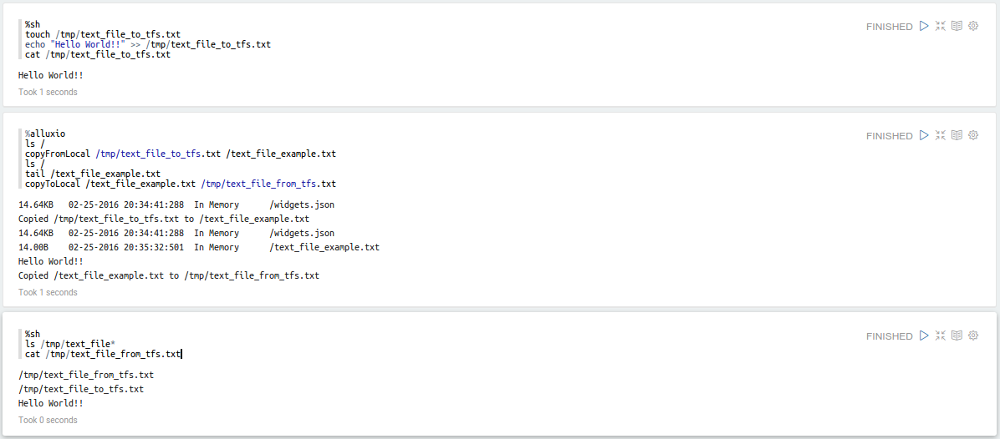

<!--
Licensed under the Apache License, Version 2.0 (the "License");
you may not use this file except in compliance with the License.
You may obtain a copy of the License at

http://www.apache.org/licenses/LICENSE-2.0

Unless required by applicable law or agreed to in writing, software
distributed under the License is distributed on an "AS IS" BASIS,
WITHOUT WARRANTIES OR CONDITIONS OF ANY KIND, either express or implied.
See the License for the specific language governing permissions and
limitations under the License.
-->


# Alluxio Interpreter for Apache Zeppelin

<div id="toc"></div>

## Overview
[Alluxio](http://alluxio.org/) is a memory-centric distributed storage system enabling reliable data sharing at memory-speed across cluster frameworks.

## Configuration
<table class="table-configuration">
  <tr>
    <th>Name</th>
    <th>Class</th>
    <th>Description</th>
  </tr>
  <tr>
    <td>alluxio.master.hostname</td>
    <td>localhost</td>
    <td>Alluxio master hostname</td>
  </tr>
  <tr>
    <td>alluxio.master.port</td>
    <td>19998</td>
    <td>Alluxio master port</td>
  </tr>
</table>

## Enabling Alluxio Interpreter
In a notebook, to enable the **Alluxio** interpreter, click on the **Gear** icon and select **Alluxio**.

## Using the Alluxio Interpreter
In a paragraph, use `%alluxio` to select the **Alluxio** interpreter and then input all commands.

```bash
%alluxio
help
```

> **Tip :** Use ( Ctrl + . ) for autocompletion.

## Interpreter Commands
The **Alluxio** interpreter accepts the following commands.

<center>
  <table class="table-configuration">
    <tr>
      <th>Operation</th>
      <th>Syntax</th>
      <th>Description</th>
    </tr>
    <tr>
      <td>cat</td>
      <td>cat "path"</td>
      <td>Print the content of the file to the console.</td>
    </tr>
    <tr>
      <td>chgrp</td>
      <td>chgrp "group" "path"</td>
      <td>Change the group of the directory or file.</td>
    </tr>
    <tr>
      <td>chmod</td>
      <td>chmod "permission" "path"</td>
      <td>Change the permission of the directory or file.</td>
    </tr>
    <tr>
      <td>chown</td>
      <td>chown "owner" "path"</td>
      <td>Change the owner of the directory or file.</td>
    </tr>
    <tr>
      <td>copyFromLocal</td>
      <td>copyFromLocal "source path" "remote path"</td>
      <td>Copy the specified file specified by "source path" to the path specified by "remote path".
      This command will fail if "remote path" already exists.</td>
    </tr>
    <tr>
      <td>copyToLocal</td>
      <td>copyToLocal "remote path" "local path"</td>
      <td>Copy the specified file from the path specified by "remote path" to a local destination.</td>
    </tr>
    <tr>
      <td>count</td>
      <td>count "path"</td>
      <td>Display the number of folders and files matching the specified prefix in "path".</td>
    </tr>
    <tr>
      <td>du</td>
      <td>du "path"</td>
      <td>Display the size of a file or a directory specified by the input path.</td>
    </tr>
    <tr>
      <td>fileInfo</td>
      <td>fileInfo "path"</td>
      <td>Print the information of the blocks of a specified file.</td>
    </tr>
    <tr>
      <td>free</td>
      <td>free "path"</td>
      <td>Free a file or all files under a directory from Alluxio. If the file/directory is also
      in under storage, it will still be available there.</td>
    </tr>
    <tr>
      <td>getCapacityBytes</td>
      <td>getCapacityBytes</td>
      <td>Get the capacity of the AlluxioFS.</td>
    </tr>
    <tr>
      <td>getUsedBytes</td>
      <td>getUsedBytes</td>
      <td>Get number of bytes used in the AlluxioFS.</td>
    </tr>
    <tr>
      <td>load</td>
      <td>load "path"</td>
      <td>Load the data of a file or a directory from under storage into Alluxio.</td>
    </tr>
    <tr>
      <td>loadMetadata</td>
      <td>loadMetadata "path"</td>
      <td>Load the metadata of a file or a directory from under storage into Alluxio.</td>
    </tr>
    <tr>
      <td>location</td>
      <td>location "path"</td>
      <td>Display a list of hosts that have the file data.</td>
    </tr>
    <tr>
      <td>ls</td>
      <td>ls "path"</td>
      <td>List all the files and directories directly under the given path with information such as
      size.</td>
    </tr>
    <tr>
      <td>mkdir</td>
      <td>mkdir "path1" ... "pathn"</td>
      <td>Create directory(ies) under the given paths, along with any necessary parent directories.
      Multiple paths separated by spaces or tabs. This command will fail if any of the given paths
      already exist.</td>
    </tr>
    <tr>
      <td>mount</td>
      <td>mount "path" "uri"</td>
      <td>Mount the underlying file system path "uri" into the Alluxio namespace as "path". The "path"
      is assumed not to exist and is created by the operation. No data or metadata is loaded from under
      storage into Alluxio. After a path is mounted, operations on objects under the mounted path are
      mirror to the mounted under storage.</td>
    </tr>
    <tr>
      <td>mv</td>
      <td>mv "source" "destination"</td>
      <td>Move a file or directory specified by "source" to a new location "destination". This command
      will fail if "destination" already exists.</td>
    </tr>
    <tr>
      <td>persist</td>
      <td>persist "path"</td>
      <td>Persist a file or directory currently stored only in Alluxio to the underlying file system.</td>
    </tr>
    <tr>
      <td>pin</td>
      <td>pin "path"</td>
      <td>Pin the given file to avoid evicting it from memory. If the given path is a directory, it
      recursively pins all the files contained and any new files created within this directory.</td>
    </tr>
    <tr>
      <td>report</td>
      <td>report "path"</td>
      <td>Report to the master that a file is lost.</td>
    </tr>
    <tr>
      <td>rm</td>
      <td>rm "path"</td>
      <td>Remove a file. This command will fail if the given path is a directory rather than a file.</td>
    </tr>
    <tr>
      <td>setTtl</td>
      <td>setTtl "time"</td>
      <td>Set the TTL (time to live) in milliseconds to a file.</td>
    </tr>
    <tr>
      <td>tail</td>
      <td>tail "path"</td>
      <td>Print the last 1KB of the specified file to the console.</td>
    </tr>
    <tr>
      <td>touch</td>
      <td>touch "path"</td>
      <td>Create a 0-byte file at the specified location.</td>
    </tr>
    <tr>
      <td>unmount</td>
      <td>unmount "path"</td>
      <td>Unmount the underlying file system path mounted in the Alluxio namespace as "path". Alluxio
      objects under "path" are removed from Alluxio, but they still exist in the previously mounted
      under storage.</td>
    </tr>
    <tr>
      <td>unpin</td>
      <td>unpin "path"</td>
      <td>Unpin the given file to allow Alluxio to evict this file again. If the given path is a
      directory, it recursively unpins all files contained and any new files created within this
      directory.</td>
    </tr>
    <tr>
      <td>unsetTtl</td>
      <td>unsetTtl</td>
      <td>Remove the TTL (time to live) setting from a file.</td>
    </tr>  
  </table>
</center>

## How to test it's working
Be sure to have configured correctly the Alluxio interpreter, then open a new paragraph and type one of the above commands.

Below a simple example to show how to interact with Alluxio interpreter.
Following steps are performed:

* using sh interpreter a new text file is created on local machine
* using Alluxio interpreter:
  * is listed the content of the afs (Alluxio File System) root
  * the file previously created is copied to afs
  * is listed again the content of the afs root to check the existence of the new copied file
  * is showed the content of the copied file (using the tail command)
  * the file previously copied to afs is copied to local machine
*  using sh interpreter it's checked the existence of the new file copied from Alluxio and its content is showed

<center>
  
</center>
