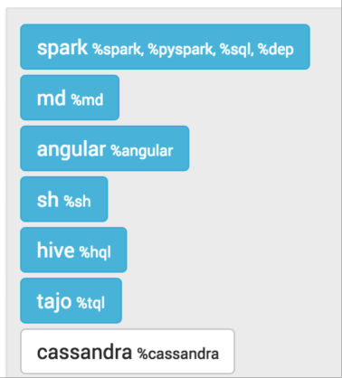



<hr/>
## 1. Cassandra CQL Interpreter for Apache Zeppelin

<br/>
<table class="table-configuration">
  <tr>
    <th>Name</th>
    <th>Class</th>
    <th>Description</th>
  </tr>
  <tr>
    <td>%cassandra</td>
    <td>CassandraInterpreter</td>
    <td>Provides interpreter for Apache Cassandra CQL query language</td>
  </tr>
</table>

<hr/>

## 2. Enabling Cassandra Interpreter

 In a notebook, to enable the **Cassandra** interpreter, click on the **Gear** icon and select **Cassandra**
 
 <center>
 

 
 </center>

<hr/>
 
## 3. Using the Cassandra Interpreter

 In a paragraph, use **_%cassandra_** to select the **Cassandra** interpreter and then input all commands.
 
 To access the interactive help, type **HELP;**
 
 <center>
  
 </center>

<hr/>

## 4. Interpreter Commands

 The **Cassandra** interpreter accepts the following commands
 
<center>
  <table class="table-configuration">
    <tr>
      <th>Command Type</th>
      <th>Command Name</th>
      <th>Description</th>
    </tr>
    <tr>
      <td nowrap>Help command</td>
      <td>HELP</td>
      <td>Display the interactive help menu</td>
    </tr>
    <tr>
      <td nowrap>Schema commands</td>
      <td>DESCRIBE KEYSPACE, DESCRIBE CLUSTER, DESCRIBE TABLES ...</td>
      <td>Custom commands to describe the Cassandra schema</td>
    </tr>
    <tr>
      <td nowrap>Option commands</td>
      <td>@consistency, @retryPolicy, @fetchSize ...</td>
      <td>Inject runtime options to all statements in the paragraph</td>
    </tr>
    <tr>
      <td nowrap>Prepared statement commands</td>
      <td>@prepare, @bind, @remove_prepared</td>
      <td>Let you register a prepared command and re-use it later by injecting bound values</td>
    </tr>
    <tr>
      <td nowrap>Native CQL statements</td>
      <td>All CQL-compatible statements (SELECT, INSERT, CREATE ...)</td>
      <td>All CQL statements are executed directly against the Cassandra server</td>
    </tr>
  </table>  
</center>

<hr/>
## 5. CQL statements
 
This interpreter is compatible with any CQL statement supported by Cassandra. Ex: 

```sql

    INSERT INTO users(login,name) VALUES('jdoe','John DOE');
    SELECT * FROM users WHERE login='jdoe';
```                                

Each statement should be separated by a semi-colon ( **;** ) except the special commands below:

1. @prepare
2. @bind
3. @remove_prepare
4. @consistency
5. @serialConsistency
6. @timestamp
7. @retryPolicy
8. @fetchSize
 
Multi-line statements as well as multiple statements on the same line are also supported as long as they are 
separated by a semi-colon. Ex: 

```sql

    USE spark_demo;

    SELECT * FROM albums_by_country LIMIT 1; SELECT * FROM countries LIMIT 1;

    SELECT *
    FROM artists
    WHERE login='jlennon';
```

Batch statements are supported and can span multiple lines, as well as DDL(CREATE/ALTER/DROP) statements: 

```sql

    BEGIN BATCH
        INSERT INTO users(login,name) VALUES('jdoe','John DOE');
        INSERT INTO users_preferences(login,account_type) VALUES('jdoe','BASIC');
    APPLY BATCH;

    CREATE TABLE IF NOT EXISTS test(
        key int PRIMARY KEY,
        value text
    );
```

CQL statements are <strong>case-insensitive</strong> (except for column names and values). 
This means that the following statements are equivalent and valid: 

```sql

    INSERT INTO users(login,name) VALUES('jdoe','John DOE');
    Insert into users(login,name) vAlues('hsue','Helen SUE');
```

The complete list of all CQL statements and versions can be found below:
<center>                                 
 <table class="table-configuration">
   <tr>
     <th>Cassandra Version</th>
     <th>Documentation Link</th>
   </tr>
   <tr>
     <td><strong>2.2</strong></td>
     <td>
        <a target="_blank" 
          href="http://docs.datastax.com/en/cql/3.3/cql/cqlIntro.html">
          http://docs.datastax.com/en/cql/3.3/cql/cqlIntro.html
        </a>
     </td>
   </tr>   
   <tr>
     <td><strong>2.1 & 2.0</strong></td>
     <td>
        <a target="_blank" 
          href="http://docs.datastax.com/en/cql/3.1/cql/cql_intro_c.html">
          http://docs.datastax.com/en/cql/3.1/cql/cql_intro_c.html
        </a>
     </td>
   </tr>   
   <tr>
     <td><strong>1.2</strong></td>
     <td>
        <a target="_blank" 
          href="http://docs.datastax.com/en/cql/3.0/cql/aboutCQL.html">
          http://docs.datastax.com/en/cql/3.0/cql/aboutCQL.html
        </a>
     </td>
   </tr>   
 </table>
</center>

<hr/>

## 6. Comments in statements

It is possible to add comments between statements. Single line comments start with the hash sign (#). Multi-line comments are enclosed between /** and **/. Ex: 

```sql

    #First comment
    INSERT INTO users(login,name) VALUES('jdoe','John DOE');

    /**
     Multi line
     comments
     **/
    Insert into users(login,name) vAlues('hsue','Helen SUE');
```

<hr/>

## 7. Syntax Validation

The interpreters is shipped with a built-in syntax validator. This validator only checks for basic syntax errors. 
All CQL-related syntax validation is delegated directly to **Cassandra** 

Most of the time, syntax errors are due to **missing semi-colons** between statements or **typo errors**.

<hr/>
                                    
## 8. Schema commands

To make schema discovery easier and more interactive, the following commands are supported:
<center>                                 
 <table class="table-configuration">
   <tr>
     <th>Command</th>
     <th>Description</th>
   </tr>
   <tr>
     <td><strong>DESCRIBE CLUSTER;</strong></td>
     <td>Show the current cluster name and its partitioner</td>
   </tr>   
   <tr>
     <td><strong>DESCRIBE KEYSPACES;</strong></td>
     <td>List all existing keyspaces in the cluster and their configuration (replication factor, durable write ...)</td>
   </tr>   
   <tr>
     <td><strong>DESCRIBE TABLES;</strong></td>
     <td>List all existing keyspaces in the cluster and for each, all the tables name</td>
   </tr>   
   <tr>
     <td><strong>DESCRIBE TYPES;</strong></td>
     <td>List all existing user defined types in the <strong>current (logged) keyspace</strong></td>
   </tr>   
   <tr>
     <td nowrap><strong>DESCRIBE FUNCTIONS &lt;keyspace_name&gt;;</strong></td>
     <td>List all existing user defined functions in the given keyspace</td>
   </tr>   
   <tr>
     <td nowrap><strong>DESCRIBE AGGREGATES &lt;keyspace_name&gt;;</strong></td>
     <td>List all existing user defined aggregates in the given keyspace</td>
   </tr>   
   <tr>
     <td nowrap><strong>DESCRIBE KEYSPACE &lt;keyspace_name&gt;;</strong></td>
     <td>Describe the given keyspace configuration and all its table details (name, columns, ...)</td>
   </tr>   
   <tr>
     <td nowrap><strong>DESCRIBE TABLE (&lt;keyspace_name&gt;).&lt;table_name&gt;;</strong></td>
     <td>
        Describe the given table. If the keyspace is not provided, the current logged in keyspace is used. 
        If there is no logged in keyspace, the default system keyspace is used. 
        If no table is found, an error message is raised
     </td>
   </tr>   
   <tr>
     <td nowrap><strong>DESCRIBE TYPE (&lt;keyspace_name&gt;).&lt;type_name&gt;;</strong></td>
     <td>
        Describe the given type(UDT). If the keyspace is not provided, the current logged in keyspace is used. 
        If there is no logged in keyspace, the default system keyspace is used. 
        If no type is found, an error message is raised
     </td>
   </tr>   
   <tr>
     <td nowrap><strong>DESCRIBE FUNCTION (&lt;keyspace_name&gt;).&lt;function_name&gt;;</strong></td>
     <td>Describe the given user defined function. The keyspace is optional</td>
   </tr>   
   <tr>
     <td nowrap><strong>DESCRIBE AGGREGATE (&lt;keyspace_name&gt;).&lt;aggregate_name&gt;;</strong></td>
     <td>Describe the given user defined aggregate. The keyspace is optional</td>
   </tr>   
 </table>
</center>              
                      
The schema objects (cluster, keyspace, table, type, function and aggregate) are displayed in a tabular format. 
There is a drop-down menu on the top left corner to expand objects details. On the top right menu is shown the Icon legend.

<br/>
<center>
  
</center>

<hr/>

## 9. Runtime Parameters

Sometimes you want to be able to pass runtime query parameters to your statements. 
Those parameters are not part of the CQL specs and are specific to the interpreter. 
Below is the list of all parameters: 

<br/>
<center>                                 
 <table class="table-configuration">
   <tr>
     <th>Parameter</th>
     <th>Syntax</th>
     <th>Description</th>
   </tr>
   <tr>
     <td nowrap>Consistency Level</td>
     <td><strong>@consistency=<em>value</em></strong></td>
     <td>Apply the given consistency level to all queries in the paragraph</td>
   </tr>
   <tr>
     <td nowrap>Serial Consistency Level</td>
     <td><strong>@serialConsistency=<em>value</em></strong></td>
     <td>Apply the given serial consistency level to all queries in the paragraph</td>
   </tr>
   <tr>
     <td nowrap>Timestamp</td>
     <td><strong>@timestamp=<em>long value</em></strong></td>
     <td>
        Apply the given timestamp to all queries in the paragraph.
        Please note that timestamp value passed directly in CQL statement will override this value
      </td>
   </tr>
   <tr>
     <td nowrap>Retry Policy</td>
     <td><strong>@retryPolicy=<em>value</em></strong></td>
     <td>Apply the given retry policy to all queries in the paragraph</td>
   </tr>
   <tr>
     <td nowrap>Fetch Size</td>
     <td><strong>@fetchSize=<em>integer value</em></strong></td>
     <td>Apply the given fetch size to all queries in the paragraph</td>
   </tr>
 </table>
</center>

 Some parameters only accept restricted values: 

<br/>
<center>                                 
 <table class="table-configuration">
   <tr>
     <th>Parameter</th>
     <th>Possible Values</th>
   </tr>
   <tr>
     <td nowrap>Consistency Level</td>
     <td><strong>ALL, ANY, ONE, TWO, THREE, QUORUM, LOCAL_ONE, LOCAL_QUORUM, EACH_QUORUM</strong></td>
   </tr>
   <tr>
     <td nowrap>Serial Consistency Level</td>
     <td><strong>SERIAL, LOCAL_SERIAL</strong></td>
   </tr>
   <tr>
     <td nowrap>Timestamp</td>
     <td>Any long value</td>
   </tr>
   <tr>
     <td nowrap>Retry Policy</td>
     <td><strong>DEFAULT, DOWNGRADING_CONSISTENCY, FALLTHROUGH, LOGGING_DEFAULT, LOGGING_DOWNGRADING, LOGGING_FALLTHROUGH</strong></td>
   </tr>
   <tr>
     <td nowrap>Fetch Size</td>
     <td>Any integer value</td>
   </tr>
 </table>
</center> 

>Please note that you should **not** add semi-colon ( **;** ) at the end of each parameter statement

Some examples: 

```sql

    CREATE TABLE IF NOT EXISTS spark_demo.ts(
        key int PRIMARY KEY,
        value text
    );
    TRUNCATE spark_demo.ts;

    # Timestamp in the past
    @timestamp=10

    # Force timestamp directly in the first insert
    INSERT INTO spark_demo.ts(key,value) VALUES(1,'first insert') USING TIMESTAMP 100;

    # Select some data to make the clock turn
    SELECT * FROM spark_demo.albums LIMIT 100;

    # Now insert using the timestamp parameter set at the beginning(10)
    INSERT INTO spark_demo.ts(key,value) VALUES(1,'second insert');

    # Check for the result. You should see 'first insert'
    SELECT value FROM spark_demo.ts WHERE key=1;
```
                                
Some remarks about query parameters:
  
> 1. **many** query parameters can be set in the same paragraph
> 2. if the **same** query parameter is set many time with different values, the interpreter only take into account the first value
> 3. each query parameter applies to **all CQL statements** in the same paragraph, unless you override the option using plain CQL text (like forcing timestamp with the USING clause)
> 4. the order of each query parameter with regard to CQL statement does not matter

<hr/>

## 10. Support for Prepared Statements

For performance reason, it is better to prepare statements before-hand and reuse them later by providing bound values. 
This interpreter provides 3 commands to handle prepared and bound statements: 

1. **@prepare**
2. **@bind**
3. **@remove_prepared**

Example: 

```

    @prepare[statement_name]=...

    @bind[statement_name]=’text’, 1223, ’2015-07-30 12:00:01’, null, true, [‘list_item1’, ’list_item2’]

    @bind[statement_name_with_no_bound_value]

    @remove_prepare[statement_name]
```

<br/>
#### a. @prepare
<br/>
You can use the syntax _"@prepare[statement_name]=SELECT ..."_ to create a prepared statement. 
The _statement_name_ is **mandatory** because the interpreter prepares the given statement with the Java driver and 
saves the generated prepared statement in an **internal hash map**, using the provided _statement_name_ as search key.
  
> Please note that this internal prepared statement map is shared with **all notebooks** and **all paragraphs** because 
there is only one instance of the interpreter for Cassandra
  
> If the interpreter encounters **many** @prepare for the **same _statement_name_ (key)**, only the **first** statement will be taken into account.
  
Example: 

```

    @prepare[select]=SELECT * FROM spark_demo.albums LIMIT ?

    @prepare[select]=SELECT * FROM spark_demo.artists LIMIT ?
```                                

For the above example, the prepared statement is _SELECT * FROM spark_demo.albums LIMIT ?_. 
_SELECT * FROM spark_demo.artists LIMIT ?_ is ignored because an entry already exists in the prepared statements map with the key select. 

In the context of **Zeppelin**, a notebook can be scheduled to be executed at regular interval, 
thus it is necessary to **avoid re-preparing many time the same statement (considered an anti-pattern)**.
<br/>
<br/>
#### b. @bind
<br/>
Once the statement is prepared (possibly in a separated notebook/paragraph). You can bind values to it: 

```
    @bind[select_first]=10
```                                

Bound values are not mandatory for the **@bind** statement. However if you provide bound values, they need to comply to some syntax:

* String values should be enclosed between simple quotes ( ‘ )
* Date values should be enclosed between simple quotes ( ‘ ) and respect the formats:
  1. yyyy-MM-dd HH:MM:ss
  2. yyyy-MM-dd HH:MM:ss.SSS
* **null** is parsed as-is
* **boolean** (true|false) are parsed as-is
* collection values must follow the **[standard CQL syntax]**:
  * list: [‘list_item1’, ’list_item2’, ...]
  * set: {‘set_item1’, ‘set_item2’, …}
  * map: {‘key1’: ‘val1’, ‘key2’: ‘val2’, …}
* **tuple** values should be enclosed between parenthesis (see **[Tuple CQL syntax]**): (‘text’, 123, true)
* **udt** values should be enclosed between brackets (see **[UDT CQL syntax]**): {stree_name: ‘Beverly Hills’, number: 104, zip_code: 90020, state: ‘California’, …}

> It is possible to use the @bind statement inside a batch:
> 
> ```sql
>  
>     BEGIN BATCH
>         @bind[insert_user]='jdoe','John DOE'
>         UPDATE users SET age = 27 WHERE login='hsue';
>     APPLY BATCH;
> ```

<br/>
#### c. @remove_prepare
<br/>
To avoid for a prepared statement to stay forever in the prepared statement map, you can use the 
**@remove_prepare[statement_name]** syntax to remove it. 
Removing a non-existing prepared statement yields no error.

<hr/>

## 11. Using Dynamic Forms

Instead of hard-coding your CQL queries, it is possible to use the mustache syntax ( **\{\{ \}\}** ) to inject simple value or multiple choices forms. 

The syntax for simple parameter is: **\{\{input_Label=default value\}\}**. The default value is mandatory because the first time the paragraph is executed, 
we launch the CQL query before rendering the form so at least one value should be provided. 

The syntax for multiple choices parameter is: **\{\{input_Label=value1 | value2 | … | valueN \}\}**. By default the first choice is used for CQL query 
the first time the paragraph is executed. 

Example: 


    #Secondary index on performer style
    SELECT name, country, performer
    FROM spark_demo.performers
    WHERE name='{{performer=Sheryl Crow|Doof|Fanfarlo|Los Paranoia}}'
    AND styles CONTAINS '{{style=Rock}}';

                                

In the above example, the first CQL query will be executed for _performer='Sheryl Crow' AND style='Rock'_. 
For subsequent queries, you can change the value directly using the form. 

> Please note that we enclosed the **\{\{ \}\}** block between simple quotes ( **'** ) because Cassandra expects a String here. 
> We could have also use the **\{\{style='Rock'\}\}** syntax but this time, the value displayed on the form is **_'Rock'_** and not **_Rock_**. 

It is also possible to use dynamic forms for **prepared statements**: 



    @bind[select]=='{{performer=Sheryl Crow|Doof|Fanfarlo|Los Paranoia}}', '{{style=Rock}}'
  


<hr/>

## 12. Execution parallelism and shared states

It is possible to execute many paragraphs in parallel. However, at the back-end side, we’re still using synchronous queries. 
_Asynchronous execution_ is only possible when it is possible to return a `Future` value in the `InterpreterResult`. 
It may be an interesting proposal for the **Zeppelin** project.

Another caveat is that the same `com.datastax.driver.core.Session` object is used for **all** notebooks and paragraphs.
Consequently, if you use the **USE _keyspace name_;** statement to log into a keyspace, it will change the keyspace for
**all current users** of the **Cassandra** interpreter because we only create 1 `com.datastax.driver.core.Session` object
per instance of **Cassandra** interpreter.

The same remark does apply to the **prepared statement hash map**, it is shared by **all users** using the same instance of **Cassandra** interpreter.

Until **Zeppelin** offers a real multi-users separation, there is a work-around to segregate user environment and states: 
_create different **Cassandra** interpreter instances_

For this, first go to the **Interpreter** menu and click on the **Create** button
<br/>
<br/>
<center>
  
</center>
 
In the interpreter creation form, put **cass-instance2** as **Name** and select the **cassandra** 
in the interpreter drop-down list  
<br/>
<br/>
<center>
  
</center>                         

 Click on **Save** to create the new interpreter instance. Now you should be able to see it in the interpreter list.
  
<br/>
<br/>
<center>
  
</center>                         

Go back to your notebook and click on the **Gear** icon to configure interpreter bindings.
You should be able to see and select the **cass-instance2** interpreter instance in the available
interpreter list instead of the standard **cassandra** instance.

<br/>
<br/>
<center>
  
</center> 

<hr/>

## 13. Interpreter Configuration

To configure the **Cassandra** interpreter, go to the **Interpreter** menu and scroll down to change the parameters.
The **Cassandra** interpreter is using the official **[Cassandra Java Driver]** and most of the parameters are used
to configure the Java driver

Below are the configuration parameters and their default value.


 <table class="table-configuration">
   <tr>
     <th>Property Name</th>
     <th>Description</th>
     <th>Default Value</th>
   </tr>
   <tr>
     <td>cassandra.cluster</td>
     <td>Name of the Cassandra cluster to connect to</td>
     <td>Test Cluster</td>
   </tr>
   <tr>
     <td>cassandra.compression.protocol</td>
     <td>On wire compression. Possible values are: NONE, SNAPPY, LZ4</td>
     <td>NONE</td>
   </tr>
   <tr>
     <td>cassandra.credentials.username</td>
     <td>If security is enable, provide the login</td>
     <td>none</td>
   </tr>
   <tr>
     <td>cassandra.credentials.password</td>
     <td>If security is enable, provide the password</td>
     <td>none</td>
   </tr>
   <tr>
     <td>cassandra.hosts</td>
     <td>
        Comma separated Cassandra hosts (DNS name or IP address).
        <br/>
        Ex: '192.168.0.12,node2,node3'
      </td>
     <td>localhost</td>
   </tr>
   <tr>
     <td>cassandra.interpreter.parallelism</td>
     <td>Number of concurrent paragraphs(queries block) that can be executed</td>
     <td>10</td>
   </tr>
   <tr>
     <td>cassandra.keyspace</td>
     <td>
        Default keyspace to connect to.
        <strong>
          It is strongly recommended to let the default value
          and prefix the table name with the actual keyspace
          in all of your queries
        </strong>
     </td>
     <td>system</td>
   </tr>
   <tr>
     <td>cassandra.load.balancing.policy</td>
     <td>
        Load balancing policy. Default = <em>new TokenAwarePolicy(new DCAwareRoundRobinPolicy())</em>
        To Specify your own policy, provide the <strong>fully qualify class name (FQCN)</strong> of your policy.
        At runtime the interpreter will instantiate the policy using 
        <strong>Class.forName(FQCN)</strong>
     </td>
     <td>DEFAULT</td>
   </tr>
   <tr>
     <td>cassandra.max.schema.agreement.wait.second</td>
     <td>Cassandra max schema agreement wait in second</td>
     <td>10</td>
   </tr>
   <tr>
     <td>cassandra.pooling.core.connection.per.host.local</td>
     <td>Protocol V2 and below default = 2. Protocol V3 and above default = 1</td>
     <td>2</td>
   </tr>
   <tr>
     <td>cassandra.pooling.core.connection.per.host.remote</td>
     <td>Protocol V2 and below default = 1. Protocol V3 and above default = 1</td>
     <td>1</td>
   </tr>
   <tr>
     <td>cassandra.pooling.heartbeat.interval.seconds</td>
     <td>Cassandra pool heartbeat interval in secs</td>
     <td>30</td>
   </tr>
   <tr>
     <td>cassandra.pooling.idle.timeout.seconds</td>
     <td>Cassandra idle time out in seconds</td>
     <td>120</td>
   </tr>
   <tr>
     <td>cassandra.pooling.max.connection.per.host.local</td>
     <td>Protocol V2 and below default = 8. Protocol V3 and above default = 1</td>
     <td>8</td>
   </tr>
   <tr>
     <td>cassandra.pooling.max.connection.per.host.remote</td>
     <td>Protocol V2 and below default = 2. Protocol V3 and above default = 1</td>
     <td>2</td>
   </tr>
   <tr>
     <td>cassandra.pooling.max.request.per.connection.local</td>
     <td>Protocol V2 and below default = 128. Protocol V3 and above default = 1024</td>
     <td>128</td>
   </tr>
   <tr>
     <td>cassandra.pooling.max.request.per.connection.remote</td>
     <td>Protocol V2 and below default = 128. Protocol V3 and above default = 256</td>
     <td>128</td>
   </tr>
   <tr>
     <td>cassandra.pooling.new.connection.threshold.local</td>
     <td>Protocol V2 and below default = 100. Protocol V3 and above default = 800</td>
     <td>100</td>
   </tr>
   <tr>
     <td>cassandra.pooling.new.connection.threshold.remote</td>
     <td>Protocol V2 and below default = 100. Protocol V3 and above default = 200</td>
     <td>100</td>
   </tr>
   <tr>
     <td>cassandra.pooling.pool.timeout.millisecs</td>
     <td>Cassandra pool time out in millisecs</td>
     <td>5000</td>
   </tr>
   <tr>
     <td>cassandra.protocol.version</td>
     <td>Cassandra binary protocol version</td>
     <td>3</td>
   </tr>
   <tr>
     <td>cassandra.query.default.consistency</td>
     <td>
      Cassandra query default consistency level
      <br/>
      Available values: ONE, TWO, THREE, QUORUM, LOCAL_ONE, LOCAL_QUORUM, EACH_QUORUM, ALL
     </td>
     <td>ONE</td>
   </tr>
   <tr>
     <td>cassandra.query.default.fetchSize</td>
     <td>Cassandra query default fetch size</td>
     <td>5000</td>
   </tr>
   <tr>
     <td>cassandra.query.default.serial.consistency</td>
     <td>
      Cassandra query default serial consistency level
      <br/>
      Available values: SERIAL, LOCAL_SERIAL
     </td>
     <td>SERIAL</td>
   </tr>
   <tr>
     <td>cassandra.reconnection.policy</td>
     <td>
        Cassandra Reconnection Policy.
        Default = new ExponentialReconnectionPolicy(1000, 10 * 60 * 1000)
        To Specify your own policy, provide the <strong>fully qualify class name (FQCN)</strong> of your policy.
        At runtime the interpreter will instantiate the policy using 
        <strong>Class.forName(FQCN)</strong>
     </td>
     <td>DEFAULT</td>
   </tr>
   <tr>
     <td>cassandra.retry.policy</td>
     <td>
        Cassandra Retry Policy.
        Default = DefaultRetryPolicy.INSTANCE
        To Specify your own policy, provide the <strong>fully qualify class name (FQCN)</strong> of your policy.
        At runtime the interpreter will instantiate the policy using 
        <strong>Class.forName(FQCN)</strong>
     </td>
     <td>DEFAULT</td>
   </tr>
   <tr>
     <td>cassandra.socket.connection.timeout.millisecs</td>
     <td>Cassandra socket default connection timeout in millisecs</td>
     <td>500</td>
   </tr>
   <tr>
     <td>cassandra.socket.read.timeout.millisecs</td>
     <td>Cassandra socket read timeout in millisecs</td>
     <td>12000</td>
   </tr>
   <tr>
     <td>cassandra.socket.tcp.no_delay</td>
     <td>Cassandra socket TCP no delay</td>
     <td>true</td>
   </tr>
   <tr>
     <td>cassandra.speculative.execution.policy</td>
     <td>
        Cassandra Speculative Execution Policy.
        Default = NoSpeculativeExecutionPolicy.INSTANCE
        To Specify your own policy, provide the <strong>fully qualify class name (FQCN)</strong> of your policy.
        At runtime the interpreter will instantiate the policy using 
        <strong>Class.forName(FQCN)</strong>
     </td>
     <td>DEFAULT</td>
   </tr>
 </table>

<hr/>

## 14. Bugs & Contacts

 If you encounter a bug for this interpreter, please create a **[JIRA]** ticket and ping me on Twitter
 at **[@doanduyhai]**


[Cassandra Java Driver]: https://github.com/datastax/java-driver
[standard CQL syntax]: http://docs.datastax.com/en/cql/3.1/cql/cql_using/use_collections_c.html
[Tuple CQL syntax]: http://docs.datastax.com/en/cql/3.1/cql/cql_reference/tupleType.html
[UDT CQL syntax]: http://docs.datastax.com/en/cql/3.1/cql/cql_using/cqlUseUDT.html
[JIRA]: https://issues.apache.org/jira/browse/ZEPPELIN-382?jql=project%20%3D%20ZEPPELIN
[@doanduyhai]: https://twitter.com/doanduyhai
