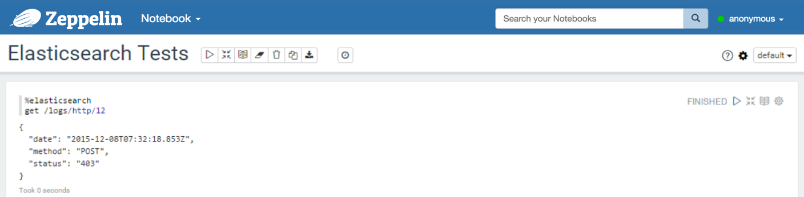




## Elasticsearch Interpreter for Apache Zeppelin

### Configuration

<br/>
<table class="table-configuration">
  <tr>
    <th>Property</th>
    <th>Default</th>
    <th>Description</th>
  </tr>
  <tr>
    <td>elasticsearch.cluster.name</td>
    <td>elasticsearch</td>
    <td>Cluster name</td>
  </tr>
  <tr>
    <td>elasticsearch.host</td>
    <td>localhost</td>
    <td>Host of a node in the cluster</td>
  </tr>
  <tr>
    <td>elasticsearch.port</td>
    <td>9300</td>
    <td>Connection port <b>(important: this is not the HTTP port, but the transport port)</b></td>
  </tr>
</table>

<center>
  
</center>


### Enabling the Elasticsearch Interpreter

In a notebook, to enable the **Elasticsearch** interpreter, click the **Gear** icon and select **Elasticsearch**.


### Using the Elasticsearch Interpreter

In a paragraph, use `%elasticsearch` to select the Elasticsearch interpreter and then input all commands.

#### get
With the `get` command, you can find a document by id.

```bash
| get /index/type/id
```

Example:



#### search
With the `search` command, you can send a search query to Elasticsearch.

```bash
| search /index1,index2,.../type1,type2,... <size of the response> <JSON document containing the query>
```

Example:
* With a table containing the results:


* You can also use a predefined diagram:


#### count
With the `count` command, you can count documents available in some indices and types.

```bash
| count /index1,index2,.../type1,type2,... 
```

Example:


#### index
With the `index` command, you can insert/update a document in Elasticsearch.
```bash
| index /index/type/id <JSON document>
| index /index/type <JSON document>
```

#### delete
With the `delete` command, you can delete a document.

```bash
| delete /index/type/id
```


#### Apply Zeppelin Dynamic Forms

You can leverage [Zeppelin Dynamic Form]({{BASE_PATH}}/manual/dynamicform.html) inside your queries. You can use both the `text input` and `select form` parameterization features

```bash
%elasticsearch
search /index/type ${limit=10} { "query": { "match_all": {} } }
```

