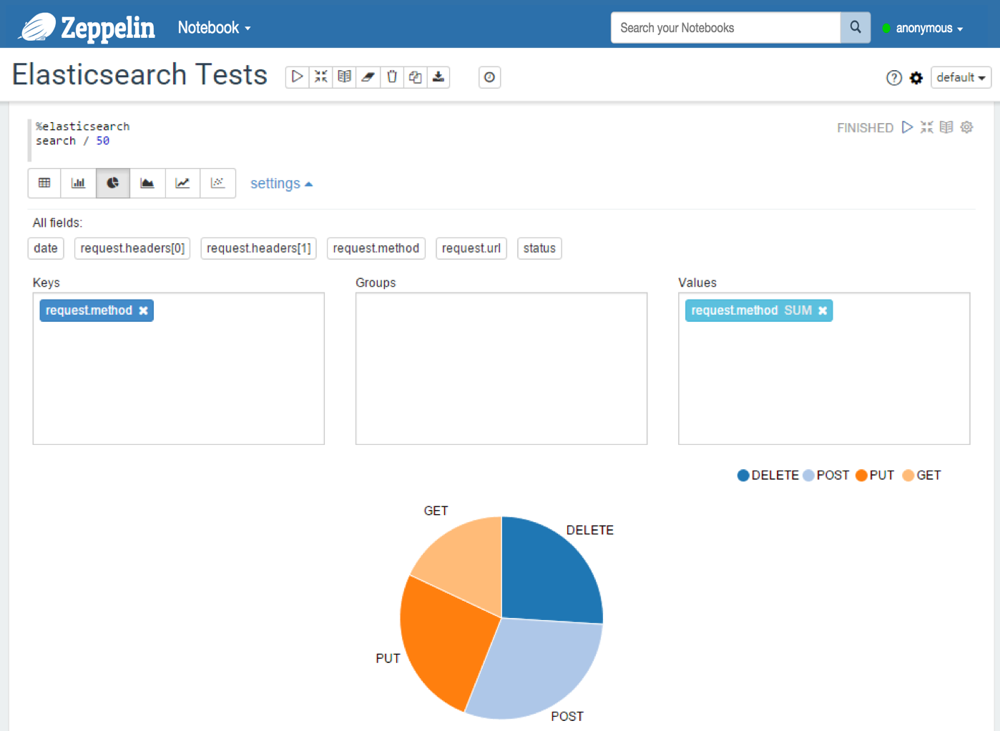




## Elasticsearch Interpreter for Apache Zeppelin

### 1. Configuration

<br/>
<table class="table-configuration">
  <tr>
    <th>Property</th>
    <th>Default</th>
    <th>Description</th>
  </tr>
  <tr>
    <td>elasticsearch.cluster.name</td>
    <td>elasticsearch</td>
    <td>Cluster name</td>
  </tr>
  <tr>
    <td>elasticsearch.host</td>
    <td>localhost</td>
    <td>Host of a node in the cluster</td>
  </tr>
  <tr>
    <td>elasticsearch.port</td>
    <td>9300</td>
    <td>Connection port <b>(important: this is not the HTTP port, but the transport port)</b></td>
  </tr>
</table>

<center>
  
</center>


> Note #1: you can add more properties to configure the Elasticsearch client.
> Note #2: if you use Shield, you can add a property named `shield.user` with a value containing the name and the password (format: `username:password`). For more details about Shield configuration, consult the [Shield reference guide](https://www.elastic.co/guide/en/shield/current/_using_elasticsearch_java_clients_with_shield.html). Do not forget, to copy the shield client jar in the interpreter directory (`ZEPPELIN_HOME/interpreters/elasticsearch`).


<hr/>

### 2. Enabling the Elasticsearch Interpreter

In a notebook, to enable the **Elasticsearch** interpreter, click the **Gear** icon and select **Elasticsearch**.


<hr/>

### 3. Using the Elasticsearch Interpreter

In a paragraph, use `%elasticsearch` to select the Elasticsearch interpreter and then input all commands. To get the list of available commands, use `help`.

```bash
| %elasticsearch
| help
General format: <command> /<indices>/<types>/<id> <option> <JSON>
  - indices: list of indices separated by commas (depends on the command)
  - types: list of document types separated by commas (depends on the command)
Commands:
  - get /index/type/id
  - delete /index/type/id
  - count /indices/<types>
    . indices and types can be omitted
  - search /indices/types <limit> <json-formatted query>
    . indices and types can be omited
    . if a query is provided, the limit must also be provided
  - index /ndex/type/id <json-formatted document>
    . the id can be omitted, elasticsearch will generate one
```

> Tip: use (CTRL + .) for completion


#### get
With the `get` command, you can find a document by id. The result is a JSON document.

```bash
| get /index/type/id
```

Example:


#### search
With the `search` command, you can send a search query to Elasticsearch. You can provide a query, that is exactly what you can provide when you use the REST API of Elasticsearch.  See [Elasticsearch reference document](https://www.elastic.co/guide/en/elasticsearch/reference/current/search.html) for more details about the content of the queries.

```bash
| search /index1,index2,.../type1,type2,... <size of the response> <JSON document containing the query>
```

> **Important**: a document in Elasticsearch is a JSON document, so it is hierarchical, not flat as a row in a SQL table.
For the Elastic interpreter, the result of a search query is flattened.

Suppose we have a JSON document:
```json
{
  "date": "2015-12-08T21:03:13.588Z",
  "request": {
    "method": "GET",
    "url": "/zeppelin/4cd001cd-c517-4fa9-b8e5-a06b8f4056c4",
    "headers": [ "Accept: *.*", "Host: apache.org"]
  },
  "status": "403"
}
```

The data will be flattened like this:

date | request.headers[0] | request.headers[1] | request.method | request.url | status
-----|--------------------|--------------------|----------------|-------------|-------
2015-12-08T21:03:13.588Z | Accept: \*.\* | Host: apache.org | GET | /zeppelin/4cd001cd-c517-4fa9-b8e5-a06b8f4056c4 | 403


Examples:
* With a table containing the results:


* You can also use a predefined diagram:


* With a JSON query:


#### count
With the `count` command, you can count documents available in some indices and types.

```bash
| count /index1,index2,.../type1,type2,... 
```

Example:


#### index
With the `index` command, you can insert/update a document in Elasticsearch.
```bash
| index /index/type/id <JSON document>
| index /index/type <JSON document>
```

#### delete
With the `delete` command, you can delete a document.

```bash
| delete /index/type/id
```


#### Apply Zeppelin Dynamic Forms

You can leverage [Zeppelin Dynamic Form]({{BASE_PATH}}/manual/dynamicform.html) inside your queries. You can use both the `text input` and `select form` parameterization features

```bash
%elasticsearch
search /index/type ${limit=10} { "query": { "match_all": {} } }
```

