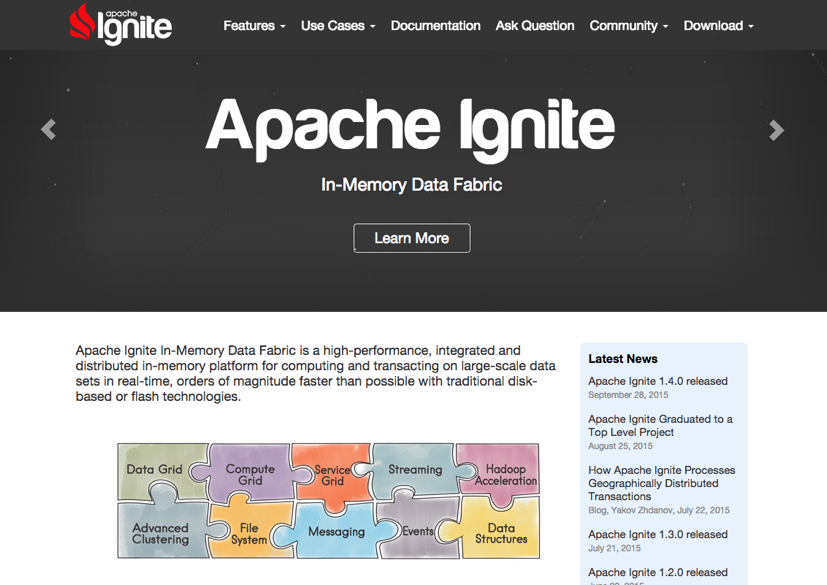
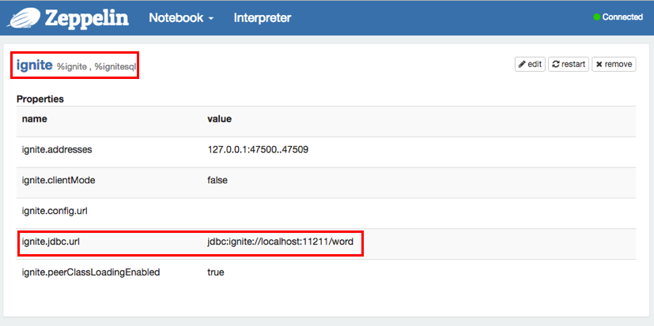
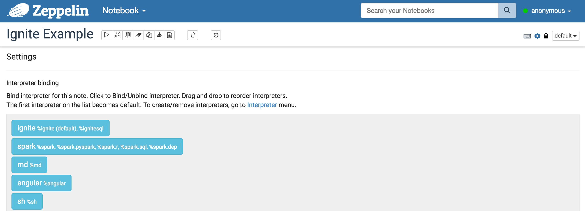
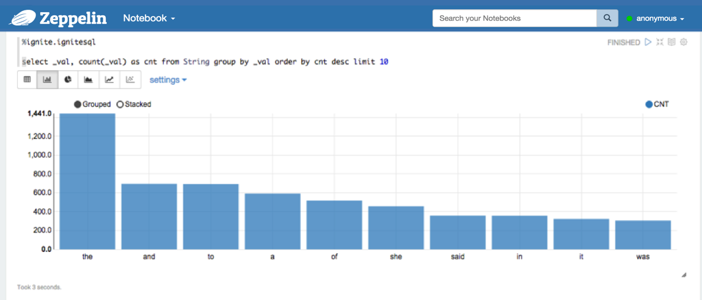
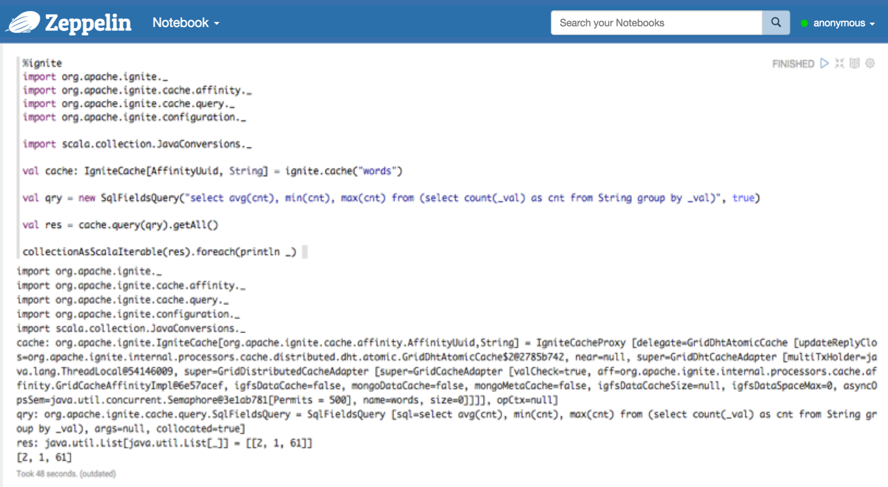

<!--
Licensed under the Apache License, Version 2.0 (the "License");
you may not use this file except in compliance with the License.
You may obtain a copy of the License at

http://www.apache.org/licenses/LICENSE-2.0

Unless required by applicable law or agreed to in writing, software
distributed under the License is distributed on an "AS IS" BASIS,
WITHOUT WARRANTIES OR CONDITIONS OF ANY KIND, either express or implied.
See the License for the specific language governing permissions and
limitations under the License.
-->


# Ignite Interpreter for Apache Zeppelin

<div id="toc"></div>

## Overview
[Apache Ignite](https://ignite.apache.org/) In-Memory Data Fabric is a high-performance, integrated and distributed in-memory platform for computing and transacting on large-scale data sets in real-time, orders of magnitude faster than possible with traditional disk-based or flash technologies.



You can use Zeppelin to retrieve distributed data from cache using Ignite SQL interpreter. Moreover, Ignite interpreter allows you to execute any Scala code in cases when SQL doesn't fit to your requirements. For example, you can populate data into your caches or execute distributed computations.

## Installing and Running Ignite example
In order to use Ignite interpreters, you may install Apache Ignite in some simple steps:

1. Ignite provides examples only with source or binary release. Download Ignite [source release](https://ignite.apache.org/download.html#sources) or [binary release](https://ignite.apache.org/download.html#binaries) whatever you want. But you must download Ignite as the same version of Zeppelin's. If it is not, you can't use scala code on Zeppelin. The supported Ignite version is specified in [Supported Interpreter table](https://zeppelin.apache.org/supported_interpreters.html#ignite) for each Zeppelin release. If you're using Zeppelin master branch, please see `ignite.version` in `path/to/your-Zeppelin/ignite/pom.xml`.
2. Examples are shipped as a separate Maven project, so to start running you simply need to import provided `<dest_dir>/apache-ignite-fabric-{version}-bin/examples/pom.xml` file into your favourite IDE, such as Eclipse.

* In case of Eclipse, Eclipse -> File -> Import -> Existing Maven Projects
* Set examples directory path to Eclipse and select the pom.xml.
* Then start `org.apache.ignite.examples.ExampleNodeStartup` (or whatever you want) to run at least one or more ignite node. When you run example code, you may notice that the number of node is increase one by one.

> **Tip. If you want to run Ignite examples on the cli not IDE, you can export executable Jar file from IDE. Then run it by using below command.**

```
$ nohup java -jar </path/to/your Jar file name>
```

## Configuring Ignite Interpreter
At the "Interpreters" menu, you may edit Ignite interpreter or create new one. Zeppelin provides these properties for Ignite.

<table class="table-configuration">
  <tr>
    <th>Property Name</th>
    <th>value</th>
    <th>Description</th>
  </tr>
  <tr>
    <td>ignite.addresses</td>
    <td>127.0.0.1:47500..47509</td>
    <td>Coma separated list of Ignite cluster hosts. See [Ignite Cluster Configuration](https://apacheignite.readme.io/docs/cluster-config) section for more details.</td>
  </tr>
  <tr>
    <td>ignite.clientMode</td>
    <td>true</td>
    <td>You can connect to the Ignite cluster as client or server node. See [Ignite Clients vs. Servers](https://apacheignite.readme.io/docs/clients-vs-servers) section for details. Use true or false values in order to connect in client or server mode respectively.</td>
  </tr>
  <tr>
    <td>ignite.config.url</td>
    <td></td>
    <td>Configuration URL. Overrides all other settings.</td>
  </tr>
  <tr>
    <td>ignite.jdbc.url</td>
    <td>jdbc:ignite:cfg://default-ignite-jdbc.xml</td>
    <td>Ignite JDBC connection URL.</td>
  </tr>
  <tr>
    <td>ignite.peerClassLoadingEnabled</td>
    <td>true</td>
    <td>Enables peer-class-loading. See [Zero Deployment](https://apacheignite.readme.io/docs/zero-deployment) section for details. Use true or false values in order to enable or disable P2P class loading respectively.</td>
  </tr>
</table>



## How to use
After configuring Ignite interpreter, create your own notebook. Then you can bind interpreters like below image.



For more interpreter binding information see [here](../manual/interpreters.html#what-is-interpreter-setting).

### Ignite SQL interpreter
In order to execute SQL query, use ` %ignite.ignitesql ` prefix. <br>
Supposing you are running `org.apache.ignite.examples.streaming.wordcount.StreamWords`, then you can use "words" cache( Of course you have to specify this cache name to the Ignite interpreter setting section `ignite.jdbc.url` of Zeppelin ).
For example, you can select top 10 words in the words cache using the following query

```
%ignite.ignitesql
select _val, count(_val) as cnt from String group by _val order by cnt desc limit 10
```



As long as your Ignite version and Zeppelin Ignite version is same, you can also use scala code. Please check the Zeppelin Ignite version before you download your own Ignite.

```
%ignite
import org.apache.ignite._
import org.apache.ignite.cache.affinity._
import org.apache.ignite.cache.query._
import org.apache.ignite.configuration._

import scala.collection.JavaConversions._

val cache: IgniteCache[AffinityUuid, String] = ignite.cache("words")

val qry = new SqlFieldsQuery("select avg(cnt), min(cnt), max(cnt) from (select count(_val) as cnt from String group by _val)", true)

val res = cache.query(qry).getAll()

collectionAsScalaIterable(res).foreach(println _)
```



Apache Ignite also provides a guide docs for Zeppelin ["Ignite with Apache Zeppelin"](https://apacheignite.readme.io/docs/data-analysis-with-apache-zeppelin)
