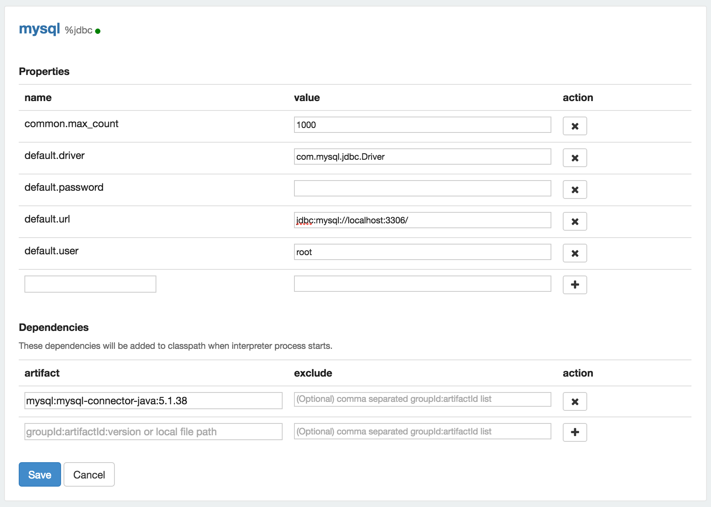
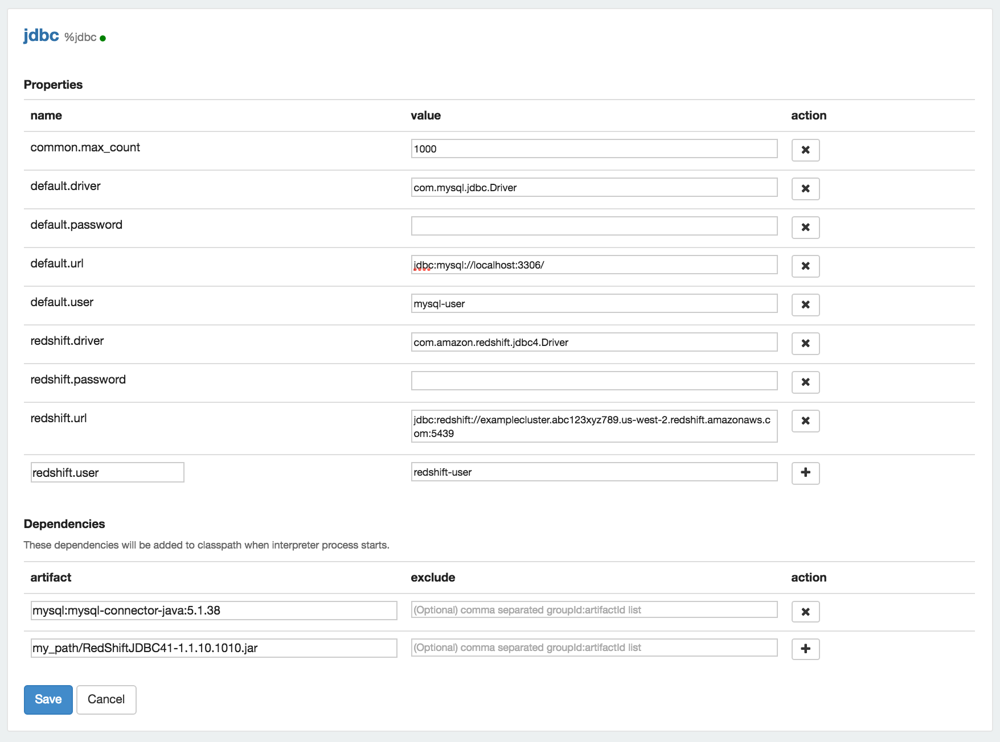

<!--
Licensed under the Apache License, Version 2.0 (the "License");
you may not use this file except in compliance with the License.
You may obtain a copy of the License at

http://www.apache.org/licenses/LICENSE-2.0

Unless required by applicable law or agreed to in writing, software
distributed under the License is distributed on an "AS IS" BASIS,
WITHOUT WARRANTIES OR CONDITIONS OF ANY KIND, either express or implied.
See the License for the specific language governing permissions and
limitations under the License.
-->


# Generic JDBC Interpreter for Apache Zeppelin

<div id="toc"></div>

## Overview

This interpreter lets you create a JDBC connection to any data source, by now it has been tested with:

* Postgres
* MySql
* MariaDB
* Redshift
* Apache Hive
* Apache Phoenix
* Apache Drill (Details on using [Drill JDBC Driver](https://drill.apache.org/docs/using-the-jdbc-driver))
* Apache Tajo

If someone else used another database please report how it works to improve functionality.

## Create Interpreter

When you create a interpreter by default use PostgreSQL with the next properties:

<table class="table-configuration">
  <tr>
    <th>name</th>
    <th>value</th>
  </tr>
  <tr>
    <td>common.max_count</td>
    <td>1000</td>
  </tr>
  <tr>
    <td>default.driver</td>
    <td>org.postgresql.Driver</td>
  </tr>
  <tr>
    <td>default.password</td>
    <td>********</td>
  </tr>
  <tr>
    <td>default.url</td>
    <td>jdbc:postgresql://localhost:5432/</td>
  </tr>
  <tr>
    <td>default.user</td>
    <td>gpadmin</td>
  </tr>      
</table>

It is not necessary to add driver jar to the classpath for PostgreSQL as it is included in Zeppelin.

### Simple connection

Prior to creating the interpreter it is necessary to add maven coordinate or path of the JDBC driver to the Zeppelin classpath. To do this you must edit dependencies artifact(ex. `mysql:mysql-connector-java:5.1.38`) in interpreter menu as shown:

<div class="row">
  <div class="col-md-11">
    
  </div>
</div>

To create the interpreter you need to specify connection parameters as shown in the table.

<table class="table-configuration">
  <tr>
    <th>name</th>
    <th>value</th>
  </tr>
  <tr>
    <td>common.max_count</td>
    <td>1000</td>
  </tr>
  <tr>
    <td>default.driver</td>
    <td>driver name</td>
  </tr>
  <tr>
    <td>default.password</td>
    <td>********</td>
  </tr>
  <tr>
    <td>default.url</td>
    <td>jdbc url</td>
  </tr>
  <tr>
    <td>default.user</td>
    <td>user name</td>
  </tr>      
</table>

### Multiple connections

JDBC interpreter also allows connections to multiple data sources. It is necessary to set a prefix for each connection to reference it in the paragraph in the form of `%jdbc(prefix)`. Before you create the interpreter it is necessary to add each driver's maven coordinates or JDBC driver's jar file path to the Zeppelin classpath. To do this you must edit the dependencies of JDBC interpreter in interpreter menu as following:

<div class="row">
  <div class="col-md-11">
    
  </div>
</div>

You can add all the jars you need to make multiple connections into the same JDBC interpreter. To create the interpreter you must specify the parameters. For example we will create two connections to MySQL and Redshift, the respective prefixes are `default` and `redshift`:

<table class="table-configuration">
  <tr>
    <th>name</th>
    <th>value</th>
  </tr>
  <tr>
    <td>common.max_count</td>
    <td>1000</td>
  </tr>
  <tr>
    <td>default.driver</td>
    <td>com.mysql.jdbc.Driver</td>
  </tr>
  <tr>
    <td>default.password</td>
    <td>********</td>
  </tr>
  <tr>
    <td>default.url</td>
    <td>jdbc:mysql://localhost:3306/</td>
  </tr>
  <tr>
    <td>default.user</td>
    <td>mysql-user</td>
  </tr>
  <tr>
    <td>redshift.driver</td>
    <td>com.amazon.redshift.jdbc4.Driver</td>
  </tr>
  <tr>
    <td>redshift.password</td>
    <td>********</td>
  </tr>
  <tr>
    <td>redshift.url</td>
    <td>jdbc:redshift://examplecluster.abc123xyz789.us-west-2.redshift.amazonaws.com:5439</td>
  </tr>
  <tr>
    <td>redshift.user</td>
    <td>redshift-user</td>
  </tr>      
</table>


## Bind to Notebook
In the `Notebook` click on the `settings` icon at the top-right corner. Use select/deselect to specify the interpreters to be used in the `Notebook`.

## More Properties
You can modify the interpreter configuration in the `Interpreter` section. The most common properties are as follows, but you can specify other properties that need to be connected.

 <table class="table-configuration">
   <tr>
     <th>Property Name</th>
     <th>Description</th>
   </tr>
   <tr>
     <td>{prefix}.url</td>
     <td>JDBC URL to connect, the URL must include the name of the database </td>
   </tr>
   <tr>
     <td>{prefix}.user</td>
     <td>JDBC user name</td>
   </tr>
   <tr>
     <td>{prefix}.password</td>
     <td>JDBC password</td>
   </tr>
   <tr>
     <td>{prefix}.driver</td>
     <td>JDBC driver name.</td>
   </tr>
   <tr>
     <td>common.max_result</td>
     <td>Max number of SQL result to display to prevent the browser overload. This is  common properties for all connections</td>
   </tr>
   <tr>
     <td>zeppelin.jdbc.auth.type</td>
     <td>Types of authentications' methods supported are SIMPLE, and KERBEROS</td>
   </tr>
   <tr>
     <td>zeppelin.jdbc.principal</td>
     <td>The principal name to load from the keytab</td>
   </tr>
   <tr>
     <td>zeppelin.jdbc.keytab.location</td>
     <td>The path to the keytab file</td>
   </tr>
 </table>

To develop this functionality use this [method](http://docs.oracle.com/javase/7/docs/api/java/sql/DriverManager.html#getConnection%28java.lang.String,%20java.util.Properties%29). For example if a connection needs a schema parameter, it would have to add the property as follows:

<table class="table-configuration">
  <tr>
    <th>name</th>
    <th>value</th>
  </tr>
  <tr>
    <td>{prefix}.schema</td>
    <td>schema_name</td>
  </tr>
</table>

## Examples

### Hive

#### Properties
 <table class="table-configuration">
   <tr>
     <th>Name</th>
     <th>Value</th>
   </tr>
   <tr>
     <td>hive.driver</td>
     <td>org.apache.hive.jdbc.HiveDriver</td>
   </tr>
   <tr>
     <td>hive.url</td>
     <td>jdbc:hive2://localhost:10000</td>
   </tr>
   <tr>
     <td>hive.user</td>
     <td>hive_user</td>
   </tr>
   <tr>
     <td>hive.password</td>
     <td>hive_password</td>
   </tr>
 </table>

#### Dependencies
 <table class="table-configuration">
   <tr>
     <th>Artifact</th>
     <th>Excludes</th>
   </tr>
   <tr>
     <td>org.apache.hive:hive-jdbc:0.14.0</td>
     <td></td>
   </tr>
   <tr>
     <td>org.apache.hadoop:hadoop-common:2.6.0</td>
     <td></td>
   </tr>
 </table>

### Phoenix
#### Properties:
 Phoenix supports 'thick' and 'thin' connection types:

 The thick client is faster, but must connect directly to ZooKeeper and HBase RegionServers.

 The thin client has fewer dependencies and connects through a [Phoenix Query Server](http://phoenix.apache.org/server.html) instance.

 Use the appropriate phoenix.driver and phoenix.url for your connection type. Include only the dependency for your connection type.

 <table class="table-configuration">
   <tr>
     <th>Name</th>
     <th>Value</th>
     <th>Description</th>
   </tr>
   <tr>
     <td>phoenix.driver</td>
     <td>org.apache.phoenix.jdbc.PhoenixDriver</td>
     <td>'Thick Client', connects directly to Phoenix</td>
   </tr>
   <tr>
     <td>phoenix.driver</td>
     <td>org.apache.calcite.avatica.remote.Driver</td>
     <td>'Thin Client', connects via Phoenix Query Server</td>
   </tr>
   <tr>
     <td>phoenix.url</td>
     <td>jdbc:phoenix:localhost:2181:/hbase-unsecure</td>
     <td>'Thick Client', connects directly to Phoenix</td>
   </tr>
   <tr>
     <td>phoenix.url</td>
     <td>jdbc:phoenix:thin:url=http://localhost:8765;serialization=PROTOBUF</td>
     <td>'Thin Client', connects via Phoenix Query Server</td>
   </tr>
   <tr>
     <td>phoenix.user</td>
     <td>phoenix_user</td>
     <td></td>
   </tr>
   <tr>
     <td>phoenix.password</td>
     <td>phoenix_password</td>
     <td></td>
   </tr>
 </table>
#### Dependencies:
 <table class="table-configuration">
   <tr>
     <th>Artifact</th>
     <th>Excludes</th>
     <th>Description</th>
   </tr>
   <tr>
     <td>org.apache.phoenix:phoenix-core:4.4.0-HBase-1.0</td>
     <td></td>
     <td>'Thick Client', connects directly to Phoenix</td>
   </tr>
   <tr>
     <td>org.apache.phoenix:phoenix-server-client:4.7.0-HBase-1.1</td>
     <td></td>
     <td>'Thin Client', connects via Phoenix Query Server</td>
   </tr>
 </table>

### Tajo
#### Properties
 <table class="table-configuration">
   <tr>
     <th>Name</th>
     <th>Value</th>
   </tr>
   <tr>
     <td>tajo.driver</td>
     <td>org.apache.tajo.jdbc.TajoDriver</td>
   </tr>
   <tr>
     <td>tajo.url</td>
     <td>jdbc:tajo://localhost:26002/default</td>
   </tr>
 </table>

#### Dependencies
 <table class="table-configuration">
   <tr>
     <th>Artifact</th>
     <th>Excludes</th>
   </tr>
   <tr>
     <td>org.apache.tajo:tajo-jdbc:0.11.0</td>
     <td></td>
   </tr>
 </table>
 
## How to use

### Reference in paragraph

Start the paragraphs with the `%jdbc`, this will use the `default` prefix for connection. If you want to use other connection you should specify the prefix of it as follows `%jdbc(prefix)`:

```sql
%jdbc
SELECT * FROM db_name;

```

or

```sql
%jdbc(prefix)
SELECT * FROM db_name;

```

### Apply Zeppelin Dynamic Forms

You can leverage [Zeppelin Dynamic Form](../manual/dynamicform.html) inside your queries. You can use both the `text input` and `select form` parametrization features

```sql
%jdbc(prefix)
SELECT name, country, performer
FROM demo.performers
WHERE name='{{performer=Sheryl Crow|Doof|Fanfarlo|Los Paranoia}}'
```

## Bugs & Reporting
If you find a bug for this interpreter, please create a [JIRA]( https://issues.apache.org/jira/browse/ZEPPELIN-382?jql=project%20%3D%20ZEPPELIN) ticket.
