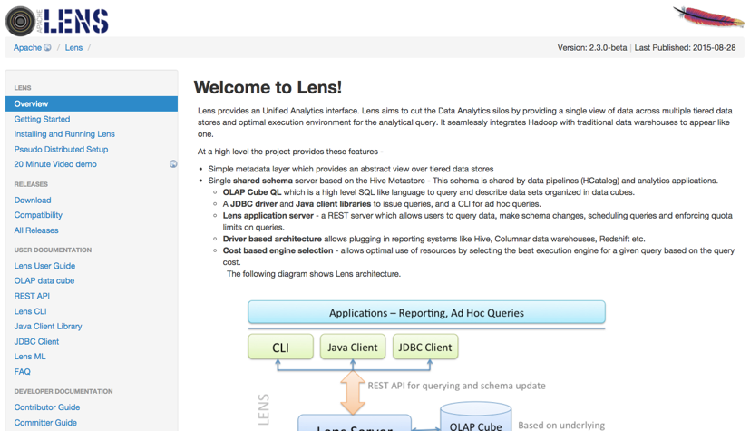
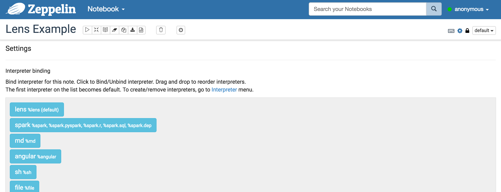



## Lens Interpreter for Apache Zeppelin

### Overview
[Apache Lens](https://lens.apache.org/) provides an Unified Analytics interface. Lens aims to cut the Data Analytics silos by providing a single view of data across multiple tiered data stores and optimal execution environment for the analytical query. It seamlessly integrates Hadoop with traditional data warehouses to appear like one.



### Installing and Running Lens
In order to use Lens interpreters, you may install Apache Lens in some simple steps:

1. Download Lens for latest version from [the ASF](http://www.apache.org/dyn/closer.lua/lens/2.3-beta). Or the older release can be found [in the Archives](http://archive.apache.org/dist/lens/).
2. Before running Lens, you have to set HIVE_HOME and HADOOP_HOME. If you want to get more information about this, please refer to [here](http://lens.apache.org/lenshome/install-and-run.html#Installation). Lens also provides Pseudo Distributed mode. [Lens pseudo-distributed setup](http://lens.apache.org/lenshome/pseudo-distributed-setup.html) is done by using [docker](https://www.docker.com/). Hive server and hadoop daemons are run as separate processes in lens pseudo-distributed setup.
3. Now, you can start lens server (or stop).

```
./bin/lens-ctl start (or stop)
```

### Configuring Lens Interpreter
At the "Interpreters" menu, you can edit Lens interpreter or create new one. Zeppelin provides these properties for Lens.

<table class="table-configuration">
  <tr>
    <th>Property Name</th>
    <th>value</th>
    <th>Description</th>
  </tr>
  <tr>
    <td>lens.client.dbname</td>
    <td>default</td>
    <td>The database schema name</td>
  </tr>
  <tr>
    <td>lens.query.enable.persistent.resultset</td>
    <td>false</td>
    <td>Whether to enable persistent resultset for queries. When enabled, server will fetch results from driver, custom format them if any and store in a configured location. The file name of query output is queryhandle-id, with configured extensions</td>
  </tr>
  <tr>
    <td>lens.server.base.url</td>
    <td>http://hostname:port/lensapi</td>
    <td>The base url for the lens server. you have to edit "hostname" and "port" that you may use(ex. http://0.0.0.0:9999/lensapi)</td>
   </tr>
   <tr>
    <td>lens.session.cluster.user </td>
    <td>default</td>
    <td>Hadoop cluster username</td>
  </tr>
  <tr>
    <td>zeppelin.lens.maxResult</td>
    <td>1000</td>
    <td>Max number of rows to display</td>
  </tr>
  <tr>
    <td>zeppelin.lens.maxThreads</td>
    <td>10</td>
    <td>If concurrency is true then how many threads?</td>
  </tr>
  <tr>
    <td>zeppelin.lens.run.concurrent</td>
    <td>true</td>
    <td>Run concurrent Lens Sessions</td>
  </tr>
  <tr>
    <td>xxx</td>
    <td>yyy</td>
    <td>anything else from [Configuring lens server](https://lens.apache.org/admin/config-server.html)</td>
  </tr>
</table>


### Interpreter Binding for Zeppelin Notebook
After configuring Lens interpreter, create your own notebook, then you can bind interpreters like below image.



For more interpreter binding information see [here](http://zeppelin.incubator.apache.org/docs/manual/interpreters.html).

### How to use
You can analyze your data by using [OLAP Cube](http://lens.apache.org/user/olap-cube.html) [QL](http://lens.apache.org/user/cli.html) which is a high level SQL like language to query and describe data sets organized in data cubes.
You may experience OLAP Cube like this [Video tutorial](https://cwiki.apache.org/confluence/display/LENS/2015/07/13/20+Minute+video+demo+of+Apache+Lens+through+examples).
As you can see in this video, they are using Lens Client Shell(./bin/lens-cli.sh). All of these functions also can be used on Zeppelin by using Lens interpreter.

<li> Create and Use(Switch) Databases.

```
create database newDb
```

```
use newDb
```

<li> Create Storage.

```
create storage your/path/to/lens/client/examples/resources/db-storage.xml
```

<li> Create Dimensions, Show fields and join-chains of them.

```
create dimension your/path/to/lens/client/examples/resources/customer.xml
```

```
dimension show fields customer
```

```
dimension show joinchains customer
```

<li> Create Caches, Show fields and join-chains of them.

```
create cube your/path/to/lens/client/examples/resources/sales-cube.xml
```

```
cube show fields sales
```

```
cube show joinchains sales
```

<li> Create Dimtables and Fact.

```
create dimtable your/path/to/lens/client/examples/resources/customer_table.xml
```

```
create fact your/path/to/lens/client/examples/resources/sales-raw-fact.xml
```

<li> Add partitions to Dimtable and Fact.

```
dimtable add single-partition --dimtable_name customer_table --storage_name local --path your/path/to/lens/client/examples/resources/customer-local-part.xml
```

```
fact add partitions --fact_name sales_raw_fact --storage_name local --path your/path/to/lens/client/examples/resources/sales-raw-local-parts.xml
```

<li> Now, you can run queries on cubes.

```
query execute cube select customer_city_name, product_details.description, product_details.category, product_details.color, store_sales from sales where time_range_in(delivery_time, '2015-04-11-00', '2015-04-13-00')
```


These are just examples that provided in advance by Lens. If you want to explore whole tutorials of Lens, see the [tutorial video](https://cwiki.apache.org/confluence/display/LENS/2015/07/13/20+Minute+video+demo+of+Apache+Lens+through+examples).

### Lens UI Service
Lens also provides web UI service. Once the server starts up, you can open the service on http://serverhost:19999/index.html and browse. You may also check the structure that you made and use query easily here.


