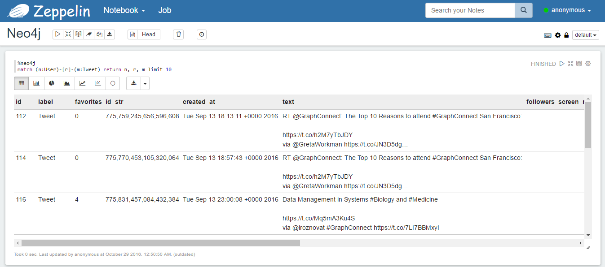
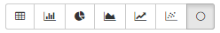
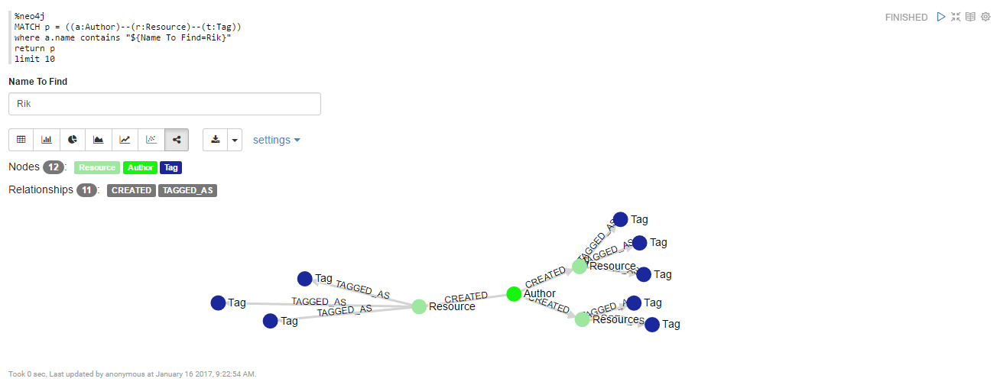
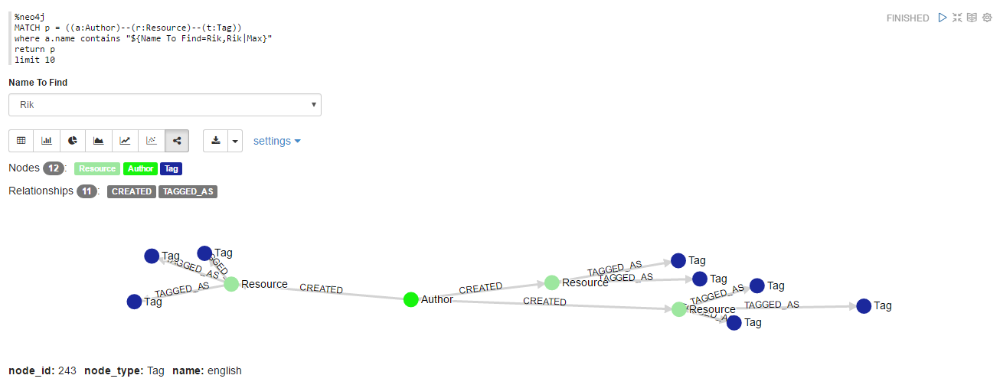

<!--
Licensed under the Apache License, Version 2.0 (the "License");
you may not use this file except in compliance with the License.
You may obtain a copy of the License at

http://www.apache.org/licenses/LICENSE-2.0

Unless required by applicable law or agreed to in writing, software
distributed under the License is distributed on an "AS IS" BASIS,
WITHOUT WARRANTIES OR CONDITIONS OF ANY KIND, either express or implied.
See the License for the specific language governing permissions and
limitations under the License.
-->


# Neo4j Interpreter for Apache Zeppelin

<div id="toc"></div>

## Overview
[Neo4j](https://neo4j.com/) is a highly scalable, native graph database purpose-built to leverage not only data but also its relationships.
Neo4j's native graph storage and processing engine deliver constant, real-time performance, helping enterprises build intelligent applications to meet today’s evolving data challenges.

<table class="table-configuration">
  <tr>
    <th>Name</th>
    <th>Class</th>
    <th>Description</th>
  </tr>
  <tr>
    <td>%neo4j</td>
    <td>Neo4jCypherInterpreter</td>
    <td>Enable the Neo4j intepreter</td>
  </tr>
</table>

## Configuration
The Neo4j interpreter can be configured with properties provided by Zeppelin.
<table class="table-configuration">
  <tr>
    <th>Property</th>
    <th>Default</th>
    <th>Description</th>
  </tr>
  <tr>
    <td>neo4j.url</td>
    <td>bolt://localhost:7687</td>
    <td>The Neo4j's BOLT url.</td>
  </tr>
  <tr>
    <td>neo4j.user</td>
    <td>neo4j</td>
    <td>The Neo4j user name.</td>
  </tr>
  <tr>
    <td>neo4j.password</td>
    <td>neo4j</td>
    <td>The Neo4j user password.</td>
  </tr>
  <tr>
    <td>neo4j.max.concurrency</td>
    <td>50</td>
    <td>Max concurrency call to Neo4j server.</td>
  </tr>
</table>

## Enabling the Neo4j Interpreter
In a notebook, to enable the **Neo4j** interpreter, click the **Gear** icon and select **neo4j**.

## Using the Neo4j Interpreter
In a paragraph, use `%neo4j` to select the Neo4j interpreter and then write your cypher query.

```cypher
MATCH (u:User)-[p:POSTS]->(t:Tweet) RETURN u, p, t;
```

The default visualization show the query result as a table. In the tabular result if nodes and relationships are return from the query, they will show together as rows


If the query result has almost a node the **Network** button will be enabled so you can switch to the graph visualization



Leveraging the **settings** button you can customize your graph visualization, a list of nodes will be displayed and by click on each one you can set the property which will be used as node label.


### Apply Zeppelin Dynamic Forms
You can leverage [Zeppelin Dynamic Form](../manual/dynamicform.html) inside your queries. You can use both the `text input` and `select form` parameterization features.

```cypher
match (n:User{screen_name: '${user_name}'})-[r]-(m:Tweet) return n, r, m limit 10
```


```cypher
match (n:User{screen_name: '${user_name=santand84,santand84|individue|maurofer79}'})-[r]-(m:Tweet) return n, r, m limit 10
```

