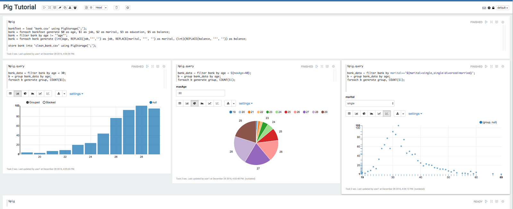




# Pig Interpreter for Apache Zeppelin

<div id="toc"></div>

## Overview
[Apache Pig](https://pig.apache.org/) is a platform for analyzing large data sets that consists of a high-level language for expressing data analysis programs, coupled with infrastructure for evaluating these programs. The salient property of Pig programs is that their structure is amenable to substantial parallelization, which in turns enables them to handle very large data sets.

## Supported interpreter type
  - `%pig.script` (default Pig interpreter, so you can use `%pig`)
    
    `%pig.script` is like the Pig grunt shell. Anything you can run in Pig grunt shell can be run in `%pig.script` interpreter, it is used for running Pig script where you don’t need to visualize the data, it is suitable for data munging. 
  
  - `%pig.query`
 
    `%pig.query` is a little different compared with `%pig.script`. It is used for exploratory data analysis via Pig latin where you can leverage Zeppelin’s visualization ability. There're 2 minor differences in the last statement between `%pig.script` and `%pig.query`
    - No pig alias in the last statement in `%pig.query` (read the examples below).
    - The last statement must be in single line in `%pig.query`
    
## Supported runtime mode
  - Local
  - MapReduce
  - Tez_Local (Only Tez 0.7 is supported)
  - Tez  (Only Tez 0.7 is supported)

## How to use

### How to setup Pig

- Local Mode

    Nothing needs to be done for local mode

- MapReduce Mode

    HADOOP\_CONF\_DIR needs to be specified in `ZEPPELIN_HOME/conf/zeppelin-env.sh`.

- Tez Local Mode
    
    Nothing needs to be done for tez local mode
    
- Tez Mode

    HADOOP\_CONF\_DIR and TEZ\_CONF\_DIR needs to be specified in `ZEPPELIN_HOME/conf/zeppelin-env.sh`.

### How to configure interpreter

At the Interpreters menu, you have to create a new Pig interpreter. Pig interpreter has below properties by default.
And you can set any Pig properties here which will be passed to Pig engine. (like tez.queue.name & mapred.job.queue.name).
Besides, we use paragraph title as job name if it exists, else use the last line of Pig script. So you can use that to find app running in YARN RM UI.

<table class="table-configuration">
    <tr>
        <th>Property</th>
        <th>Default</th>
        <th>Description</th>
    </tr>
    <tr>
        <td>zeppelin.pig.execType</td>
        <td>mapreduce</td>
        <td>Execution mode for pig runtime. local | mapreduce | tez_local | tez </td>
    </tr>
    <tr>
        <td>zeppelin.pig.includeJobStats</td>
        <td>false</td>
        <td>whether display jobStats info in <code>%pig.script</code></td>
    </tr>
    <tr>
        <td>zeppelin.pig.maxResult</td>
        <td>1000</td>
        <td>max row number displayed in <code>%pig.query</code></td>
    </tr>
    <tr>
        <td>tez.queue.name</td>
        <td>default</td>
        <td>queue name for tez engine</td>
    </tr>
    <tr>
        <td>mapred.job.queue.name</td>
        <td>default</td>
        <td>queue name for mapreduce engine</td>
    </tr>
</table>  

### Example

##### pig

```
%pig

bankText = load 'bank.csv' using PigStorage(';');
bank = foreach bankText generate $0 as age, $1 as job, $2 as marital, $3 as education, $5 as balance; 
bank = filter bank by age != '"age"';
bank = foreach bank generate (int)age, REPLACE(job,'"','') as job, REPLACE(marital, '"', '') as marital, (int)(REPLACE(balance, '"', '')) as balance;
store bank into 'clean_bank.csv' using PigStorage(';'); -- this statement is optional, it just show you that most of time %pig.script is used for data munging before querying the data. 
```

##### pig.query

Get the number of each age where age is less than 30

```
%pig.query
 
bank_data = filter bank by age < 30;
b = group bank_data by age;
foreach b generate group, COUNT($1);
```

The same as above, but use dynamic text form so that use can specify the variable maxAge in textbox. (See screenshot below). Dynamic form is a very cool feature of Zeppelin, you can refer this [link]((../manual/dynamicform.html)) for details.

```
%pig.query
 
bank_data = filter bank by age < ${maxAge=40};
b = group bank_data by age;
foreach b generate group, COUNT($1) as count;
```

Get the number of each age for specific marital type, also use dynamic form here. User can choose the marital type in the dropdown list (see screenshot below).

```
%pig.query
 
bank_data = filter bank by marital=='${marital=single,single|divorced|married}';
b = group bank_data by age;
foreach b generate group, COUNT($1) as count;
```

The above examples are in the Pig tutorial note in Zeppelin, you can check that for details. Here's the screenshot.




Data is shared between `%pig` and `%pig.query`, so that you can do some common work in `%pig`, and do different kinds of query based on the data of `%pig`. 
Besides, we recommend you to specify alias explicitly so that the visualization can display the column name correctly. In the above example 2 and 3 of `%pig.query`, we name `COUNT($1)` as `count`. If you don't do this,
then we will name it using position. E.g. in the above first example of `%pig.query`, we will use `col_1` in chart to represent `COUNT($1)`.


