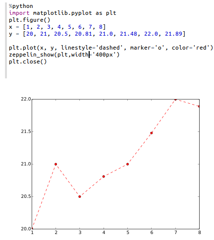

<!--
Licensed under the Apache License, Version 2.0 (the "License");
you may not use this file except in compliance with the License.
You may obtain a copy of the License at

http://www.apache.org/licenses/LICENSE-2.0

Unless required by applicable law or agreed to in writing, software
distributed under the License is distributed on an "AS IS" BASIS,
WITHOUT WARRANTIES OR CONDITIONS OF ANY KIND, either express or implied.
See the License for the specific language governing permissions and
limitations under the License.
-->


# Python 2 & 3 Interpreter for Apache Zeppelin

<div id="toc"></div>

## Configuration
<table class="table-configuration">
  <tr>
    <th>Property</th>
    <th>Default</th>
    <th>Description</th>
  </tr>
  <tr>
    <td>zeppelin.python</td>
    <td>python</td>
    <td>Path of the already installed Python binary (could be python2 or python3).
    If python is not in your $PATH you can set the absolute directory (example : /usr/bin/python)
    </td>
  </tr>
  <tr>
    <td>zeppelin.python.maxResult</td>
    <td>1000</td>
    <td>Max number of dataframe rows to display.</td>
  </tr>
</table>

## Enabling Python Interpreter

In a notebook, to enable the **Python** interpreter, click on the **Gear** icon and select **Python**

## Using the Python Interpreter

In a paragraph, use **_%python_** to select the **Python** interpreter and then input all commands.

The interpreter can only work if you already have python installed (the interpreter doesn't bring it own python binaries).

To access the help, type **help()**

## Python environments

### Default
By default, PythonInterpreter will use python command defined in `zeppelin.python` property to run python process.
The interpreter can use all modules already installed (with pip, easy_install...)

### Conda
[Conda](http://conda.pydata.org/) is an package management system and environment management system for python.
`%python.conda` interpreter lets you change between environments.

#### Usage

List your environments

```
%python.conda
```

Activate an environment

```
%python.conda activate [ENVIRONMENT_NAME]
```

Deactivate

```
%python.conda deactivate
```

### Docker

`%python.docker` interpreter allows PythonInterpreter creates python process in a specified docker container.

#### Usage

Activate an environment

```
%python.docker activate [Repository]
%python.docker activate [Repository:Tag]
%python.docker activate [Image Id]
```

Deactivate

```
%python.docker deactivate
```

Example

```
# activate latest tensorflow image as a python environment
%python.docker activate gcr.io/tensorflow/tensorflow:latest
```

## Using Zeppelin Dynamic Forms
You can leverage [Zeppelin Dynamic Form]({{BASE_PATH}}/manual/dynamicform.html) inside your Python code.

**Zeppelin Dynamic Form can only be used if py4j Python library is installed in your system. If not, you can install it with `pip install py4j`.**

Example : 

```python
%python
### Input form
print (z.input("f1","defaultValue"))

### Select form
print (z.select("f1",[("o1","1"),("o2","2")],"2"))

### Checkbox form
print("".join(z.checkbox("f3", [("o1","1"), ("o2","2")],["1"])))
```

## Matplotlib integration

 The python interpreter can display matplotlib figures inline automatically using the `pyplot` module:
 
```python
%python
import matplotlib.pyplot as plt
plt.plot([1, 2, 3])
```
This is the recommended method for using matplotlib from within a Zeppelin notebook. The output of this command will by default be converted to HTML by implicitly making use of the `%html` magic. Additional configuration can be achieved using the builtin `z.configure_mpl()` method. For example, 

```python
z.configure_mpl(width=400, height=300, fmt='svg')
plt.plot([1, 2, 3])
```

Will produce a 400x300 image in SVG format, which by default are normally 600x400 and PNG respectively. In the future, another option called `angular` can be used to make it possible to update a plot produced from one paragraph directly from another (the output will be `%angular` instead of `%html`). However, this feature is already available in the `pyspark` interpreter. More details can be found in the included "Zeppelin Tutorial: Python - matplotlib basic" tutorial notebook. 

If Zeppelin cannot find the matplotlib backend files (which should usually be found in `$ZEPPELIN_HOME/interpreter/lib/python`) in your `PYTHONPATH`, then the backend will automatically be set to agg, and the (otherwise deprecated) instructions below can be used for more limited inline plotting.

If you are unable to load the inline backend, use `z.show(plt)`:
 ```python
%python
import matplotlib.pyplot as plt
plt.figure()
(.. ..)
z.show(plt)
plt.close()
```
The `z.show()` function can take optional parameters to adapt graph dimensions (width and height) as well as output format (png or optionally svg).

 ```python
%python
z.show(plt, width='50px')
z.show(plt, height='150px', fmt='svg')
```



## Pandas integration
Apache Zeppelin [Table Display System](../displaysystem/basicdisplaysystem.html#table) provides built-in data visualization capabilities. Python interpreter leverages it to visualize Pandas DataFrames though similar `z.show()` API, same as with [Matplotlib integration](#matplotlib-integration).

Example:

```python
import pandas as pd
rates = pd.read_csv("bank.csv", sep=";")
z.show(rates)
```

## SQL over Pandas DataFrames

There is a convenience `%python.sql` interpreter that matches Apache Spark experience in Zeppelin and enables usage of SQL language to query [Pandas DataFrames](http://pandas.pydata.org/pandas-docs/stable/generated/pandas.DataFrame.html) and visualization of results though built-in [Table Display System](../displaysystem/basicdisplaysystem.html#table).

 **Pre-requests**

  - Pandas `pip install pandas`
  - PandaSQL `pip install -U pandasql`

In case default binded interpreter is Python (first in the interpreter list, under the _Gear Icon_), you can just use it as `%sql` i.e

 - first paragraph

  ```python
import pandas as pd
rates = pd.read_csv("bank.csv", sep=";")
  ```

 - next paragraph

  ```sql
%sql
SELECT * FROM rates WHERE age < 40
  ```

Otherwise it can be referred to as `%python.sql`


## Technical description

For in-depth technical details on current implementation please refer to [python/README.md](https://github.com/apache/zeppelin/blob/master/python/README.md).


### Some features not yet implemented in the Python Interpreter

* Interrupt a paragraph execution (`cancel()` method) is currently only supported in Linux and MacOs. If interpreter runs in another operating system (for instance MS Windows) , interrupt a paragraph will close the whole interpreter. A JIRA ticket ([ZEPPELIN-893](https://issues.apache.org/jira/browse/ZEPPELIN-893)) is opened to implement this feature in a next release of the interpreter.
* Progression bar in webUI  (`getProgress()` method) is currently not implemented.
* Code-completion is currently not implemented.

