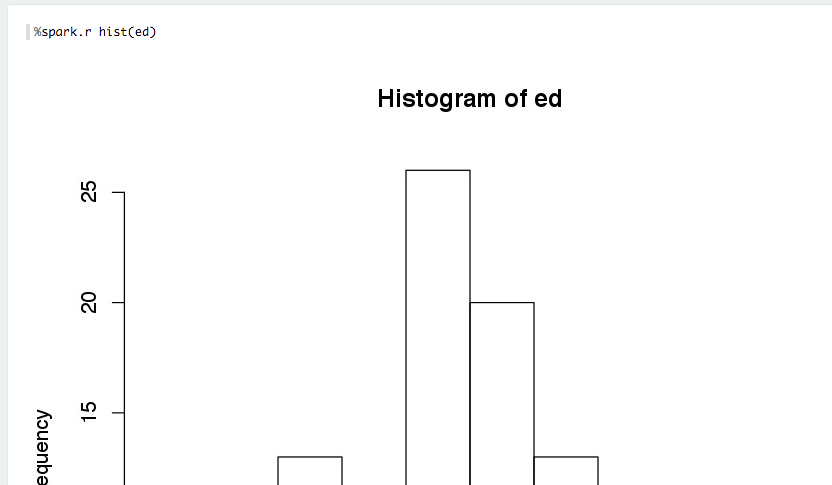



## R Interpreter

This is a the Apache (incubating) Zeppelin project, with the addition of support for the R programming language and R-spark integration.

### Requirements

Additional requirements for the R interpreter are:

 * R 3.1 or later (earlier versions may work, but have not been tested)
 * The `evaluate` R package.

For full R support, you will also need the following R packages:

 * `knitr`
 * `repr` -- available with `devtools::install_github("IRkernel/repr")`
 * `htmltools` -- required for some interactive plotting
 * `base64enc` -- required to view R base plots

### Configuration

To run Zeppelin with the R Interpreter, the SPARK_HOME environment variable must be set. The best way to do this is by editing `conf/zeppelin-env.sh`.

If it is not set, the R Interpreter will not be able to interface with Spark.

You should also copy `conf/zeppelin-site.xml.template` to `conf/zeppelin-site.xml`.  That will ensure that Zeppelin sees the R Interpreter the first time it starts up.

### Using the R Interpreter

By default, the R Interpreter appears as two Zeppelin Interpreters, `%r` and `%knitr`.

`%r` will behave like an ordinary REPL.  You can execute commands as in the CLI.   

[](screenshots/repl2plus2.png)

R base plotting is fully supported

[](screenshots/replhist.png)

If you return a data.frame, Zeppelin will attempt to display it using Zeppelin's built-in visualizations.

[](screenshots/replhead.png)

`%knitr` interfaces directly against `knitr`, with chunk options on the first line:

[](screenshots/knitgeo.png)
[](screenshots/knitstock.png)
[](screenshots/knitmotion.png)

The two interpreters share the same environment.  If you define a variable from `%r`, it will be within-scope if you then make a call using `knitr`.

### Using SparkR & Moving Between Languages

If `SPARK_HOME` is set, the `SparkR` package will be loaded automatically:

[](screenshots/sparkrfaithful.png)

The Spark Context and SQL Context are created and injected into the local environment automatically as `sc` and `sql`.

The same context are shared with the `%spark`, `%sql` and `%pyspark` interpreters:

[](screenshots/backtoscala.png)

You can also make an ordinary R variable accessible in scala and Python:

[](screenshots/varr1.png)

And vice versa:

[](screenshots/varscala.png)
[](screenshots/varr2.png)

### Caveats & Troubleshooting

* Almost all issues with the R interpreter turned out to be caused by an incorrectly set `SPARK_HOME`.  The R interpreter must load a version of the `SparkR` package that matches the running version of Spark, and it does this by searching `SPARK_HOME`. If Zeppelin isn't configured to interface with Spark in `SPARK_HOME`, the R interpreter will not be able to connect to Spark.

* The `knitr` environment is persistent. If you run a chunk from Zeppelin that changes a variable, then run the same chunk again, the variable has already been changed.  Use immutable variables.

* (Note that `%spark.r` and `$r` are two different ways of calling the same interpreter, as are `%spark.knitr` and `%knitr`. By default, Zeppelin puts the R interpreters in the `%spark.` Interpreter Group.

* Using the `%r` interpreter, if you return a data.frame, HTML, or an image, it will dominate the result. So if you execute three commands, and one is `hist()`, all you will see is the histogram, not the results of the other commands. This is a Zeppelin limitation.

* If you return a data.frame (for instance, from calling `head()`) from the `%spark.r` interpreter, it will be parsed by Zeppelin's built-in data visualization system.  

* Why `knitr` Instead of `rmarkdown`?  Why no `htmlwidgets`?  In order to support `htmlwidgets`, which has indirect dependencies, `rmarkdown` uses `pandoc`, which requires writing to and reading from disc.  This makes it many times slower than `knitr`, which can operate entirely in RAM.

* Why no `ggvis` or `shiny`?  Supporting `shiny` would require integrating a reverse-proxy into Zeppelin, which is a task.

* Max OS X & case-insensitive filesystem.  If you try to install on a case-insensitive filesystem, which is the Mac OS X default, maven can unintentionally delete the install directory because `r` and `R` become the same subdirectory.

* Error `unable to start device X11` with the repl interpreter.  Check your shell login scripts to see if they are adjusting the `DISPLAY` environment variable.  This is common on some operating systems as a workaround for ssh issues, but can interfere with R plotting.

* akka Library Version or `TTransport` errors.  This can happen if you try to run Zeppelin with a SPARK_HOME that has a version of Spark other than the one specified with `-Pspark-1.x` when Zeppelin was compiled.


## R Interpreter for Apache Zeppelin

[R](https://www.r-project.org) is a free software environment for statistical computing and graphics.

To run R code and visualize plots in Apache Zeppelin, you will need R on your master node (or your dev laptop).

+ For Centos: `yum install R R-devel libcurl-devel openssl-devel`
+ For Ubuntu: `apt-get install r-base`

Validate your installation with a simple R command:

```
R -e "print(1+1)"
```

To enjoy plots, install additional libraries with:

```
+ devtools with `R -e "install.packages('devtools', repos = 'http://cran.us.r-project.org')"`
+ knitr with `R -e "install.packages('knitr', repos = 'http://cran.us.r-project.org')"`
+ ggplot2 with `R -e "install.packages('ggplot2', repos = 'http://cran.us.r-project.org')"`
+ Other vizualisation librairies: `R -e "install.packages(c('devtools','mplot', 'googleVis'), repos = 'http://cran.us.r-project.org'); require(devtools); install_github('ramnathv/rCharts')"`
```

We recommend you to also install the following optional R libraries for happy data analytics:

+ glmnet
+ pROC
+ data.table
+ caret
+ sqldf
+ wordcloud
